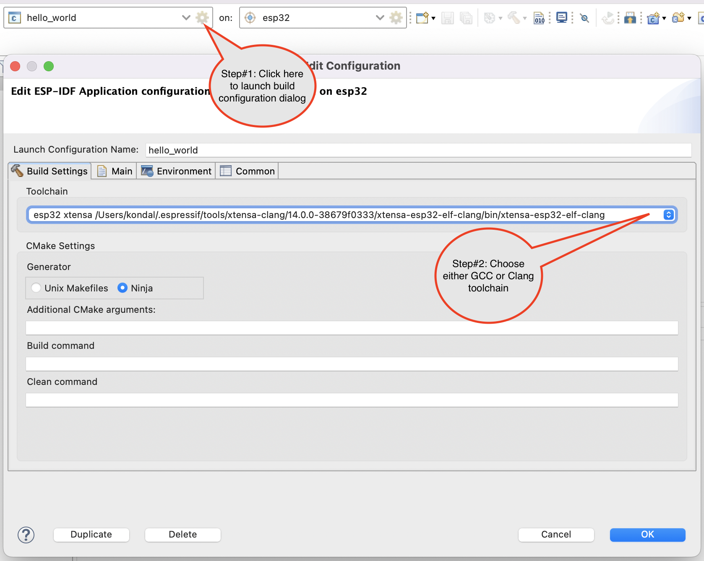
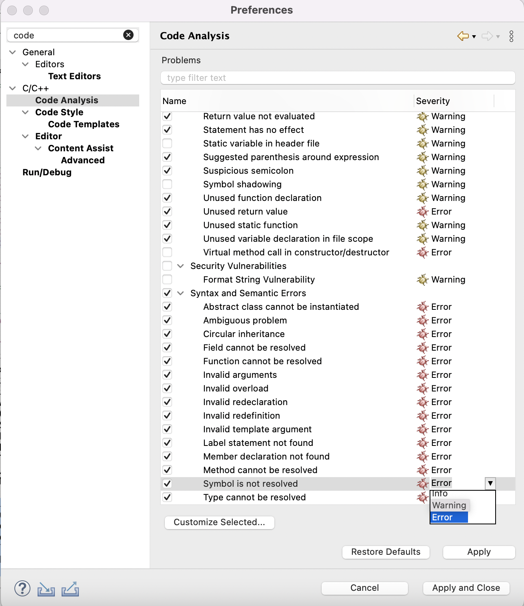

# FAQ

## Which version of Java should I use? 
Java 11 and above. We suggest to use the latest LTS version. Check the plugin [Prerequisites](https://github.com/espressif/idf-eclipse-plugin#Prerequisites). 
Also check [why we recommend Java 11](https://github.com/espressif/idf-eclipse-plugin/blob/master/FAQ.md#why-java-11-recommended-for-idf-eclipse-plugin) while using the IDF Eclipse plugin 
## Which version of Eclipse CDT should I use?
Eclipse 2023-06 CDT and above (Eclipse IDE for C/C++ Developers). Check the plugin [Prerequisites](https://github.com/espressif/idf-eclipse-plugin#Prerequisites)
## How do I know the installed version of Java in my system?
You can check using `java -version` command from the terminal
##  How to check the Java version used by Eclipse?
- `Help > About Eclipse > Installation Details > Configuration`  
- Look for `-vm` argument
##  How to increase the heap memory for Java while working Eclipse IDE?
- Locate the eclipse.ini or espressif-ide.ini  
- Increase the Xmx value under the `-vmargs` args section. For example, you can set to `-Xmx2048m`
## What are the operating systems the plugin supports?
- Windows
- macOSX
- Linux

For downloads please check this [here](https://github.com/espressif/idf-eclipse-plugin/blob/master/docs_readme/Espressif-IDE.md#espressif-ide-1)
## How do I provide Eclipse environment and plugins information?
`Help > About Eclipse > Installation Details > Configuration > Copy to Clipboard` 
## How do I know the installed IDF Eclipse Plugins version?
- You can check using the menu `Eclipse > About Eclipse > Installation Details > Installed Software`  
- Search for `Espressif`
## How do I uninstall IDF Eclipse Plugins from the Eclipse?
- `Eclipse > About Eclipse > Installation Details > Installed Software`  
- Search for `Espressif`
- Select the Espressif IDF Feature  
- `Uninstall..`
## Unable to install IDF plugins in Eclipse?
Please check the error log from the main menu, select `Window > Show View > Other`. Then select `General > Error Log`
## Espressif Menu options and Espressif IDF Project menu are not visible in my Eclipse CDT
- Make sure you have installed Java 8 and above and Eclipse in the C/C++ perspective 
- Reset the perspective using `Window > Perspective > Reset Perspective..`
## Do IDF Eclipse Plugins support CMake IDF project creation?
Yes, you can create IDF CMake project using `File > New > Espressif IDF Project`
## Can I import my existing IDF project into Eclipse?
Yes, you can import using Import Menu. `Import... > Espressif > Existing IDF Project`
## Where can I find the IDF installed tools in my system?
Default directory is `$HOME/.espressif` for Linux/MacOS users or `%USER_PROFILE%.espressif` for Windows users
## Why am I getting timeout errors when Installing tools?
If you are getting errors when downloading or installing tools this can be due to some issue with the mirrors. You can try to set the mirrors in Eclipse `Preferences > Espressif` you will see two settings for Git and Pip Py Wheels please set these to proper mirror according to your region. Currently these two mirrors are available.
### Mirror for GIT (IDF_GITHUB_ASSETS)
- dl.espressif.com/github_assets (default)
- dl.espressif.cn/github_assets
### Mirror for python wheels (PIP_EXTRA_INDEX_URL)
- https://dl.espressif.com/pypi (default)
- https://dl.espressif.cn/pypi
## Deleted C/C++ build environment variables still appearing?
- You need to uncheck the preference recorder. This can be performed by following. Eclipse `Preferences > Oomph > Setup Tasks > Preference Recorder`  
- Uncheck `Record into`
## "Unresolved inclusion" errors in the editor
Unresolved inclusion errors will be resolved only after the build. Make sure you select the `ESP` Launch Target before you trigger the build so that CDT will correctly identify the toolchain to build and index the sources. Check [Configure Launch Target](https://github.com/espressif/idf-eclipse-plugin#ConfigureLaunchTarget) for more details.

If you still see the errors, please try `Project > C/C++ Index > Rebuild` and see if it helps.
## "No Toolchain found for Target ESP32" error
You need to make sure you run the [Install Tools](https://github.com/espressif/idf-eclipse-plugin#installing-esp-idf-tools) from the Eclipse. This will take care of configuring the required paths in the CDT build environment along with installing the tools.

Check [Configuring core build toolchains](https://github.com/espressif/idf-eclipse-plugin#configuring-core-build-toolchains)
## "No esp launch target found. Please create/select the correct Launch Target" error
You see this error when you're trying a compile a project without selecting an `ESP` launch target. Check [this](https://github.com/espressif/idf-eclipse-plugin#configuring-launch-target)
## How can I rollback to old ESP-IDF Eclipse plugin?
- Open Eclipse IDE and Uninstall the esp-idf plugin
- Restart Eclipse IDE
- Download the previous version of the ESP Eclipse Plugin using this [link](https://github.com/espressif/idf-eclipse-plugin/releases)
- Goto `Help > Install New Software`
- Press the `Add` button, a window will open with the name of `Add Repository`
- Press the `Archive` button and select the file downloaded
- Proceed with the installation
- Restart Eclipse
## Where can I find Compiler_commands.json file for the project?
`/projectName/build/compile_commands.json`

compile_commands.json containing the exact compiler calls for all translation units of the project in machine-readable form which is used by the Eclipse CDT indexing for parsing and resolving headers
## How do I access CDT Parser error log?
Please follow this menu. `Project > C/C++ Index >  Create Parser Log`
##  How do I access the error log?
To view the Eclipse error log: From the main menu, select `Window > Show View > Other`. Then select `General > Error Log`
Check more details [here](https://github.com/espressif/idf-eclipse-plugin#error-log)
## How do I report a deadlock or Eclipse hang?
You can find the detailed instructions here https://wiki.eclipse.org/How_to_report_a_deadlock
- On command line, use `jps -v` to find the PIDs of Java processes and jstack <pid> to show the stack trace of Java processes.
<pre>
<code>$ jps -v
32308 org.eclipse.equinox.launcher_1.5.0.v20180119-0753.jar -Dosgi.requiredJavaVersion=1.8 -Dosgi.instance.area.default=@user.home/eclipse-workspace -XX:+UseG1GC -XX:+UseStringDeduplication -Dosgi.requiredJavaVersion=1.8 -Dosgi.dataAreaRequiresExplicitInit=true -Xms256m -Xmx1024m -Dswt.dbus.init
8824 Jps -Dapplication.home=/usr/lib/jvm/java-8-oracle -Xms8m
$ jstack 32308 > /tmp/jstack.txt
</code></pre>
Here 32308 and 8824 are PIDs of Java processes. 8824 is jps itself and is of no interest for us. 32308 is and Eclipse process judging from presence of org.eclipse.equinox.launcher in its command line. Jstack command saves stack trace of Eclipse process in a file /tmp/jstack.txt, attach the file to bug report.
## `sun.security.validator.ValidatorException: PKIX path building failed:` error while installing the plugins through update site
This would have caused by the Java version or Java certificates. Please make sure you've installed `Java 11 and later` to fix this error. 
Check below links:
- https://esp32.com/viewtopic.php?f=13&t=12327&start=10#p50137 
- https://stackoverflow.com/questions/6908948/java-sun-security-provider-certpath-suncertpathbuilderexception-unable-to-find

## How to delete Launch Targets from the Eclipse
There is no UI option to delete launch targets directly from the eclipse, however this can be achieved by following the below instructions.
- Go to the Eclipse workspace directory. For example: In my case /Users/myName/myTesteclipseWorkspace
- Navigate to `.metadata/.plugins/org.eclipse.core.runtime/.settings` folder in the workspace directory
- Look for `org.eclipse.launchbar.core.prefs` file and open it in the editor
- Search for the launch target name you want to delete and remove all those entries from the file
- Save the file
- Restart the eclipse

## How do I access project build log?
  - To enable logging navigate to `Preferences > Project > C/C++ > Build > Logging` 
  - Check `Enable global build logging`
  - Build the project
  - Export `global-build.log`. This is the same build console log which appears in the CDT build console but the build console usually have limited buffer size hence it won't display everything.
  
 ## How do I enable verbose debug output to my project build?
  IDF Eclipse plugin uses CMake commands to build the project so it's possible to pass cmake arguments from the build configuration wizard. To configure this. 
  - Click on the editor configuration wizard
  - Navigate to `Build Settings` tab
  - Add `--debug-output` or other verbose arguments in the `Additional CMake arguments` text field
  - Click on Ok and compile the project to start in the debug output mode. Please refer to https://cmake.org/cmake/help/v3.5/manual/cmake.1.html 
  
## How do I view Product Information?
  - Navigate to `Espressif > Product Information`

## Eclipse launch fails with `Java was started but returned exit code=13` when directory path contains special characters
Eclipse will fail to launch if installed in a directory whose path contains certain invalid characters, including :%#<>"!. The workaround is to install Eclipse in a directory whose path does not contain invalid characters.
  
## [SSL: CERTIFICATE_VERIFY_FAILED] certificate verify failed: unable to get local issuer certificate
If you see this error while installing tools in macOS, you may run `Install Certificates.command` in the Python folder of your computer to install certificates. For details, see [Download Error While Installing ESP-IDF Tools](https://github.com/espressif/esp-idf/issues/4775).

## Espressif-IDE, Linux Install tools fail due to permissions in udev rules in /etc/udev/ 
This occurs basically because the directory `/etc/udev/` requires elevated permissions. Can you please try running the IDE with sudo and see if the issue persists? You can also try to manually copy the rules file with terminal using sudo to the `/etc/udev` directory. The file to copy is `60-openocd.rules` it can be found in the directory where you installed tools inside openocd directory at the path .`..../share/openocd/contrib/60-openocd.rules` 
  
## How do I generate OpenOCD log ?
  - Open the project OpenOCD `Edit Configuration` dialog
  - Navigate to the `Debugger` tab
  - Add `-d3 -l oocd.log` in the `Config Options` section of the `Debugger` tab
  - Click `Ok` and start the debugging process. This generates `oocd.log` file your project
  

## Why esp_idf_components folder is created in the project?
`esp_idf_components` folder is introduced with v2.4.0 release to achieve source code navigation for the function definitions((Press F3 or Ctrl+Click on the functional call) and to fix unresolved header problems with the indexer. It will be created immediately after the build based on the `build/compile_commands.json` file list. secondly, it also helps the users who want to check source of esp-idf components directly from the IDE. The files created under esp_idf_components are virtual folders for /esp-idf/components and these will be re-generated everytime after the build.
 
 This could be disabled by adding the `-Dskip.idf.components=true` VM argument in the eclipse.ini(espressif-ide.ini) file but this might create inconsistency issues with the indexer where it's unable to resolve headers properly and you might not be able to navigate to the function definitions from the code editors.
  
## Installation of drivers
  If you are a windows user, always prefer [ESP-IDF Windows Installer](https://dl.espressif.com/dl/esp-idf/) for installing pre-requisites and required drivers
  
  To install it manually refer to [this](https://github.com/espressif/idf-installer#manual-installation-of-drivers)
  
  To installation of the USB drivers for Libusb and FTDI D2XX drivers for your devices, you could refer to this [tool](https://visualgdb.com/UsbDriverTool/)
  
 ## Do you have the board with JTAG or without JTAG?
  This [thread](https://github.com/espressif/idf-installer/issues/133#issuecomment-1136990432) and subsequent discussion could help you understand this.

# How to configure esp-adf in Espressif-IDE
- `git clone https://github.com/espressif/esp-adf.git esp-adf-v2.6`
- `cd esp-adf-v2.6/`
- `git checkout v2.6`
- `git submodule update --init --recursive`
- Launch Espressif-IDE
- Navigate to `Espressif > ESP-IDF Manager` and Click on `Add ESP-IDF` and Check "Use an existing ESP-IDF directory from the file system" and then browse ESP-IDF directory from the esp-idf folder which you have configured in the previous steps.
- Add `ADF_PATH` in the Eclipse Build Preferences: Navigate to `Preferences > C/C++ Build > Environment`
- Choose `ADF_PATH` from the preferences list and click on Edit and Click Ok without changing any value(There is a bug in CDT that is appending a null value before the path hence we need to click on edit and save it.)
- Click Apply and Close the preference window.
- Navigate to `File > New > Import > Existing IDF Project` from the existing esp-adf examples list and import it.
- Choose target and click on the build.

# How to choose to build with Clang or GCC toolchain?
- Select a project from the project explorer
- Select project build configuration from the top toolbar
- Click on the gear icon and this will launch a build edit configuration window
- Click on the Build Settings tab
- Choose either GCC or Clang toolchain from the list
- Click Ok

More details on using clang and clangd, please check [this](https://github.com/espressif/idf-eclipse-plugin/blob/master/docs_readme/clangd_cdt_support.md)

  # How to configure esp-who in Espressif-IDE
- Clone esp-who: `git clone https://github.com/espressif/esp-who.git`
- `cd esp-who`
- `git submodule update --init --recursive`
- Clone esp-idf which is compatible with esp-who, as per the documentation release/v4.4 is compatible with the esp-who v0.9.0. Follow below instructions to configure esp-idf
- `git clone -b v4.4.2 --recursive https://github.com/espressif/esp-idf.git esp-idf-v4.4.2`
- `cd esp-idf-v4.4.2/`
- `git submodule update --init --recursive`
- Launch Espressif IDE and import using `File > New > Import > Existing IDF Project` from the existing esp-who examples list
- Run Install Tools using `Espressif > ESP-IDF Tools Manager > Install Tools` and provide esp-idf directory path which you have cloned earlier
- Configure `WHO_PATH` in the eclipse build preferences: `Preferences > C/C++ Build > Environment`
- Select `WHO_PATH` from the preferences list and click on Edit and Click Ok without changing any value(There is a bug in CDT that is appending a null value before the path hence we need to click on edit and save it.)
- Open `CMakeLists.txt` from the project root and change this from `set(EXTRA_COMPONENT_DIRS ../../../components)` to `set(EXTRA_COMPONENT_DIRS $ENV{WHO_PATH}/components)` in the line 5
- Select the target and click on build. 

# How to Enable the LaunchBar in Espressif-IDE
By default, LaunchBar is enabled in Espressif-IDE and Eclipse CDT. However, in some of the Linux versions, this seems to be disabled. Please follow the below instructions to enable the LaunBar.
- Go to `Preferences...`
- Navigate to `Run/Debug > Launching > LaunchBar`
- Check `Enable the LaunchBar`
- Click `Apply and Close`

# How to disable the Unresolved Symbol error markers
When working with **ESP-IDF 5.0 and higher using the Espressif-IDE**, you may come across unresolved symbol issues with certain projects. This is because ESP-IDF 5.0 and higher use some of the **C/C++ 20 language features** that are not yet supported by the Eclipse CDT Indexer. These unresolved symbols will only appear in the indexer and should not cause any build failures.

To resolve this issue, you can try disabling Unresolved Symbol error marker.

- Go to `Preferences...`
- Navigate to `C/C++ > Code Analysis`
- Look for `Symbol is not resolved` from the problems list
- Change the Severity from `Error` to `Warning`
- Click `Apply and Close`

When IDE parser add the support for C/C++ 20 language features, you can revert the above change.

# How to manage two environment setup (different skconfig and partition.csv) during compilation?
Create two `sdkconfig.defaults` files for the two build configurations (e.g. sdkconfig.develop and sdkconfig.prod). Refer to the readme of [this](https://github.com/espressif/esp-idf/tree/master/examples/build_system/cmake/multi_config) example for details. 

In Eclipse, create two launch configurations. In the "Build settings" tab of the "Edit Launch Configuration" dialog, enter the "Additional CMake arguments" for each configuration, same as it is done in the related IDF example.
