 

# ESP-IDF Eclipse Plugin
ESP-IDF Eclipse Plugin brings developers an easy-to-use Eclipse-based development environment for developing ESP32 based IoT applications.
It provides better tooling capabilities, which simplifies and enhances standard Eclipse CDT for developing and debugging ESP32 IoT applications. It offers advanced editing, compiling, flashing and debugging features with the addition of Installing the tools, SDK configuration and CMake editors. 

The plug-in runs on `Windows`, `macOS` and `GNU/Linux`.

> **Note:** It supports ESP-IDF CMake based projects (4.x and above)

# Table Of Contents
* [ Installing Prerequisites ](#Prerequisites)  
* [ Installing IDF Eclipse Plugin ](#GettingStarted)  
* [ Installing ESP-IDF Tools ](#InstallTools)  
* [ Creating a new Project ](#NewProjectUsingDefault) 
* [ Configuring Launch Target ](#ConfigureLaunchTarget) 
* [ Compiling the Project ](#BuildApplication) 
* [ Flashing the Project ](#FlashApplication) 
* [ Viewing Serial Output ](#ConfigureLaunchTerminal) 
* [ Configuring the Project using sdkconfig Editor](#projectconfigure) 
* [ CMake Editor](#cmakeproject) 
* [ Debugging the Project ](#debugging) 
* [ ESP-IDF Application Size Analysis Editor](#sizeanalysiseditor) 
* [ ESP-IDF Terminal](#idfterminal) 
* [ Configuring Build Environment Variables ](#configureEnvironmentVariables) 
* [ Configuring Core Build Toolchain ](#ConfigureToolchains) 
* [ Configuring CMake Toolchain ](#ConfigureCMakeToolchain) 
* [ Configuring the flash arguments ](#customizeLaunchConfig) 
* [ Installing IDF Eclipse Plugin from Eclipse Market Place](#installPluginsFromMarketPlace)  
* [ Installing IDF Eclipse Plugin using local archive ](#installPluginsUsingLocalFile)  
* [ Upgrading IDF Eclipse Plugin ](#upgradePlugins) 
* [ Importing an existing IDF Project ](#ImportProject) 
* [ Importing an existing Debug launch configuration ](#importDebugLaunchConfig) 
* [ Troubleshooting Guide](#troubleshooting) 
* [ How to raise bugs ](#howToRaiseBugs) 
* [ FAQ ](#faq) 

# Installing Prerequisites
The minimum requirements for running the IDF Eclipse plug-ins are:
* **Java 11 and above** : Download and install Java SE from <a href= "https://www.oracle.com/technetwork/java/javase/downloads/index.html">here</a>
* **Python 3.5 and above** : Download and install Python from <a href="https://www.python.org/downloads/">here</a>
* **Eclipse 2020-06 CDT** : Download and install Eclipse CDT package from <a href= "https://www.eclipse.org/downloads/packages/release/2020-06/r/eclipse-ide-cc-developers">here </a>
*  **Git** : Get the latest git from <a href ="https://git-scm.com/downloads">here</a>
*  **ESP-IDF 4.0 and above** : Clone the ESP-IDF repo from <a href ="https://github.com/espressif/esp-idf/releases">here</a>

> **Note:** Make sure Java, Python and Git are available on the system environment PATH.

# Installing IDF Plugin using update site URL
You can install the IDF Eclipse plugin into an existing Eclipse CDT installation using the update site URL. You first need to add the release repository URL as follows:
* Go to `Help` -> `Install New Software`
* Click `Add…`
* Enter `Location` of the repository https://dl.espressif.com/dl/idf-eclipse-plugin/updates/latest/
* Enter `Name` as `Espressif IDF Plugin for Eclipse`
* Click `Ok`
* Select `Espressif IDF` from the list and proceed with the installation 

> **Note:** Though screenshots are captured from `macOS`, installation instructions are applicable for `Windows`, `Linux` and `macOS`.

# Installing ESP-IDF Tools
ESP-IDF requires some prerequisite tools to be installed so you can build firmware for the ESP32. The prerequisite tools include Python, Git, cross-compilers, menuconfig tool, CMake and Ninja build tools.

For this getting started guide, follow the instructions below.

* Navigate to `Help` > `ESP-IDF Tools Manager` > `Install Tools`
* Provide the `ESP-IDF Directory` path
* Provide `Git` and `Python` executable locations if they are not auto-detected.
* Click on `Install Tools` to proceed with the installation process. Check the Console for the installation details.
* Installation might take a while if you're doing it for the first time since it has to download and install xtensa-esp32-elf, esp32ulp-elf, cmake, openocd-esp32 and ninja tools.

> **Note:** Make sure you run this step even if you've already installed the required tools, since it sets the IDF_PATH, PATH, OPENOCD_SCRIPTS and IDF_PYTHON_ENV_PATH to the Eclipse CDT build environment based on the idf_tools.py export command.

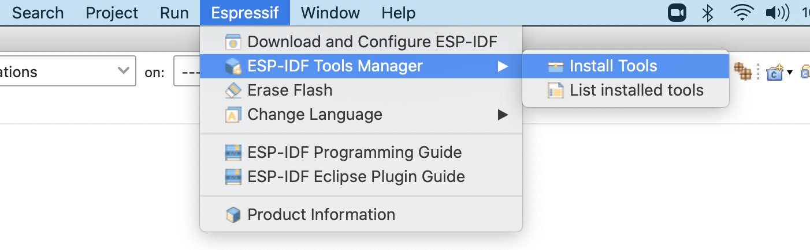

ESP-IDF Directory selection dialog:

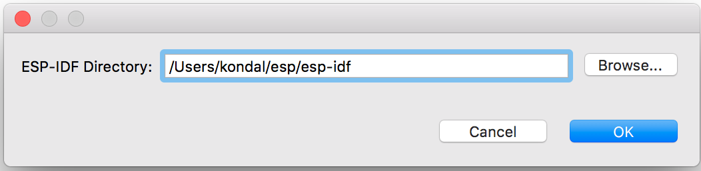

# Create a new Project
* Make sure you are in `C/C++ Perspective`
* Go to `File` > `New` > `Espressif IDF Project` (If you don't see this, please reset the perspective from `Window` > `Perspective` > `Reset Perspective..`)
* Provide the `Project name`
* Click `Finish`

> **Note:** You will see a lot of unresolved inclusion errors in the editor and those will be resolved only after the build.

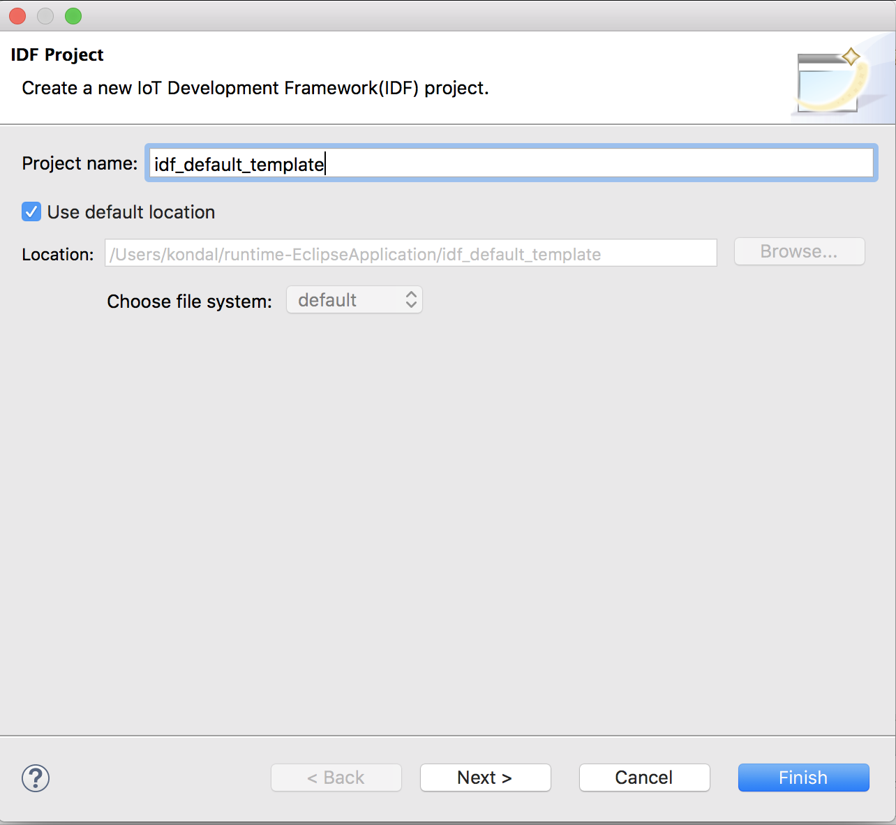

## Create a new project using ESP-IDF Templates
* Make sure you're in `C/C++ Perspective`
* Go to `File` > `New` > `Espressif IDF Project` (If you don't see this, please reset the perspective from `Window` > `Perspective` > `Reset Perspective..`)
* Provide the `Project name`
* Click `Next`
* Check `Create a project using one of the templates`
* Select the required template from the tree
* Click `Finish`

> **Note:** You will see a lot of unresolved inclusion errors in the editor and those will be resolved only after the build.

# Configuring Launch target
Next, we need to tell CDT to use the toolchain for our project so that all the headers will be indexed and resolved. This is accomplished through the Launch Bar, the new widget set you see on the far left of the toolbar. This will be shown only when you have a project in the project explorer.

* Click on the third dropdown 
* Select `New Launch Target`
* Select `ESP Target`
* Provide properties for the target where you would like to launch the application. Enter a `Name` for the target and select the `Serial Port` your ESP device is connected to on your machine.

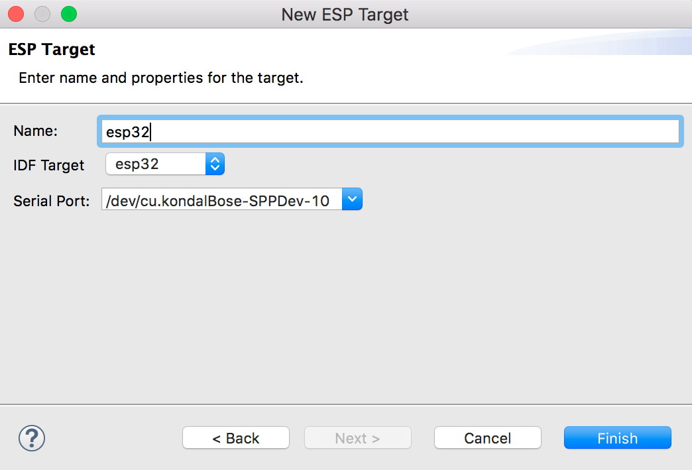

# Compiling the Project
* Select a project from the Project Explorer
* Select `Run` from the first drop-down, which is called `Launch Mode`
* Select your application from the second drop-down, which is called `Launch Configuration`(Auto-detected)
* Select target from the third drop-down, which is called `Launch Target`
* Now click on the `Build` button widget which you see on the far left of the toolbar

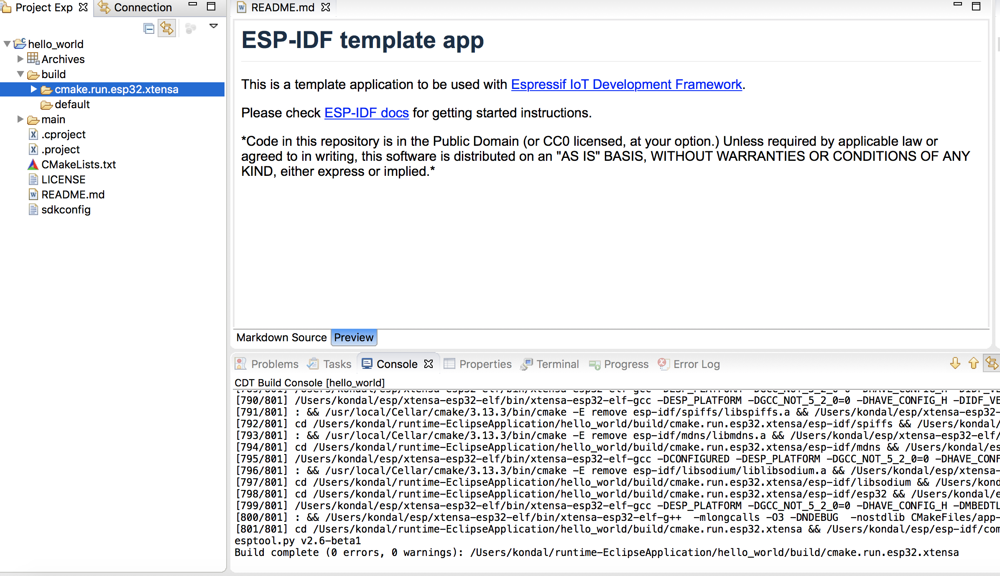

# Flashing the Project
ESP-IDF has a tool called `idf.py` which is a wrapper around make flash command with some handy operations. Flash operation can be initiated with just a click of a launch button(second button from the left) and it's auto-configured to flash the application with the default flash command i.e, `idf.py -p PORT flash`.

To provide the customized flash arguments, please follow [this](#customizeLaunchConfig) link for further instructions.

# Viewing Serial Output
To see the serial output in Eclipse, we need to configure the `ESP-IDF Serial Monitor` to connect to the serial port.

* Click on the `Open a Terminal` icon from the toolbar
* Choose `ESP-IDF Serial Monitor` from the terminal drop-down
* Select `Serial Port` for your board if it's not detected. Baud Rate and Serial Port settings are auto-configured by default. 
* Click on `OK` to launch the terminal, which will listen to the USB port

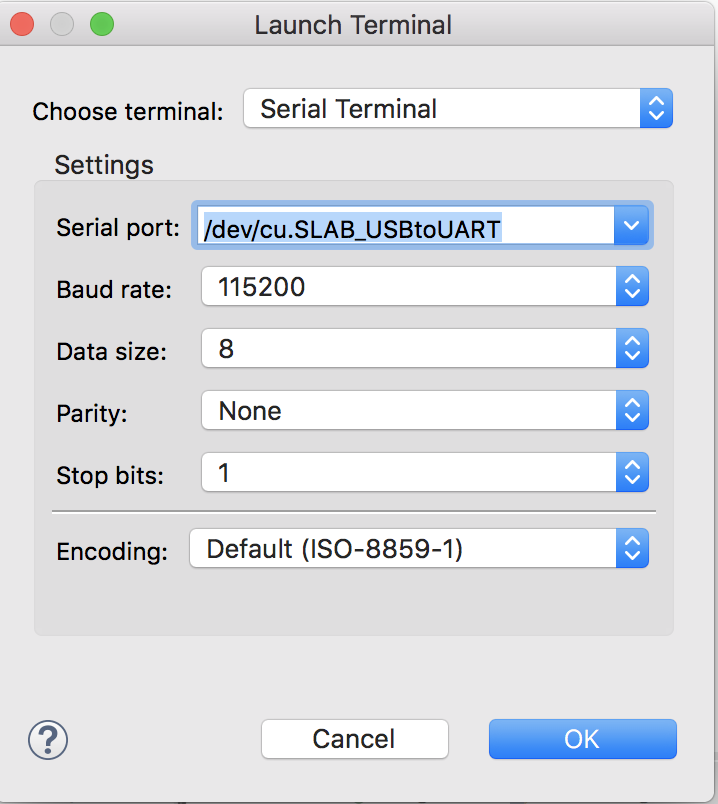

# Configuring the Project
IDF plugin will allow you to configure `sdkconfig` without leaving the Eclipse environment.

## SDK Configuration editor
Project configuration is held in a single file called `sdkconfig` in the root directory of the project. This configuration file can be modified using `SDK Configuration Editor`

To launch the SDK Configuration editor:
* Navigate to `sdkconfig` file
* Double click on the file to launch the SDK configuration editor
* Use `Ctrl+S` or  `Command+S` based on the OS environment to save the changes. You can also use Eclipse `Save` button from the toolbar
* To revert the sdkconfig editor changes, you can either close the editor without saving them or you can right click on the `sdkconfig` file and select `Load sdkconfig` menu option to revert the changes from the editor.

# CMake Editor
CMake Editor Plug-in is integrated with IDF Plugin for editing CMake files such as CMakeLists.txt. It provides syntax coloring, CMake command content assist, and code templates.

CMake editor preferences can be controlled using `Eclipse > Preferences > CMakeEd`

# Debugging the Project
## GDB Hardware Debugging
Please refer to <a href ="https://docs.espressif.com/projects/esp-idf/en/latest/api-guides/jtag-debugging/index.html" > GDB Hardware Debugging guide</a>

## GDB OpenOCD Debugging
Please refer to this <a href="https://github.com/espressif/idf-eclipse-plugin/tree/master/docs/OpenOCD%20Debugging.md">GDB OpenOCD Debugging</a>

# ESP-IDF Application Size Analysis
Application Size Analysis editor provides a way to analyze the static memory footprint of your application. It has two sections - Overview and Details. The **Overview** section provides a summary of the application memory usage and the **Details** section will have in-depth details about components and per-symbol level memory information.

Details table viewer also provides you with searching and sorting capabilities on various columns.

To launch the Application Size Analysis editor:
* Right-click on the project
* Select `ESP-IDF: Application Size Analysis` menu option to launch the editor

**Application Size Analysis - Overview**

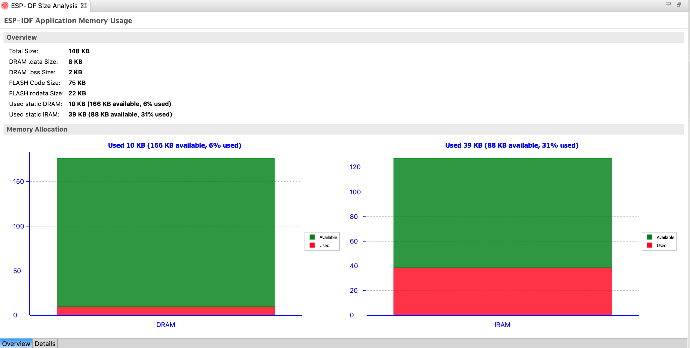

**Application Size Analysis - Details**

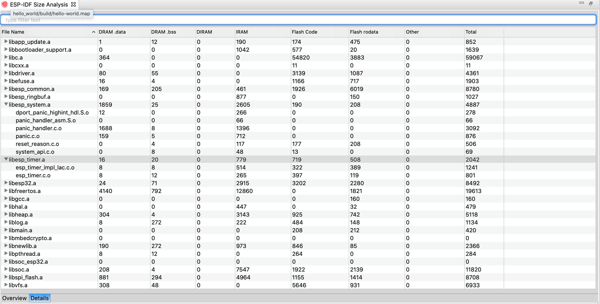

# ESP-IDF Terminal
This would launch a local terminal with all the environment variables which are set under `Preferences > C/C++ > Build > Environment`. The default working directory would be either the currently selected project or IDF_PATH if there is no project selected. 

The terminal PATH is also configured with `esptool`, `espcoredump`, `partition_table`, and `app_update` component paths so that it will be handy to access them directly from the ESP-IDF terminal.

To launch the ESP-IDF Terminal:
* Click on the `Open a Terminal` icon from the toolbar
* Choose `ESP-IDF Terminal` from the terminal drop-down and click `OK` to launch a terminal

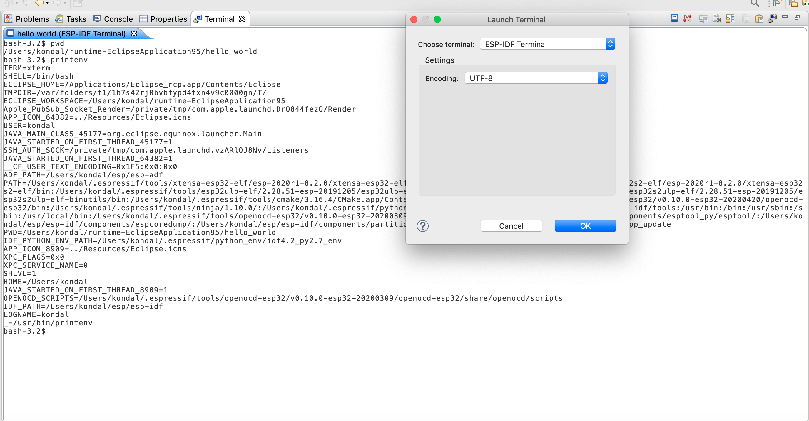

# Configuring Environment Variables
Eclipse auto configures the required environment variables in the `Preferences > C/C++ Build > Environment` section if IDF Tools are installed using `Help` > `ESP-IDF Tools Manager` > `Install Tools` menu option.

Required environment variables:
* IDF_PATH
* PATH
* OPENOCD_SCRIPTS
* IDF_PYTHON_ENV_PATH

If the required environment variables are not configured for any reason, please follow the step by step instructions below.
* Click on the `Environment` preference page under `C/C++ Build`. 
* Click “Add…” again, and enter name `IDF_PATH`. The value should be the full path where ESP-IDF is installed.
* Similarly we shoud configure OPENOCD_SCRIPTS, IDF_PYTHON_ENV_PATH and PATH environment variables

This is how they should look:

##### IDF_PATH #####
`/Users/user-name/esp/esp-idf`

##### OPENOCD_SCRIPTS #####
`/Users/user-name/.espressif/tools/openocd-esp32/v0.10.0-esp32-20190313/openocd-esp32/share/openocd/scripts`

##### IDF_PYTHON_ENV_PATH #####
`/Users/user-name/.espressif/python_env/idf4.0_py3.7_env`

##### PATH #####
`/Users/user-name/.espressif/tools/xtensa-esp32-elf/esp32-2019r1-8.2.0/xtensa-esp32-elf/bin:/Users/user-name/.espressif/tools/esp32ulp-elf/2.28.51.20170517/esp32ulp-elf-binutils/bin:/Users/user-name/.espressif/tools/cmake/3.13.4/CMake.app/Contents/bin:/Users/user-name/.espressif/tools/openocd-esp32/v0.10.0-esp32-20190313/openocd-esp32/bin:/Users/user-name/.espressif/tools/ninja/1.9.0/:/Users/user-name/.espressif/python_env/idf4.0_py3.7_env/bin:/Users/user-name/esp/esp-idf/tools:$PATH`

In the above path, the last segment `$PATH` needs to be replaced with the system environment PATH based on the operating system.
For example, to get the system environment PATH.
- In macOS,  `$echo $PATH ` 
- In Windows, `$echo %PATH%`

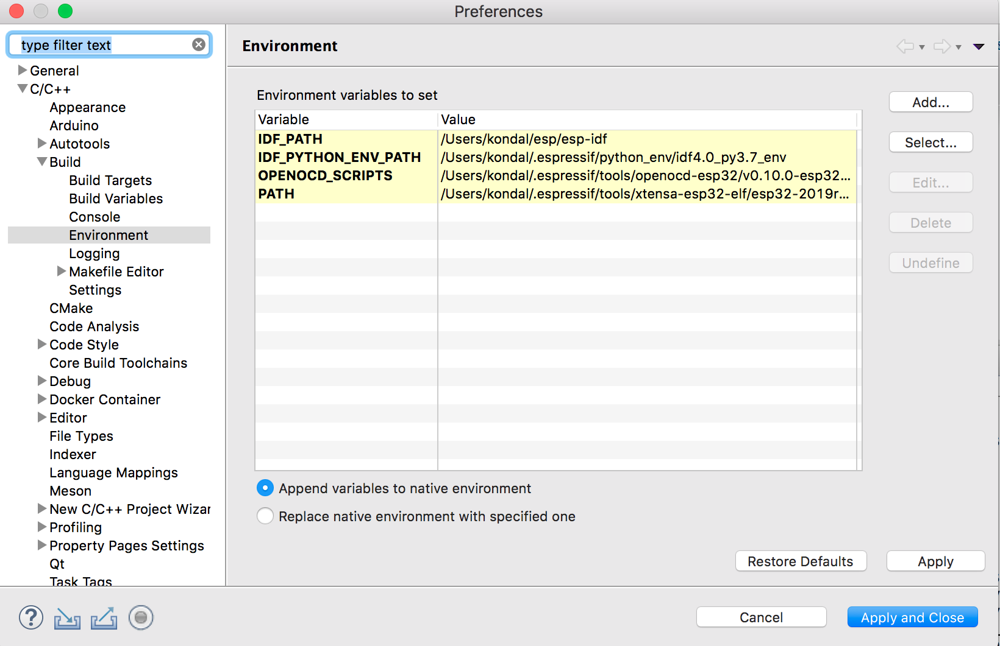

# Configuring Toolchains
We need to tell Eclipse CDT what core build toolchain and CMake toolchain need to be used to build the project. However, this will be auto-detected if you've installed the tools using the `Help > ESP-IDF Tools Manager > Install Tools` option from the Eclipse.

If these toolchains are not detected for any reason, please follow the step by step instructions below to add a new toolchain.

# Configuring Core Build Toolchains

* Open Eclipse Preferences
* Navigate to `C/C++  -> “Core Build Toolchains` preference page
* Click on `Add..` from the User defined Toolchians tables
* Select `GCC` as a toolchain type
* Click on `Next>`
* Provide the GCC Toolchain Settings:

**Compiler:** /Users/user-name/esp/xtensa-esp32-elf/bin/xtensa-esp32-elf-gcc,
**Operating System:** esp32,
**CPU Architecture:** xtensa

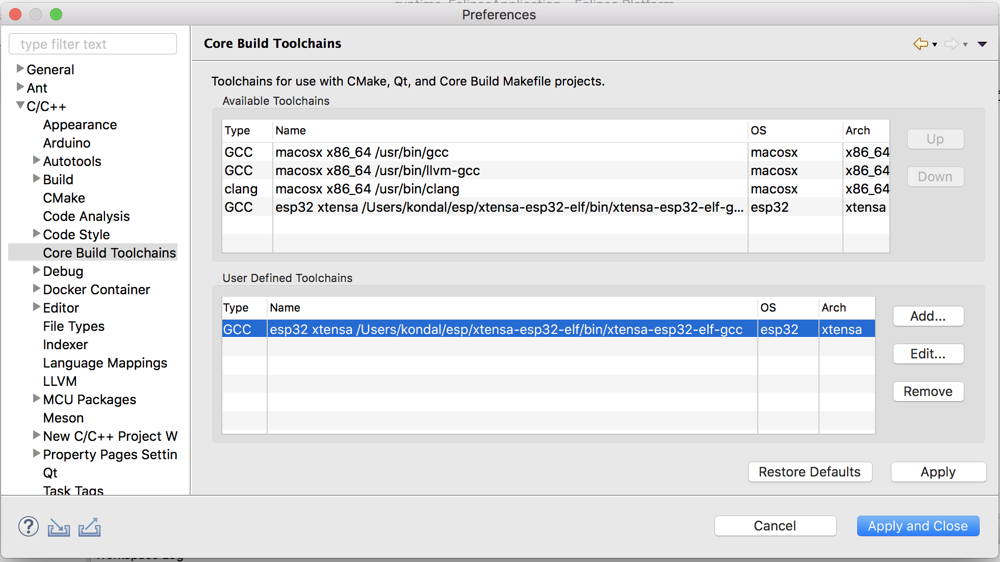

# Configuring CMake Toolchain
We now need to tell CDT which toolchain to use when building the project. This will pass the required arguments to CMake when generating the Ninja files.

* Navigate to “C/C++  -> “CMake” preference page
* Click `Add..` and this will launch the New CMake Toolchain configuration dialog
* Browse CMake toolchain `Path`. Example: `/Users/user-name/esp/esp-idf/tools/cmake/toolchain-esp32.cmake`
* Select GCC Xtensa Toolchain compiler from the drop-down list. Example: `esp32 xtensa /Users/user-name/esp/xtensa-esp32-elf/bin/xtensa-esp32-elf-gcc`

> **NOTE:**  Eclipse CDT has a bug in saving the toolchain preferences, hence it's recommended to restart Eclipse before we move further configuring the launch target.

# Launch Configuration
To provide the customized launch configuration and flash arguments, please follow the step by step instructions below.

* Click on the `Launch Configuration` edit button
* Switch to the `Main` tab
* Specify the `Location` where this application has to run. Since `idf.py` is a python file, will configure the python system path. Example:`${system_path:python}`
* Specify `Working directory` of the application. Example: `${workspace_loc:/hello_world}`
* In additional arguments, provide a flashing command which will run in the specified working directory
* Flash command looks like this: `/Users/user-name/esp/esp-idf/tools/idf.py -p /dev/cu.SLAB_USBtoUART flash`
* Click OK to save the settings
* Click on the `Launch` icon to flash the application to the selected board 

# Troubleshooting 

## Error Log
The Error Log view captures all the warnings and errors logged by plug-ins. The underlying log file is a .log file stored in the .metadata subdirectory of the workspace. 

The Error Log view is available in `Window > Show View > Error Log` .

To export the current log view content into a file, press the Export Log toolbar button or select `Export Log...` from the context menu. Then, enter a file name.

Always provide an error log when reporting an issue.

## Console View Log
The Console View provides all the warnings and errors related to the current running process or build. To access the console view.

From the menu bar, `Window > Show View > Console`. 

## CDT Global Build Log
Go to `Preferences > C/C++ > Build > Logging`

## Espressif IDF Tools Console
The Espressif IDF Tools Console is part of Console view, this will be opened only during the installation of IDF tools from the Eclipse. 

If you encounter any issue while installing the IDF tools using `Help > ESP-IDF Tools Manager > Install tools`, please check the Espressif IDF Tools Console to see the errors reported.

If this is not active, it can be switched by clicking on the `Display Selected Console` icon from the console view.

# Installing IDF Eclipse Plugin from Eclipse Market Place

Please follow the steps below to install IDF Eclipse Plugin from the Eclipse Market Place.
* In Eclipse, choose `Help` -> `Eclipse Market Place...`
* Enter `ESP-IDF Eclipse Plugin` in the search box to find the plugin
* Click on `Install` to follow the installation instructions.
* Restart the Eclipse

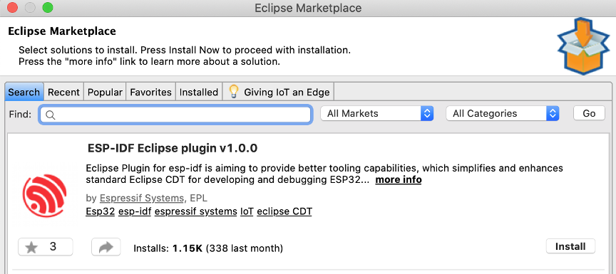

# Installing IDF Eclipse Plugin from Local Archive
* Download the latest update site archive for IDF Eclipse Plugin here - https://github.com/espressif/idf-eclipse-plugin/releases
* In Eclipse, choose `Help` -> `Install New Software`
* Click `Add…` button
* Select `Archive` from Add repository dialog and select the file `com.espressif.idf.update-vxxxxxxx.zip`
* Click `Add`
* Select `Espressif IDF` from the list and proceed with the installation 
* Restart the Eclipse

# How do I upgrade my existing IDF Eclipse Plugin?

If you are installing IDF Eclipse Plugin into your Eclipse for the first time, you first need to add the new release's repository as follows:
* Window > Preferences > Install/Update > Available Software Sites
* Click `Add`
* Enter the URL of the new repository https://dl.espressif.com/dl/idf-eclipse-plugin/updates/latest/
* Click `Ok`

If you've already installed IDF Eclipse Plugin using update site URL, you can get the latest changes using below
* Help > Check for Updates
* If updates are found, select `Espressif IDF Plugins for Eclipse` and deselect all other items
* Click `Next` to proceed with the installation

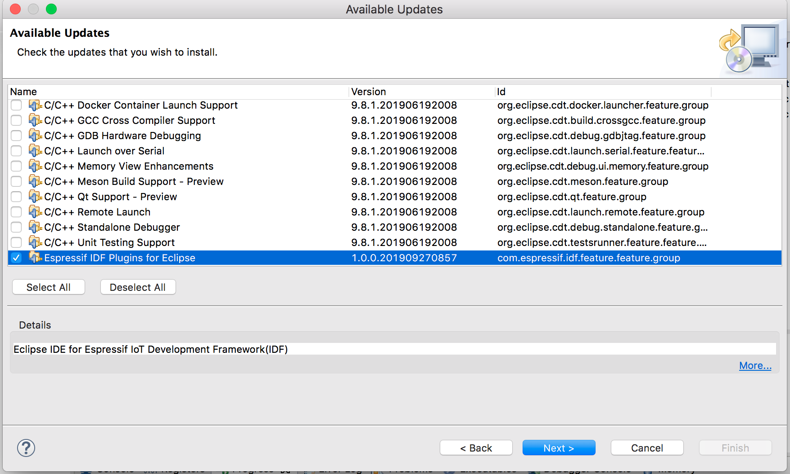

# Importing an existing IDF Project
* Make sure you're in `C/C++ Perspective`.
* Right click in the Project Explorer
* Select `Import..` Menu
* Select `Existing IDF Project` from `Espressif` import wizard menu list
* Click `Next`
* Click on `Browse...` to choose an existing project location directory
* Provide `Project name` if you wish you have a different name
* Click `Finish` to import the selected project into eclipse workspace as a CMake project

# Importing an existing Debug launch configuration
To import an existing launch configuration into Eclipse:
* Select `Import...` from the `File` menu
* In the Import dialog box, expand the `Run/Debug` group and select `Launch Configurations`
* Click on `Next`
* Click on `Browse...` to select the required location in the local file system
* Select the folder containing the launch files and then click OK
* Select the checkboxes for the required folder and launch file
* If you are replacing an existing configuration with the same name then select `Overwrite existing launch configurations without warning`
* Click on `Finish`

# How to raise bugs
Please raise the issues here https://github.com/espressif/idf-eclipse-plugin/issues with the complete environment details and log.

# FAQ

Please refer to https://github.com/espressif/idf-eclipse-plugin/blob/master/FAQ.md#FAQ
