[](https://github.com/espressif/idf-eclipse-plugin/releases/latest)

[中文](./README_CN.md)

# ESP-IDF Eclipse Plugin (Espressif-IDE)

ESP-IDF Eclipse Plugin brings developers an easy-to-use Eclipse-based development environment for developing ESP32-based IoT applications.

It provides better tooling capabilities, which simplifies and enhances standard Eclipse CDT for developing and debugging ESP32 IoT applications. It offers advanced editing, compiling, flashing and debugging features with the addition of installing the tools, SDK configuration and CMake editors.

The plug-in runs on `macOS`, `Windows` and `Linux` platforms.


> **Note:** Espressif-IDE 3.0 and higher supports ESP-IDF 5.x and above

To get a quick understanding of ESP-IDF and Eclipse plugin features, check our session which was presented in <a href= "https://youtu.be/CbPX3q7LeBc">EclipseCon 2020</a>.

# Table Of Contents
<details open>
  <summary>Get Started</summary>

* [Installation](#Installation) <br>
* [Creating a new Project](#NewProjectUsingDefault)<br>
* [Configuring Launch Target](#ConfigureLaunchTarget)<br>
* [Compiling the Project](#BuildApplication)<br>
* [Flashing the Project](#FlashApplication)<br>
* [Viewing Serial Output](#ConfigureLaunchTerminal)<br>
* [Debugging the Project](#debugging)<br>
* [Troubleshooting Guide](#troubleshooting)<br>
* <a href ="https://github.com/espressif/idf-eclipse-plugin/blob/master/FAQ.md#FAQ">FAQ</a>
</details>

<details open>
  <summary>Other IDE Features</summary>

* [Configuring the Project using sdkconfig Editor](#projectconfigure)<br>
* [CMake Editor](#cmakeproject)<br>
* [ESP-IDF Application Size Analysis Editor](#sizeanalysiseditor)<br>
* [Installing ESP-IDF Components](#espidfcomponents)<br>
* [ESP-IDF Terminal](#idfterminal)<br>
* [Configuring Build Environment Variables](#configureEnvironmentVariables)<br>
* [Configuring Core Build Toolchain](#ConfigureToolchains)<br>
* [Configuring CMake Toolchain](#ConfigureCMakeToolchain)<br>
* [Selecting Clang Toolchain](#SelectDifferentToolchain)<br>
* [Configuring the Flash Arguments](#customizeLaunchConfig)<br>
* [Installing IDF Eclipse Plugin from Eclipse Market Place](#installPluginsFromMarketPlace) <br>
* [Installing IDF Eclipse Plugin Using Local Archive](#installPluginsUsingLocalFile) <br>
* [Upgrading IDF Eclipse Plugin](#upgradePlugins)<br>
* [Importing an existing IDF Project](#ImportProject)<br>
* [Importing an existing Debug Launch Configuration](#importDebugLaunchConfig)<br>
* [Device Firmware Upgrade (DFU) through USB](#deviceFirmwareUpgrade)<br>
* [GDBStub Debugging](#gdbStubDebugging)<br>
* [Core Dump Debugging](#coreDumpDebugging)<br>
* [Application Level Tracing](#appLvlTracing)<br
* [Partition Table Editor UI for ESP-IDF](#partitionTableEditor)<br>
* [NVS Table Editor](#nvsTableEditor)<br>
* [Write Binary Data to Flash](#writeFlashBinary)<br>
* [Changing Language](#changeLanguage)<br>
* [Wokwi Simulator](#wokwisimulator)<br>
</details>

<a name="Installation"></a>

# Installation

We recommend using the Espressif-IDE instead of the Eclipse CDT + IEP Plugin update approach to avoid the hassles of updating.

## Espressif-IDE for Windows

* Download the [Espressif-IDE with ESP-IDF Offline Windows Installer](https://dl.espressif.com/dl/esp-idf/) and follow the instructions provided [here](https://github.com/espressif/idf-eclipse-plugin/blob/master/docs_readme/Espressif-IDE-Windows-Installer.md). This guide will walk you through the installation process for Java, Git, CMake, ESP-IDF, IDF Tools, Device Drivers, and Espressif-IDE to help you get started.

## Espressif-IDE for macOS and Linux

* To begin, download the [Espressif-IDE](https://github.com/espressif/idf-eclipse-plugin/blob/master/docs_readme/Espressif-IDE.md#downloads) for your respective operating system. Following this, launch the IDE and proceed to install the necessary ESP-IDF and related tools. Please note that prior to launching the IDE, you must ensure that Java, Python, and Git are installed as [prerequisites](#Prerequisites), and are available in the system path.

If you plan to use Eclipse CDT and update it through the IDF Eclipse plugin, please ensure that you download the supported version for your operating system from <a href= "https://www.eclipse.org/downloads/packages/release/2023-12/r/eclipse-ide-cc-developers">here</a>.

<a name="Prerequisites"></a>

## Prerequisites

The minimum requirements for running the Espressif-IDE are below.

* **Java 17 and above**: Download and install Java SE from <a href= "https://www.oracle.com/technetwork/java/javase/downloads/index.html">here</a>.
* **Python 3.8 and above**: Download and install Python from <a href="https://www.python.org/downloads/">here</a>.
* **Git**: Get the latest git from <a href ="https://git-scm.com/downloads">here</a>.

> **Note:** Make sure Java, Python and Git are available on the system environment PATH.

<a name="GettingStarted"></a>

# Installing IDF Plugin Using Update Site URL

You can install the IDF Eclipse plugin into an existing IDE using the update site URL. First, add the release repository URL as follows:

1. Go to `Help` > `Install New Software`.
2. Click `Add…`, and in the pop-up window:
	* Enter `Name` as `Espressif IDF Plugin for Eclipse`
	* Enter `Location` of the repository:
        * Stable release: https://dl.espressif.com/dl/idf-eclipse-plugin/updates/latest/
	* Click `Add`.
3. Select `Espressif IDF` from the list and proceed with the installation.

For adding beta and nightly builds, you can use the following update site URLs.
    * Beta version: https://dl.espressif.com/dl/idf-eclipse-plugin/updates/beta/
    * Nightly build: https://dl.espressif.com/dl/idf-eclipse-plugin/updates/nightly/

> **Note:** While the screenshots are captured on macOS, the installation instructions are applicable to Windows, Linux, and macOS.

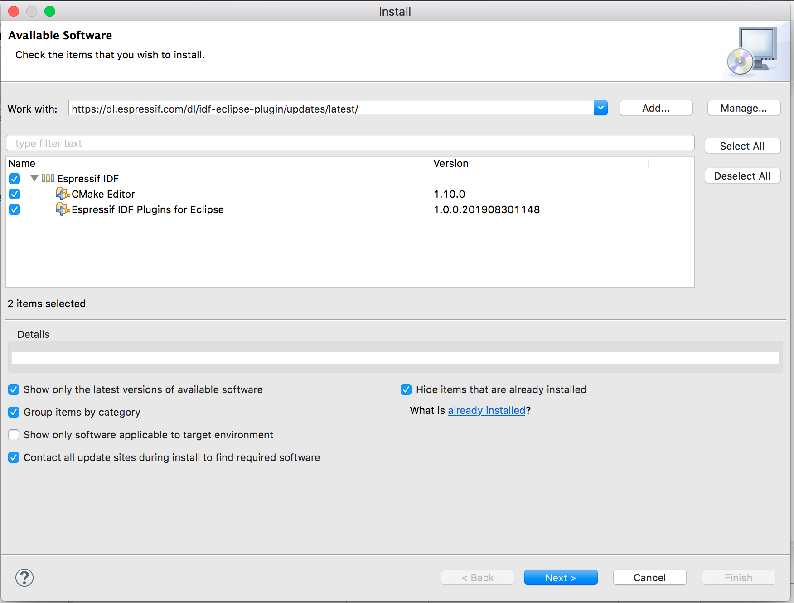

<a name="InstallTools"></a>

# Installing ESP-IDF

Please follow the instructions below for installing ESP-IDF in the Espressif-IDE.

1. Go to `Espressif` > `ESP-IDF Manager`. The following editor will open

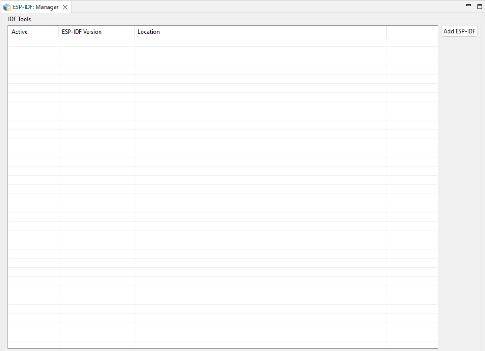

2. Click on `Add ESP-IDF` button.

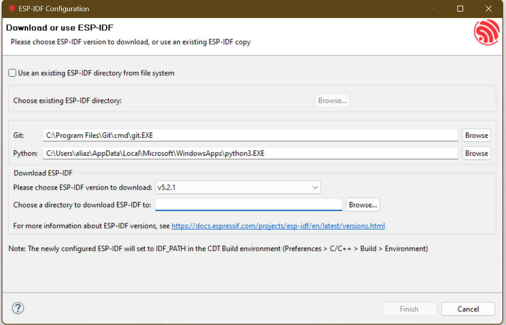

From the screen shown above you can either choose an already downloaded ESP-IDF directory or select and download one directly from the given dialog. The `Git` and `Python` must be installed and if they are configured in system PATH, they will be preloaded in the given view. If not, you can Browse to the directory and select the proper executables.

3. Click on `Finish`, which will be enabled after all the paths and executables are properly configured.

> **Note** Please note that the python executable is not the one from the virtual environment created from the installation of the ESP-IDF via other means like from CLI. If you are selecting an already installed ESP-IDF directory, IDE will automatically pick up the python once you have installed the tools.

To configure an existing ESP-IDF:

After you have clicked `Finish`, you will see the progress on console for the tools getting installed. Once the installation is done and this is the very first set of ESP-IDF installed in the IDE, it will be activated as well, and you will see a similar entry in the editor for ESP-IDF Manager.

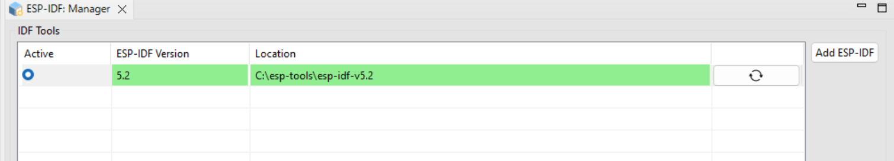

You can add as many version of ESP-IDF as you want, but only one of the version can be set active and that will be used to compile and index projects in your workspace. This new feature can help you in swithcing between versions in the workspace easily.

Let's take a look at how the multiple versions will look like. You have to follow the same steps as done previously to add another ESP-IDF version to the IDE.


To activate any specific version, simply click on the radio button next to it in the `Active` column.

The refresh button in last column for the active ESP-IDF version can be used to reload any changes in the directory you made.

> **Note** Please note that you can not delete an active ESP-IDF version. You need to activate another version before deleting that.

<a name="NewProjectUsingDefault"></a>

# Create a new Project

1. Make sure you are in `C/C++ Perspective`.
2. Go to `File` > `New` > `Espressif IDF Project`.
3. Provide the `Project name` (The ESP-IDF build system does not support spaces in the project path).
4. Click `Finish`.

To create a project using existing ESP-IDF templates, please refer to [this](#NewProjectUsingTemplates).

> **Note:** You may see numerous unresolved headers and symbols errors in the editor, and these will only be resolved after the build process.

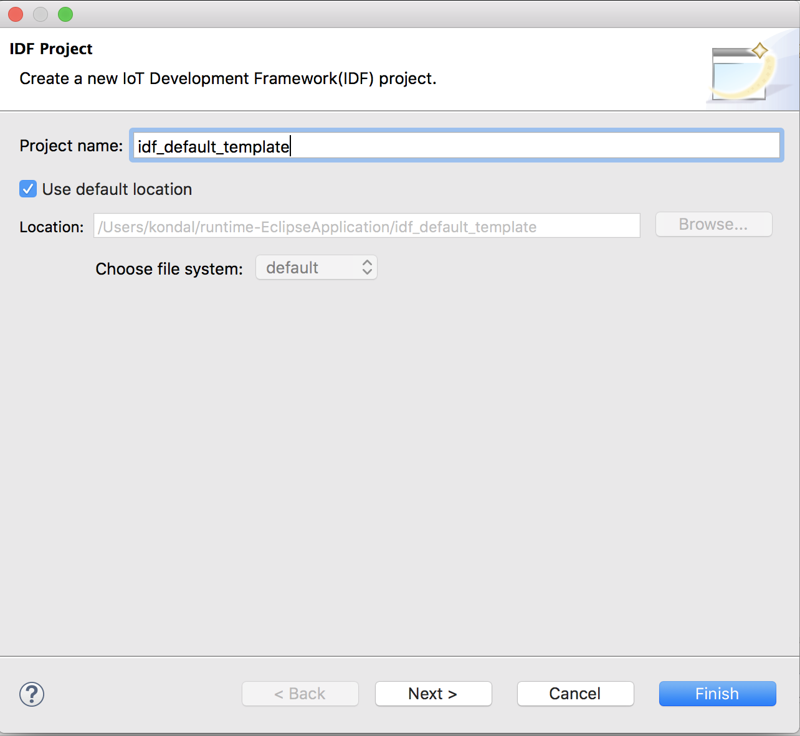

<a name="ConfigureLaunchTarget"></a>

# Configuring build target

Next, you should select the ESP target for your project. By default, the launch target drop-down will display all the supported targets by the plugin.


However, if you would like to add a target that is not available in the launch target drop-down, please follow the instructions below.

1. Click on the launch target dropdown.
2. Select `New Launch Target`.
3. Select `ESP Target`.
4. Provide properties for the target where you would like to launch the application. Enter a `Name` for the target and select the `Serial Port` your ESP device is connected to on your machine.

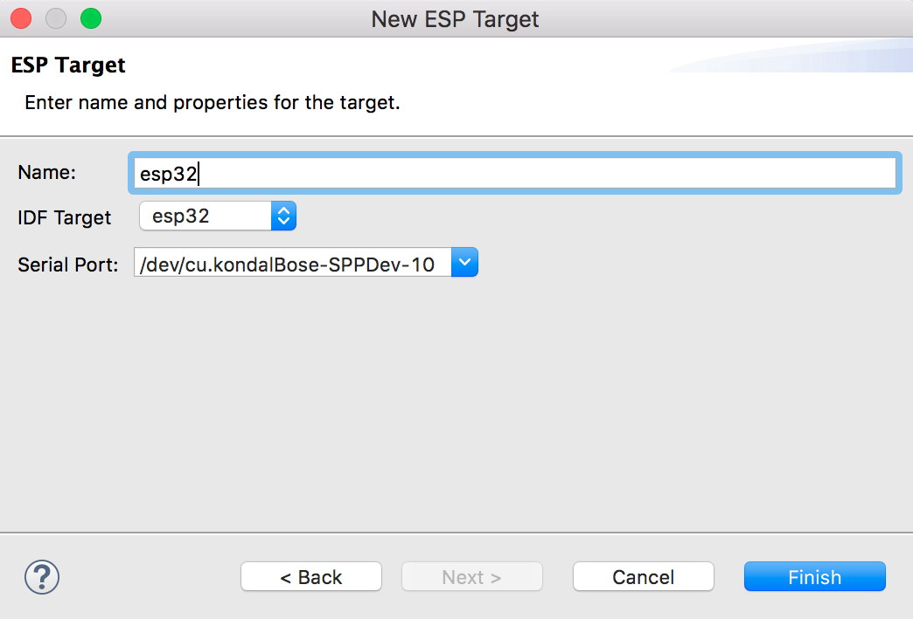

<a name="BuildApplication"></a>

# Compiling the Project

1. Select a project from the `Project Explorer`.
2. Select `Run` from the first drop-down, which is called `Launch Mode`.
3. Select your application from the second drop-down, which is called `Launch Configuration` (Auto-detected).
4. Select a target from the third drop-down, which is called `Launch Target`.
5. Now click on the `Build`  button to start with a build process.


<a name="FlashApplication"></a>

# Flashing the Project

Flash operation can be initiated with just a click of a launch button  and it's auto-configured to flash the application with the default flash command i.e, `idf.py -p PORT flash`.


To provide the customized flash arguments, please follow [this](#customizeLaunchConfig) link for further instructions.

To configure flashing via JTAG, please refer to this <a href="https://github.com/espressif/idf-eclipse-plugin/tree/master/docs_readme/JTAG%20Flashing.md">JTAG Flashing Guide</a>.

<a name="ConfigureLaunchTerminal"></a>

# Viewing Serial Output

To see the serial output in Eclipse, we need to configure the `ESP-IDF Serial Monitor` to connect to the serial port. This is integrated with the `IDF Monitor`. Please check more details <a href="https://docs.espressif.com/projects/esp-idf/en/latest/esp32/api-guides/tools/idf-monitor.html#idf-monitor">here</a>.


1. Click on the `Open a Terminal` icon from the toolbar.
2. Choose `ESP-IDF Serial Monitor` from the terminal drop-down.
3. Select `Serial Port` for your board if it's not detected.
4. Configure serial monitor `Filter Options` for output filtering.
5. Click on `OK` to launch the terminal, which will listen to the USB port.

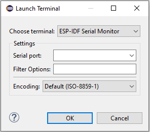

### ESP-IDF Serial Monitor Settings

ESP-IDF Serial Monitor will allow you to configure the default settings of the serial monitor character limit and number of lines.

1. Navigate to `Espressif` from the Eclipse Preferences.
2. Click on `ESP-IDF Serial Monitor Settings`.
3. Provide `Console Line Width` and `Limit Console Output`.

<a name="debugging"></a>

# Debugging the Project

In most cases, only two things are required to start debugging an ESP-IDF project:
1) Create a debug configuration
2) Check whether the board in the created configuration corresponds to the board in use.
> **Note:** If you're using Windows, you may need to install drivers using Zadig to run a debug session successfully. For detailed instructions, please refer to this [guide](https://docs.espressif.com/projects/esp-idf/en/latest/esp32/api-guides/jtag-debugging/configure-ft2232h-jtag.html#configure-usb-drivers).

The fastest way to create a debug configuration is to expand the configuration list in the launch bar and click `New Launch Configuration...`. Then select `ESP-IDF GDB OpenOCD Debugging` -> Double Click or `Next`. After that, the preview for the new debug configuration will open where it's necessary to check the board.

After creating the debug configuration, you can go ahead and debug the project. Select the configuration you just created, select debug mode, and click on the `Debug` icon  to start debugging:


To learn more about the debug configuration, please refer to <a href="https://github.com/espressif/idf-eclipse-plugin/tree/master/docs_readme/OpenOCD%20Debugging.md">GDB OpenOCD Debugging</a>.

# Other IDE Features

<a name="NewProjectUsingTemplates"></a>
## Create a New Project Using ESP-IDF Templates

1. Make sure you're in `C/C++ Perspective`.
2. Go to `File` > `New` > `Espressif IDF Project` (If you don't see this, please reset the perspective from `Window` > `Perspective` > `Reset Perspective..`).
3. Provide the `Project name`.
4. Click `Next`.
5. Check `Create a project using one of the templates`.
6. Select the required template from the tree.
7. Click `Finish`.

> **Note:** You will see a lot of unresolved inclusion errors in the editor and those will be resolved only after the build.

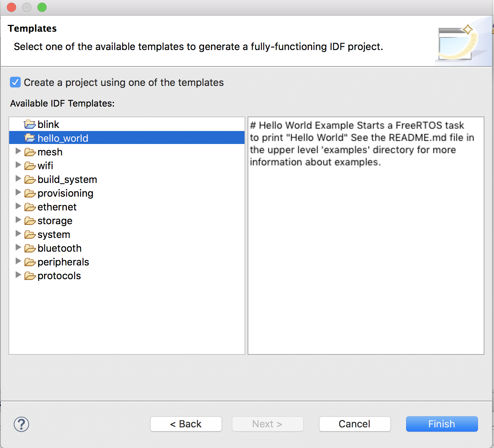


<a name="projectconfigure"></a>
# SDK Configuration Editor

Project configuration is held in a single file called `sdkconfig` in the root directory of the project. This configuration file can be modified using `SDK Configuration Editor`

To launch the SDK Configuration editor:

1. Navigate to `sdkconfig` file.
2. Double-click on the file to launch the SDK configuration editor.
3. Use `Ctrl+S` or  `Command+S` based on the OS environment to save the changes. You can also use Eclipse `Save` button from the toolbar.
4. To revert the sdkconfig editor changes, you can either close the editor without saving them or you can right-click on the `sdkconfig` file and select `Load sdkconfig` menu option to revert the changes from the editor.

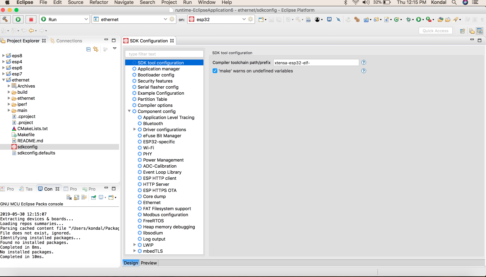

<a name="cmakeproject"></a>
# CMake Editor

CMake Editor Plug-in is integrated with IDF Plugin for editing CMake files such as `CMakeLists.txt`. It provides syntax coloring, CMake command content assist, and code templates.

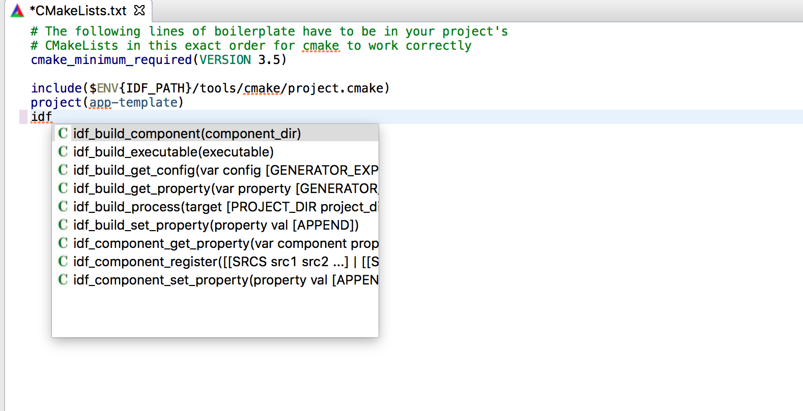

CMake editor preferences can be controlled using `Eclipse` > `Preferences` > `CMakeEd`.

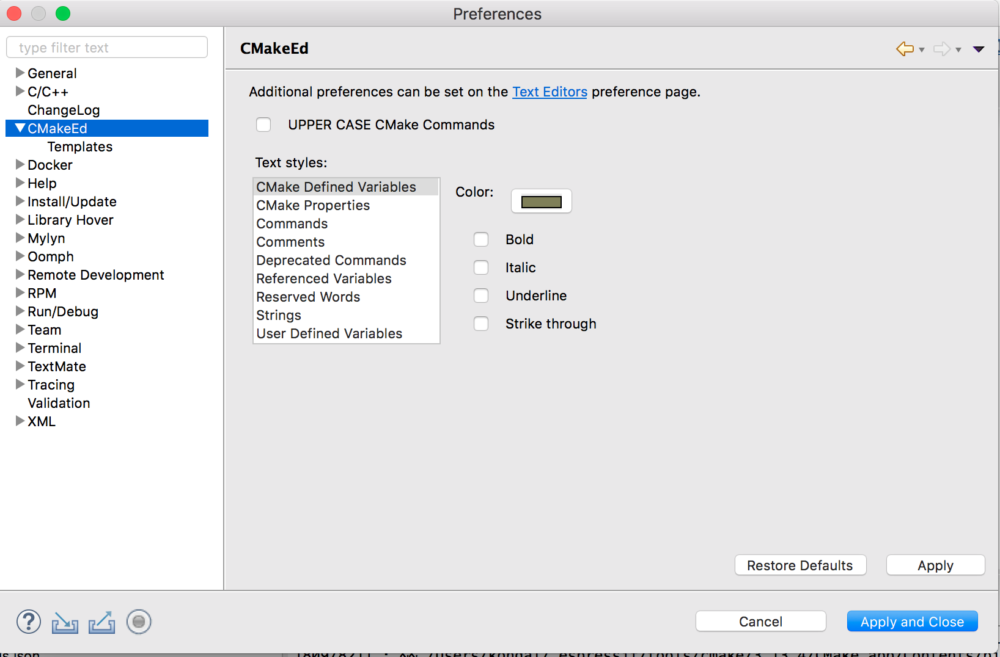

<a name="sizeanalysiseditor"></a>
# ESP-IDF Application Size Analysis

The Application Size Analysis editor provides a way to analyze the static memory footprint of your application. It has two sections:
- The **Overview** section provides a summary of the application's memory usage;
- The **Details** section will have in-depth details about components and per-symbol level memory information.

**Details** table viewer also provides you with searching and sorting capabilities on various columns.

To launch the Application Size Analysis editor:

1. Right-click on the project.
2. Select `ESP-IDF` > `Application Size Analysis` menu option to launch the editor.

**Application Size Analysis - Overview**

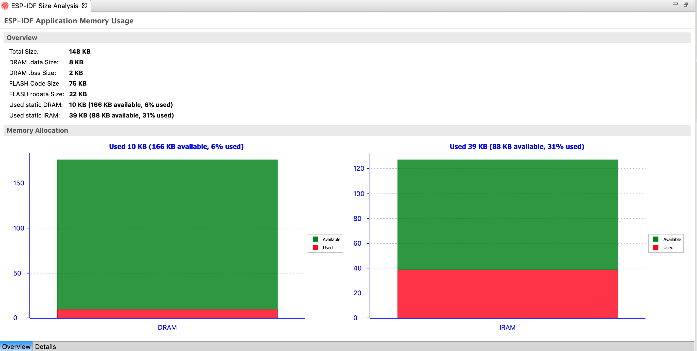

**Application Size Analysis - Details**

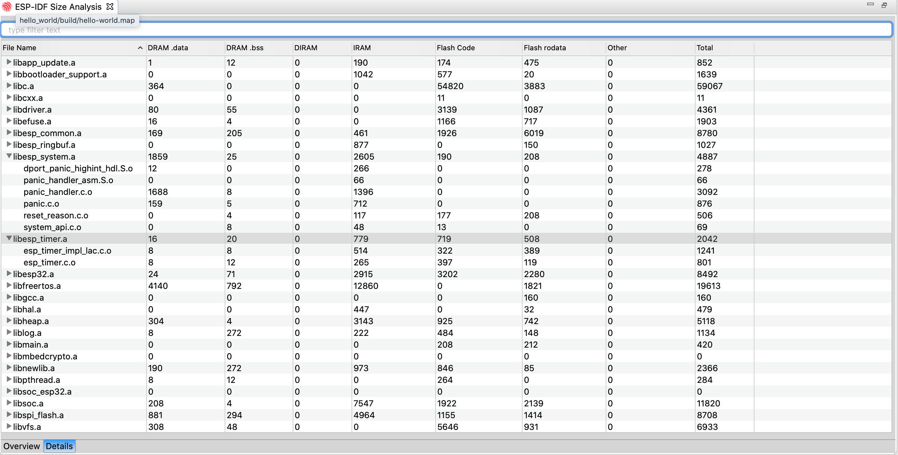

<a name="idfterminal"></a>
# ESP-IDF Terminal

This would launch a local terminal with all the environment variables which are set under `Preferences` > `C/C++` > `Build` > `Environment`. The default working directory would be either the currently selected project or `IDF_PATH` if there is no project selected.

The terminal PATH is also configured with `esptool`, `espcoredump`, `partition_table`, and `app_update` component paths so that it will be handy to access them directly from the ESP-IDF terminal.

To launch the ESP-IDF Terminal:

* Click on the `Open a Terminal` icon from the toolbar.
* Choose `ESP-IDF Terminal` from the terminal drop-down and click `OK` to launch a terminal.


<a name="espidfcomponents"></a>
# Installing ESP-IDF Components

You can install the ESP-IDF Components directly into your project from the available components online. Follow the steps below:

* Right-click on the project from `Project Explorer` in which you want to add the component to and select `Install ESP-IDF Components`.

    

    A new window will open up showing all the available component to be installed.

* From the window, you can click on `Install` button to add that component to the project. To get to the readme file for that component you can click on `More Info` which will open the browser link to the readme file of that component.

    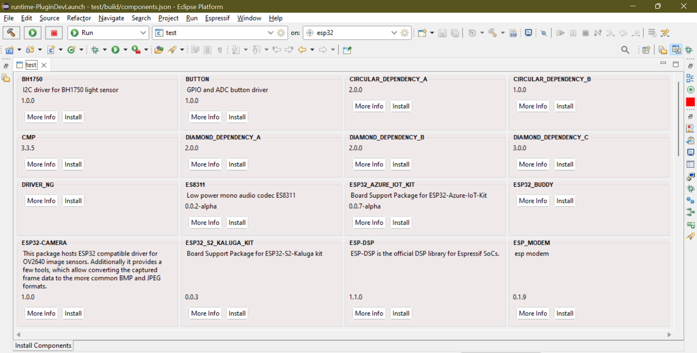

Already added components are also shown but the `Install` button changes text to `Already Added` and is disabled.

<a name="configureEnvironmentVariables"></a>
# Configuring Environment Variables

All the required environment variables are automatically configured by the IDE during the ESP-IDF and Tools installation process (`Espressif` > `ESP-IDF Manager` > `Add ESP-IDF`). You can verify them in the Preferences page under `C/C++` > `Build` > `Environment`.

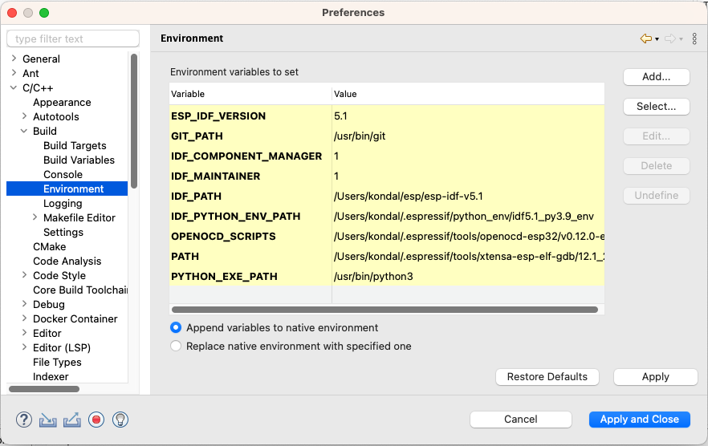

# Configuring Toolchains

We need to tell Eclipse CDT what core build toolchain and CMake toolchain to use to build the project. However, this will be auto-detected if you've installed the tools using the `Espressif` > `ESP-IDF Manager` > `Add ESP-IDF` option from IDE.

If these toolchains are not detected for any reason, please follow the step-by-step instructions below to add a new toolchain.

<a name="ConfigureToolchains"></a>
# Configuring Core Build Toolchains

1. Open Eclipse `Preferences`.
2. Navigate to `C/C++` > `Core Build Toolchains` preference page.
3. Click on `Add...` from the user-defined toolchains tables.
4. Select `GCC` as a toolchain type.
5. Click on `Next`.
6. Provide the GCC toolchain settings:

    * **Compiler:** /Users/user-name/esp/xtensa-esp32-elf/bin/xtensa-esp32-elf-gcc
    * **Operating System:** esp32
    * **CPU Architecture:** xtensa

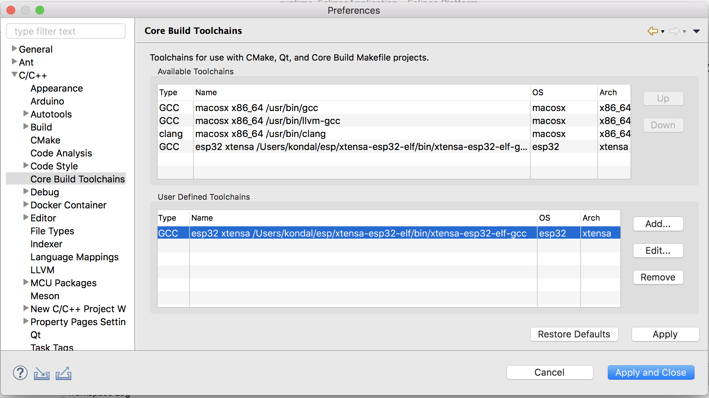

<a name="ConfigureCMakeToolchain"></a>
# Configuring CMake Toolchain

We now need to tell CDT which toolchain to use when building the project. This will pass the required arguments to CMake when generating the Ninja files.

1. Navigate to `C/C++` > `CMake` preference page.
2. Click `Add...` and this will launch the New CMake toolchain configuration dialog.
3. Browse CMake toolchain `Path`. Example: `/Users/user-name/esp/esp-idf/tools/cmake/toolchain-esp32.cmake`.
4. Select GCC Xtensa toolchain compiler from the drop-down list. Example: `esp32 xtensa /Users/user-name/esp/xtensa-esp32-elf/bin/xtensa-esp32-elf-gcc`.

> **Note:**  Eclipse CDT has a bug in saving the toolchain preferences, hence it's recommended to restart Eclipse before we move further configuring the launch target.

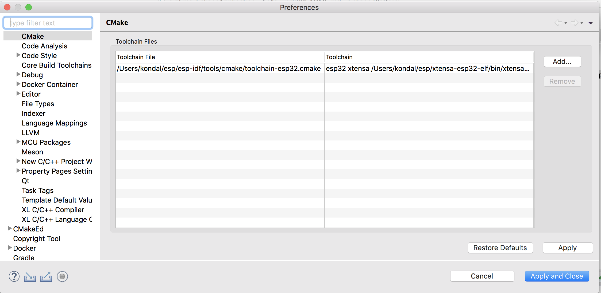

<a name="SelectDifferentToolchain"></a>
# Selecting Clang Toolchain

1. After creating a new project, edit the project configuration.


2. Go to the `Build Settings` tab and select clang toolchain there:


> **Note:** Clang toolchain now is an experimental feature and you may face some build issues due to the incompatibility of ESP-IDF. Below is a description of how to fix the most common build issues on the current ESP-IDF master (ESP-IDF v5.1-dev-992-gaf28c1fa21-dirty). To work around clang build errors please refer to [this](https://github.com/espressif/idf-eclipse-plugin/blob/master/WORKAROUNDS.md#clang-toolchain-buid-errors).

<a name="customizeLaunchConfig"></a>
# Launch Configuration

To provide the customized launch configuration and flash arguments, please follow the step-by-step instructions below.

1. Click on the `Launch Configuration` edit button.
2. Switch to the `Main` tab.
3. Specify the `Location` where this application has to run. Since `idf.py` is a Python file, the system will configure the Python path. Example: `${system_path:python}`.
4. Specify the `Working Directory` of the application. Example: `${workspace_loc:/hello_world}`.
5. In additional arguments, provide a flashing command which will run in the specified working directory.
6. Flash command looks like this: `/Users/user-name/esp/esp-idf/tools/idf.py -p /dev/cu.SLAB_USBtoUART flash`.
7. Click OK to save the settings.
8. Click on the `Launch` icon to flash the application to the selected board.

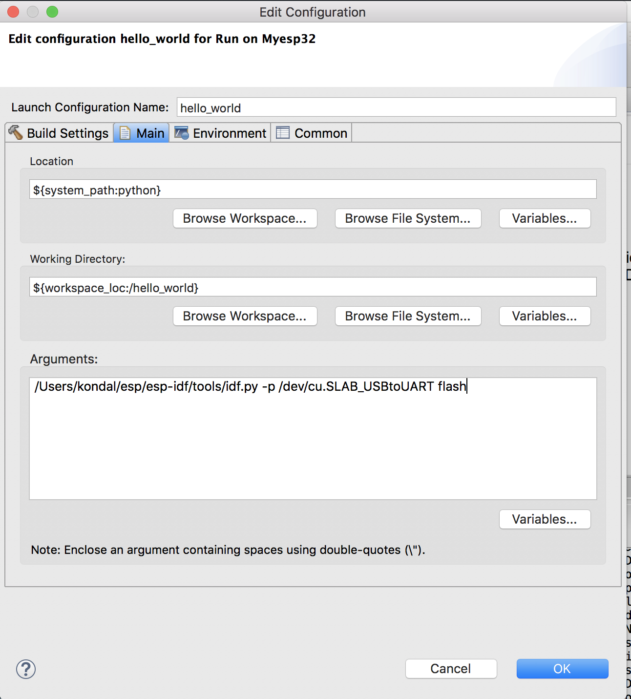

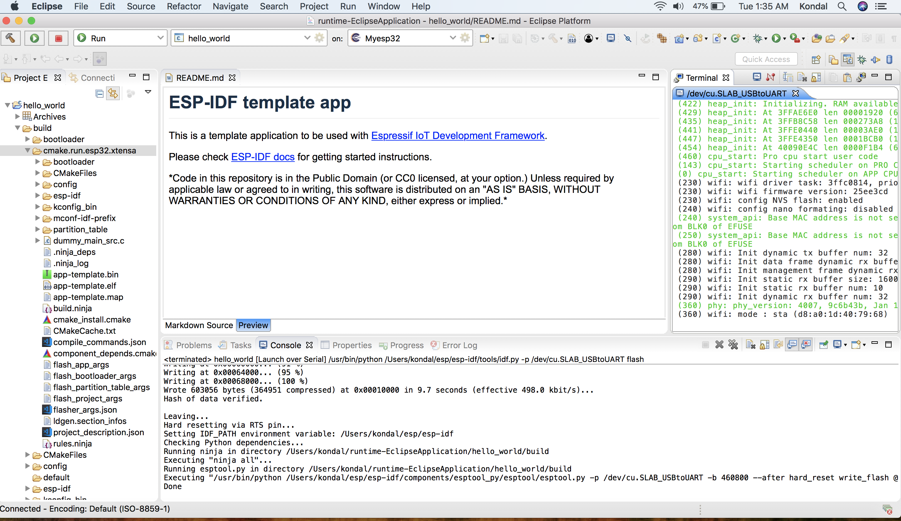

<a name="changeLanguage"></a>
# Changing Language

To change the plugin language, a menu is provided to show the list of available languages for the plugin.

1. Click on the `Espressif` menu from the menu bar.
2. Select the `Change Language` from the drop-down menu.
3. From the sub menu select the language you want.
4. IDE will restart with the selected language.


Remember this will only change the language of the Eclipse if the required language bundles for the selected language are installed or else only the plugin interfaces will be changed.

<a name="troubleshooting"></a>
# Troubleshooting

## Suggestions for Solving Errors from ESP-IDF by Hints Viewer

If you run into a problem during a build, chances are that there is a hint for this error in the ESP-IDF hint database, which is stored in `tools/idf_py_actions/hints.yml` of ESP-IDF. The ESP-IDF Eclipse plugin provides a hint viewer where you can type an error message and find a hint for it.

Prerequisites for it is to have `hints.yml`, which is available from ESP-IDF v5.0 and higher. If you are using lower versions of ESP-IDF, you can still use the hints viewer. To do it, you have to manually download the `hints.yml` file from [here](https://github.com/espressif/esp-idf/blob/master/tools/idf_py_actions/hints.yml) and put it to your `esp-idf/tools/idf_py_actions/` path. To download a file from GitHub, right-click the `Raw` button and then `Save as...`.

To open the hints viewer, go to `Windows` -> `Show View` -> `Other...` -> `Espressif` -> `Hints`. You will see the following view:


Now you can type or copy paste some error from the build log, for example: `ccache error: Failed to create temporary file for esp-idf/libsodium/CMakeFiles/..../....: No such file or directory`


Double-clicking on the row will give you a hint message, so you can clearly see it if it doesn't fit on your screen in the table view.


## Error Log

The `Error Log` view captures all the warnings and errors logged by plug-ins. The underlying log file is a .log file stored in the .metadata subdirectory of the workspace.

The `Error Log` view is available in `Window` > `Show View` > `Error Log`.

To export the current log view content into a file, press the Export Log toolbar button or select `Export Log...` from the context menu. Then, enter a file name.

Always provide an error log when reporting an issue.

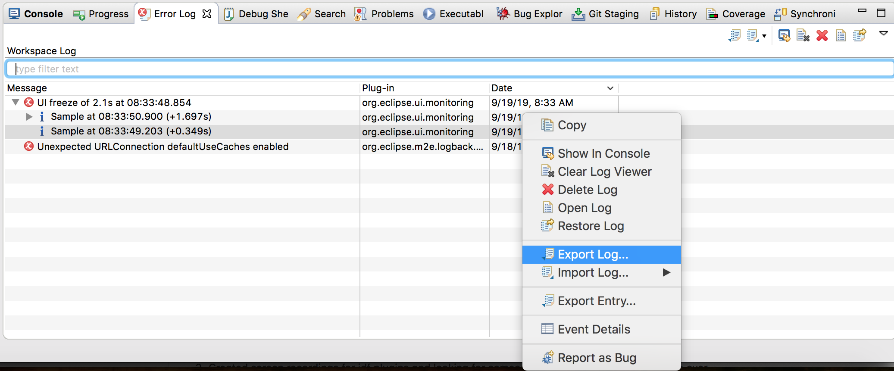

## Console View Log

The `Console` view provides all the warnings and errors related to the current running process or build.

To access the console view, go to the menu bar and select `Window` > `Show View` > `Console`.

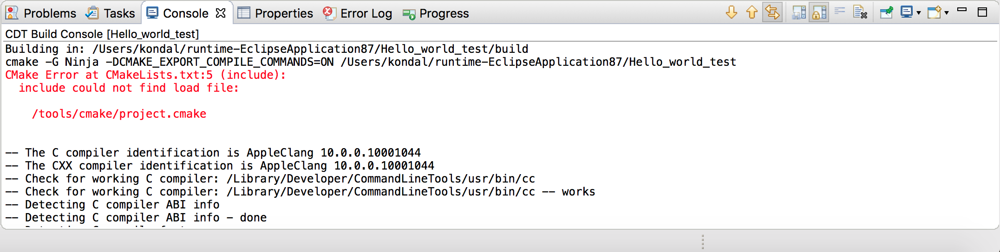

## CDT Global Build Log

Go to `Preferences > C/C++ > Build > Logging`

## Espressif IDF Tools Console

The Espressif IDF Tools Console is part of the `Console` view, this will be opened only during the installation of IDF tools from the Eclipse.

If you encounter any issue while installing the IDF tools using `Espressif` > `ESP-IDF Tools Manager` > `Install tools`, please check the Espressif IDF Tools Console to see the errors reported.

If this is not active, it can be switched by clicking on the `Display Selected Console` icon from the `Console` view.

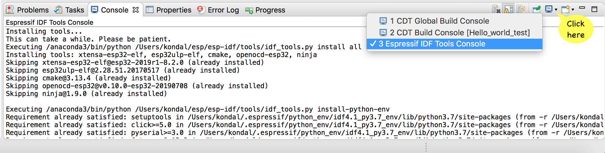

## Heap Tracing

Please refer to <a href="https://github.com/espressif/idf-eclipse-plugin/tree/master/docs_readme/HeapTracing.md">this</a> doc.

<a name="installPluginsFromMarketPlace"></a>
# Installing IDF Eclipse Plugin from Eclipse Market Place

Please follow the steps below to install IDF Eclipse Plugin from the Eclipse Market Place.

1. In Eclipse, choose `Help` > `Eclipse Market Place...`.
2. Enter `ESP-IDF Eclipse Plugin` in the search box to find the plugin.
3. Click on `Install` to follow the installation instructions.
4. Restart the Eclipse.

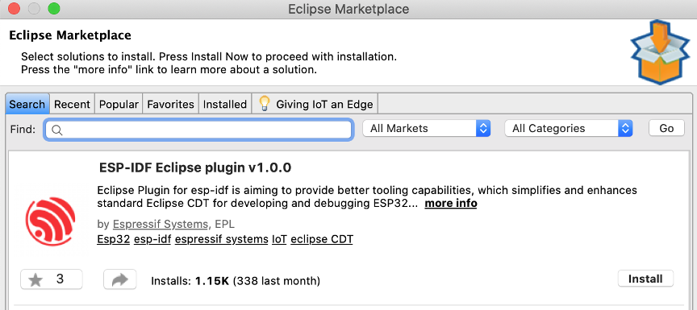

<a name="installPluginsUsingLocalFile"></a>
# Installing IDF Eclipse Plugin from Local Archive

1. Download the latest update site archive for IDF Eclipse Plugin here - https://github.com/espressif/idf-eclipse-plugin/releases.
2. In Eclipse, choose `Help` > `Install New Software`.
3. Click `Add…` button.
4. Select `Archive` from Add repository dialog and select the file `com.espressif.idf.update-vxxxxxxx.zip`.
5. Click `Add`.
6. Select `Espressif IDF` from the list and proceed with the installation.
7. Restart the Eclipse.

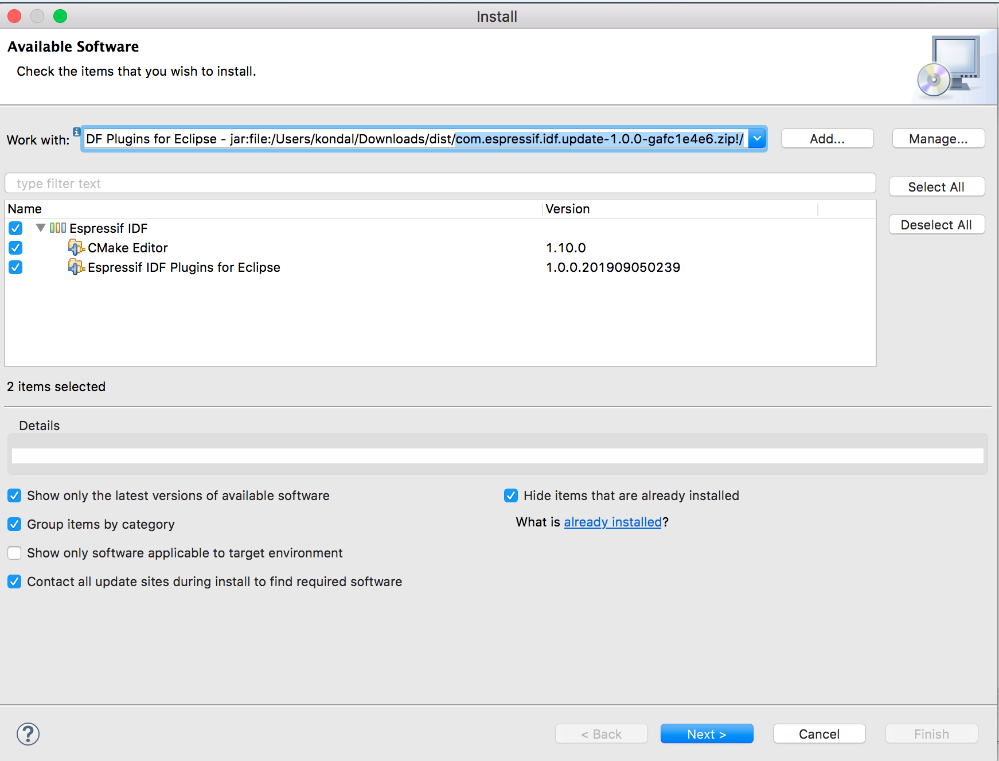

<a name="upgradePlugins"></a>
# How do I upgrade my existing IDF Eclipse Plugin?

If you are installing IDF Eclipse Plugin into your Eclipse for the first time, you first need to add the new release's repository as follows:

1. `Window` > `Preferences` > `Install/Update` > `Available Software Sites`.
2. Click `Add`.
3. Enter the URL of the new repository https://dl.espressif.com/dl/idf-eclipse-plugin/updates/latest/.
4. Click `Ok`.

If you've already installed IDF Eclipse Plugin using `update site URL`, you can get the latest changes by following the steps below:

1. `Help` > `Check for Updates`.
2. If updates are found, select `Espressif IDF Plugins for Eclipse` and deselect all other items.
3. Click `Next` to proceed with the installation.

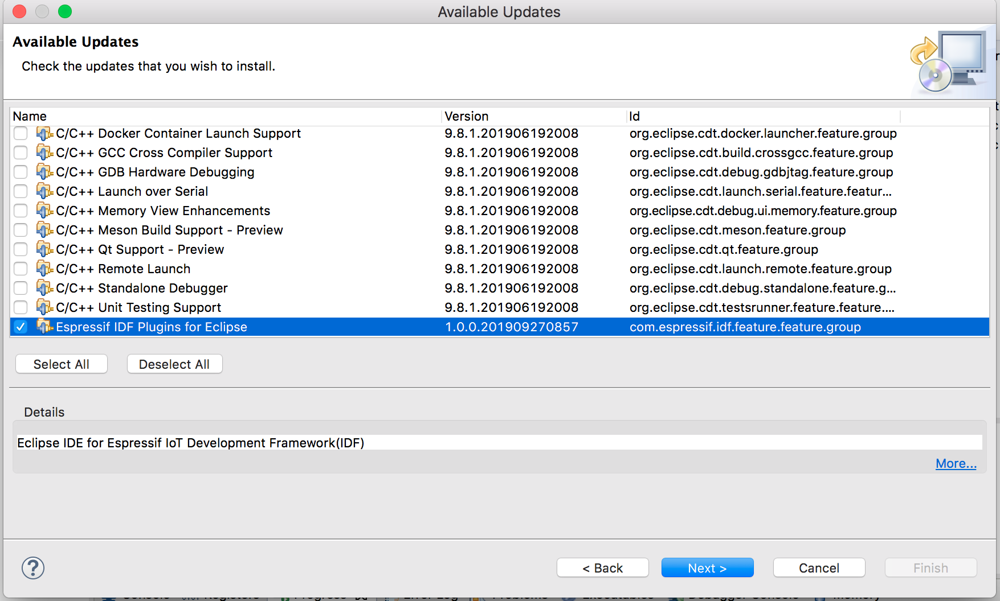

<a name="ImportProject"></a>
# Importing an Existing IDF Project

1. Make sure you're in `C/C++ Perspective`.
2. Right-click on the `Project Explorer`.
3. Select `Import...` Menu.
4. Select `Existing IDF Project` from `Espressif` import wizard menu list.
5. Click `Next`.
6. Click on `Browse...` to choose an existing project location directory.
7. Provide `Project name` if you wish you have a different name.
8. Click `Finish` to import the selected project into Eclipse workspace as a CMake project.

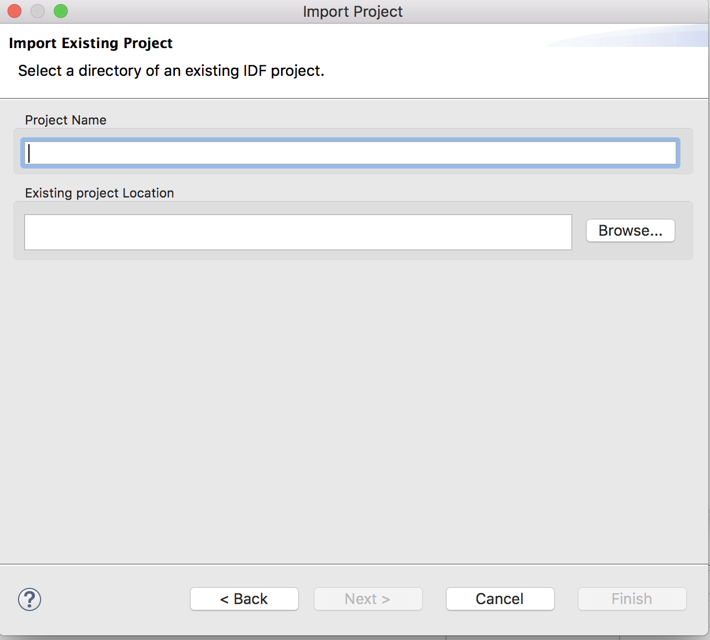

<a name="importDebugLaunchConfig"></a>
# Importing an Existing Debug Launch Configuration

To import an existing launch configuration into Eclipse:

1. Select `Import...` from the `File` menu.
2. In the Import dialog box, expand the `Run/Debug` group and select `Launch Configurations`.
3. Click on `Next`.
4. Click on `Browse...` to select the required location in the local file system.
5. Select the folder containing the launch files and then click `OK`.
6. Select the checkboxes for the required folder and launch file.
7. If you are replacing an existing configuration with the same name then select `Overwrite existing launch configurations without warning`.
8. Click on `Finish`.

<a name="gdbStubDebugging"></a>
# GDBStub Debugging

You can now use the GDBStub debugging inside our Eclipse plugin to help you diagnose and debug issues on chips via Eclipse when it is in panic mode.

To enable GDBStub debugging for a project:

1. Launch the `sdkconfig` in project root by double-clicking on it, and it will open the configuration editor.

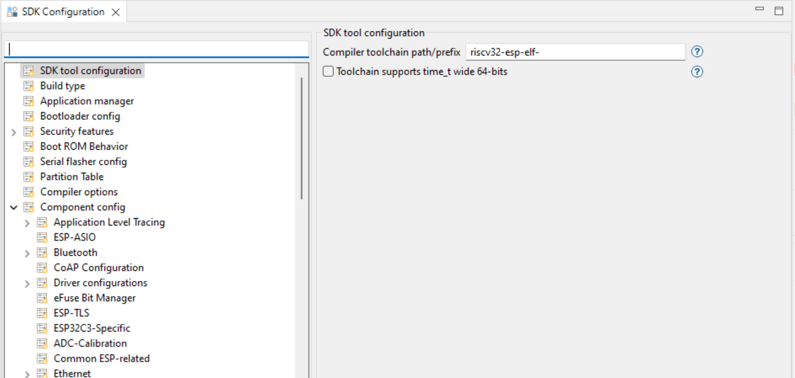

2. Expand the `Component Config` section and select `ESP System Settings`. From the settings on the right of `Panic handler behaviour`, select the `GDBStub on Panic` option from the list.

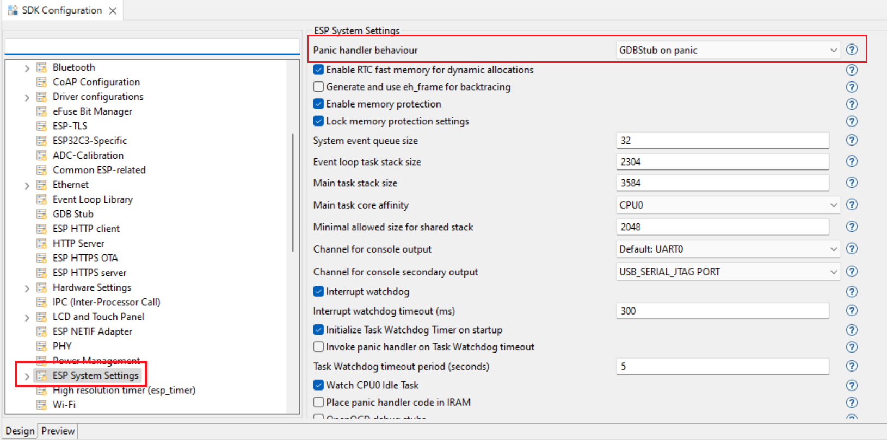

Now you will be taken to the GDBStub debugger automatically when you connect the serial monitor and there is a panic for this example.

To use the GDBStub debugging for a project:

1. Create a template `hello_world` project and add the following lines in the main c file.

    ```
    This is a global variable<br/>
    COREDUMP_DRAM_ATTR uint8_t global_var;
    ```

2. Now add these two lines just above the `esp_restart()` function

    ```
    global_var = 25;
    assert(0);
    ```

The final file should be something like this:

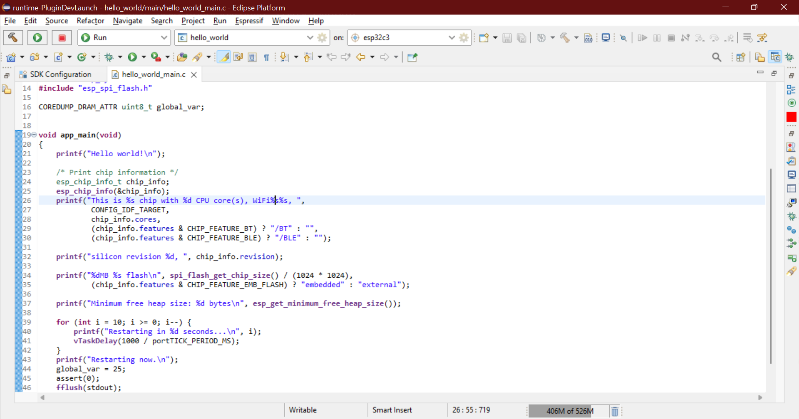

Build and flash the project and launch the serial monitor. On line number 45, we are signaling for a failing assert which will put the chip in panic mode and when that line reaches, you will be prompted to switch the perspective to debug mode and the chip will be halted.

Remember that this is a panic mode and you can not continue the execution from here, you will have to stop and restart the chip through IDF commands or simply restart the serial monitor.

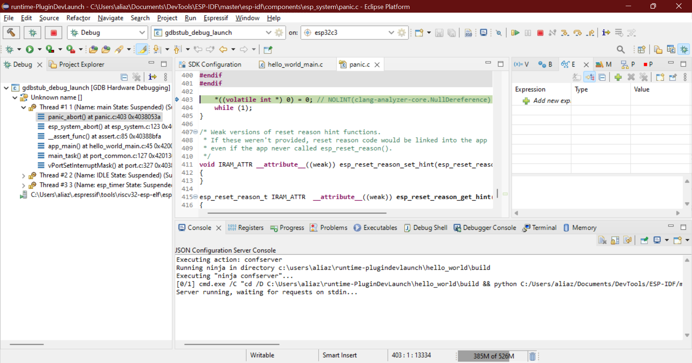

You can view the registers stack trace and even view the value of variables in the stack frame.

To exit the debug session: simply press `Stop` button.

<a name="coreDumpDebugging"></a>

# Core Dump Debugging

The IDF-Eclipse plugin allows you to debug the core dump if any crash occurs on the chip and the configurations are set. Currently only the UART core dump capture and debugging is supported.

To enable core dump debugging for a project:

1. You need to enable it first in `sdkconfig`. Launch the `sdkconfig` in the project root by double-clicking on it, and it will open the configuration editor.

2. Click on the `Core Dump` from the settings on the left and select `Data Destination` as `UART`.

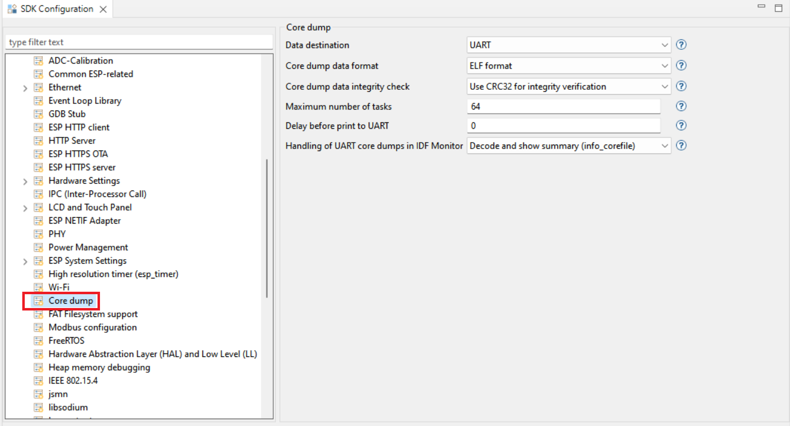

This will enable the core dump debugging and whenever you connect a serial monitor for that project if any crash occurs, it will load the dump and open a debug perspective in Eclipse to let you diagnose the dump where you can view all the information in the core dump.

You can view the registers stack trace and even view the value of variables in stack frame.

To exit the debug session: simply press `Stop` button.

<a name="deviceFirmwareUpgrade"></a>
# Device Firmware Upgrade (DFU) through USB

Device Firmware Upgrade (DFU) is a mechanism for upgrading the firmware of devices through Universal Serial Bus (USB). There are a few requirements that need to be met:

- DFU is supported by ESP32-S2 and ESP32-S3 chips.
- You will need to do some electrical connection work (Here is a [guide](https://blog.espressif.com/dfu-using-the-native-usb-on-esp32-s2-for-flashing-the-firmware-b2c4af3335f1) for the ESP32-S2 board). The necessary connections for the USB peripheral are shown in the following table.

| GPIO | USB         |
| -----| ------------|
| 20   |  D+ (green) |
| 19   |  D- (white) |
| GND  |  GND (black)|
| +5V  |  +5V (red)  |

After meeting the above requirements:

1. The chip needs to be in bootloader mode for the detection as a DFU device and flashing. This can be achieved by pulling GPIO0 down (e.g. pressing the BOOT button), pulsing RESET down for a moment and releasing GPIO0.

<a name="driversInstallation"></a>
1. Install USB drivers (Windows only). The drivers can be installed by the [Zadig tool](https://zadig.akeo.ie/).
	- Please make sure that the device is in download mode before running the tool and that it detects the device before installing the drivers.
	- The Zadig tool might detect several USB interfaces of the target. Please install the WinUSB driver for only that interface for which there is no driver installed (probably it is Interface 2) and don't re-install the driver for the other interface.
	- The manual installation of the driver in Device Manager of Windows is not recommended because the flashing might not work properly.

After meeting the above requirements, you are free to build and flash via DFU. How to use DFU:

1. Edit the active launch configuration.
2. In the main tab, select the `Flash over DFU` option.
3. Select a suitable IDF target for DFU
4. Now, if you use the build command, an extra file (dfu.bin) will be created, which can be used later for flashing.


Additional information, including common errors and known issues, is mentioned in this [guide](https://docs.espressif.com/projects/esp-idf/en/latest/esp32s3/api-guides/dfu.html#usb-drivers-windows-only).

<a name="appLvlTracing"></a>
# Application Level Tracing

ESP-IDF provides a useful feature for program behavior analysis called [Application Level Tracing](https://docs.espressif.com/projects/esp-idf/en/latest/esp32c3/api-guides/app_trace.html?). IDF-Eclipse plugin has UI, that allows the use of start, and stop tracing commands and process received data. To familiarize yourself with this library, you can use the [app_trace_to_host](https://github.com/espressif/esp-idf/tree/release/v5.0/examples/system/app_trace_to_host) project or the [app_trace_basic](https://github.com/espressif/esp-idf/tree/release/v5.1/examples/system/app_trace_basic) project if you are using ESP-IDF 5.1 and higher. These projects can be created from the plugin itself:

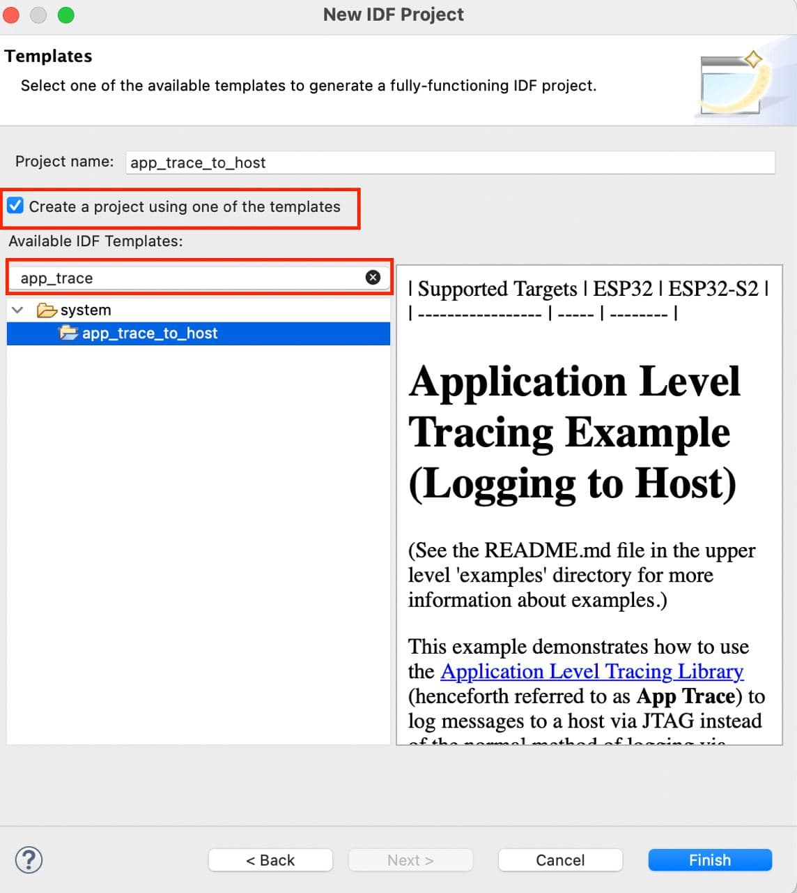

Before you start using application-level tracing, it is important to create a debug configuration for the project where you must select the board you are using in order to successfully start the OpenOCD server.

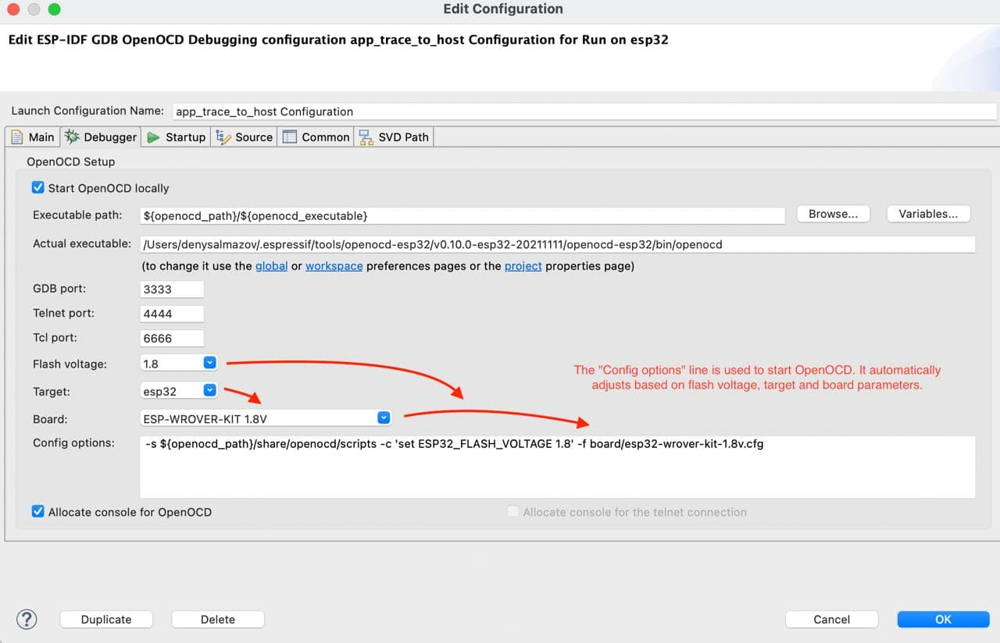

After the debug configuration is created, right-click on the project in the Project Explorer and click on `ESP-IDF` > `Application Level Tracing`:

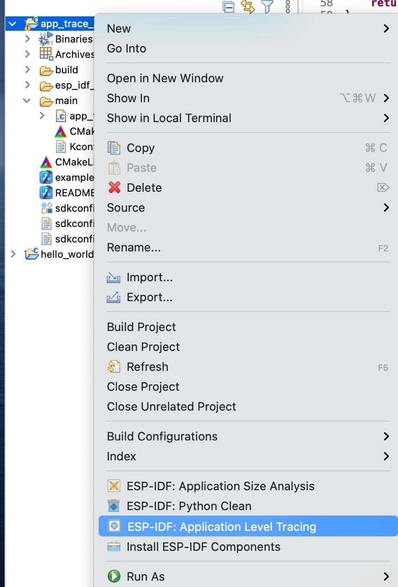

It can take a while to open the application level tracing dialog because the OpenOCD server starts first, so you don't need to start it externally. At the very top of the application-level trace dialog, there are auto-configured fields that you can change for the trace start command.

Start command:

* Syntax: `start <outfile> [poll_period [trace_size [stop_tmo [wait4halt [skip_size]]]]`
* Argument:
	* `outfile`: Path to file to save data from both CPUs. This argument should have the following format: ``file://path/to/file``.
	* `poll_period`: Data polling period (in ms) for available trace data. If greater than 0, then command runs in non-blocking mode. By default, 1 ms.
	* `trace_size`: Maximum size of data to collect (in bytes). Tracing is stopped after specified amount of data is received. By default -1 (trace size stop trigger is disabled).
	* `stop_tmo`: Idle timeout (in sec). Tracing is stopped if there is no data for a specified period of time. By default -1 (disable this stop trigger). Optionally set it to a value longer than the longest pause between tracing commands from the target.
	* `wait4halt`: If 0, start tracing immediately, otherwise command waits for the target to be halted (after reset, by breakpoint etc.) and then automatically resumes it and starts tracing. By default, 0.
	* `skip_size`: Number of bytes to skip at the start. By default, 0.

Additional information can be found [here](https://docs.espressif.com/projects/esp-idf/en/latest/esp32c3/api-guides/app_trace.html?).


The next two fields `Trace Processing Script` and `Start Parsing Command` are used to parse the output file.

* `Trace Processing Script` is used to provide the path to the parsing script, by default it is logtrace_proc.py from esp-idf.
* `Start Parsing Command` allows you to check the resulting parsing command and edit it if it's necessary. By default, this field is automatically configured to match `$IDF_PATH/tools/esp_app_trace/logtrace_proc.py/path/to/trace/file/path/to/program/elf/file`.

Note the `Start parse` button is disabled until a dump file is available. To generate it, click the `Start` button at the bottom of the dialog box. After you click, the button changes to Stop so that you can stop tracking.

When the output file is generated, you can click on `Start parse` button, and you will see the parsed script output in the Eclipse console:

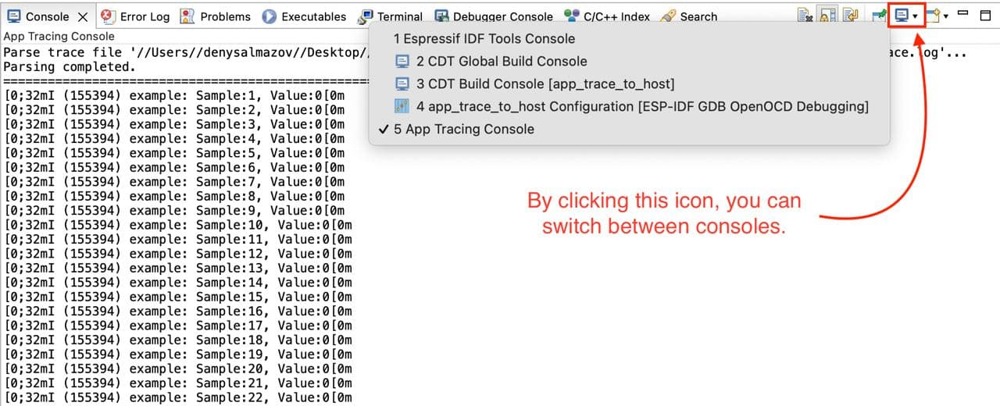

<a name ="partitionTableEditor"></a>
# Partition Table Editor UI for ESP-IDF

The Partition Table Editor command allows you to edit your [partition table](https://docs.espressif.com/projects/esp-idf/en/latest/esp32/api-guides/partition-tables.html) in a more convenient way, where you can see the supported types and subtypes and monitor the correctness of the entered data.

Steps:

1. Go to `Project Explorer`, open any IDF Project where you want to have a customized partition table.
2. In `Project Explorer`, right-click on the project and click on `ESP-IDF` > `Partition Table Editor` menu:

	

	When opening the partition table editor for the selected project, you will see the standard editable content. Errors (if any) will be highlighted. You can hover your mouse over it to get a hint of what it is about:

	

3. Click "Save" or "Save and Quit" to save your changes.

To use a customized partition table:

1. Go to `sdkconfig` and set `Custom partition table CSV` like below:

	

<a name ="nvsTableEditor"></a>
# NVS Table Editor

The NVS Table Editor helps to create a binary file based on key-value pairs provided in a CSV file. The resulting binary file is compatible with NVS architecture defined in [ESP-IDF Non-Volatile Storage Library](https://docs.espressif.com/projects/esp-idf/en/latest/esp32/api-reference/storage/nvs_flash.html). The expected CSV format is:

```
	key,type,encoding,value     <-- column header (must be the first line)
	namespace_name,namespace,,  <-- First entry must be of type "namespace"
	key1,data,u8,1
	key2,file,string,/path/to/file
```

> **Note:** This is based on ESP-IDF [NVS Partition Generator Utility](https://docs.espressif.com/projects/esp-idf/en/latest/esp32/api-reference/storage/nvs_partition_gen.html).

Steps:

1. Right-click on a project in the `Project Explorer`
2. Click on the `ESP-IDF` > `NVS Table Editor` menu option

	

3. Make desired changes to CSV data
4. Save changes by clicking the `Save` button. If everything is ok, you will see an information message at the top of the dialog

	

5. Generate the partition binary (Choose `encrypt` to encrypt the binary and disable the `generate key` option to use your own key if desired). You will see an information message at the top of the dialog about the result of generated binaries. You can hover your mouse over it to read the whole message if it's too long

	

	> **Note:** If there are any errors, you will see them highlighted. Hover over the error icon to read more about the error. Also, you will see an error message at the top of the dialog if saving the CSV file is not successful.

	

After all these steps, you should see `nvs.csv` and `nvs.bin` files in the project directory.

<a name ="writeFlashBinary"></a>
# Write Binary to Flash

Binary data can be written to the ESP’s flash chip via `ESP-IDF` > `Write Binary Data to Flash` command accessible by right click on the project in the project explorer:


After clicking this command, the `Write Binary Data to Flash` dialog box will open. Editable default values ​​are provided for binary path and offset. The correct offset can be checked by looking at the partition table via `ESP-IDF` > `Partition Table Editor` or manually by opening the ``partitions.csv`` file.


After clicking on the `Flash` button, the result of the flash command will be printed inside of this dialog.

# How to build locally

1. Install prerequisites Java 11+ and Maven.
2. Run the below commands to clone and build.

	```
	git clone https://github.com/espressif/idf-eclipse-plugin.git
	cd idf-eclipse-plugin
	mvn clean verify -Djarsigner.skip=true
	```

This will generate p2 update site artifact:

* Name: `com.espressif.idf.update-*`
* Location: `releng/com.espressif.idf.update/target`

This artifact can be installed using the mechanism mentioned <a href="https://github.com/espressif/idf-eclipse-plugin#installPluginsUsingLocalFile">here</a>

# How do I get the latest development build

1. Go to the last commit of the master branch <a href="https://github.com/espressif/idf-eclipse-plugin/commits/master">here</a>.
2. Click on a :white_check_mark: green tick mark.
3. Click on `Details`.
4. Click on `Summary` on the left.
5. Scroll down to see the `Artifacts` section.
6. Download `com.espressif.idf.update` p2 update site archive and install as per the instructions mentioned <a
href="https://github.com/espressif/idf-eclipse-plugin#installPluginsUsingLocalFile">here</a>.

# Custom IDE Configuration
## Custom Build Directory

IDE allows configuring a custom build directory to the project:

1. Select a project and click on a launch configuration `Edit` button from the top toolbar and this will launch the `Edit Configuration` window.
2. Navigate to the `Build Settings` tab.
3. In the `Additional CMake arguments` section, provide a custom build directory with arguments `-B <custom build path>` with an absolute path. Customized build directory path could be within the project or a path from the file system. For example: `-B /Users/myUser/esp/generated`.
4. Click on `Ok` and build the project.

Note this configuration changes where all the project build artifacts will be generated.

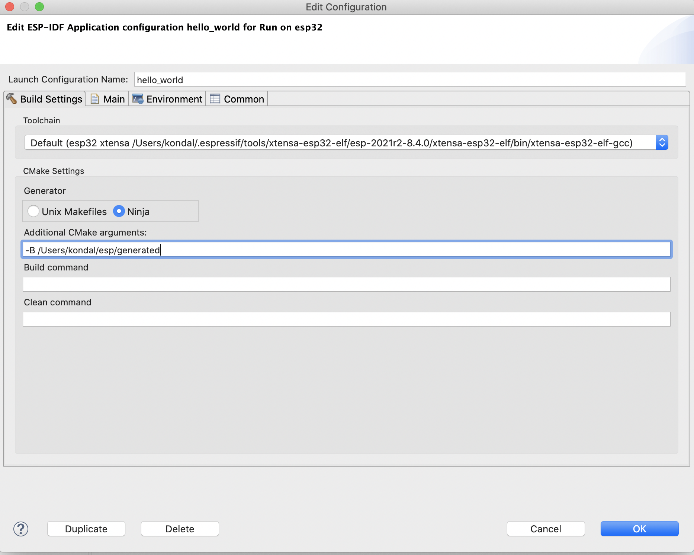

<a name ="wokwisimulator"></a>
# Wokwi Simulator

1. Install `wokwi-server` as mentioned [here](https://github.com/MabezDev/wokwi-server/)
2. In the Eclipse CDT build environment variables, configure `WOKWI_SERVER_PATH` to set the wokwi-server executable path (`Preferences` > `C/C++` > `Build` > `Environment`).
3. Create a new `Run Launch Configuration` with the `Wokwi Simulator`.
4. Choose a project and add the project ID of the Wokwi project. The ID of a Wokwi project can be found in the URL. For example, the URL of project ESP32 Rust Blinky is [https://wokwi.com/projects/345932416223806035](https://wokwi.com/projects/345932416223806035) and the project ID is 345932416223806035.
5. Click `Finish` to save the changes.
6. From the IDE Toolbar, click on the `Launch` button to launch the Wokwi simulator.
7. Wokwi Simulator will be launched in the external browser. The serial monitor output is also displayed in the Eclipse CDT build console.
8. To kill a Wokwi simulator, click on the `Stop` button from the toolbar.

# ESP-IDF Eclipse Plugin Compatibility Matrix

| IEP | Eclipse | Java | Installer | Description |
| ------ | ------ | ------ |------ | ------ |
| IEP 2.12.1 | Eclipse 2023-03 to Eclipse 2023-12 |Java 17 and above |[espressif-ide-setup-2.12.1-with-esp-idf-5.2.exe](https://github.com/espressif/idf-installer/releases/download/espressif-ide-2.12.1-esp-idf-5.2/espressif-ide-setup-2.12.1-with-esp-idf-5.2.exe) |
| IEP 2.12.0 | Eclipse 2023-03, 2023-06, 2023-09 |Java 17 and above | [espressif-ide-setup-2.12.0-with-esp-idf-5.1.2](https://github.com/espressif/idf-installer/releases/download/espressif-ide-2.12.0-esp-idf-5.1.2/espressif-ide-setup-2.12.0-with-esp-idf-5.1.2.exe) |
| IEP 2.11.0 | Eclipse 2023-03, 2023-06, 2023-09 |Java 17 and above |[espressif-ide-setup-2.11.0-with-esp-idf-5.1.1.exe](https://github.com/espressif/idf-installer/releases/download/espressif-ide-2.11.0-esp-idf-5.1.1/espressif-ide-setup-2.11.0-with-esp-idf-5.1.1.exe) |
| IEP 2.10.0 | Eclipse 2022-09, 2022-12, 2023-03 |Java 17 and above | [espressif-ide-setup-2.10.0-with-esp-idf-5.0.1.exe](https://github.com/espressif/idf-installer/releases/download/untagged-52aeb689780472c126c1/espressif-ide-setup-2.10.0-with-esp-idf-5.0.1.exe)|
| IEP 2.9.1 | Eclipse 2022-09 and Eclipse 2022-12 |Java 17 and above | [espressif-ide-setup-2.9.0-with-esp-idf-5.0.1.exe](https://github.com/espressif/idf-installer/releases/download/espressif-ide-2.9.0-esp-idf-5.0.1/espressif-ide-setup-2.9.0-with-esp-idf-5.0.1.exe) | For Windows Users, it's recommended to use the Windows Offline Installer and upgrade to the latest IEP v2.9.1 plugin|
| IEP 2.9.0 | Eclipse 2022-09 |Java 17 and above | [espressif-ide-setup-2.9.0-with-esp-idf-5.0.1.exe](https://github.com/espressif/idf-installer/releases/download/espressif-ide-2.9.0-esp-idf-5.0.1/espressif-ide-setup-2.9.0-with-esp-idf-5.0.1.exe) | For Windows, it's recommended to use the Windows Offline Installer|


<a name="Support"></a>
# How to raise bugs

Please raise the issues [here](https://github.com/espressif/idf-eclipse-plugin/issues) with the complete environment details and log.
