[](https://github.com/espressif/idf-eclipse-plugin/releases/latest) 

[中文](./README_CN.md) 

# ESP-IDF Eclipse Plugin
ESP-IDF Eclipse Plugin brings developers an easy-to-use Eclipse-based development environment for developing ESP32 based IoT applications.
It provides better tooling capabilities, which simplifies and enhances standard Eclipse CDT for developing and debugging ESP32 IoT applications. It offers advanced editing, compiling, flashing and debugging features with the addition of Installing the tools, SDK configuration and CMake editors. 

The plug-in runs on `macOS`, `Windows` and `Linux` platforms.


> **Note:** It supports ESP-IDF CMake based projects (4.x and above) with `esp32`,`esp32s2`, `esp32s3` and `esp32c3` boards.

To get a quick understanding about ESP-IDF and Eclipse plugin features check our session which was presented in <a href= "https://youtu.be/CbPX3q7LeBc">EclipseCon 2020</a>

# Table Of Contents
* [ Installing Prerequisites ](#Prerequisites) <br>
* [ Installing IDF Eclipse Plugin ](#GettingStarted) <br>
* [ Installing ESP-IDF and Tools ](#InstallTools) <br>
* [ Installing ESP-IDF and Tools via Tools Installation Wizard ](#InstallToolsManager) <br>
* [ Creating a new Project ](#NewProjectUsingDefault)<br>
* [ Configuring Launch Target ](#ConfigureLaunchTarget)<br>
* [ Compiling the Project ](#BuildApplication)<br>
* [ Flashing the Project ](#FlashApplication)<br>
* [ Viewing Serial Output ](#ConfigureLaunchTerminal)<br>
* [ Configuring the Project using sdkconfig Editor](#projectconfigure)<br>
* [ CMake Editor](#cmakeproject)<br>
* [ Debugging the Project ](#debugging)<br>
* [ ESP-IDF Application Size Analysis Editor](#sizeanalysiseditor)<br>
* [ Installing ESP-IDF Components](#espidfcomponents)<br>
* [ ESP-IDF Terminal](#idfterminal)<br>
* [ Configuring Build Environment Variables ](#configureEnvironmentVariables)<br>
* [ Configuring Core Build Toolchain ](#ConfigureToolchains)<br>
* [ Configuring CMake Toolchain ](#ConfigureCMakeToolchain)<br>
* [ Configuring the flash arguments ](#customizeLaunchConfig)<br>
* [ Installing IDF Eclipse Plugin from Eclipse Market Place](#installPluginsFromMarketPlace) <br>
* [ Installing IDF Eclipse Plugin using local archive ](#installPluginsUsingLocalFile) <br>
* [ Upgrading IDF Eclipse Plugin ](#upgradePlugins)<br>
* [ Importing an existing IDF Project ](#ImportProject)<br>
* [ Importing an existing Debug launch configuration ](#importDebugLaunchConfig)<br>
* [ Device Firmware Upgrade (DFU) through USB ](#deviceFirmwareUpgrade)<br>
* [ GDBStub Debugging ](#gdbStubDebugging)<br>
* [ Application Level Tracing ](#appLvlTracing)<br>
* [ ESP-IDF master update](#updateEspIdfMaster)<br>
* [ Changing Language ](#changeLanguage)<br>
* [ Troubleshooting Guide](#troubleshooting)<br>
* [ How to raise bugs ](#howToRaiseBugs)<br>
* <a href ="https://github.com/espressif/idf-eclipse-plugin/blob/master/FAQ.md#FAQ">FAQ</a>


<a name="Prerequisites"></a>
# Installing Prerequisites
The minimum requirements for running the IDF Eclipse plug-ins are below. 

* **Java 11 and above** : Download and install Java SE from <a href= "https://www.oracle.com/technetwork/java/javase/downloads/index.html">here</a>
* **Python 3.6 and above** : Download and install Python from <a href="https://www.python.org/downloads/">here</a>
* **Eclipse IDE for C/C++ Developers 2022-06 (2021-06 and higher is supported)** : Download and install Eclipse CDT package from <a href= "https://www.eclipse.org/downloads/packages/release/2022-06/r/eclipse-ide-cc-developers">here </a>
*  **Git** : Get the latest git from <a href ="https://git-scm.com/downloads">here</a>
*  **ESP-IDF 4.0 and above** : Clone the ESP-IDF repo from <a href ="https://github.com/espressif/esp-idf/releases">here</a>

> **Note:** Make sure Java, Python and Git are available on the system environment PATH.

We also offer `Espressif-IDE Offline Installer` for Windows which comes with OpenJDK, Python, CMake, Git, ESP-IDF, Eclipse IDE, IDF Eclipse plugins and required build tools. Please check our <a href="https://github.com/espressif/idf-installer#espressif-ide-offline-installer"> Espressif-IDE Offline Installer </a> page.

More details on the Espressif-IDE can be found <a href="https://github.com/espressif/idf-eclipse-plugin/blob/master/docs/Espressif-IDE.md"> here</a>.

<a name="GettingStarted"></a>

# Installing IDF Plugin using update site URL
You can install the IDF Eclipse plugin into an existing Eclipse CDT installation using the update site URL. You first need to add the release repository URL as follows:

1. Go to `Help` > `Install New Software`
1. Click `Add…`, and in the pop-up window:
	* Enter `Name` as `Espressif IDF Plugin for Eclipse`
	* Enter `Location` of the repository:
		* Stable releases: https://dl.espressif.com/dl/idf-eclipse-plugin/updates/latest/
		* Beta versions: https://dl.espressif.com/dl/idf-eclipse-plugin/updates/beta/
		* Nightly build: https://dl.espressif.com/dl/idf-eclipse-plugin/updates/nightly/
	* Click `Add`
1. Select `Espressif IDF` from the list and proceed with the installation 

> **Note:** Though screenshots are captured from `macOS`, installation instructions are applicable for `Windows`, `Linux` and `macOS`.


<a name="InstallTools"></a>
# Installing ESP-IDF
To install ESP-IDF directly from the Eclipse

1. Go to `Espressif` > `Download and Configure ESP-IDF`
1. From the `Download ESP-IDF` section, choose ESP-IDF version and directory to download
1. Click on `Finish`

To configure an existing ESP-IDF

1. Go to `Espressif` > `Download and Configure ESP-IDF`
1. Check `Use an existing ESP-IDF directory from the file system`
1. Choose an existing ESP-IDF directory from the file system
1. Click on `Finish`

This will download a specified esp-idf version and configures `IDF_PATH` in the Eclipse CDT build environment variables.


# Installing ESP-IDF Tools
ESP-IDF requires some prerequisite tools to be installed so you can build firmware for the ESP32. The prerequisite tools include Python, Git, cross-compilers, menuconfig tool, CMake and Ninja build tools.

For this getting started guide, follow the instructions below.

1. Navigate to `Espressif` > `ESP-IDF Tools Manager` > `Install Tools`
1. Provide the `ESP-IDF Directory` path
1. Provide `Git` and `Python` executable locations if they are not auto-detected.
1. Click on `Install Tools` to proceed with the installation process. Check the Console for the installation details.
1. Installation might take a while if you're doing it for the first time since it has to download and install xtensa-esp32-elf, esp32ulp-elf, cmake, openocd-esp32 and ninja tools.

> **Note:** Make sure you run this step even if you've already installed the required tools, since it sets the `IDF_PATH`, `PATH`, `OPENOCD_SCRIPTS` and `IDF_PYTHON_ENV_PATH` to the Eclipse CDT build environment based on the idf_tools.py export command.


ESP-IDF Directory selection dialog:


<a name="Installing ESP-IDF and Tools via Tools Installation Wizard"></a>
# Tools Installation Wizard
You can use the install tools wizard to manage the tools installation via a wizard. The advantage of this method over the exisitng installation is that you can easily manage the whole flow via wizard and install the tools in ESP-IDF framework that you only need.<br/>

For getting started:
1. Navigate to `Espressif` > `ESP-IDF Tools Manager` > `Tools Installation Wizard (Preview)`
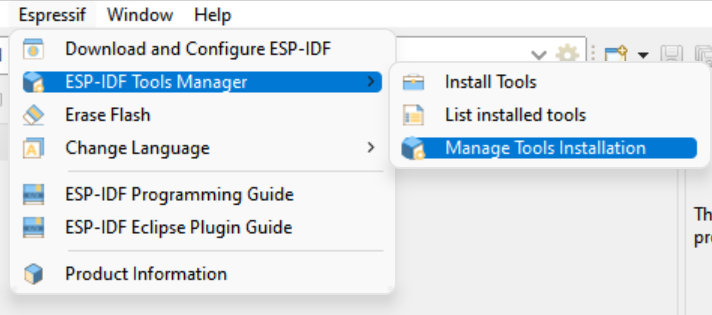


2. The wizard will start and you can select the location for the Git and Python, if they are already present on the system PATH or registry the tools will be populated. After selection you can click `Next`.
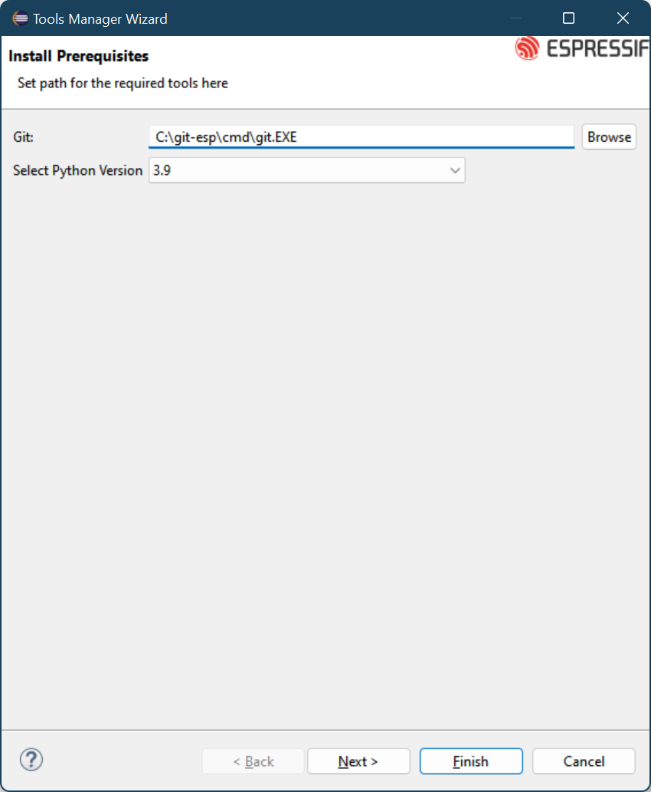

3. Next page will let you select the folder for existing ESP-IDF or you can also select from the drop down list to download the available versions. You can also select master from the list to clone the master for ESP-IDF from github
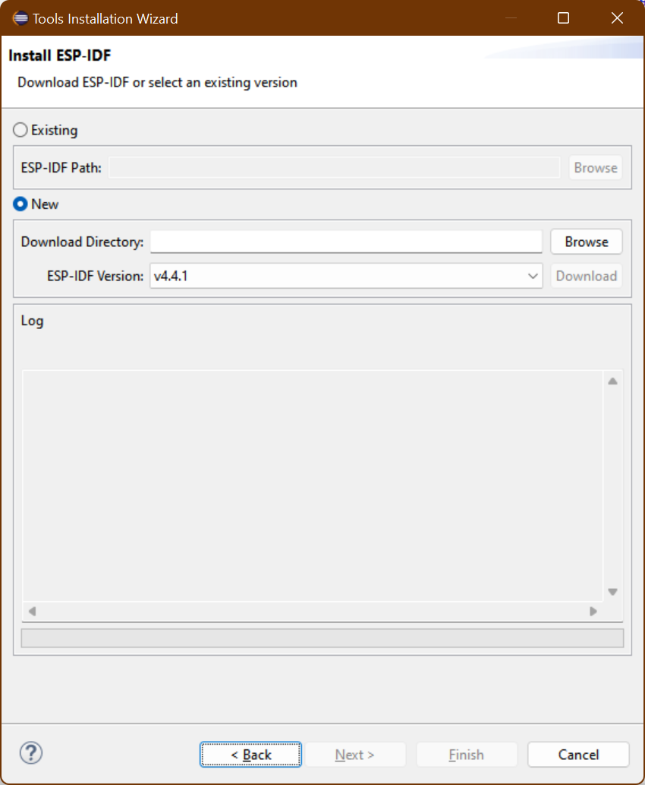


1. After you select `Next` you will see the list of all the available tools in the selected ESP-IDF version, this page lets you select only the recommended tools or you can select the tools you want to. You can also filter out the tools via the filter text box or based on the target. The wizard page is the last page and will Install and Download if necessary all the selected tools required. After you have installed all the tools you can finish the wizard and start creating projects.

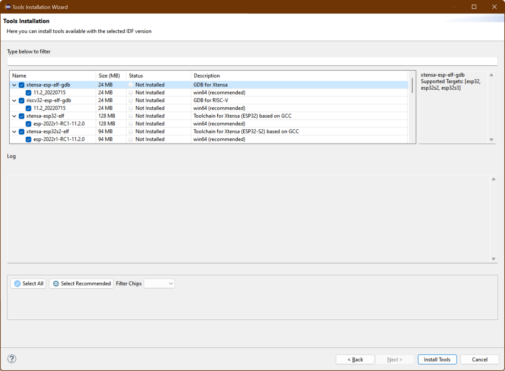


<a name="NewProjectUsingDefault"></a>
# Create a new Project
1. Make sure you are in `C/C++ Perspective`
1. Go to `File` > `New` > `Espressif IDF Project` (If you don't see this, please reset the perspective from `Window` > `Perspective` > `Reset Perspective...`)
1. Provide the `Project name` (The ESP-IDF build system does not support spaces in the project path)
1. Click `Finish`

> **Note:** You will see a lot of unresolved inclusion errors in the editor and those will be resolved only after the build.


<a name="NewProjectUsingTemplates"></a>
## Create a new project using ESP-IDF Templates
1. Make sure you're in `C/C++ Perspective`
1. Go to `File` > `New` > `Espressif IDF Project` (If you don't see this, please reset the perspective from `Window` > `Perspective` > `Reset Perspective..`)
1. Provide the `Project name`
1. Click `Next`
1. Check `Create a project using one of the templates`
1. Select the required template from the tree
1. Click `Finish`

> **Note:** You will see a lot of unresolved inclusion errors in the editor and those will be resolved only after the build.


<a name="ConfigureLaunchTarget"></a>
# Configuring Launch target
Next, we need to tell CDT to use the toolchain for our project so that all the headers will be indexed and resolved. This is accomplished through the Launch Bar, the new widget set you see on the far left of the toolbar. This will be shown only when you have a project in the project explorer.

1. Click on the third dropdown window from the top bar
1. Select `New Launch Target`
1. Select `ESP Target`
1. Provide properties for the target where you would like to launch the application. Enter a `Name` for the target and select the `Serial Port` your ESP device is connected to on your machine.


<a name="BuildApplication"></a>
# Compiling the Project
1. Select a project from the `Project Explorer`
1. Select `Run` from the first drop-down, which is called `Launch Mode`
1. Select your application from the second drop-down, which is called `Launch Configuration`(Auto-detected)
1. Select target from the third drop-down, which is called `Launch Target`
1. Now click on the `Build` button widget which you see on the far left of the toolbar


<a name="FlashApplication"></a>
# Flashing the Project
ESP-IDF has a tool called `idf.py` which is a wrapper around `make flash` command with some handy operations. Flash operation can be initiated with just a click of a launch button (second button from the left on the top bar) and it's auto-configured to flash the application with the default flash command i.e, `idf.py -p PORT flash`.

To provide the customized flash arguments, please follow [this](#customizeLaunchConfig) link for further instructions.

To configure flashing via JTAG, please refer to this <a href="https://github.com/espressif/idf-eclipse-plugin/tree/master/docs/JTAG%20Flashing.md"> JTAG Flashing guide</a>.

<a name="ConfigureLaunchTerminal"></a>
# Viewing Serial Output
To see the serial output in Eclipse, we need to configure the `ESP-IDF Serial Monitor` to connect to the serial port. This is integrated with the `IDF Monitor`. Please check more details <a href="https://docs.espressif.com/projects/esp-idf/en/latest/esp32/api-guides/tools/idf-monitor.html#idf-monitor">here</a>. 

1. Click on the `Open a Terminal` icon from the toolbar
1. Choose `ESP-IDF Serial Monitor` from the terminal drop-down
1. Select `Serial Port` for your board if it's not detected
1. Configure serial monitor filter options for output filtering
1. Click on `OK` to launch the terminal, which will listen to the USB port


### ESP-IDF Serial Monitor Settings
ESP-IDF Serial Monitor will allow you to configure the default settings of the serial monitor character limit and number of lines. 
1. Navigate to `Espressif` from the Eclipse Preferences
1. Click on `ESP-IDF Serial Monitor Settings`
1. Provide `Console Line Width` and `Limit Console Output`

<a name="projectconfigure"></a>
# Configuring the Project
IDF plugin will allow you to configure `sdkconfig` without leaving the Eclipse environment.

## SDK Configuration editor
Project configuration is held in a single file called `sdkconfig` in the root directory of the project. This configuration file can be modified using `SDK Configuration Editor`

To launch the SDK Configuration editor:

1. Navigate to `sdkconfig` file
1. Double click on the file to launch the SDK configuration editor
1. Use `Ctrl+S` or  `Command+S` based on the OS environment to save the changes. You can also use Eclipse `Save` button from the toolbar
1. To revert the sdkconfig editor changes, you can either close the editor without saving them or you can right click on the `sdkconfig` file and select `Load sdkconfig` menu option to revert the changes from the editor.


<a name="cmakeproject"></a>
# CMake Editor
CMake Editor Plug-in is integrated with IDF Plugin for editing CMake files such as CMakeLists.txt. It provides syntax coloring, CMake command content assist, and code templates.


CMake editor preferences can be controlled using `Eclipse` > `Preferences` > `CMakeEd`


<a name="debugging"></a>
# Debugging the Project
## GDB Hardware Debugging
Please refer to <a href ="https://docs.espressif.com/projects/esp-idf/en/latest/api-guides/jtag-debugging/index.html" > GDB Hardware Debugging guide</a>

## GDB OpenOCD Debugging
Please refer to this <a href="https://github.com/espressif/idf-eclipse-plugin/tree/master/docs/OpenOCD%20Debugging.md">GDB OpenOCD Debugging</a>


<a name="sizeanalysiseditor"></a>
# ESP-IDF Application Size Analysis
Application Size Analysis editor provides a way to analyze the static memory footprint of your application. It has two sections - Overview and Details. The **Overview** section provides a summary of the application memory usage and the **Details** section will have in-depth details about components and per-symbol level memory information.

Details table viewer also provides you with searching and sorting capabilities on various columns.

To launch the Application Size Analysis editor:
1. Right-click on the project
1. Select `ESP-IDF: Application Size Analysis` menu option to launch the editor

**Application Size Analysis - Overview**


**Application Size Analysis - Details**


<a name="idfterminal"></a>
# ESP-IDF Terminal
This would launch a local terminal with all the environment variables which are set under `Preferences > C/C++ > Build > Environment`. The default working directory would be either the currently selected project or IDF_PATH if there is no project selected. 

The terminal PATH is also configured with `esptool`, `espcoredump`, `partition_table`, and `app_update` component paths so that it will be handy to access them directly from the ESP-IDF terminal.

To launch the ESP-IDF Terminal:
* Click on the `Open a Terminal` icon from the toolbar
* Choose `ESP-IDF Terminal` from the terminal drop-down and click `OK` to launch a terminal


<a name="espidfcomponents"></a>
# Installing ESP-IDF Components
You can install the ESP-IDF Components directly into your project from the available components online. Follow the steps below.

* Right click on the project from project explorer in which you want to add the component to and Select `Install ESP-IDF Components`
  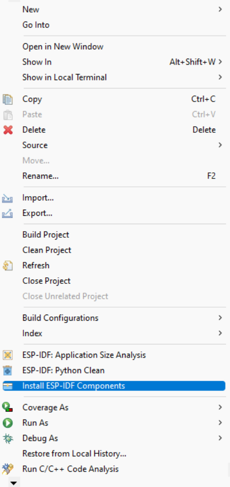

  A new window will open up showing all the available component to be installed.

* From the window you can click on `Install` button to add that component to the project. To get to the readme file for that component you can click on `More Info` which will open the browser link to the readme file of that component.
  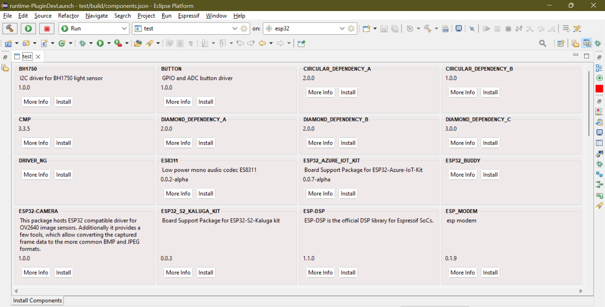

Already added components are also shown but the `Install` button changes text to `Already Added` and is disabled.

<a name="configureEnvironmentVariables"></a>
# Configuring Environment Variables
Eclipse auto configures the required environment variables in the `Preferences` > `C/C++ Build` > `Environment` section if IDF Tools are installed using `Espressif` > `ESP-IDF Tools Manager` > `Install Tools` menu option.

Required environment variables:
* `IDF_PATH`
* `PATH`
* `OPENOCD_SCRIPTS`
* `IDF_PYTHON_ENV_PATH`

If the required environment variables are not configured for any reason, please follow the step by step instructions below.
* Click on the `Environment` preference page under `C/C++ Build`. 
* Click `Add…` again, and enter name `IDF_PATH`. The value should be the full path where ESP-IDF is installed.
* Similarly we should configure `OPENOCD_SCRIPTS`, `IDF_PYTHON_ENV_PATH` and `PATH` environment variables

This is how they should look:

##### IDF_PATH #####
`/Users/user-name/esp/esp-idf`

##### OPENOCD_SCRIPTS #####
`/Users/user-name/.espressif/tools/openocd-esp32/v0.10.0-esp32-20190313/openocd-esp32/share/openocd/scripts`

##### IDF_PYTHON_ENV_PATH #####
`/Users/user-name/.espressif/python_env/idf4.0_py3.7_env`

##### PATH #####
`/Users/user-name/.espressif/tools/xtensa-esp32-elf/esp32-2019r1-8.2.0/xtensa-esp32-elf/bin:/Users/user-name/.espressif/tools/esp32ulp-elf/2.28.51.20170517/esp32ulp-elf-binutils/bin:/Users/user-name/.espressif/tools/cmake/3.13.4/CMake.app/Contents/bin:/Users/user-name/.espressif/tools/openocd-esp32/v0.10.0-esp32-20190313/openocd-esp32/bin:/Users/user-name/.espressif/tools/ninja/1.9.0/:/Users/user-name/.espressif/python_env/idf4.0_py3.7_env/bin:/Users/user-name/esp/esp-idf/tools:$PATH`


# Configuring Toolchains
We need to tell Eclipse CDT what core build toolchain and CMake toolchain need to be used to build the project. However, this will be auto-detected if you've installed the tools using the `Espressif` > `ESP-IDF Tools Manager` > `Install Tools` option from the Eclipse.

If these toolchains are not detected for any reason, please follow the step by step instructions below to add a new toolchain.

<a name="ConfigureToolchains"></a>
# Configuring Core Build Toolchains

1. Open Eclipse Preferences
1. Navigate to `C/C++` > `Core Build Toolchains` preference page
1. Click on `Add..` from the User defined Toolchains tables
1. Select `GCC` as a toolchain type
1. Click on `Next`
1. Provide the GCC Toolchain Settings:

**Compiler:** /Users/user-name/esp/xtensa-esp32-elf/bin/xtensa-esp32-elf-gcc,
**Operating System:** esp32,
**CPU Architecture:** xtensa


<a name="ConfigureCMakeToolchain"></a>
# Configuring CMake Toolchain
We now need to tell CDT which toolchain to use when building the project. This will pass the required arguments to CMake when generating the Ninja files.

1. Navigate to `C/C++` > `CMake` preference page
1. Click `Add...` and this will launch the New CMake Toolchain configuration dialog
1. Browse CMake toolchain `Path`. Example: `/Users/user-name/esp/esp-idf/tools/cmake/toolchain-esp32.cmake`
1. Select GCC Xtensa Toolchain compiler from the drop-down list. Example: `esp32 xtensa /Users/user-name/esp/xtensa-esp32-elf/bin/xtensa-esp32-elf-gcc`

> **NOTE:**  Eclipse CDT has a bug in saving the toolchain preferences, hence it's recommended to restart Eclipse before we move further configuring the launch target.


<a name="customizeLaunchConfig"></a>
# Launch Configuration
To provide the customized launch configuration and flash arguments, please follow the step by step instructions below.

1. Click on the `Launch Configuration` edit button
1. Switch to the `Main` tab
1. Specify the `Location` where this application has to run. Since `idf.py` is a python file, will configure the python system path. Example:`${system_path:python}`
1. Specify `Working directory` of the application. Example: `${workspace_loc:/hello_world}`
1. In additional arguments, provide a flashing command which will run in the specified working directory
1. Flash command looks like this: `/Users/user-name/esp/esp-idf/tools/idf.py -p /dev/cu.SLAB_USBtoUART flash`
1. Click OK to save the settings
1. Click on the `Launch` icon to flash the application to the selected board 


<a name="changeLanguage"></a>
# Changing Language
To change the plugin language a menu is provided to show the list of available languages for the plugin. Remember this will only change the language of the eclipse if the required language bundles for the selected language are installed or else only the plugin interfaces will be changed.

1. Click on the `Espressif` menu from menu bar
1. Select the `Change Language` from the menu drop down
1. From the sub menu select the language you want
1. Eclipse will restart with selected language

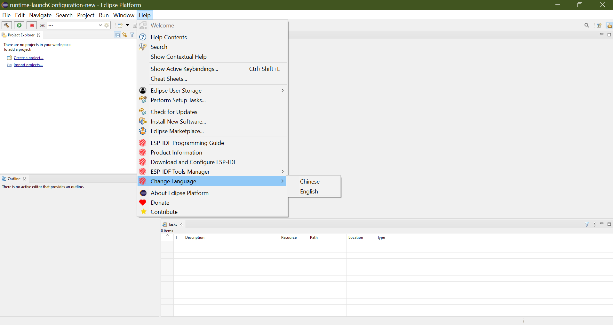

<a name="troubleshooting"></a>
# Troubleshooting 

## Error Log
The Error Log view captures all the warnings and errors logged by plug-ins. The underlying log file is a .log file stored in the .metadata subdirectory of the workspace. 

The Error Log view is available in `Window` > `Show View` > `Error Log`.

To export the current log view content into a file, press the Export Log toolbar button or select `Export Log...` from the context menu. Then, enter a file name.

Always provide an error log when reporting an issue.


## Console View Log
The Console View provides all the warnings and errors related to the current running process or build. To access the console view.

From the menu bar, `Window` > `Show View` > `Console`. 


## CDT Global Build Log
Go to `Preferences > C/C++ > Build > Logging`

## Espressif IDF Tools Console
The Espressif IDF Tools Console is part of Console view, this will be opened only during the installation of IDF tools from the Eclipse. 

If you encounter any issue while installing the IDF tools using `Espressif` > `ESP-IDF Tools Manager` > `Install tools`, please check the Espressif IDF Tools Console to see the errors reported.

If this is not active, it can be switched by clicking on the `Display Selected Console` icon from the console view.


## Heap Tracing
Please refer to <a href="https://github.com/espressif/idf-eclipse-plugin/tree/master/docs/HeapTracing.md">this</a> doc.

<a name="installPluginsFromMarketPlace"></a>
# Installing IDF Eclipse Plugin from Eclipse Market Place

Please follow the steps below to install IDF Eclipse Plugin from the Eclipse Market Place.
1. In Eclipse, choose `Help` > `Eclipse Market Place...`
1. Enter `ESP-IDF Eclipse Plugin` in the search box to find the plugin
1. Click on `Install` to follow the installation instructions.
1. Restart the Eclipse


<a name="installPluginsUsingLocalFile"></a>
# Installing IDF Eclipse Plugin from Local Archive
1. Download the latest update site archive for IDF Eclipse Plugin here - https://github.com/espressif/idf-eclipse-plugin/releases
1. In Eclipse, choose `Help` > `Install New Software`
1. Click `Add…` button
1. Select `Archive` from Add repository dialog and select the file `com.espressif.idf.update-vxxxxxxx.zip`
1. Click `Add`
1. Select `Espressif IDF` from the list and proceed with the installation 
1. Restart the Eclipse


<a name="upgradePlugins"></a>
# How do I upgrade my existing IDF Eclipse Plugin?

If you are installing IDF Eclipse Plugin into your Eclipse for the first time, you first need to add the new release's repository as follows:
1. `Window` > `Preferences` > `Install/Update` > `Available Software Sites`
1. Click `Add`
1. Enter the URL of the new repository https://dl.espressif.com/dl/idf-eclipse-plugin/updates/latest/
1. Click `Ok`

If you've already installed IDF Eclipse Plugin using update site URL, you can get the latest changes using below
1. `Help` > `Check for Updates`
1. If updates are found, select `Espressif IDF Plugins for Eclipse` and deselect all other items
1. Click `Next` to proceed with the installation


<a name="ImportProject"></a>
# Importing an existing IDF Project

1. Make sure you're in `C/C++ Perspective`.
1. Right click in the Project Explorer
1. Select `Import..` Menu
1. Select `Existing IDF Project` from `Espressif` import wizard menu list
1. Click `Next`
1. Click on `Browse...` to choose an existing project location directory
1. Provide `Project name` if you wish you have a different name
1. Click `Finish` to import the selected project into eclipse workspace as a CMake project


<a name="importDebugLaunchConfig"></a>
# Importing an existing Debug launch configuration

To import an existing launch configuration into Eclipse:
1. Select `Import...` from the `File` menu
1. In the Import dialog box, expand the `Run/Debug` group and select `Launch Configurations`
1. Click on `Next`
1. Click on `Browse...` to select the required location in the local file system
1. Select the folder containing the launch files and then click `OK`
1. Select the checkboxes for the required folder and launch file
1. If you are replacing an existing configuration with the same name then select `Overwrite existing launch configurations without warning`
1. Click on `Finish`

<a name="gdbStubDebugging"></a>
# GDBStub Debugging
You can now use the gdb stub debugging inside our eclipse plugin to help you diagnose and debug issues on chip via eclipse when it is in panic mode.

To enable gdb stub debugging for a project you need to enable it first in the sdkconfig. Launch the sdkconfig in project root by double clicking on it which will open the configuration editor.


Expand the `Component Config` section and select `ESP System Settings`. From the settings on the right for `Panic Handler behaviour` select the `GDBStub on Panic option` from the list
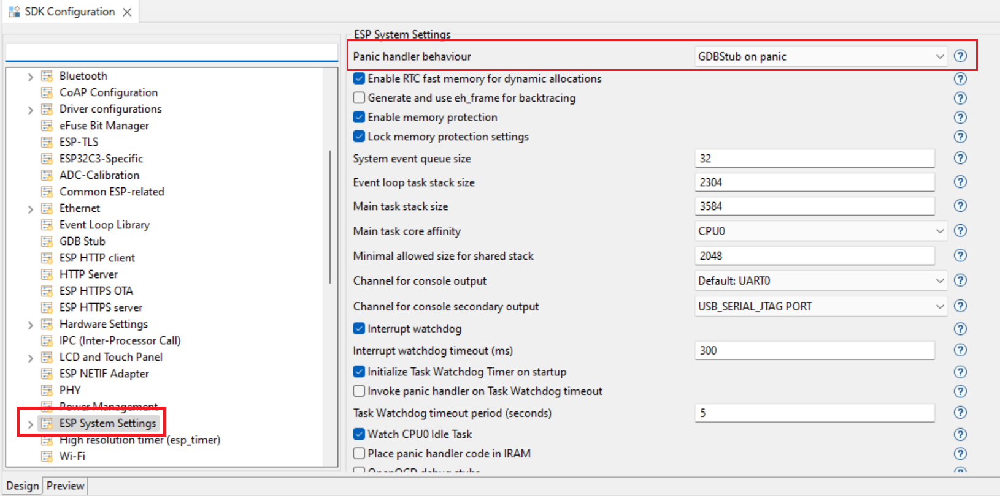


Now you will be taken to the gdbstub debugger automatically when you connect the serial monitor and there is a panic for this example. 

Create a template `hello_world` project and add the following lines in the main c file.

```
This is a global variable<br/>
COREDUMP_DRAM_ATTR uint8_t global_var;
```

Now add these two lines just above `esp_restart()` function<br/>
`global_var = 25;`<br/>
`assert(0);`<br/>
The final file should be something like this


Build and flash the project and launch the serial monitor. On the line number 45 we are signaling for a failing assert which will put the chip in panic mode and when that line reaches you will be prompted to switch the perspective to debug mode and the chip will be halted, remember that this is a panic mode and you cannot continue the execution from here you will have to stop and restart the chip through idf commands or simply restart the serial monitor.


You can view the registers stack trace and even view the value of variables in stack frame. To exit the debug session simply press stop button.

<a name="deviceFirmwareUpgrade"></a>

# Device Firmware Upgrade (DFU) through USB

Device Firmware Upgrade (DFU) is a mechanism for upgrading the firmware of devices through Universal Serial Bus (USB). There are a few  requirements that need to be met:

- DFU is supported by ESP32-S2 and  ESP32-S3 chips. 
- You will need to do some electrical connection work (Here is a [guide](https://blog.espressif.com/dfu-using-the-native-usb-on-esp32-s2-for-flashing-the-firmware-b2c4af3335f1) for the ESP32-S2 board). The necessary connections for the USB peripheral are shown in the following table.

| GPIO | USB         |
| -----| ------------|
| 20   |  D+ (green) |
| 19   |  D- (white) |
| GND  |  GND (black)|
| +5V  |  +5V (red)  |

- The chip needs to be in bootloader mode for the detection as a DFU device and flashing. This can beachieved by pulling GPIO0 down (e.g. pressing the BOOT button), pulsing RESET down for a moment and releasing GPIO0.
- Install USB drivers (Windows only). The drivers can be installed by the [Zadig tool](https://zadig.akeo.ie/>). The manual installation of the driver in Device Manager of Windows is not recommended because the flashing might not work properly. Please make sure that the device is in
download mode before running the tool and that it detects the device before installing the drivers. The Zadig
tool might detect several USB interfaces of the target. Please install the WinUSB driver for only that interface for
which there is no driver installed (probably it is Interface 2) and don't re-install the driver for the other interface. 

After meeting requirements you are free to build and flash via DFU. How to use DFU:

- Activate the DFU toggle button on the toolbar.
- Select the correct target and port through the target panel
- Now, if you will use the build command an extra file will be created (dfu.bin), which will be later used for flashing.


Additional information, including common errors and known issues, is mentioned in this [guide](https://docs.espressif.com/projects/esp-idf/en/latest/esp32s3/api-guides/dfu.html#usb-drivers-windows-only).

<a name="appLvlTracing"></a>

# Application Level Tracing

ESP-IDF provides a useful feature for program behavior analysis called [Application Level Tracing](https://docs.espressif.com/projects/esp-idf/en/latest/esp32c3/api-guides/app_trace.html?). IDF-Eclipse plugin has UI, that allows using start, stop tracing commands and process received data. To familiarize yourself with this library, you can use the [app_trace_to_host](https://github.com/espressif/esp-idf/tree/master/examples/system/app_trace_to_host) project. This project can be created from the plugin itself:


Before you start using application-level tracing, it is important to create a debug configuration for the project where you must select the board you are using in order to successfully start the OpenOCD server.

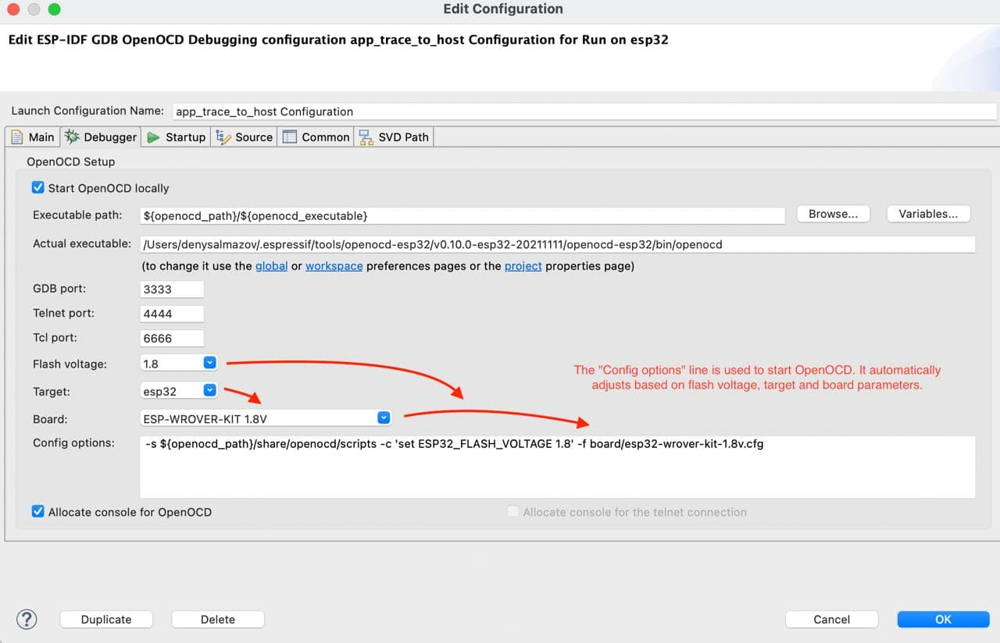

After debug configuration is created, right click on the project in project explorer and click on `ESP-IDF:Application Level Tracing`:

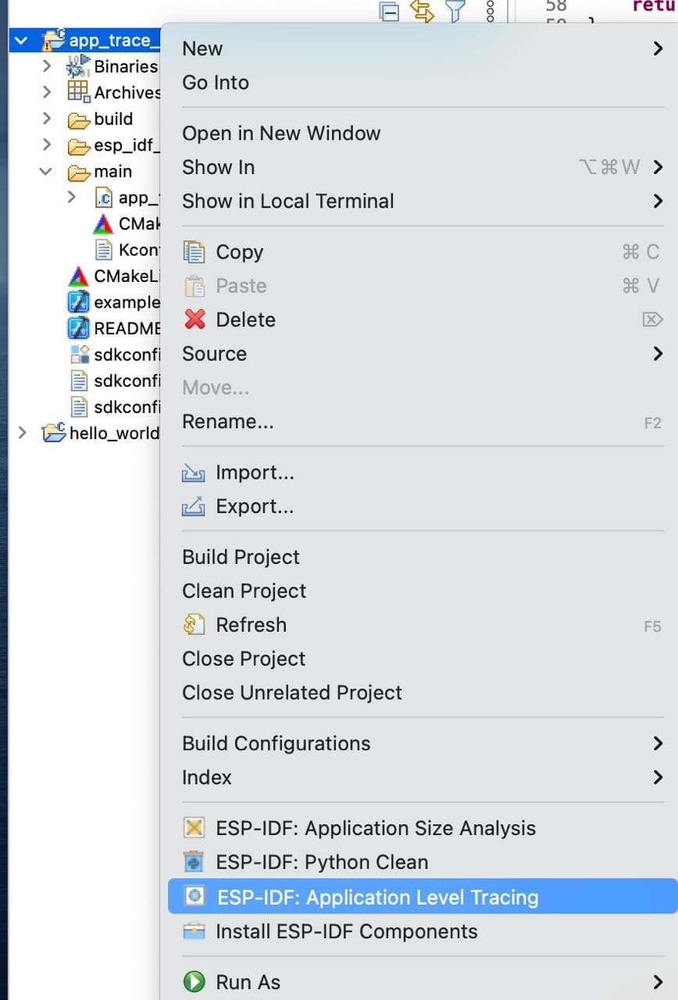

It can take a while to open the application level tracing dialog because the OpenOCD server starts first, so you don't need to start it externally. At the very top of the application-level trace dialog, there are auto-configured fields that you can change for the trace start command.


Start command:

* Syntax: `start <outfile> [poll_period [trace_size [stop_tmo [wait4halt [skip_size]]]]`
* Argument: 
	* `outfile`: Path to file to save data from both CPUs. This argument should have the following format: ``file://path/to/file``.
	* `poll_period`: Data polling period (in ms) for available trace data. If greater than 0 then command runs in non-blocking mode. By default, 1 ms.
	* `trace_size`: Maximum size of data to collect (in bytes). Tracing is stopped after specified amount of data is received. By default -1 (trace size stop trigger is disabled).
	* `stop_tmo`: Idle timeout (in sec). Tracing is stopped if there is no data for a specified period of time. By default -1 (disable this stop trigger). Optionally set it to a value longer than the longest pause between tracing commands from the target.
	* `wait4halt`: If 0 start tracing immediately, otherwise command waits for the target to be halted (after reset, by breakpoint etc.) and then automatically resumes it and starts tracing. By default, 0.
	* `skip_size`: Number of bytes to skip at the start. By default, 0.

Additional information can be found [here](https://docs.espressif.com/projects/esp-idf/en/latest/esp32c3/api-guides/app_trace.html?).
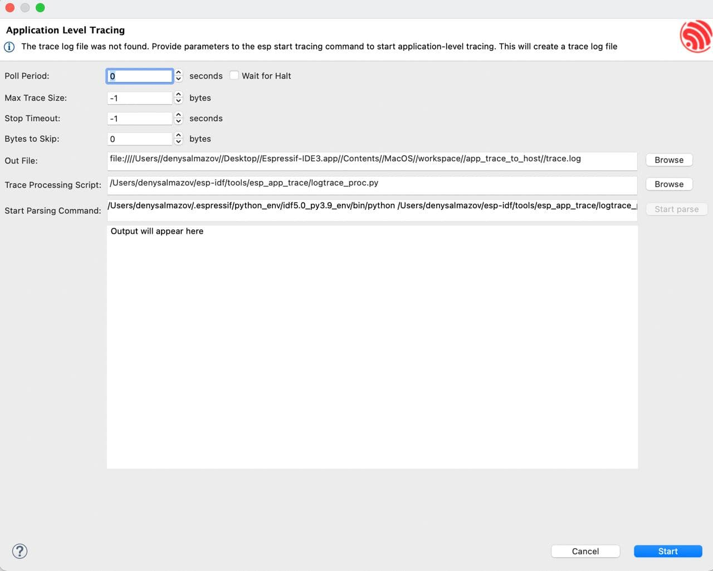


The next two fields `Trace Processing Script` and `Start Parsing Command` are used to parse the output file. 

* `Trace Processing Script` is used to provide the path to the parsing script, by default it is logtrace_proc.py from esp-idf. 
* `Start Parsing Command` allows you to check the resulting parsing command and edit it if it's necessary. By default, this field is automatically configured to match `$IDF_PATH/tools/esp_app_trace/logtrace_proc.py/path/to/trace/file/path/to/program/elf/file`. Note the `Start parse` button is disabled until a dump file is available. To generate it, click the Start button at the bottom of the dialog box. After you click, the button changes to Stop so that you can stop tracking.

When output file is generated, you can click on `Start parse` button and you will see parse script output in the eclipse console:


<a name ="updateEspIdfMaster"></a>

# ESP-IDF Master Update

If you are using the master version of ESP-IDF and want to update it, you can do so in the plugin by going to `Espressif -> ESP-IDF Tool Manager` and clicking the `Update ESP-IDF master` command there.


**Note:** This command is visible only if you are on the master branch in ESP-IDF

<a name="howToRaiseBugs"></a>
# How to raise bugs
Please raise the issues here https://github.com/espressif/idf-eclipse-plugin/issues with the complete environment details and log.

# How to build locally
1. Install prerequisites Java 11+ and Maven
2. Run below commands to clone and build

	```
	git clone https://github.com/espressif/idf-eclipse-plugin.git
	cd idf-eclipse-plugin
	mvn clean verify -Djarsigner.skip=true
	```

This will generate p2 update site artifact in the location `releng/com.espressif.idf.update/target` with name `com.espressif.idf.update-*` and this can be installed using the mechanism mentioned <a href="https://github.com/espressif/idf-eclipse-plugin#installPluginsUsingLocalFile">here</a>

# How do I get the latest development build 
1. Go to master branch last commit <a href="https://github.com/espressif/idf-eclipse-plugin/commits/master">here</a> 
1. Click on a :white_check_mark: green tick mark
1. Click on Details
1. Click on Summary on the left
1. Scroll down to see the artifacts section
1. Download `com.espressif.idf.update` p2 update site archive and install as per the instructions mentioned <a 
href="https://github.com/espressif/idf-eclipse-plugin#installPluginsUsingLocalFile">here</a>

# Custom IDE Configuration
## Custom build directory
IDE allows configuring a custom build directory to the project: 
 
1. Select a project and click on a launch configuration `Edit` button from the top toolbar and this will the launch `Edit Configuration` window
2. Navigate to the `Build Settings` tab
3. In the `Additional CMake Arguments` section, provide a custom build directory with arguments `-B <custom build path>` with an absolute path. Custom build directory path could be within the project or a path from the file system. For example: `-B /Users/myUser/esp/generated`
4. Click on Ok and build the project

Note this configuration changes where all the project build artifacts will be generated.

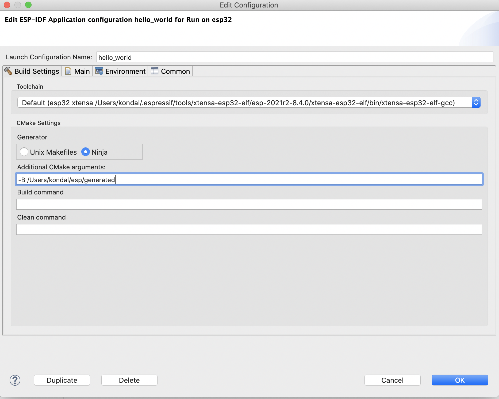

# ESP-IDF Eclipse Plugin Compatibility Matrix

| IEP | Eclipse | Java | Tools Installer| Description |
| ------ | ------ | ------ |------ | ------ |
| IEP 2.3.0 | Eclipse 2021-09, 2021-06 |Java 11 and above | ESP-IDF Tools Windows Installer 2.11| ESP-IDF Tools Windows Installer 2.11 comes with IEP 2.2.0 and this need to be updated to 2.3.0|
| IEP 2.2.0 | Eclipse 2021-06, 2021-03, 2020-12 |Java 11 and above | ESP-IDF Tools Windows Installer 2.10| |
| IEP 2.1.2 | Eclipse 2021-06, 2021-03, 2020-12, 2020-09 |Java 11 and above | ESP-IDF Tools Windows Installer 2.9| IEP 2.1.2 added a support for Eclipse 2021-06 |
| IEP 2.1.1 | Eclipse 2021-03, 2020-12, 2020-09 | Java 11 and above | ESP-IDF Tools Windows Installer 2.8 | ESP-IDF Tools Windows Installer 2.8 comes with IEP 2.1.0 and this need to be updated to 2.1.1
| IEP 2.1.0 | Eclipse 2021-03, 2020-12, 2020-09 | Java 11 and above | ESP-IDF Tools Windows Installer 2.6 beta | IEP 2.1.0 added a support for Eclipse 2021-03
| IEP 2.0.0 | Eclipse 2020-12, 2020-09, 2020-06 | Java 11 and above | ESP-IDF Tools Windows Installer 2.6 beta  | 
| IEP 1.2.4 | Eclipse 2020-12, 2020-09, 2020-06, 2020-03 | Java 1.8 and above | Not supported | IEP 1.2.4 added a support for Eclipse 2020-12
