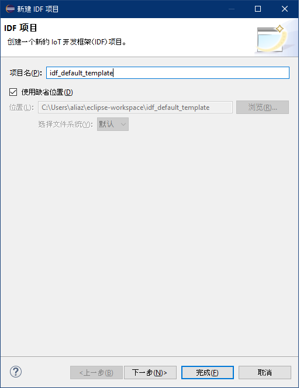
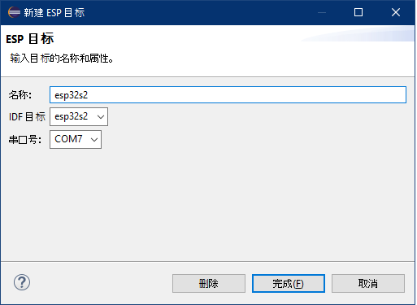
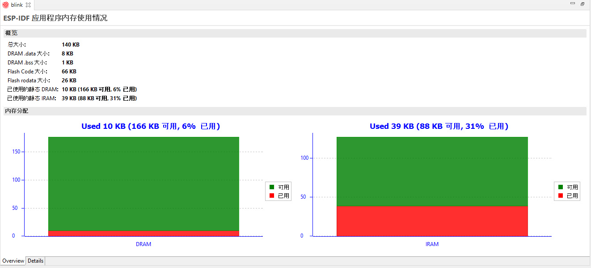
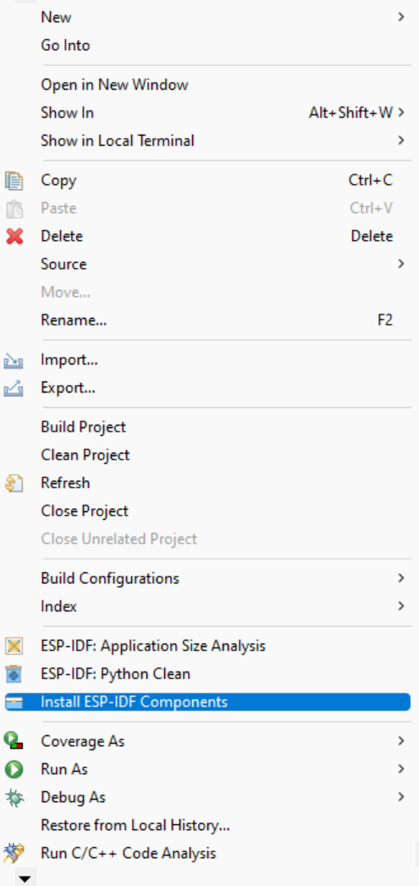
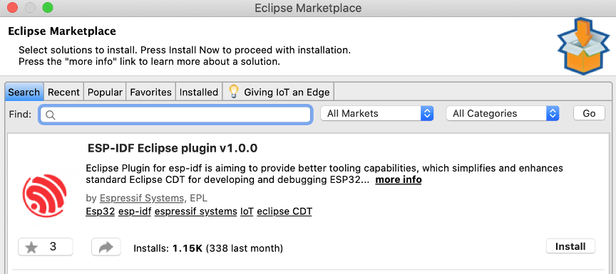
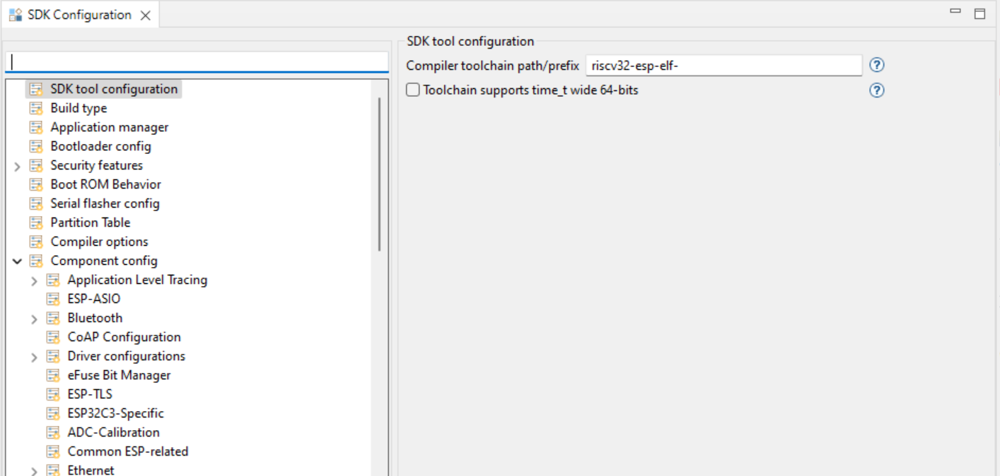
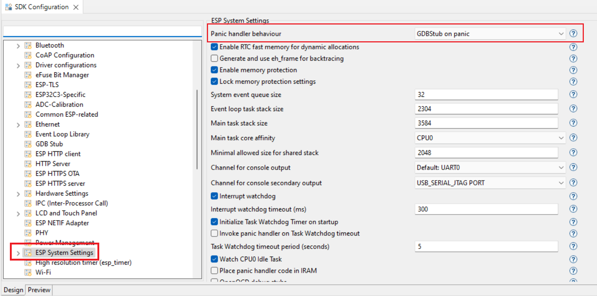
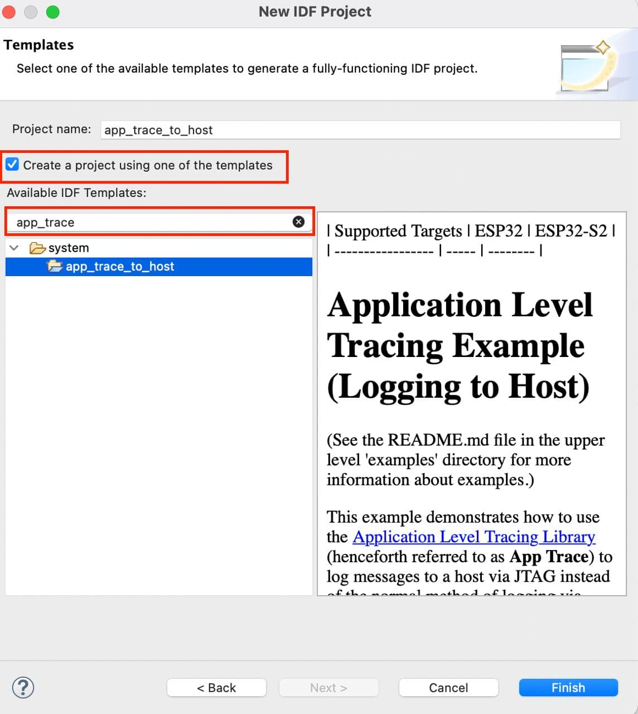

[](https://github.com/espressif/idf-eclipse-plugin/releases/latest)

[English](./README.md)

# ESP-IDF Eclipse 插件
ESP-IDF Eclipse 插件可便利开发人员在 Eclipse 开发环境中开发基于 ESP32 的 IoT 应用程序。本插件集成了编辑、编译、烧录和调试等基础功能，还有安装工具、SDK 配置和 CMake 编辑器等附加功能，可简化并增强开发人员在使用标准 Eclipse CDT 开发和调试 ESP32 IoT 应用程序时的开发体验。

ESP-IDF Eclipse 插件支持 `macOS`、`Window` 和 `Linux` 操作系统。


> **Note:** 本插件支持基于 `esp32`、`esp32s2`、`esp32s3` 和 `esp32c3` 开发的 ESP-IDF CMake 项目（4.x 及以上）。

快速了解 ESP-IDF 和 Eclipse 插件，请见我们在 <a href= "https://youtu.be/CbPX3q7LeBc">EclipseCon 2020</a> 中的视频介绍。

# 目录
* [安装依赖资源](#Prerequisites) <br>
* [安装 IDF Eclipse 插件](#GettingStarted) <br>
* [安装 ESP-IDF 和相关工具集](#InstallTools) <br>
* [使用工具安装助手，安装 ESP-IDF 和相关工具](#InstallToolsWizard) <br>
* [创建一个新项目](#NewProjectUsingDefault)<br>
* [配置启动目标](#ConfigureLaunchTarget)<br>
* [编译项目](#BuildApplication)<br>
* [烧录项目](#FlashApplication)<br>
* [查看串口输出](#ConfigureLaunchTerminal)<br>
* [使用 sdkconfig 编辑器配置项目](#projectconfigure)<br>
* [CMake 编辑器](#cmakeproject)<br>
* [调试项目](#debugging)<br>
* [ESP-IDF 应用程序内存分析编辑器](#sizeanalysiseditor)<br>
* [安装 ESP-IDF 组件](#espidfcomponents)<br>
* [ESP-IDF 终端](#idfterminal)<br>
* [配置构建环境变量](#configureEnvironmentVariables)<br>
* [配置核心构建工具链](#ConfigureToolchains)<br>
* [配置的 CMake 工具链](#ConfigureCMakeToolchain)<br>
* [配置烧录参数](#customizeLaunchConfig)<br>
* [从 Eclipse 市场安装 IDF Eclipse 插件](#installPluginsFromMarketPlace)<br>
* [使用本地文件安装 IDF Eclipse 插件](#installPluginsUsingLocalFile) <br>
* [升级 IDF Eclipse 插件](#upgradePlugins)<br>
* [导入一个现有的 IDF 项目](#ImportProject)<br>
* [导入一个现有的 Debug 启动配置](#importDebugLaunchConfig)<br>
* [通过 USB 升级设备固件 (DFU)](#deviceFirmwareUpgrade)<br>
* [GDBStub 调试](#gdbStubDebugging)<br>
* [GCOV Code Coverage and Dump Generation](#gcovCodeCoverage)<br>
* [应用层追踪](#appLvlTracing)<br>
* [ESP-IDF master 分支更新](#updateEspIdfMaster)<br>
* [更改语言](#changeLanguage)<br>
* [故障排除指南](#troubleshooting)<br>
* [如何提交 bug](#howToRaiseBugs)<br>
* <a href ="https://github.com/espressif/idf-eclipse-plugin/blob/master/FAQ.md#FAQ">常见问题</a>


<a name="Prerequisites"></a>
# 安装依赖资源

IDF Eclipse 插件的运行环境要求如下。

* **Java 11 及以上**：点击<a href= "https://www.oracle.com/technetwork/java/javase/downloads/index.html">这里</a>下载并安装 Java SE
* **Python 3.6 及以上**：点击<a href="https://www.python.org/downloads/">这里</a>下载并安装 Python
* **Eclipse IDE C/C++ 开发工具 2022-06（2021-06 及以上）**：点击<a href= "https://www.eclipse.org/downloads/packages/release/2022-06/r/eclipse-ide-cc-developers">这里</a>下载并安装 Eclipse CDT 安装包
* **Git**：点击<a href ="https://git-scm.com/downloads">这里</a>获得最新 Git
* **ESP-IDF 4.0 及以上**：点击<a href ="https://github.com/espressif/esp-idf/releases">这里</a>克隆 ESP-IDF 仓库

> **Note:** 请确保系统环境 `PATH` 可以访问 Java、Python 和 Git。


此外，我们还为 Windows 用户提供 `Espressif-IDE 离线安装器`，集成了 OpenJDK、Python、CMake、Git、ESP-IDF、Eclipse IDE、IDF Eclipse 插件及相关构建工具，请见 <a href="https://github.com/espressif/idf-installer#espressif-ide-offline-installer"> Espressif-IDE 离线安装器 </a>。

更多有关 Espressif-IDE 的信息，请见<a href="https://github.com/espressif/idf-eclipse-plugin/blob/master/docs/Espressif-IDE.md"> 这里</a>。

<a name="GettingStarted"></a>

# 使用更新站点 URL 安装插件

您可以使用`更新站点 URL` 将 ESP-IDF Eclipse 插件安装至您的 Eclipse CDT 环境中，具体步骤见下：

1. 前往`帮助`>`安装新软件`
1. 点击`添加…`，并在弹出的对话窗中：
	* 输入`名称`为 `乐鑫 ESP-IDF Eclipse 插件`。
	* 输入`仓库位置`为：
		* 稳定版：https://dl.espressif.com/dl/idf-eclipse-plugin/updates/latest/
		* 测试版：https://dl.espressif.com/dl/idf-eclipse-plugin/updates/beta/
		* 每日构建版：https://dl.espressif.com/dl/idf-eclipse-plugin/updates/nightly/
	* 点击`添加`。
1. 从列表中选择`Espressif IDF`，并按照提示完成所有安装步骤。

> **Note:** 本文档中的所有截图均来自 `macOS` 操作系统，但安装步骤同时适用于 `Windows`、`Linux` 和 `macOS` 操作系统。


<a name="InstallTools"></a>
# 安装 ESP-IDF

通过 Eclipse 直接安装 ESP-IDF：

1. 前往`乐鑫`>`下载并配置 ESP-IDF`。
1. 在`下载 ESP-IDF`部分，选择需要下载的 ESP-IDF 版本和保存路径。
1. 点击`完成`。

使用现有的本地 ESP-IDF：

1. 前往`乐鑫`>`下载并配置 ESP-IDF`。
1. 勾选`使用文件系统中现有的 ESP-IDF 目录`。
1. 选择一个文件系统中现有的 ESP-IDF 目录。
1. 点击`完成`。

本操作将下载指定的 ESP-IDF 版本，并配置 Eclipse CDT 构建环境变量中的 `IDF_PATH`。


# 安装 ESP-IDF 工具集
ESP-IDF 在构建固件时需要一些工具，包括 Python、Git、交叉编译器、menuconfig 工具、CMake 和 Ninja 构建工具等。

具体可按照以下步骤，安装 ESP-IDF 工具集。

1. 前往`乐鑫`>`ESP-IDF 工具管理器`>`安装工具`。
1. 输入 `ESP-IDF 目录`的所在路径。
1. 输入 `Git` 和 `Python` 可执行文件的位置（如未能自动检测填充）。
1. 点击`安装工具`，并按照提示完成所有安装步骤。如需了解安装详情，请查看`控制台`。
1. 本操作需要下载并安装 `xtensa-esp32-elf`、`esp32ulp-elf`、CMake、`openocd-esp32` 和 Ninja 等工具集。因此，如果您是首次进行本操作，则可能需要等待较长时间。

> **Note:** 本步骤将按照 `idf_tools.py export` 命令，将 `IDF_PATH`、`PATH`、`OPENOCD_SCRIPTS` 和 `IDF_PYTHON_ENV_PATH` 设置为 Eclipse CDT 构建环境。因此，即使您以前已安装过上述工具，也不可跳过该步骤。


ESP-IDF 目录选择对话框：


<a name="InstallToolsWizard"></a>
# 工具安装助手
您可以使用工具安装助手，安装相关工具，优势在于可以简化安装过程，且仅安装 ESP-IDF 框架下您需要的工具。<br/>

具体步骤如下：

1. 前往 `乐鑫` > `ESP-IDF 工具管理器` > `工具安装助手（预览版）`


2. 等待安装助手启动，选择 Git 和 Python 的安装路径（如您已添加系统 PATH，则路径可自动填充）。然后，点击 `下一步`。


3. 选择本地已安装 ESP-IDF 文件夹，或从下拉菜单中选择不同版本安装 ESP-IDF，比如选择列表中的 master 可以帮您从 github 中克隆 ESP-IDF 的 master 分支。


1. 点击 `下一步` 查看针对您的 ESP-IDF 版本的可用工具。此时，您可以选择安装所有推荐工具，或仅选择您需要的工具（可按照工具名称或目标进行筛选）。接着，安装助手将下载并安装所有所需的工具。安装完成后，您就可以创建项目了。


<a name="NewProjectUsingDefault"></a>
# 创建一个新项目
1. 请首先确保您处于`C/C++ 视图`之下。
1. 前往`文件`>`新建`>`乐鑫 IDF 项目`（如果您未看到该选项，请前往`窗口`>`视图`>`重置视图...`）。
1. 输入 `项目名称` （注意，ESP-IDF 构建系统路径中不允许空格）。
1. 点击`完成`。

> **Note:** 完成以上操作后，您将在编辑器中看到许多未解决的 include 错误。这些错误仅在构建后才能解决。



<a name="NewProjectUsingTemplates"></a>
## 使用 ESP-IDF 模板创建一个新项目
1. 请首先确保您处于`C/C++ 视图`之下。
1. 前往`文件`>`新建`>`乐鑫 IDF 项目`（如果您未找到该选项，请前往`窗口`>`视图`>`重置视图...`）。
1. 输入`项目名称`。
1. 点击`下一步`。
1. 勾选`使用其中一个模板创建项目`。
1. 从目录中选择一个模板。
1. 点击`完成`。

> **Note:** 完成以上操作后，您将在编辑器中看到许多未解决的 include 错误。这些错误仅在构建完成后才能解决。


<a name="ConfigureLaunchTarget"></a>
# 配置启动目标
接下来，我们需要告诉 CDT 应在项目中使用我们的工具链，确保所有的头文件均可索引和使用。本步骤需在`启动栏`完成。注意，`启动栏`位于工具栏的最左边，仅在`项目管理器`中存在项目时出现。

1. 点击顶部工具栏中左起第三个下拉窗口`启动目标`。
1. 选择`新的启动目标`。
1. 选择`ESP 目标`。
1. 提供目标属性，即您希望启动应用程序的位置。输入目标`名称`，并选择您连接 ESP 设备的`串口`。



<a name="BuildApplication"></a>
# 编译项目
1. 从`项目浏览器`中选择一个项目。
1. 点击顶部工具栏中左起第一个下拉窗口`启动模式`，选择`运行`。
1. 点击顶部工具栏中左起第二个下拉窗口`启动配置`，选择您的应用程序（自动检测）。
1. 点击顶部工具栏中左起第三个下拉窗口`启动目标`，选择您需要启动的目标。
1. 现在，点击顶部工具栏左上角的`构建`按钮。


<a name="FlashApplication"></a>
# 烧录项目
ESP-IDF 的 `idf.py` 工具可以打包 `make flash` 命令和常用指令。用户只需点击`启动`按钮（顶部工具栏左起第二个按钮）即可启动烧录操作，即使用默认的烧录命令 `idf.py -p PORT flash` 烧录应用程序。

如需使用自定义烧录参数，请前往 [这里](#customizeLaunchConfig) 获取详细步骤。

如需通过 JTAG 进行烧录，请见 <a href="https://github.com/espressif/idf-eclipse-plugin/tree/master/docs/JTAG%20Flashing.md"> JTAG 烧录指南</a>。

<a name="ConfigureLaunchTerminal"></a>
# 查看串口输出
为了查看 Eclipse 的串口输出，我们需要在`ESP-IDF 串口监视器`中配置需要监测的串口。本功能已经集成至`IDF 监视器`。更多详情，请见 <a href="https://docs.espressif.com/projects/esp-idf/zh_CN/latest/esp32/api-guides/tools/idf-monitor.html">这里</a>。

1. 点击工具栏中的`打开终端`图标。
1. 从终端下拉菜单中选择`ESP-IDF 串口监视器`。
1. 手动选择开发板连接的`串口`（如未能自动检测）。
1. 配置`串口监视器`过滤器，对串口输出进行过滤。
1. 点击 `OK` 启动终端，开始监听 USB 端口。


### ESP-IDF 串口监视器设置

设置 ESP-IDF 串口监视器的字符和行数上限：
1. 进入 Eclipse 偏好设置，选择 `乐鑫`
1. 点击 `ESP-IDF 串口监视器设置`
1. 配置 `控制台行宽 (Console Line Width)` 和 `控制台输出上限 (Limit Console Output)`

<a name="projectconfigure"></a>
# 编译项目
ESP-IDF Eclipse 插件允许用户直接在 Eclipse 环境中配置 `sdkconfig`。

## SDK 配置编辑器
项目配置保存在项目根目录下的 `sdkconfig` 配置文件中，用户可通过`SDK 配置编辑器`进行修改。

启动`SDK 配置编辑器`：

1. 前往 `sdkconfig` 文件。
1. 双击文件，启动 SDK 配置编辑器。
1. 完成更改后，可使用 `Ctrl+S` 或 `Command+S` 保存更改。也可以点击 Eclipse 工具栏中的`保存`按钮进行保存。
1. 如需撤回对 sdkconfig 编辑器的更改，用户可选择不保存退出编辑器；也可右键 `sdkconfig` 文件并选择`加载 sdkconfig`菜单选项，恢复对编辑器的修改。


<a name="cmakeproject"></a>
# CMake 编辑器
ESP-IDF Eclipse 插件中还集成了一个 CMake 编辑器，允许用户编辑 CMakeList.txt 等 CMake 文件，支持语法高亮、CMake 命令助手、代码模板等功能。


如需配置 CMake 编辑器，请前往 Eclipse 的`偏好设置` > `CMakeEd`。


<a name="debugging"></a>
# 调试项目
## GDB 硬件调试
请见 <a href ="https://docs.espressif.com/projects/esp-idf/zh_CN/latest/esp32/api-guides/jtag-debugging/index.html" >GDB 硬件调试指南</a>。

## GDB OpenOCD 调试
请见 <a href="https://github.com/espressif/idf-eclipse-plugin/tree/master/docs/OpenOCD%20Debugging.md">GDB OpenOCD 调试</a>。


<a name="sizeanalysiseditor"></a>
#  ESP-IDF 应用程序内存分析
内存分析编辑器可分析应用程序的静态内存使用情况：概述和详情。`概述`选项卡可简要提供应用程序的内存使用情况；`详情`选项卡可详细介绍应用程序中各组件和各符号文件的内存使用情况。

其中，`详情`选项卡还支持搜索和排序功能。

启动`应用程序内存分析编辑器`：

1. 右键点击项目
1. 选择`ESP-IDF：应用程序内存分析`菜单，启动编辑器

**应用程序内存分析 - 概述**



**应用程序内存分析 - 详情**


<a name="idfterminal"></a>
# ESP-IDF 终端
`ESP-IDF 终端`可为用户在 Eclipse 环境中启动一个本地终端窗口。用户可通过`偏好设置`>`C/C++`>`构建`>`环境`配置所有环境变量。本终端窗口的默认工作目录为当前选定的项目或 `IDF_PATH`（如未选定项目）。

终端 PATH 还将同时配置 `esptool`、`espcoredump`、`partition_table` 和 `app_update` 组件路径，允许用户从 ESP-IDF 终端直接进行访问。

启动 `ESP-IDF 终端`：

1. 点击工具栏中的`打开终端`图标。
1. 从终端下拉菜单中选择`ESP-IDF 终端`，并点击`OK`启动终端。


<a name="espidfcomponents"></a>
# 安装 ESP-IDF 组件

直接向您的项目中安装 ESP-IDF 组件：

* 从`项目浏览器`中选择需要安装组件的项目，并选择 `安装 ESP-IDF 组件`
  

  查看所有可安装的组件。

* 选中需要安装的组件，并点击 `安装`。此外，您还可以点击 `更多信息`，查看具体组件的更多信息。
  

注意，已经安装的组件也会出现的列表中，但 `安装` 选项（`已安装`选项旁边）将禁用。

<a name="configureEnvironmentVariables"></a>
# 配置环境变量
如您的 IDF 工具是通过`乐鑫`>`ESP-IDF 工具管理器`>`安装工具`菜单选项安装的，则 Eclipse 将帮您自动填充`偏好设置`>`C/C++ 构建`>`环境`配置所需的环境变量，具体包括：

* IDF_PATH
* PATH
* OPENOCD_SCRIPTS
* IDF_PYTHON_ENV_PATH

如上述环境变量未能自动正确配置，请按照以下步骤操作。

1. 前往`C/C++ 构建`下的`环境`偏好设置页。
1. 再次点击`添加...`，并输入`IDF_PATH`，即 ESP-IDF 的完整安装路径。
1. 按照相同步骤，配置 OPENOCD_SCRIPTS、IDF_PYTHON_ENV_PATH 和 PATH 环境变量

以下均为示例：

##### IDF_PATH #####
`/Users/user-name/esp/esp-idf`

##### OPENOCD_SCRIPTS #####
`/Users/user-name/.espressif/tools/openocd-esp32/v0.10.0-esp32-20190313/openocd-esp32/share/openocd/scripts`

##### IDF_PYTHON_ENV_PATH #####
`/Users/user-name/.espressif/python_env/idf4.0_py3.7_env`

##### PATH #####
`/Users/user-name/.espressif/tools/xtensa-esp32-elf/esp32-2019r1-8.2.0/xtensa-esp32-elf/bin:/Users/user-name/.espressif/tools/esp32ulp-elf/2.28.51.20170517/esp32ulp-elf-binutils/bin:/Users/user-name/.espressif/tools/cmake/3.13.4/CMake.app/Contents/bin:/Users/user-name/.espressif/tools/openocd-esp32/v0.10.0-esp32-20190313/openocd-esp32/bin:/Users/user-name/.espressif/tools/ninja/1.9.0/:/Users/user-name/.espressif/python_env/idf4.0_py3.7_env/bin:/Users/user-name/esp/esp-idf/tools:$PATH`


# 配置工具链
我们需要告诉 Eclipse CDT 在构建项目时需要使用什么核心构建工具链和 CMake 工具链。如您的 IDF 工具是通过`工具`>`ESP-IDF 工具管理器`>`安装工具`菜单选项安装的，则 Eclipse 可自动检测到需要使用的工具链。

如未能自动检测所需工具链，请按照以下步骤操作。

<a name="ConfigureToolchains"></a>
#  配置核心构建工具链

1. 打开 Eclipse `偏好设置`。
1. 前往`C/C++`>`核心构建工具链`偏好设置页。
1. 选中用户定义工具链，点击`添加...`。
1. 选择 `GCC` 为工具链类型。
1. 点击`下一步`。
1. 提供 GCC 工具链设置：
	**编译器：** /Users/user-name/esp/xtensa-esp32-elf/bin/xtensa-esp32-elf-gcc,
	**操作系统：** esp32,
	**CPU 架构：** xtensa


<a name="ConfigureCMakeToolchain"></a>
#  配置 CMake 工具链
现在，我们需要告诉 CDT 在构建项目时需要使用哪种工具链。这可以在生成 Ninja 文件时将所需的参数传递给 CMake。

1. 前往`C/C++`>`CMake`偏好设置页
1. 点击`添加...`，启动新的 CMake 工具链配置对话框
1. 浏览 CMake 工具链 `Path`。示例：`/Users/user-name/esp/esp-idf/tools/cmake/toolchain-esp32.cmake`
1. 从下拉列表中选择`GCC Xtensa 工具链`编译器。示例：`esp32 xtensa /Users/user-name/esp/xtensa-esp32-elf/bin/xtensa-esp32-elf-gcc`

> **Note:** Eclipse CDT 在保存工具链偏好设置时有一个已知 bug。因此，我们建议在进行后续操作前，重新启动 Eclipse。


<a name="customizeLaunchConfig"></a>
# 启动配置
如需使用自定义启动配置和烧录参数，请按照以下步骤操作。

1. 点击`启动配置`编辑按钮。
1. 切换至`主选项卡`。
1. 指定应用程序的运行 `位置`。由于 `idf.py` 是一个 Python 文件，因此还将配置 Python 系统路径。示例：`${system_path:python}`。
1. 指定应用程序的`工作目录`。示例：`${workspace_loc:/hello_world}`。
1. 在其他`参数`编辑框，新增一条将在指定工作目录下运行的烧录命令。
1. 烧录命令示例：`/Users/user-name/esp/esp-idf/tools/idf.py -p /dev/cu.SLAB_USBtoUART flash`。
1. 点击 `OK`，保存设置。
1. 点击`启动`图标，将应用程序烧录到选定的开发板中。


<a name="changeLanguage"></a>
# 更改语言
IDF Eclipse 插件可支持不同语言。如需更改，请按照以下步骤操作。

1. 前往菜单栏，点击`乐鑫`。
1. 在下拉菜单中选择`更改语言`。
1. 在子下拉菜单中选择所需的语言。
1. 此后，Eclipse 重启后将切换至所选择的语言。


注意，上述操作仅提供针对插件界面的汉化。如需全部汉化，则请另外安装 Eclipse 汉化包。

<a name="troubleshooting"></a>
# 故障排除

## 错误日志
`错误日志`视图可以显示插件记录的所有警告和错误，其底层日志文件 (.log 文件) 保存在工作空间的 .metadata 子目录下。

打开`错误日志`视图，请前往`窗口`>`显示视图`>`错误日志`。

保存当前日志内容至本地文件，请从工具栏中点击`导出日志`按钮或右键选择`导出日志...`。此后，输入文件名即可保存日志至本地文件。

注意，在提交问题时一定要提供错误日志。


## 控制台视图日志
`控制台`视图可显示与当前运行或构建有关的所有警告和错误。

打开`控制台`视图，请前往`窗口`>`显示视图`>`控制台`。


## CDT 全局构建日志
打开 CDT 全局构建日志，请前往`偏好设置`>`C/C++`>`构建`>`日志`

## 乐鑫 IDF 工具集控制台
`乐鑫 IDF 工具控制台`为`控制台`视图的组成部分，通常仅在通过 Eclipse 安装 IDF 工具集时使用。

如您在通过`乐鑫`>`ESP-IDF 工具管理器`>`安装工具`方式安装 IDF 工具集时出现任何问题，即可使用本控制台查看错误报告。

如本控制台未自动启动，请前往`中控台`视图，点击`显示选中的中控台`按钮。


## 堆栈追踪
详见 <a href="https://github.com/espressif/idf-eclipse-plugin/tree/master/docs/HeapTracing.md">这里</a>。

<a name="installPluginsFromMarketPlace"></a>
# 从 Eclipse 市场安装 IDF Eclipse 插件

从 Eclipse 市场安装 IDF Eclipse 插件，请按照以下步骤操作。

1. 打开 Eclipse，前往`帮助`>`Eclipse 市场...`。
1. 在搜索框中输入 `ESP-IDF Eclipse Plugin`，并点击`Go`。
1. 点击`安装`，并按照提示完成所有安装步骤。
1. 重启 Eclipse。



<a name="installPluginsUsingLocalFile"></a>
#  从本地文件安装 IDF Eclipse 插件

1. 下载最新版 ESP-IDF Eclipse 插件：https://github.com/espressif/idf-eclipse-plugin/releases
1. 打开 Eclipse，前往`帮助`>`安装新软件`。
1. 点击`添加`按钮。
1. 在`添加`仓库对话框中选择`存档`> `com.espressif.idf.update-vxxxxxxx.zip` 文件。
1. 点击`添加`。
1. 从列表中选择`Espressif IDF`，并按照提示完成所有安装步骤。
1. 重启 Eclipse。


<a name="upgradePlugins"></a>
#  如何升级我的 IDF Eclipse 插件？

如您是首次在 Eclipse 软件中安装 IDF 插件，则首先需要按照以下步骤`添加`最新插件地址：

1. 前往`窗口`>`偏好设置`>`安装/更新`>`可用软件站点`。
1. 点击`添加`。
1. 输入最新仓库的地址：https://dl.espressif.com/dl/idf-eclipse-plugin/updates/latest/
1. 点击 `OK`。

如果您已经使用最新仓库的 URL 安装了 IDF Eclipse 插件，则可以按照以下步骤获取更新。

1. 前往`帮助`>`检查更新`
1. 如有新的更新，请选择`乐鑫 IDF 插件`，并取消勾选所有其他项目
1. 点击`下一步`，并按照提示完成所有安装步骤。


<a name="ImportProject"></a>
#  导入一个现有的 IDF 项目

1. 请首先确保您处于`C/C++ 视图`之下。
1. 右键点击`项目资源管理器`。
1. 选择`导入...`菜单
1. 前往`乐鑫导入向导`菜单，选择`现有 IDF 项目`。
1. 点击`下一步`。
1. 点击`浏览...`，选择一个本地项目的位置。
1. 更改 `项目名称`（否则将使用默认名称）。
1. 点击`完成`，将选定项目作为一个 CMake 项目导入 Eclipse 工作空间。


<a name="importDebugLaunchConfig"></a>
#  导入一个现有的 Debug 启动配置
将一个现有的启动配置导入 Eclipse：

1. 前往`文件`>`导入...`。
1. 在`导入`对话框中，扩展`运行/调试`组，并选择`启动配置`。
1. 点击`下一步`。
1. 点击`浏览...`，选择本地文件系统中所需的位置。
1. 选择包含启动文件的文件夹，然后点击`OK`。
1. 勾选所需的文件夹并启动文件。
1. 如果您正在使用新的配置文件替代先前一个相同名称的配置，请选择`覆盖现有启动配置（忽略警告）`。
1. 点击`完成`。

<a name="gdbStubDebugging"></a>
# GDBStub 调试

乐鑫 Eclipse 插件集成了 GDBStub 调试功能，允许用户在 Eclipse 界面中诊断处于 panic 模式下的芯片并进行问题调试。

使能 GDBStub 调试功能：

1. 前往 `sdkconfig` 打开配置编辑器。


1. 展开 `Component Config` 部分，并选择 `ESP System Settings`；窗口右侧在 `Panic handler behaviour` 中选择 `GDBStub on Panic`。


至此，实例一旦发生 panic，则串口监视器将自动进入 GDBStub 调试页面。

使用 GDBStub 调试功能：

1. 创建一个 `hello_world` 项目模版，并在 main c 文件中增加下方代码：

	```
	This is a global variable<br/>
	COREDUMP_DRAM_ATTR uint8_t global_var;
	```

1. 接着，在 `esp_restart()` 功能之前插入下方代码 <br/>

	```
	global_var = 25;<br/>
	assert(0);<br/>
	```

最终文件实例：


构建烧录项目，并启动串口监视器。我们在第 45 行发送一个失败信号，这会使芯片进入 panic 模式。之后会跳出调试模式界面，此时芯片将停止工作。

注意，芯片进入 panic 模式后无法再从断点继续执行，您必须停止运行并重新启动芯片（使用 idf 命令或重新启动串口监视器）。


您可以在此界面查看寄存器堆栈踪迹，甚至堆栈框架中变量的值。

退出调试界面：

1. 点击 `停止`。

<a name="gcovCodeCoverage"></a>

# GCOV 代码覆盖率和转储生成

借助 ESP-IDF Eclipse 插件，您可以生成和查看 GCOV 代码覆盖率报告。

请参考示例项目 [gcov](https://github.com/espressif/esp-idf/blob/master/examples/system/gcov/)来了解这一功能。
有关启用此功能所需标志的详细信息，请查看该示例的[项目简介](https://github.com/espressif/esp-idf/blob/master/examples/system/gcov/README.md)。

构建并烧录项目后，您可以使用 OpenOCD 启动配置开始调试。调试会话开始后，ESP-IDF Eclipse 切换到调试视图，您会在 IDF 进程控制台上看到以下两个按键。


第一个按键用于生成即时运行时转储，第二个按键用于生成硬编码转储。根据程序当前状态，您可以选择生成相应的转储。示例项目中的程序会暂停两次，以便您按下第二个按键生成硬编码转储。
在硬编码转储生成完成后，您可以按下第一个按键生成即时运行时转储。

转储生成后，您可以右键单击项目，然后选择以下选项。
`ESP-IDF: 查看GCOV文件`


点击该选项后，会打开一个视图，显示可用于 Eclipse 分析的转储文件。


点击刷新按键可更新视图以显示最新的文件，然后使用选择项目按键来选择不同的项目。
文件名只显示一个名称，同时用于 gcno 和 gcda 文件。同时，只有具有匹配的 gcno 或 gcda 文件的文件才会显示在列表中。

双击列表中的任何文件，将显示以下对话框。
。
您可以选择仅查看所选文件的覆盖率，或查看整个项目的覆盖率。
根据您的选择，系统会显示相应的信息。


<a name="deviceFirmwareUpgrade"></a>

# 通过 USB 升级设备固件 (DFU)

设备固件升级 (DFU) 允许用户通过 USB 升级设备固件，但必须满足一些条件：

- DFU 支持仅限 ESP32-S2 和 ESP32-S3 系列。 
- 其次，您还需额外链接一些导线，具体见下表。此外，您还可以参考针对 ESP32-S2 开发板的[示例](https://blog.espressif.com/dfu-using-the-native-usb-on-esp32-s2-for-flashing-the-firmware-b2c4af3335f1)。

| GPIO | USB         |
| -----| ------------|
| 20   |  D+ （绿）   |
| 19   |  D- （白）   |
| GND  |  GND （黑）  |
| +5V  |  +5V （红）  |

确认上述条件满足后：

1. 按住 Boot 键的同时按一下 Reset 键进入“固件下载”模式。芯片只有在“下载模式”中才可以被识别为 DFU 设备，并进行 USB 烧录。
1. 通过 [Zadig 工具](https://zadig.akeo.ie/>) 安装 USB 驱动（仅支持 Windows）。这里需要注意几点：
	- 注意必须首先使芯片进入“下载模式”且已被识别为 DFU 设备后，再运行 Zadig 工具安装 USB 驱动。
	- Zadig 工具可能识别到若干个 USB 接口，请仅为未安装驱动的接口（通常为接口 2）进行安装 WinUSB 驱动，不要为同一个接口重复安装驱动。
	- 不推荐手动安装 Windows 设备管理器中的驱动，这可能导致烧录失败。

完成上述步骤后，可通过 DFU 构建烧固件，具体步骤如下：

1. 前往工具栏，并打开 DFU 开关。
1. 前往目标面板，并选择正确的目标和端口。
1. 此时，使用 build 命令会生成一个新文件 (dfu.bin)，可用于后续的烧录。


更多信息（包括常见错误和已知问题），请见[指南](https://docs.espressif.com/projects/esp-idf/en/latest/esp32s3/api-guides/dfu.html#usb-drivers-windows-only)。

<a name="appLvlTracing"></a>

# 应用层追踪

ESP-IDF 的 [应用层追踪](https://docs.espressif.com/projects/esp-idf/en/latest/esp32c3/api-guides/app_trace.html?) 功能可用于分析程序行为。ESP-IDF Eclipse 插件也特别提供了用户界面，允许通过命令开始/停止追踪，并进行数据处理。具体参考可见 [app_trace_to_host](https://github.com/espressif/esp-idf/tree/master/examples/system/app_trace_to_host) 项目，创建方式如下：



启动应用层追踪功能之前，请首先完成项目的调试配置，包括指定使用的开发板名称。否则无法正常启动 OpenOCD 服务器。


配置完成后，从 `项目浏览器` 中选择您的项目，并点击 `ESP-IDF:Application Level Tracing`：


注意，本功能需要调用 OpenOCD 服务器，因此启动需要一定时间，请耐心等待。另外，调用自动完成，无需从外部特别打开 OpenOCD 服务器。应用层追踪启动后会自动填充一些配置，您也可以根据个人需要修改。

开始命令：

* 语法：`start <outfile> [poll_period [trace_size [stop_tmo [wait4halt [skip_size]]]]`
* 参数：
	* `outfile`：文件路径（从任一 CPU），格式应满足 `file://path/to/file`。
	* `poll_period`：可用追踪数据的轮询周期（单位：毫秒）。如果大于 0，则命令以“非阻塞”模式运行。默认值 1（1 毫秒）。
	* `trace_size`：可追踪数据的最大长度限制（单位：字节）。注意，该参数使能后，追踪数据达到配置的长度后则自动停止。默认值 -1（不限制最大长度）。
	* `stop_tmo`：超时限制（单位：秒），即如特定期间中未收到数据则停止追踪。默认值 -1（不限制超时）。如需配置，注意应长于两条追踪命令之间的最大间隔。
	* `wait4halt`：配置为 0 立刻开始追踪，否则等待目标停止后开始追踪（复位后、出现断点等）。默认值 0（立刻开始追踪）
	* `skip_size`：开始追踪后跳过若干个字节。默认值 0 （跳过 0 个字节）

更多信息，请见 [这里](https://docs.espressif.com/projects/esp-idf/en/latest/esp32c3/api-guides/app_trace.html?)。

另外两个参数 `Trace Processing Script` 和 `Start Parsing Command` 用于解析输出文件。

* `Trace Processing Script` 配置解析脚本的存储路径，默认为 esp-idf 中的 logtrace_proc.py
* `Start Parsing Command` 配置解析结果文件的存储路径，默认为 `$IDF_PATH/tools/esp_app_trace/logtrace_proc.py/path/to/trace/file/path/to/program/elf/file`。

注意，右侧的 `Start parse` 按钮默认将处于禁用状态。此时，可以点击窗口右下方的 `开始` 按钮，这将生成一个 dump 文件，并同时解禁 `Start parse` 按钮。

此后，点击 `Start parse` 按钮，从 Eclipse 控制台查看解析脚本的输出：


<a name ="updateEspIdfMaster"></a>

# ESP-IDF Master 更新

您如果在使用 ESP-IDF 的 master 分支，并希望进行升级：请打开 Eclipse 插件，前往 `乐鑫` -> `ESP-IDF 工具管理器`，并点击 `更新 ESP-IDF master`。


**注意：** 该选项仅适用于 ESP-IDF 的 master 分支。

<a name="howToRaiseBugs"></a>
# 如何提交 bug？
请点击此链接（https://github.com/espressif/idf-eclipse-plugin/issues）提交问题，并提供完整的环境详细信息和日志。

# 如何进行本地构建

1. 完成准备工作：安装 Java 11+ 和 Maven
2. 运行以下命令，进行克隆和构建

	```
	git clone https://github.com/espressif/idf-eclipse-plugin.git
	cd idf-eclipse-plugin
	mvn clean verify -Djarsigner.skip=true
	```

以上命令将生成 p2 更新站点 artifact：
* 名称：`com.espressif.idf.update-*`
* 存储路径：`releng/com.espressif.idf.update/target`

后续可按照 <a href="https://github.com/espressif/idf-eclipse-plugin#installPluginsUsingLocalFile">介绍</a> 进行安装。

# 如何获得最新的开发构建
1. 前往最新 master 分支，找到 <a href="https://github.com/espressif/idf-eclipse-plugin/commits/master">最新 commit</a> 。
1. 点击最新 commit 处的 :white_check_mark:。
1. 点击 `Details`。
1. 点击左侧 `Summary`。
1. 下滑至页面底部，找到 `Artifacts`。
1. 下载 `com.espressif.idf.update`，并按照 <a
href="https://github.com/espressif/idf-eclipse-plugin#installPluginsUsingLocalFile">介绍</a> 进行安装。

# 自定义 IDE 配置
## 自定义构建目录

IDE 支持配置自定义构架目录：

1. 选择您的项目，从顶部工具栏打开配置 `Edit` 界面。
2. 选择 `Build Settings` 选项卡。
3. 在 `Additional CMake arguments` 选项框提供自定义目录，可以选择项目中的某个文件夹，也可以选择项目外的某个文件夹，格式为 `-B <custom build path>`，例 `-B /Users/myUser/esp/generated`。
4. 点击 `OK`开始构建项目

注意，此配置将改变所有项目构建 artifact 的保存路径。


# ESP-IDF Eclipse 插件兼容情况

| IEP | Eclipse | Java | 工具安装器| 描述 |
| ------ | ------ | ------ |------ | ------ |
| IEP 2.3.0 | Eclipse 2021-09, 2021-06 |Java 11 及以上 | ESP-IDF 工具安装器 (Windows) 2.11| ESP-IDF 工具安装器 (Windows) 2.11 集成 IEP 2.2.0，需升级至 2.3.0|
| IEP 2.2.0 | Eclipse 2021-06, 2021-03, 2020-12 |Java 11 及以上 | ESP-IDF 工具安装器 (Windows) 2.10| |
| IEP 2.1.2 | Eclipse 2021-06, 2021-03, 2020-12, 2020-09 |Java 11 及以上 | ESP-IDF 工具安装器 (Windows) 2.9| IEP 2.1.2 增加了对 Eclipse 2021-06 的支持|
| IEP 2.1.1 | Eclipse 2021-03, 2020-12, 2020-09 | Java 11 及以上 | ESP-IDF 工具安装器 (Windows) 2.8 | ESP-IDF 工具安装器 (Windows) 集成 IEP 2.1.0，需升级至 2.1.1
| IEP 2.1.0 | Eclipse 2021-03, 2020-12, 2020-09 | Java 11 及以上 | ESP-IDF 工具安装器 (Windows) 2.6 beta | IEP 2.1.0 增加了对 Eclipse 2021-03 的支持|
| IEP 2.0.0 | Eclipse 2020-12, 2020-09, 2020-06 | Java 11 及以上 | ESP-IDF 工具安装器 (Windows) 2.6 beta  ||
| IEP 1.2.4 | Eclipse 2020-12, 2020-09, 2020-06, 2020-03 | Java 1.8 及以上 | 不支持 | IEP 1.2.4 增加了对 Eclipse 2020-12 的支持|