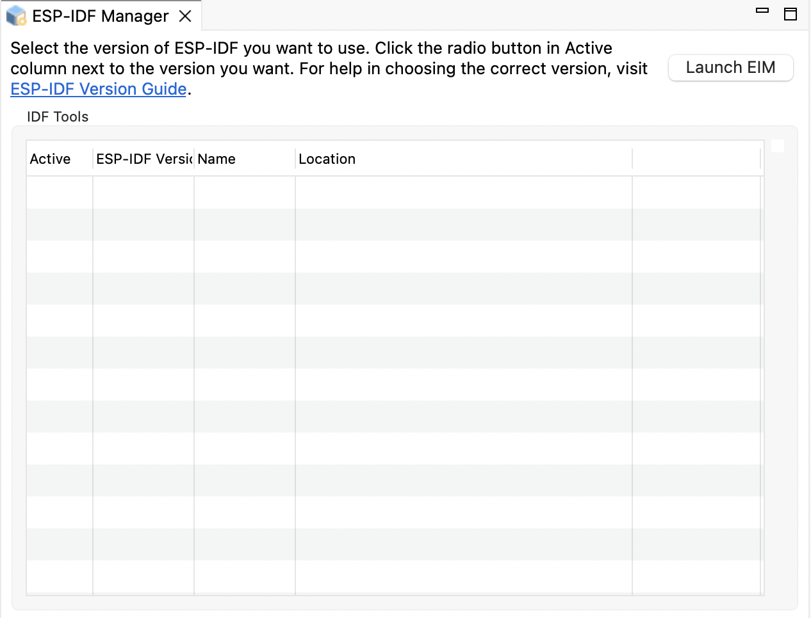

[](https://github.com/espressif/idf-eclipse-plugin/releases/latest)

[English](./README.md)

# ESP-IDF Eclipse 插件 (Espressif-IDE)

使用 ESP-IDF Eclipse 插件，开发者很容易就能在 Eclipse 开发环境中开发基于 ESP32 的 IoT 应用程序。

本插件集成了编辑、编译、烧录和调试等进阶功能，还有安装工具、SDK 配置和 CMake 编辑器等附加功能，简化并增强了标准 Eclipse CDT，用于开发和调试 ESP32 IoT 应用程序，从而优化开发体验。

ESP-IDF Eclipse 插件支持 `macOS`、`Windows` 和 `Linux` 操作系统。


> **注意：** 本插件支持基于 ESP-IDF CMake 的项目（4.x 及以上）。

想要快速了解 ESP-IDF 和 Eclipse 插件，请观看 <a href= "https://youtu.be/CbPX3q7LeBc">EclipseCon 2020</a> 中的介绍。

# 目录
<details open>
  <summary>入门指南</summary>

* [安装依赖资源](#Installation) <br>
* [创建新项目](#NewProjectUsingDefault)<br>
* [配置启动目标](#ConfigureLaunchTarget)<br>
* [编译项目](#BuildApplication)<br>
* [烧录项目](#FlashApplication)<br>
* [查看串口输出](#ConfigureLaunchTerminal)<br>
* [调试项目](#debugging)<br>
* [故障排除指南](#troubleshooting)<br>
* <a href ="https://github.com/espressif/idf-eclipse-plugin/blob/master/FAQ.md#FAQ">FAQ</a>
</details>

<details open>
  <summary>其他 IDE 功能</summary>

* [使用 sdkconfig 编辑器配置项目](#projectconfigure)<br>
* [CMake 编辑器](#cmakeproject)<br>
* [ESP-IDF 应用程序内存分析编辑器](#sizeanalysiseditor)<br>
* [安装 ESP-IDF 组件](#espidfcomponents)<br>
* [ESP-IDF 终端](#idfterminal)<br>
* [配置构建环境变量](#configureEnvironmentVariables)<br>
* [配置核心构建工具链](#ConfigureToolchains)<br>
* [配置的 CMake 工具链](#ConfigureCMakeToolchain)<br>
* [选择 Clang 工具链](#SelectDifferentToolchain)<br>
* [配置烧录参数](#customizeLaunchConfig)<br>
* [从 Eclipse 市场安装 IDF Eclipse 插件](#installPluginsFromMarketPlace)<br>
* [使用本地文件安装 IDF Eclipse 插件](#installPluginsUsingLocalFile) <br>
* [升级 IDF Eclipse 插件](#upgradePlugins)<br>
* [导入现有的 IDF 项目](#ImportProject)<br>
* [导入现有的 Debug 启动配置](#importDebugLaunchConfig)<br>
* [通过 USB 升级设备固件 (DFU)](#deviceFirmwareUpgrade)<br>
* [GDBStub 调试](#gdbStubDebugging)<br>
* [Core Dump 调试](#coreDumpDebugging)<br>
* [应用层追踪](#appLvlTracing)<br>
* [ESP-IDF 分区表编辑器界面](#partitionTableEditor)<br>
* [NVS 表编辑器](#nvsTableEditor)<br>
* [将二进制数据写入 flash](#writeFlashBinary)<br>
* [更改语言](#changeLanguage)<br>
* [Wokwi 模拟器](#wokwisimulator)<br>
</details>

<a name="Installation"></a>

# 安装

建议直接使用 Espressif-IDE，而不是借用 Eclipse CDT + IEP 插件更新，从而省去定期更新的麻烦。

# Windows 版 Espressif-IDE

下载 [适用于 Windows 的 ESP-IDF 离线安装程序](https://dl.espressif.com/dl/esp-idf/)，并按照[此处](https://github.com/espressif/idf-eclipse-plugin/blob/master/docs_readme/Espressif-IDE-Windows-Installer.md)提供的说明进行操作。该指南将引导你完成 Java、Git、CMake、ESP-IDF、IDF 工具、设备驱动程序和 Espressif-IDE 的安装，帮助你快速入门。

# macOS 和 Linux 版 Espressif-IDE

* 首先，下载适用于你操作系统的 [Espressif-IDE](https://github.com/espressif/idf-eclipse-plugin/blob/master/docs_readme/Espressif-IDE.md#downloads)。接下来，启动 IDE 并继续安装所需的 ESP-IDF 和相关工具。请注意，在启动 IDE 之前，必须确保已完成[准备工作](#Prerequisites)，即安装好了 Java、Python 和 Git，并且已将它们添加到系统路径中。

如果想要使用 Eclipse CDT 并通过 IDF Eclipse 插件进行更新，请确保从<a href= "https://www.eclipse.org/downloads/packages/release/2023-12/r/eclipse-ide-cc-developers"此处</a>下载适用于你操作系统的版本。

<a name="Prerequisites"></a>

## 准备工作

运行 Espressif-IDE 的最低要求如下：

* **Java 17 及以上**：从<a href= "https://www.oracle.com/technetwork/java/javase/downloads/index.html">此处</a>下载并安装 Java SE。
* **Python 3.8 及以上**：从<a href="https://www.python.org/downloads/">此处</a>下载并安装 Python。
* **Git**：从<a href ="https://git-scm.com/downloads">此处</a>获取最新的 Git。

> **注意：** 请确保 Java、Python 和 Git 已添加到系统环境路径中。

<a name="GettingStarted"></a>

# 使用更新站点 URL 安装 IDF 插件

可以使用更新站点 URL 将 IDF Eclipse 插件安装至现有的 IDE 中。首先，参照下列步骤添加发布仓库的 URL：

1. 前往 `帮助` > `安装新软件`。
2. 点击 `添加…`，并在弹出的对话窗中：
	* 将 `名称` 设为 `ESP-IDF Eclipse 插件`。
	* 将 `仓库位置` 设为：
        * 稳定版: https://dl.espressif.com/dl/idf-eclipse-plugin/updates/latest/
	* 点击 `添加`。
3. 在列表中选择 `Espressif IDF`，并按照提示完成所有安装步骤。

若想要添加测试版和每日构建版，请使用以下更新站点 URL。
    * 测试版：https://dl.espressif.com/dl/idf-eclipse-plugin/updates/beta/
    * 每日构建版：https://dl.espressif.com/dl/idf-eclipse-plugin/updates/nightly/

> **注意：** 本文档中的所有截图均来自 macOS 操作系统，但安装步骤同时适用于 Windows、Linux 和 macOS 操作系统。


<a name="InstallTools"></a>

# 安装 ESP-IDF

请按照以下说明在 Espressif-IDE 中安装 ESP-IDF。

1. 点击 `乐鑫` > `ESP-IDF 管理器`。将打开以下编辑器：



2. 点击 `添加 ESP-IDF` 按钮：


在这一步中，可以选择已下载的 ESP-IDF 文件夹，也可以自行选择文件夹并下载。在此之前，必须预先安装好 `Git` 和 `Python`。如果二者已配置到系统路径中，则将预加载到以上界面中；如果没有，请点击 `浏览`，在文件夹中选择适当的可执行文件。

3. 点击 `完成`。该按钮将在所有路径和可执行文件得到正确配置后自动启用。

> **注意：** 通过其他方式（如 CLI）安装 ESP-IDF 时创建的虚拟环境中的 Python 不可用作此处提到的 Python 可执行文件。如果在第二步中选择已下载的 ESP-IDF 文件夹，那么只要提前安装好了工具，IDE 就能自动检测到 Python。

配置现有的 ESP-IDF：

点击 `完成` 按钮后，可以在控制台上看到工具安装的进度。安装完成后，如果这是在 IDE 中安装的第一个 ESP-IDF，则系统会将其激活，且能在 ESP-IDF Manager 编辑器中看到类似下图中的条目：


可以在 IDE 中添加多个版本的 ESP-IDF，但只能激活其中一个，且该版本将用于编译和索引工作区中的项目。这个新功能可用于在工作区中轻松切换 ESP-IDF 版本。

以下图片展示了添加多个 ESP-IDF 版本后编辑器呈现出的效果。只需按照之前的步骤将其他 ESP-IDF 版本添加到 IDE 中即可：


若想激活某一版本，请点击 `激活` 列中对应的单选按钮。

编辑器中中最后一列的刷新按钮可用于重新加载目录中所做的任何更改。

> **注意：** 已经激活的 ESP-IDF 版本是无法删除的，需要先激活其他版本再进行删除操作。

<a name="NewProjectUsingDefault"></a>

# 创建一个新项目

1. 首先请确保处于 `C/C++ 视图`。
2. 点击 `文件` > `新建` > `乐鑫 IDF 项目`
3. 输入 `项目名` （注意，ESP-IDF 构建系统不允许项目路径中出现空格）。
4. 点击 `完成`。

如需使用现有 ESP-IDF 模版创建一个新项目，请参考[此处](#NewProjectUsingTemplates)。

> **注意：** 完成以上操作后，编辑器中可能会出现许多未解决的头文件和符号错误，这些错误仅在构建完成后才能解决。


<a name="ConfigureLaunchTarget"></a>

# 配置构建目标

接下来，需要为项目选择 ESP 目标。默认情况下，启动目标选项的下拉菜单栏会显示插件支持的所有目标。


如果启动目标选项的下拉菜单中没有你想要添加的目标，可以参照以下步骤：

1. 点击启动目标选项的下拉菜单。
2. 选择 `新建启动目标`。
3. 选择 `ESP 目标`。
4. 为应用程序的 ESP 目标提供属性。输入目标的 `名称`，并选择连接 ESP 设备的 `串口`。


<a name="BuildApplication"></a>

# 编译项目

1. 从 `项目资源管理器` 中选择一个项目。
2. 选择顶部工具栏中左起第一个下拉窗口 `启动模式`，点击 `运行`。
3. 点击顶部工具栏中左起第二个下拉窗口 `启动配置`，选择要运行的应用程序（系统会自动检测）。
4. 点击顶部工具栏中左起第三个下拉窗口 `启动目标`，选定目标。
5. 点击顶部工具栏左上角的 `构建`  按钮。


<a name="FlashApplication"></a>

# 烧录项目

点击 `启动` 按钮  即可进行烧录，且默认使用 `idf.py -p PORT flash` 命令来烧录应用程序。


如需使用自定义烧录参数，请点击[此处](#customizeLaunchConfig)获取详细信息。

如需通过 JTAG 进行烧录，请参考 <a href="https://github.com/espressif/idf-eclipse-plugin/tree/master/docs_readme/JTAG%20Flashing.md">JTAG 烧录指南</a>。

<a name="ConfigureLaunchTerminal"></a>

# 查看串口输出

想要查看 Eclipse 的串口输出，需要先在 `ESP-IDF 串口监视器` 中配置需要监测的串口。本功能已经集成至 `IDF 监视器` 中。详情见 <a href="https://docs.espressif.com/projects/esp-idf/zh_CN/latest/esp32/api-guides/tools/idf-monitor.html">此处</a>。


1. 点击工具栏中的`打开终端`图标。
2. 从终端下拉菜单中选择 `ESP-IDF 串口监视器`。
3. 若系统未能自动检测到相应串口，请手动选择开发板连接的`串口`。
4. 配置串口监视器`过滤器选项`，对串口输出进行过滤。
5. 点击 `OK`，启动终端，开始监听 USB 端口。


### ESP-IDF 串口监视器设置

设置 ESP-IDF 串口监视器默认的字符和行数上限：

1. 进入 Eclipse 偏好设置，选择`乐鑫`。
2. 点击 `ESP-IDF 串口监视器设置`。
3. 配置`控制台行宽`和`控制台输出上限`。

<a name="debugging"></a>

# 调试项目

大多数情况下，调试 ESP-IDF 项目只需要两步：
1) 创建调试配置
2) 检查创建配置中的开发板与实际使用的开发板是否对应
> **注意：** 如果使用 Windows 系统，则可能需要使用 Zadig 来安装驱动程序，以成功运行调试会话。详细说明请参考此[指南](https://docs.espressif.com/projects/esp-idf/zh/latest/esp32/api-guides/jtag-debugging/configure-ft2232h-jtag.html#configure-usb-drivers)。

创建调试配置的最快方式是展开启动栏中的配置列表并点击`新的启动配置...`。然后选择 `ESP-IDF GDB OpenOCD 调试` -> 双击或点击`下一步`。接下来会打开新的调试配置预览页面，请仔细检查开发板的设置。

创建调试配置后就可以开始调试项目了。选择刚才创建的配置，选择调试模式，然后点击`调试`图标  开始调试：


更多关于调试配置的信息，请参考 <a href="https://github.com/espressif/idf-eclipse-plugin/tree/master/docs_readme/OpenOCD%20Debugging.md">GDB OpenOCD 调试指南</a>。


# 其他 IDE 功能

<a name="NewProjectUsingTemplates"></a>
## 使用 ESP-IDF 模板创建一个新项目

1. 首先请确保处于 `C/C++ 视图`。
2. 选择`文件` > `新建` > `乐鑫 IDF 项目`（如果未找到该选项，请选择`窗口` > `视图` > `重置视图...`）。
3. 输入`项目名`。
4. 点击`下一步`。
5. 勾选`使用模板创建项目`。
6. 从目录中选择一个模板。
7. 点击`完成`。

> **注意：** 完成以上操作后，编辑器中可能会出现许多未解决的包含错误，这些错误仅在构建完成后才能解决。


<a name="projectconfigure"></a>
# SDK 配置编辑器

项目配置保存在项目根目录下的 `sdkconfig` 配置文件中，可通过 `SDK 配置编辑器`进行修改。

启动 `SDK 配置编辑器`：

1. 前往 `sdkconfig` 文件。
2. 双击文件，启动 SDK 配置编辑器。
3. 完成更改后，可使用 `Ctrl+S` 或 `Command+S` 保存更改，也可以点击 Eclipse 工具栏中的`保存`按钮进行保存。
4. 如需撤回对 sdkconfig 编辑器的更改，可选择不保存直接退出编辑器；也可右键 `sdkconfig` 文件并选择`加载 sdkconfig` 菜单选项，恢复对编辑器的修改。


<a name="cmakeproject"></a>
# CMake 编辑器

ESP-IDF Eclipse 插件中还集成了 CMake 编辑器，允许用户编辑 `CMakeList.txt` 等 CMake 文件，支持语法高亮、CMake 命令助手、代码模板等功能。


如需配置 CMake 编辑器，请前往 Eclipse 的`偏好设置` > `CMakeEd`。


<a name="sizeanalysiseditor"></a>
#  ESP-IDF 应用程序内存分析

内存分析编辑器可分析应用程序的静态内存使用情况，并且具有两种选项：
- **概述** 选项卡可简要提供应用程序的内存使用情况；
- **详情** 选项卡可详细介绍应用程序中各组件和各符号文件的内存使用情况。

其中，**详情** 选项卡还支持搜索和排序功能。

启动应用程序内存分析编辑器：

1. 右键点击项目。
2. 选择 `ESP-IDF` > `应用程序内存分析`菜单选项，启动编辑器。

**应用程序内存分析 - 概述**


**应用程序内存分析 - 详情**


<a name="idfterminal"></a>
# ESP-IDF 终端

`ESP-IDF 终端`可为用户在 Eclipse 环境中启动一个本地终端窗口，所有环境变量均可通过`偏好设置` > `C/C++` > `构建` > `环境`进行配置。本终端窗口的默认工作目录为当前选定的项目或 `IDF_PATH`（若未选定项目）。

终端 PATH 还将同时配置 `esptool`、`espcoredump`、`partition_table` 和 `app_update` 组件的路径，能够直接从 ESP-IDF 终端直接进行访问。

启动 ESP-IDF 终端：

* 点击工具栏中的`打开终端`图标。
* 从终端下拉菜单中选择 `ESP-IDF 终端`，点击 `OK`，启动终端。


<a name="espidfcomponents"></a>
# 安装 ESP-IDF 组件

直接从在线可用的组件中将 ESP-IDF 组件安装到项目中。请按照以下步骤进行操作：

* 在`项目资源管理器`中右键点击要添加组件的项目，并选择`安装 ESP-IDF 组件`。

    

    打开的新窗口中将显示所有可安装的组件。

* 选中需要安装的组件，并点击`安装`。此外，点击`更多信息`还可以查看组件的使用教程。

    

已经安装的组件也会出现在列表中，但`已安装`选项旁边的`安装`选项将被禁用。

<a name="configureEnvironmentVariables"></a>
# 配置环境变量

在 ESP-IDF 和工具安装过程中，所有必需的环境变量都会由 IDE 自动配置（`乐鑫` > `ESP-IDF 管理器` > `添加 ESP-IDF`）。这些配置可以在 `C/C++` > `构建` > `环境`的偏好设置页面中进行验证。


# 配置工具链

Eclipse CDT 需要被告知在构建项目时使用什么核心构建工具链和 CMake 工具链。若 IDF 工具是通过`乐鑫` > `ESP-IDF 管理器` > `添加 ESP-IDF` 菜单选项安装的，则 IDE 可自动检测到需要使用的工具链。

若插件未能自动检测所需工具链，请按照以下步骤操作。

<a name="ConfigureToolchains"></a>
#  配置核心构建工具链

1. 打开 Eclipse `偏好设置`。
2. 前往 `C/C++` > `核心构建工具链`偏好设置页。
3. 在用户定义工具链表格右侧，点击`添加...`。
4. 选择 `GCC` 为工具链类型。
5. 点击`下一步`。
6. 提供 GCC 工具链设置：

    * **编译器：** /Users/user-name/esp/xtensa-esp32-elf/bin/xtensa-esp32-elf-gcc
    * **操作系统：** esp32
    * **CPU 架构：** xtensa


<a name="ConfigureCMakeToolchain"></a>
#  配置 CMake 工具链

CDT 在构建项目时需要被告知构建项目时使用哪种工具链。这可以在生成 Ninja 文件时将所需的参数传递给 CMake。

1. 前往 `C/C++` > `CMake` 偏好设置页。
2. 点击`添加...`，启动新的 CMake 工具链配置对话框。
3. 浏览 CMake 工具链 `Path`。例如：`/Users/user-name/esp/esp-idf/tools/cmake/toolchain-esp32.cmake`。
4. 从下拉列表中选择 GCC Xtensa 工具链编译器。例如：`esp32 xtensa /Users/user-name/esp/xtensa-esp32-elf/bin/xtensa-esp32-elf-gcc`。

> **注意：** Eclipse CDT 在保存工具链偏好设置时有一个已知 bug。因此，建议在进行后续操作前，先重新启动 Eclipse。


<a name="SelectDifferentToolchain"></a>
# 选择 Clang 工具链

1. 创建新项目后，编辑项目配置。


2. 前往`构建设置`并选择 clang 工具链。


> **注意：** Clang 工具链目前仅供研发试用，可能会出现一些与 ESP-IDF 不兼容的构建错误。针对目前 ESP-IDF 的 master 分支 (ESP-IDF v5.1-dev-992-gaf28c1fa21-dirty)，下面罗列了一些与 Clang 工具链有关的常见问题及解决方法，详情请见[此处](https://github.com/espressif/idf-eclipse-plugin/blob/master/WORKAROUNDS__CN.md#clang-toolchain-buid-errors)。

<a name="customizeLaunchConfig"></a>
# 启动配置

如需使用自定义启动配置和烧录参数，请按照以下步骤操作。

1. 点击`启动配置`编辑按钮。
2. 切换至`主选项卡`。
3. 指定应用程序的运行`位置`。由于 `idf.py` 是一个 Python 文件，因此系统还将配置 Python 的系统路径。例如：`${system_path:python}`。
4. 指定应用程序的`工作目录`。例如：`${workspace_loc:/hello_world}`。
5. 在其他`参数`编辑框，新增一条将在指定工作目录下运行的烧录命令。
6. 烧录命令示例：`/Users/user-name/esp/esp-idf/tools/idf.py -p /dev/cu.SLAB_USBtoUART flash`。
7. 点击 `OK`，保存设置。
8. 点击`启动`图标，将应用程序烧录到选定的开发板中。


<a name="changeLanguage"></a>
# 更改语言

IDF Eclipse 插件支持不同的语言。如需更改，请按照以下步骤操作。

1. 前往菜单栏，点击`乐鑫`。
2. 在下拉菜单中选择`更改语言`。
3. 在子下拉菜单中选择所需的语言。
4. Eclipse 将在重启后切换至所选择的语言。


注意，上述操作仅提供针对插件界面的汉化。如需全部汉化，则请另外安装 Eclipse 汉化包。

<a name="troubleshooting"></a>
# 故障排除

## 有关借助提示查看器解决 ESP-IDF 常见问题的建议

ESP-IDF 项目构建中的大多数常见错误均可从提示数据库 (`tools/idf_py_actions/hints.yml`) 中找到答案。ESP-IDF Eclipse 插件专门提供了一个提示查看器，允许用户查找错误信息。

使用提示查看器必须首先拥有 `hints.yml` 文件（ESP-IDF v5.0 及以上版本均支持）。如果你的 ESP-IDF 版本较低，则可从[此处](https://github.com/espressif/esp-idf/blob/master/tools/idf_py_actions/hints.yml)手动下载 `hints.yml` 并将其保存至 `esp-idf/tools/idf_py_actions/` 目录下。如需从 GitHub 下载文件，请单击 `Raw` 按钮并选择 `Save as...`。

若想打开提示查看器，请前往`窗口` > `显示视图` > `其他...` > `乐鑫` > `提示`，就能看到如下视图：


现在，你可以直接输入或从构建日志复制粘贴错误信息，例如：`ccache error: Failed to create temporary file for esp-idf/libsodium/CMakeFiles/..../....: No such file or directory`


此外，双击错误类型还会跳出新窗口，展现详细提示。


## 错误日志

`错误日志` 视图可以显示插件记录的所有警告和错误，其底层日志文件（.log 文件）保存在工作区的 .metadata 子目录下。

若想打开`错误日志`视图，请前往`窗口` > `显示视图` > `错误日志`。

若想保存当前日志内容至本地文件，请从工具栏中点击`导出日志`按钮或右键选择`导出日志...`，输入文件名即可保存日志至本地文件。

注意，在提交问题时一定要提供错误日志。


## 控制台视图日志

`控制台`视图可显示与当前运行或构建有关的所有警告和错误。

若想打开`控制台`视图，请前往`窗口` > `显示视图` > `控制台`。


## CDT 全局构建日志

若想打开 CDT 全局构建日志，请前往`偏好设置` > `C/C++` > `构建` > `日志`。

## 乐鑫 IDF 工具集控制台

乐鑫 IDF 工具控制台是`控制台`视图的组成部分，通常仅在通过 Eclipse 安装 IDF 工具集时使用。

通过`乐鑫` > `ESP-IDF 工具管理器` > `安装工具`的方式安装 IDF 工具集时如果出现任何问题，请使用本控制台查看错误报告。

若本控制台未自动启动，请前往`控制台`视图，点击`显示选中的中控台`按钮。


## 堆栈追踪

详见<a href="https://github.com/espressif/idf-eclipse-plugin/tree/master/docs_readme/HeapTracing.md">此处</a>。

<a name="installPluginsFromMarketPlace"></a>
# 从 Eclipse 市场安装 IDF Eclipse 插件

请按照以下步骤，从 Eclipse 市场安装 IDF Eclipse 插件。

1. 打开 Eclipse，前往`帮助` > `Eclipse 市场...`。
2. 在搜索框中输入 `ESP-IDF Eclipse Plugin`，并点击`前往`。
3. 点击`安装`，并按照提示完成所有安装步骤。
4. 重启 Eclipse。


<a name="installPluginsUsingLocalFile"></a>
#  从本地文件安装 IDF Eclipse 插件

1. 下载最新版 ESP-IDF Eclipse 插件：https://github.com/espressif/idf-eclipse-plugin/releases。
2. 打开 Eclipse，前往`帮助` > `安装新软件`。
3. 点击`添加...`按钮。
4. 在添加仓库对话框中选择`存档` > `com.espressif.idf.update-vxxxxxxx.zip` 文件。
5. 点击`添加`。
6. 从列表中选择 `Espressif IDF`，并按照提示完成所有安装步骤。
7. 重启 Eclipse。


<a name="upgradePlugins"></a>
# 如何升级 IDF Eclipse 插件？

如果首次在 Eclipse 软件中安装 IDF 插件，则需要先按照以下步骤添加最新插件地址：

1. 前往`窗口` > `偏好设置` > `安装/更新` > `可用软件站点`。
2. 点击`添加`。
3. 输入最新仓库的地址：https://dl.espressif.com/dl/idf-eclipse-plugin/updates/latest/。
4. 点击 `OK`。

如果已经使用最新仓库的 URL 安装了 IDF Eclipse 插件，则可以按照以下步骤获取更新。

1. 前往`帮助` > `检查更新`。
2. 如有新的更新，请选择 `ESP-IDF Eclipse 插件`，并取消勾选所有其他项目。
3. 点击`下一步`，并按照提示完成所有安装步骤。


<a name="ImportProject"></a>
#  导入一个现有的 IDF 项目

1. 首先请确保处于 `C/C++ 视图`。
2. 右键点击`项目资源管理器`。
3. 选择`导入...`菜单。
4. 前往`乐鑫`导入向导菜单，选择`现有 IDF 项目`。
5. 点击`下一步`。
6. 点击`浏览...`，选择现有项目的目录位置。
7. 更改`项目名称`，否则将使用默认名称。
8. 点击`完成`，将选定项目作为一个 CMake 项目导入 Eclipse 工作区。


<a name="importDebugLaunchConfig"></a>
# 导入现有的 Debug 启动配置

将一个现有的启动配置导入 Eclipse：

1. 前往`文件` > `导入...`。
2. 在`导入`对话框中，扩展`运行/调试`组，并选择`启动配置`。
3. 点击`下一步`。
4. 点击`浏览...`，选择本地文件系统中所需的位置。
5. 选择包含启动文件的文件夹，然后点击 `OK`。
6. 勾选所需的文件夹并启动文件。
7. 若想使用新的配置文件替代先前同名的配置，请选择`覆盖现有启动配置并忽略警告`。
8. 点击`完成`。

<a name="gdbStubDebugging"></a>
# GDBStub 调试

乐鑫 Eclipse 插件集成了 GDBStub 调试功能，能够在 Eclipse 界面中诊断处于 panic 模式下的芯片并进行问题调试。

使能 GDBStub 调试功能：

1. 双击项目根目录中的 `sdkconfig` 文件，启动配置编辑器。


2. 展开`组件配置`部分并选择 `ESP 系统设置`。在设置菜单中`紧急处理程序行为`右侧的下拉选项里选择`紧急时使用 GDBStub`。


至此，实例一旦触发紧急情况，串口监视器将自动进入 GDBStub 调试页面。

使用 GDBStub 调试功能：

1. 创建一个 `hello_world` 项目模版，并在 main c 文件中添加下方代码：

    ```
    This is a global variable<br/>
    COREDUMP_DRAM_ATTR uint8_t global_var;
    ```

2. 接着，在 `esp_restart()` 功能之前插入下方代码：

    ```
    global_var = 25;
    assert(0);
    ```

最终文件实例：


构建并烧录项目，启动串口监视器。我们在第 45 行发送一个失败信号，这会使芯片进入 panic 模式。之后会跳出调试模式界面，此时芯片将停止工作。

注意，芯片进入 panic 模式后无法再从断点继续执行，而必须使用 idf 命令来停止运行并重新启动芯片，或者也可以重新启动串口监视器。


此界面可以查看寄存器堆栈踪迹，甚至可以查看堆栈框架中变量的值。

点击`停止`按钮，退出调试界面。

<a name="coreDumpDebugging"></a>

# Core Dump 调试

乐鑫 ESP-IDF Eclipse 插件能够调试芯片崩溃时的 core dump 信息，且无需进行额外配置。目前，仅支持 UART core dump 捕获与调试。

参照下列步骤，在项目中打开 core dump 调试功能：

1. 双击项目根目录中的 `sdkconfig` 文件，启动配置编辑器。

2. 在左侧列表中选择 `Core Dump`，并将`数据接收端`配置为 `UART`。


至此，core dump 功能已经打开。此后，一旦项目发生任何崩溃，仅需打开串口监视器即可查看 core dump 信息，还可在 eclipse 中打开调试视图，方便进行诊断。

此界面可以查看寄存器堆栈踪迹，甚至可以查看堆栈框架中变量的值。

点击`停止`按钮，退出调试界面。

<a name="deviceFirmwareUpgrade"></a>
# 通过 USB 升级设备固件 (DFU)

设备固件升级 (DFU) 是通过 USB 升级设备固件的一种机制，但必须满足下列条件：

- DFU 支持仅限 ESP32-S2 和 ESP32-S3 系列。
- 需要额外连接一些导线，具体见下表。此外，也可以可以参考针对 ESP32-S2 开发板的[示例](https://blog.espressif.com/dfu-using-the-native-usb-on-esp32-s2-for-flashing-the-firmware-b2c4af3335f1)。

| GPIO | USB         |
| -----| ------------|
| 20   |  D+（绿）    |
| 19   |  D-（白）    |
| GND  |  GND（黑）   |
| +5V  |  +5V（红）   |

确认满足上述条件后：

1. 按住 Boot 键的同时按一下 Reset 键进入 bootloader 模式。此时，芯片被被识别为 DFU 设备并进行烧录。

<a name="driversInstallation"></a>
1. 通过 [Zadig 工具](https://zadig.akeo.ie/)安装 USB 驱动（仅支持 Windows）。这里需要注意几点：
	- 必须首先使芯片进入“下载模式”且已被识别为 DFU 设备后，再运行 Zadig 工具安装 USB 驱动。
	- Zadig 工具可能会识别到若干个 USB 接口，请仅为未安装驱动的接口（通常为接口 2）进行安装 WinUSB 驱动，不要为同一个接口重复安装驱动。
	- 不推荐手动安装 Windows 设备管理器中的驱动，这可能导致烧录失败。

完成上述步骤后，可通过 DFU 构建并烧录固件，具体步骤如下：

1. 编辑活跃启动配置。
2. 前往主页面，选择`烧录 DFU` 选项。
3. 选择需要的 IDF 目标。
4. 此时，使用 build 命令会生成一个新文件 (dfu.bin)，可用于后续的烧录。


包括常见错误和已知问题在内的更多信息，请参考[指南](https://docs.espressif.com/projects/esp-idf/zh_CN/latest/esp32s3/api-guides/dfu.html#usb-drivers-windows-only)。

<a name="appLvlTracing"></a>
# 应用层追踪

ESP-IDF 的[应用层追踪](https://docs.espressif.com/projects/esp-idf/zh_CN/latest/esp32c3/api-guides/app_trace.html)功能可用于分析程序行为。ESP-IDF Eclipse 插件也特别提供了用户界面，允许通过命令开始和停止追踪，并进行数据处理。具体参考可见 [app_trace_to_host](https://github.com/espressif/esp-idf/tree/release/v5.0/examples/system/app_trace_to_host) 项目，如果使用 ESP-IDF 5.1 及更高版本，则可参考 [app_trace_basic](https://github.com/espressif/esp-idf/tree/release/v5.1/examples/system/app_trace_basic) 项目。这些项目可以直接在插件中创建。


启动应用层追踪功能之前，首先请完成项目的调试配置，包括指定使用的开发板名称。否则无法正常启动 OpenOCD 服务器。


配置完成后，在`项目资源管理器`中右键点击对应项目，并选择 `ESP-IDF` > `应用层追踪`：


注意，本功能需要调用 OpenOCD 服务器，因此启动需要一定时间，请耐心等待。另外，调用自动完成，无需从外部打开 OpenOCD 服务器。应用层追踪启动后会自动填充一些配置，也可以根据个人需要进行修改。

开始命令：

* 语法：`start <outfile> [poll_period [trace_size [stop_tmo [wait4halt [skip_size]]]]`
* 参数：
	* `outfile`：用于指定文件路径，该文件可保存来自两个 CPU 的数据。此参数应采用以下格式 `file://path/to/file`。
	* `poll_period`：可用追踪数据的轮询周期（单位：毫秒）。如果大于 0，则命令以“非阻塞”模式运行。默认值为 1 毫秒。
	* `trace_size`：可追踪数据的最大长度限制（单位：字节）。当追踪数据达到配置的长度后就会自动停止。默认值 -1（不限制最大长度）。
	* `stop_tmo`：超时限制（单位：秒）。若特定期间内未收到数据则停止追踪。默认值 -1（不限制超时）。如需配置，注意该参数值应大于两条追踪命令之间的最大间隔。
	* `wait4halt`：配置为 0 则立刻开始追踪；否则，等待目标暂停（如复位后、遇到断点等），然后自动恢复并开始跟踪。默认值为 0。
	* `skip_size`：开始追踪后跳过若干个字节。默认值为 0。

更多信息，请参考[此处](https://docs.espressif.com/projects/esp-idf/zh_CN/latest/esp32c3/api-guides/app_trace.html?)。


另外两个参数 `Trace Processing Script` 和 `Start Parsing Command` 用于解析输出文件。

* `Trace Processing Script` 配置解析脚本的存储路径，默认为 ESP-IDF 中的 logtrace_proc.py
* `Start Parsing Command` 配置解析结果文件的存储路径，默认为 `$IDF_PATH/tools/esp_app_trace/logtrace_proc.py/path/to/trace/file/path/to/program/elf/file`，必要时可进行修改。

注意，右侧的`开始解析`按钮默认处于禁用状态。可以点击窗口右下方的`开始`按钮，生成 dump 文件并同时解禁`开始解析`按钮。此时按钮会变为`停止`，以便停止跟踪。

生成输出文件后，点击`开始解析`按钮，从 Eclipse 控制台查看解析脚本的输出情况：


<a name ="partitionTableEditor"></a>
# ESP-IDF 分区表编辑器界面

分区表编辑器命令提供了一种方便快捷的方式来编辑[分区表](https://docs.espressif.com/projects/esp-idf/zh_CN/latest/esp32/api-guides/partition-tables.html)。在此界面中，可以查看所有支持的类型和子类型，并监控输入的数据。

具体操作步骤如下：

1. 前往`项目资源管理器`，打开需要自定义分区表的 ESP-IDF 项目。
2. 在`项目资源管理器`中右键单击项目，并选择 `ESP-IDF` > `分区表编辑器`命令：

	

	首次打开所选项目的分区表编辑器时，能看到标准的可编辑内容。如果存在错误，将高亮显示。鼠标悬停在错误之上可以获得详细提示：

	

3. 单击`保存`或`保存并退出`，以保存更改。

若想使用自定义的分区表，请参照以下步骤：

1. 前往 `sdkconfig` 并按照下图设置 `Custom partition table CSV`：

    

<a name ="nvsTableEditor"></a>
# NVS 表编辑器

NVS 表编辑器可以根据 CSV 文件中提供的键值对，生成二进制文件。生成的二进制文件与 [ESP-IDF 非易失性存储库](https://docs.espressif.com/projects/esp-idf/zh_CN/latest/esp32/api-reference/storage/nvs_flash.html)中定义的 NVS 架构兼容。CSV 文件应满足如下格式：

```
	key,type,encoding,value     <-- column header (must be the first line)
	namespace_name,namespace,,  <-- First entry must be of type "namespace"
	key1,data,u8,1
	key2,file,string,/path/to/file
```

> **注意：** 上述格式基于 ESP-IDF 的 [NVS 分区生成程序](https://docs.espressif.com/projects/esp-idf/zh_CN/latest/esp32/api-reference/storage/nvs_partition_gen.html)。

具体操作步骤如下：

1. 在`项目资源管理器`中右键单击项目。
2. 点击 `ESP-IDF` > `NVS 表编辑器`：

	

3. 根据需求，更改 CSV 数据
4. 点击`保存`按钮保存更改。如果一切正常，对话框顶部将出现信息提示

	

5. 生成分区二进制文件（如果需要加密二进制文件，请选择`加密`；如果需要使用自己的密钥，请禁用`生成密钥`选项）。对话框顶部将出现信息提示，可查看有关二进制文件的生成结果。如内容过长不能全部显示，可以将鼠标悬停以查看完整消息

	

	> **Note:** 若存在错误，则将高亮显示。鼠标悬停于错误之上可获取详细错误提示。此外，如果 CSV 文件保存失败，对话框顶部也将出现错误提示。

	

完成上述所有步骤后，项目目录中将出现 `nvs.csv` 和 `nvs.bin` 文件。

<a name ="writeFlashBinary"></a>
# 将二进制数据写入 flash 中

可以通过 `ESP-IDF` > `将二进制数据写入 flash 中` 命令将二进制数据写入 ESP flash 芯片，该命令可通过右键点击项目资源管理器中的项目访问：


点击此命令后，将打开 `将二进制数据写入 flash 中` 对话框。对话框中提供了可编辑的默认值，用于设置二进制路径和偏移量。可以通过 `ESP-IDF` > `分区表编辑器`命令查看分区表以检查正确的偏移量，或者通过手动打开 ``partitions.csv`` 文件进行检查。


点击 `Flash` 按钮后，flash 命令的结果将显示在此对话框内。

# 如何进行本地构建

1. 完成准备工作：安装 Java 11+ 和 Maven。
2. 运行以下命令，进行克隆和构建。

	```
	git clone https://github.com/espressif/idf-eclipse-plugin.git
	cd idf-eclipse-plugin
	mvn clean verify -Djarsigner.skip=true
	```

以上命令将生成 p2 更新站点相关文件：

* 名称：`com.espressif.idf.update-*`
* 存储路径：`releng/com.espressif.idf.update/target`

后续可按照<a href="https://github.com/espressif/idf-eclipse-plugin#installPluginsUsingLocalFile">介绍</a>进行安装。

# 如何获得最新的开发构建

1. 前往最新 master 分支，找到 <a href="https://github.com/espressif/idf-eclipse-plugin/commits/master">最新 commit</a> 。
2. 点击最新 commit 处的 :white_check_mark: 按键。
3. 点击 `Details`。
4. 点击左侧 `Summary`。
5. 下滑至页面底部，找到 `Artifacts`。
6. 下载 `com.espressif.idf.update`，并按照<a
href="https://github.com/espressif/idf-eclipse-plugin#installPluginsUsingLocalFile">介绍</a>进行安装。

# 自定义 IDE 配置
## 自定义构建目录

IDE 支持配置自定义构建目录：

1. 选择一个项目，从顶部工具栏打开配置 `编辑` 界面。
2. 选择 `构建设置` 选项卡。
3. 在 `额外的 CMake 参数` 选项框提供自定义目录，可以选择项目中的某个文件夹，也可以选择项目外的某个文件夹，格式为 `-B <custom build path>`，例 `-B /Users/myUser/esp/generated`。
4. 点击 `OK` 开始构建项目。

注意，此配置将改变所有项目构建文件的保存路径。


<a name ="wokwisimulator"></a>
# Wokwi 模拟器

1. 按照[此处](https://github.com/MabezDev/wokwi-server/)的说明，安装 `wokwi-server`。
2. 在 Eclipse CDT 的构建环境变量中配置 `WOKWI_SERVER_PATH` 为 `wokwi-server` 可执行文件的路径 (`Preferences` > `C/C++` > `Build` > `Environment`)。
3. 创建一个新的`运行启动配置`，选择 `Wokwi 模拟器`。
4. 选择一个项目，并添加 Wokwi 项目的`项目 ID`。该项目 ID 可在 URL 中找到。例如，ESP32 Rust Blinky 项目的 URL 为 [https://wokwi.com/projects/345932416223806035](https://wokwi.com/projects/345932416223806035)，项目 ID 是 URL 中的 345932416223806035。
5. 点击`完成`，保存更改。
6. 前往 IDE 工具栏，点击`启动`按钮以启动 Wokwi 模拟器。
7. Wokwi 模拟器将在外部浏览器中启动。串行监视器的输出也会显示在 Eclipse CDT 构建控制台中。
8. 要终止 Wokwi 模拟器，前往工具栏并点击`停止`按钮。

# ESP-IDF Eclipse 插件兼容情况

| IEP | Eclipse | Java | 安装程序 | 描述 |
| ------ | ------ | ------ |------ | ------ |
| IEP 2.12.1 | Eclipse 2023-03 至 Eclipse 2023-12 | Java 17 及以上 | [espressif-ide-setup-2.12.1-with-esp-idf-5.2.exe](https://github.com/espressif/idf-installer/releases/download/espressif-ide-2.12.1-esp-idf-5.2/espressif-ide-setup-2.12.1-with-esp-idf-5.2.exe) |
| IEP 2.12.0 | Eclipse 2023-03、2023-06、2023-09 | Java 17 及以上 | [espressif-ide-setup-2.12.0-with-esp-idf-5.1.2](https://github.com/espressif/idf-installer/releases/download/espressif-ide-2.12.0-esp-idf-5.1.2/espressif-ide-setup-2.12.0-with-esp-idf-5.1.2.exe) |
| IEP 2.11.0 | Eclipse 2023-03、2023-06、2023-09 | Java 17 及以上 | [espressif-ide-setup-2.11.0-with-esp-idf-5.1.1.exe](https://github.com/espressif/idf-installer/releases/download/espressif-ide-2.11.0-esp-idf-5.1.1/espressif-ide-setup-2.11.0-with-esp-idf-5.1.1.exe) |
| IEP 2.10.0 | Eclipse 2022-09、2022-12、2023-03 | Java 17 及以上 | [espressif-ide-setup-2.10.0-with-esp-idf-5.0.1.exe](https://github.com/espressif/idf-installer/releases/download/untagged-52aeb689780472c126c1/espressif-ide-setup-2.10.0-with-esp-idf-5.0.1.exe) |
| IEP 2.9.1 | Eclipse 2022-09 和 Eclipse 2022-12 | Java 17 及以上 | [espressif-ide-setup-2.9.0-with-esp-idf-5.0.1.exe](https://github.com/espressif/idf-installer/releases/download/espressif-ide-2.9.0-esp-idf-5.0.1/espressif-ide-setup-2.9.0-with-esp-idf-5.0.1.exe) | 对于 Windows 用户，推荐使用 Windows 离线安装程序并升级至最新的 IEP v2.9.1 插件 |
| IEP 2.9.0 | Eclipse 2022-09 | Java 17 及以上 | [espressif-ide-setup-2.9.0-with-esp-idf-5.0.1.exe](https://github.com/espressif/idf-installer/releases/download/espressif-ide-2.9.0-esp-idf-5.0.1/espressif-ide-setup-2.9.0-with-esp-idf-5.0.1.exe) | 对于 Windows 用户，推荐使用 Windows 离线安装程序 |


<a name="Support"></a>
# 如何提交 bug？

请点击[此链接](https://github.com/espressif/idf-eclipse-plugin/issues)提交问题，并提供完整的环境详细信息和日志。
