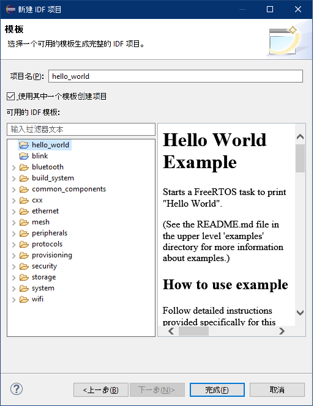

 

# ESP-IDF Eclipse 插件
ESP-IDF Eclipse 插件可便利开发人员在 Eclipse 开发环境中开发基于 ESP32 的 IoT 应用程序。本插件集成了编辑、编译、烧录和调试等基础功能，还有安装工具、SDK 配置和 CMake 编辑器等附加功能，可简化并增强开发人员在使用标准 Eclipse CDT 开发和调试 ESP32 IoT 应用程序时的开发体验。

ESP-IDF Eclipse 插件支持 `macOS`、`Window` 和 `Linux` 操作系统。

> **Note:** 本插件支持基于 `esp32`、`esp32s2`、`esp32s3` 和 `esp32c3` 开发的 ESP-IDF CMake 项目（4.x 及以上）。

快速了解 ESP-IDF 和 Eclipse 插件，请见我们在 <a href= "https://youtu.be/CbPX3q7LeBc">EclipseCon 2020</a> 中的视频介绍。

# 目录
* [安装依赖资源](#Prerequisites)  
* [安装 IDF Eclipse 插件](#GettingStarted)  
* [安装 ESP-IDF 和相关工具集](#InstallTools)  
* [创建一个新项目](#NewProjectUsingDefault) 
* [配置启动目标](#ConfigureLaunchTarget) 
* [编译项目](#BuildApplication) 
* [烧录项目](#FlashApplication) 
* [查看串口输出](#ConfigureLaunchTerminal) 
* [使用 sdkconfig 编辑器配置项目](#projectconfigure) 
* [CMake 编辑器](#cmakeproject) 
* [调试项目](#debugging) 
* [ESP-IDF 应用程序内存分析编辑器](#sizeanalysiseditor) 
* [ESP-IDF 终端](#idfterminal) 
* [配置构建环境变量](#configureEnvironmentVariables) 
* [配置核心构建工具链](#ConfigureToolchains) 
* [配置的 CMake 工具链](#ConfigureCMakeToolchain) 
* [配置烧录参数](#customizeLaunchConfig) 
* [从 Eclipse 市场安装 IDF Eclipse 插件](#installPluginsFromMarketPlace) 
* [使用本地文件安装 IDF Eclipse 插件](#installPluginsUsingLocalFile)  
* [升级 IDF Eclipse 插件](#upgradePlugins) 
* [导入一个现有的 IDF 项目](#ImportProject) 
* [导入一个现有的 Debug 启动配置](#importDebugLaunchConfig) 
* [故障排除指南](#troubleshooting) 
* [如何提交 bug](#howToRaiseBugs) 
* <a href ="https://github.com/espressif/idf-eclipse-plugin/blob/master/FAQ.md#FAQ">常见问题</a>

# 安装依赖资源

IDF Eclipse 插件的运行环境要求如下。

* **Java 11 及以上**：点击<a href= "https://www.oracle.com/technetwork/java/javase/downloads/index.html">这里</a>下载并安装 Java SE
* **Python 3.5 及以上**：点击<a href="https://www.python.org/downloads/">这里</a>下载并安装 Python 
* **Eclipse 2020-12 CDT 及以上**：点击<a href= "https://www.eclipse.org/downloads/packages/release/2020-12/r/eclipse-ide-cc-developers">这里</a>下载并安装 Eclipse CDT 安装包 
* **Git**：点击<a href ="https://git-scm.com/downloads">这里</a>获得最新 Git 
* **ESP-IDF 4.0 及以上**：点击<a href ="https://github.com/espressif/esp-idf/releases">这里</a>克隆 ESP-IDF 仓库

> **Note:** 请确保系统环境 `PATH` 可以访问 Java、Python 和 Git。

此外，您也可以前往我们的 <a href="https://github.com/espressif/idf-installer#esp-idf-tools-installer-for-windows"> ESP-IDF 工具集安装器</a>页面，获得一站式安装体检。

# 使用更新站点 URL 安装插件

您可以使用`更新站点 URL` 将 ESP-IDF Eclipse 插件安装至您的 Eclipse CDT 环境中，具体步骤见下：

1. 前往`帮助`>`安装新软件`
1. 点击`添加…`，并在弹出的对话窗中：
	* 输入`名称`为 `乐鑫 ESP-IDF Eclipse 插件`
	* 输入`仓库位置`为：
		* 稳定版本：https://dl.espressif.com/dl/idf-eclipse-plugin/updates/latest/
		* 测试版：https://dl.espressif.com/dl/idf-eclipse-plugin/updates/beta/
	* 点击`添加`
1. 从列表中选择`Espressif IDF`，并按照提示完成所有安装步骤。 

> **Note:** 本文档中的所有截图均来自 `macOS` 操作系统，但安装步骤同时适用于 `Windows`、`Linux` 和 `macOS` 操作系统。

# 安装 ESP-IDF

通过 Eclipse 直接安装 ESP-IDF：

1. 前往`帮助`>`下载并配置 ESP-IDF`。
1. 在`下载 ESP-IDF`部分，选择需要下载的 ESP-IDF 版本和保存路径。
1. 点击`完成`。

使用现有的本地 ESP-IDF：

1. 前往`帮助`>`下载并配置 ESP-IDF`。
1. 勾选`使用文件系统中现有的 ESP-IDF 目录`。
1. 选择一个文件系统中现有的 ESP-IDF 目录。
1. 点击`完成`。

本操作将下载指定的 ESP-IDF 版本，并配置 Eclipse CDT 构建环境变量中的 `IDF_PATH`。

# 安装 ESP-IDF 工具集
ESP-IDF 在构建固件时需要一些工具，包括 Python、Git、交叉编译器、menuconfig 工具、CMake 和 Ninja 构建工具等。

具体可按照以下步骤，安装 ESP-IDF 工具集。

1. 前往`帮助`>`ESP-IDF 工具管理器`>`安装工具`。
1. 输入 `ESP-IDF 目录`的所在路径。
1. 输入 `Git` 和 `Python` 可执行文件的位置（如未能自动检测填充）。
1. 点击`安装工具`，并按照提示完成所有安装步骤。如需了解安装详情，请查看`控制台`。
1. 本操作需要下载并安装 `xtensa-esp32-elf`、`esp32ulp-elf`、CMake、`openocd-esp32` 和 Ninja 等工具集。因此，如果您是首次进行本操作，则可能需要等待较长时间。

> **Note:** 本步骤将按照 `idf_tools.py export` 命令，将 `IDF_PATH`、`PATH`、`OPENOCD_SCRIPTS` 和 `IDF_PYTHON_ENV_PATH` 设置为 Eclipse CDT 构建环境。因此，即使您以前已安装过上述工具，也不可跳过该步骤。

ESP-IDF 目录选择对话框：

# 创建一个新项目
1. 请首先确保您处于`C/C++ 视图`之下。
1. 前往`文件`>`新建`>`乐鑫 IDF 项目`（如果您未看到该选项，请前往`窗口`>`视图`>`重置视图...`）。
1. 输入`项目名称`。
1. 点击`完成`。

> **Note:** 完成以上操作后，您将在编辑器中看到许多未解决的 include 错误。这些错误仅在构建后才能解决。

## 使用 ESP-IDF 模板创建一个新项目
1. 请首先确保您处于`C/C++ 视图`之下。
1. 前往`文件`>`新建`>`乐鑫 IDF 项目`（如果您未找到该选项，请前往`窗口`>`视图`>`重置视图...`）。
1. 输入`项目名称`。
1. 点击`下一步`。
1. 勾选`使用其中一个模板创建项目`。
1. 从目录中选择一个模板。
1. 点击`完成`。

> **Note:** 完成以上操作后，您将在编辑器中看到许多未解决的 include 错误。这些错误仅在构建完成后才能解决。

# 配置启动目标
接下来，我们需要告诉 CDT 应在项目中使用我们的工具链，确保所有的头文件均可索引和使用。本步骤需在`启动栏`完成。注意，`启动栏`位于工具栏的最左边，仅在`项目管理器`中存在项目时出现。

1. 点击顶部工具栏中左起第三个下拉窗口`启动目标`。
1. 选择`新的启动目标`。
1. 选择`ESP 目标`。
1. 提供目标属性，即您希望启动应用程序的位置。输入目标`名称`，并选择您连接 ESP 设备的`串口`。

# 编译项目
1. 从`项目浏览器`中选择一个项目。
1. 点击顶部工具栏中左起第一个下拉窗口`启动模式`，选择`运行`。
1. 点击顶部工具栏中左起第二个下拉窗口`启动配置`，选择您的应用程序（自动检测）。
1. 点击顶部工具栏中左起第三个下拉窗口`启动目标`，选择您需要启动的目标。
1. 现在，点击顶部工具栏左上角的`构建`按钮。

# 烧录项目
ESP-IDF 的 `idf.py` 工具可以打包 `make flash` 命令和常用指令。用户只需点击`启动`按钮（顶部工具栏左起第二个按钮）即可启动烧录操作，即使用默认的烧录命令 `idf.py -p PORT flash` 烧录应用程序。

如需使用自定义烧录参数，请前往 [这里](#customizeLaunchConfig) 获取详细步骤。

# 查看串口输出
为了查看 Eclipse 的串口输出，我们需要在`ESP-IDF 串口监视器`中配置需要监测的串口。本功能已经集成至`IDF 监视器`。更多详情，请见 <a href="https://docs.espressif.com/projects/esp-idf/zh_CN/latest/esp32/api-guides/tools/idf-monitor.html">这里</a>。 

1. 点击工具栏中的`打开终端`图标。
1. 从终端下拉菜单中选择`ESP-IDF 串口监视器`。
1. 手动选择开发板连接的`串口`（如未能自动检测）。
1. 配置`串口监视器`过滤器，对串口输出进行过滤。
1. 点击 `OK` 启动终端，开始监听 USB 端口。

# 编译项目
ESP-IDF Eclipse 插件允许用户直接在 Eclipse 环境中配置 `sdkconfig`。

## SDK 配置编辑器
项目配置保存在项目根目录下的 `sdkconfig` 配置文件中，用户可通过`SDK 配置编辑器`进行修改。

启动`SDK 配置编辑器`：

1. 前往 `sdkconfig` 文件
1. 双击文件，启动 SDK 配置编辑器
1. 完成更改后，可使用 `Ctrl+S` 或 `Command+S` 保存更改。也可以点击 Eclipse 工具栏中的`保存`按钮进行保存。
1. 如需撤回对 sdkconfig 编辑器的更改，用户可选择不保存退出编辑器；也可右键 `sdkconfig` 文件并选择`加载 sdkconfig`菜单选项，恢复对编辑器的修改。

# CMake 编辑器
ESP-IDF Eclipse 插件中还集成了一个 CMake 编辑器，允许用户编辑 CMakeList.txt 等 CMake 文件，支持语法高亮、CMake 命令助手、代码模板等功能。

如需配置 CMake 编辑器，请前往 Eclipse 的`偏好设置` > `CMakeEd`。

# 调试项目
## GDB 硬件调试
请见 <a href ="https://docs.espressif.com/projects/esp-idf/zh_CN/latest/esp32/api-guides/jtag-debugging/index.html" >GDB 硬件调试指南</a>。

## GDB OpenOCD 调试
请见 <a href="https://github.com/espressif/idf-eclipse-plugin/tree/master/docs/OpenOCD%20Debugging.md">GDB OpenOCD 调试</a>。

#  ESP-IDF 应用程序内存分析
内存分析编辑器可分析应用程序的静态内存使用情况：概述和详情。`概述`选项卡可简要提供应用程序的内存使用情况；`详情`选项卡可详细介绍应用程序中各组件和各符号文件的内存使用情况。

其中，`详情`选项卡还支持搜索和排序功能。

启动`应用程序内存分析编辑器`：

1. 右键点击项目
1. 选择`ESP-IDF：应用程序内存分析`菜单，启动编辑器

**应用程序内存分析 - 概述**

**应用程序内存分析 - 详情**

# ESP-IDF 终端
`ESP-IDF 终端`可为用户在 Eclipse 环境中启动一个本地终端窗口。用户可通过`偏好设置`>`C/C++`>`构建`>`环境`配置所有环境变量。本终端窗口的默认工作目录为当前选定的项目或 `IDF_PATH`（如未选定项目）。 

终端 PATH 还将同时配置 `esptool`、`espcoredump`、`partition_table` 和 `app_update` 组件路径，允许用户从 ESP-IDF 终端直接进行访问。

启动 `ESP-IDF 终端`：

1. 点击工具栏中的`打开终端`图标。
1. 从终端下拉菜单中选择`ESP-IDF 终端`，并点击`OK`启动终端。

# 配置环境变量
如您的 IDF 工具是通过`帮助`>`ESP-IDF 工具管理器`>`安装工具`菜单选项安装的，则 Eclipse 将帮您自动填充`偏好设置`>`C/C++ 构建`>`环境`配置所需的环境变量，具体包括：

* IDF_PATH
* PATH
* OPENOCD_SCRIPTS
* IDF_PYTHON_ENV_PATH

如上述环境变量未能自动正确配置，请按照以下步骤操作。

1. 前往`C/C++ 构建`下的`环境`偏好设置页。 
1. 再次点击`添加...`，并输入`IDF_PATH`，即 ESP-IDF 的完整安装路径。
1. 按照相同步骤，配置 OPENOCD_SCRIPTS、IDF_PYTHON_ENV_PATH 和 PATH 环境变量

以下均为示例：

##### IDF_PATH #####
`/Users/user-name/esp/esp-idf`

##### OPENOCD_SCRIPTS #####
`/Users/user-name/.espressif/tools/openocd-esp32/v0.10.0-esp32-20190313/openocd-esp32/share/openocd/scripts`

##### IDF_PYTHON_ENV_PATH #####
`/Users/user-name/.espressif/python_env/idf4.0_py3.7_env`

##### PATH #####
`/Users/user-name/.espressif/tools/xtensa-esp32-elf/esp32-2019r1-8.2.0/xtensa-esp32-elf/bin:/Users/user-name/.espressif/tools/esp32ulp-elf/2.28.51.20170517/esp32ulp-elf-binutils/bin:/Users/user-name/.espressif/tools/cmake/3.13.4/CMake.app/Contents/bin:/Users/user-name/.espressif/tools/openocd-esp32/v0.10.0-esp32-20190313/openocd-esp32/bin:/Users/user-name/.espressif/tools/ninja/1.9.0/:/Users/user-name/.espressif/python_env/idf4.0_py3.7_env/bin:/Users/user-name/esp/esp-idf/tools:$PATH`

在上述路径中，最后一段`$PATH`需要根据您的操作系统，替换为相应的系统环境路径。

获得系统环境路径：

- macOS：`$echo $PATH ` 
- Windows：`$echo %PATH%`

# 配置工具链
我们需要告诉 Eclipse CDT 在构建项目时需要使用什么核心构建工具链和 CMake 工具链。如您的 IDF 工具是通过`帮助`>`ESP-IDF 工具管理器`>`安装工具`菜单选项安装的，则 Eclipse 可自动检测到需要使用的工具链。

如未能自动检测所需工具链，请按照以下步骤操作。

#  配置核心构建工具链

1. 打开 Eclipse `偏好设置`。
1. 前往`C/C++`>`核心构建工具链`偏好设置页。
1. 选中用户定义工具链，点击`添加...`。
1. 选择 `GCC` 为工具链类型。
1. 点击`下一步`。
1. 提供 GCC 工具链设置：
	**编译器：** /Users/user-name/esp/xtensa-esp32-elf/bin/xtensa-esp32-elf-gcc,
	**操作系统：** esp32,
	**CPU 架构：** xtensa

#  配置 CMake 工具链
现在，我们需要告诉 CDT 在构建项目时需要使用哪种工具链。这可以在生成 Ninja 文件时将所需的参数传递给 CMake。

1. 前往`C/C++`>`CMake`偏好设置页
1. 点击`添加...`，启动新的 CMake 工具链配置对话框
1. 浏览 CMake 工具链 `Path`。示例：`/Users/user-name/esp/esp-idf/tools/cmake/toolchain-esp32.cmake`
1. 从下拉列表中选择`GCC Xtensa 工具链`编译器。示例：`esp32 xtensa /Users/user-name/esp/xtensa-esp32-elf/bin/xtensa-esp32-elf-gcc`

> **Note:** Eclipse CDT 在保存工具链偏好设置时有一个已知 bug。因此，我们建议在进行后续操作前，重新启动 Eclipse。

# 启动配置
如需使用自定义启动配置和烧录参数，请按照以下步骤操作。

1. 点击`启动配置`编辑按钮。
1. 切换至`主选项卡`。
1. 指定应用程序的运行 `位置`。由于 `idf.py` 是一个 Python 文件，因此还将配置 Python 系统路径。示例：`${system_path:python}`
1. 指定应用程序的`工作目录`。示例：`${workspace_loc:/hello_world}`
1. 在其他`参数`编辑框，新增一条将在指定工作目录下运行的烧录命令。
1. 烧录命令示例：`/Users/user-name/esp/esp-idf/tools/idf.py -p /dev/cu.SLAB_USBtoUART flash`
1. 点击 `OK`，保存设置。
1. 点击`启动`图标，将应用程序烧录到选定的开发板中。

# 故障排除 

## 错误日志
`错误日志`视图可以显示插件记录的所有警告和错误，其底层日志文件 (.log 文件) 保存在工作空间的 .metadata 子目录下。 

打开`错误日志`视图，请前往`窗口`>`显示视图`>`错误日志`。

保存当前日志内容至本地文件，请从工具栏中点击`导出日志`按钮或右键选择`导出日志...`。此后，输入文件名即可保存日志至本地文件。

注意，在提交问题时一定要提供错误日志。

## 控制台视图日志
`控制台`视图可显示与当前运行或构建有关的所有警告和错误。

打开`控制台`视图，请前往`窗口`>`显示视图`>`控制台`。 

## CDT 全局构建日志
打开 CDT 全局构建日志，请前往`偏好设置`>`C/C++`>`构建`>`日志`

## 乐鑫 IDF 工具集控制台
`乐鑫 IDF 工具控制台`为`控制台`视图的组成部分，通常仅在通过 Eclipse 安装 IDF 工具集时使用。 

如您在通过`帮助`>`ESP-IDF 工具管理器`>`安装工具`方式安装 IDF 工具集时出现任何问题，即可使用本控制台查看错误报告。

如本控制台未自动启动，请前往`中控台`视图，点击`显示选中的中控台`按钮。

# 从 Eclipse 市场安装 IDF Eclipse 插件

从 Eclipse 市场安装 IDF Eclipse 插件，请按照以下步骤操作。

1. 打开 Eclipse，前往`帮助`>`Eclipse 市场...`。
1. 在搜索框中输入 `ESP-IDF Eclipse Plugin`，并点击`Go`。
1. 点击`安装`，并按照提示完成所有安装步骤。
1. 重启 Eclipse。

#  从本地文件安装 IDF Eclipse 插件

1. 下载最新版 ESP-IDF Eclipse 插件：https://github.com/espressif/idf-eclipse-plugin/releases
1. 打开 Eclipse，前往`帮助`>`安装新软件`。
1. 点击`添加`按钮。
1. 在`添加`仓库对话框中选择`存档`> `com.espressif.idf.update-vxxxxxxx.zip` 文件。
1. 点击`添加`
1. 从列表中选择`Espressif IDF`，并按照提示完成所有安装步骤。 
1. 重启 Eclipse。

#  如何升级我的 IDF Eclipse 插件？

如您是首次在 Eclipse 软件中安装 IDF 插件，则首先需要按照以下步骤`添加`最新插件地址：

1. 前往`窗口`>`偏好设置`>`安装/更新`>`可用软件站点`。
1. 点击`添加`。
1. 输入最新仓库的地址：https://dl.espressif.com/dl/idf-eclipse-plugin/updates/latest/
1. 点击 `OK`。

如果您已经使用最新仓库的 URL 安装了 IDF Eclipse 插件，则可以按照以下步骤获取更新。

1. 前往`帮助`>`检查更新`
1. 如有新的更新，请选择`乐鑫 IDF 插件`，并取消勾选所有其他项目
1. 点击`下一步`，并按照提示完成所有安装步骤。

#  导入一个现有的 IDF 项目

1. 请首先确保您处于`C/C++ 视图`之下。
1. 右键点击`项目资源管理器`。
1. 选择`导入...`菜单
1. 前往`乐鑫导入向导`菜单，选择`现有 IDF 项目`。
1. 点击`下一步`。
1. 点击`浏览...`，选择一个本地项目的位置。
1. 更改 `项目名称`（否则将使用默认名称）。
1. 点击`完成`，将选定项目作为一个 CMake 项目导入 Eclipse 工作空间。

#  导入一个现有的 Debug 启动配置
将一个现有的启动配置导入 Eclipse：

1. 前往`文件`>`导入...`。
1. 在`导入`对话框中，扩展`运行/调试`组，并选择`启动配置`
1. 点击`下一步`
1. 点击`浏览...`，选择本地文件系统中所需的位置
1. 选择包含启动文件的文件夹，然后点击`OK`。
1. 勾选所需的文件夹并启动文件
1. 如果您正在使用新的配置文件替代先前一个相同名称的配置，请选择`覆盖现有启动配置（忽略警告）`。
1. 点击`完成`。

# 如何提交 bug？
请点击此链接（https://github.com/espressif/idf-eclipse-plugin/issues）提交问题，并提供完整的环境详细信息和日志。