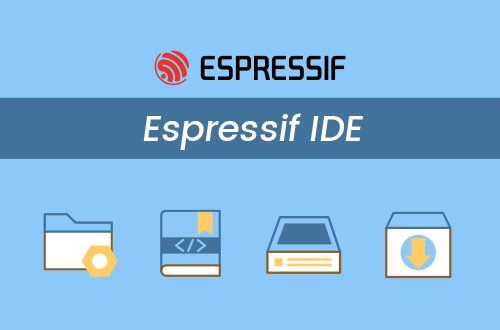

# Espressif-IDE

## Overview
Espressif-IDE is an Integrated Development Environment(IDE) based on Eclipse CDT for developing IoT Applications using the ESP-IDF framework. It's a standalone and customized IDE built specifically for ESP-IDF. Espressif-IDE comes with the IDF Eclipse plugins, essential Eclipse CDT plugins, and other third-party plugins from the Eclipse platform to support building ESP-IDF applications. 



## Features:
- Easy-to-use IDE built on Eclipse CDT environment
- Specifically built for ESP-IDF application development
- Auto-configuration of the build environment variables
- Integrated toolchain configuration
- New Project Wizards and getting started ESP-IDF examples
- Advanced editing, compiling, and editing with syntax coloring features
- Pre-built function header and function definition navigation
- ESP-IDF and ESP-IDF Tools installation and configuration directly from IDE
- SDK Configuration editor for project-specific settings 
- Integrated CMake Editor plug-in for editing CMake files such as CMakeLists.txt
- CMake based build support
- Support for UART and JTAG flashing
- Customized ESP-IDF OpenOCD Debugging with pre-built configuration and settings
- GDB Hardware debugging
- Integrated ESP-IDF serial monitor
- ESP-IDF Terminal with the pre-configured ESP-IDF build environment
- Application size analysis editor for analyzing static memory footprint of your application
- Supports Heap profiling for memory analysis and finding memory leaks
- Supports GDB Stub debugging and Application level tracing
- Supports esp32,esp32s2, esp32s3 and esp32c3 chips
- English and Chinese language support for IDE
- Extensible IDE for other third-party plugins from Eclipse eco-system
- Host operating systems supported: Windows, macOS, and Linux 

## Downloads
### Espressif-IDE v2.9.0 (Latest stable)

| OS  | Download |
| ------------- | ------------- |
| Windows  | <a href ="https://dl.espressif.com/dl/idf-eclipse-plugin/ide/Espressif-IDE-2.9.0-win32.win32.x86_64.zip">Espressif-IDE-2.9.0-win32.win32.x86_64.zip</a>  |
| macosx | <a href ="https://dl.espressif.com/dl/idf-eclipse-plugin/ide/Espressif-IDE-macosx-cocoa-x86_64-v2.9.0.dmg">Espressif-IDE-macosx-cocoa-x86_64-v2.9.0.dmg</a>  |
| macosx aarch64| <a href ="https://dl.espressif.com/dl/idf-eclipse-plugin/ide/Espressif-IDE-macosx-cocoa-aarch64-v2.9.0.dmg">Espressif-IDE-macosx-cocoa-aarch64-v2.9.0.dmg</a>  |
| linux | <a href ="https://dl.espressif.com/dl/idf-eclipse-plugin/ide/Espressif-IDE-2.9.0-linux.gtk.x86_64.tar.gz">Espressif-IDE-2.9.0-linux.gtk.x86_64.tar.gz</a>  |

### Espressif-IDE Update site
Please check the update site installation instructions from <a href="https://github.com/espressif/idf-eclipse-plugin#installing-idf-plugin-using-update-site-url">here</a>

### macOS security notice
On macOS, if you download the archive with the browser, the strict security checks on recent macOS will prevent it to run, and complain that the program is damaged. That’s obviously not true, and the fix is simple, you need to remove the `com.apple.quarantine` extended attribute.
```
$ xattr -d com.apple.quarantine ~/Downloads/Espressif-IDE-x.x.x-macosx.cocoa.x86_64.tar.gz
```
After un-archiving, if the application still complains, check/remove the attribute from the Espressif-IDE.app folder too:
```
$ xattr -dr com.apple.quarantine ~/Downloads/Espressif-IDE.app
```
### Espressif-IDE Installer for Windows
Espressif-IDE Installer (All-in-one) is an offline installer and it comes with all the required components to work with the ESP-IDF Application development.

The installer deploys the following components:
- Embedded Python
- Cross-compilers
- OpenOCD
- CMake and Ninja build tools
- ESP-IDF
- Espressif-IDE
- Amazon Corretto OpenJDK

As Installer bundles, all the required components and tools including stable esp-idf so people behind corporate firewalls can use the whole solution out-of-box. This also configures all the required build environment variables and tool paths as you launch the IDE. All you could do is to get started with your project direclty without manually configuring anything. This will give you a big boost to your productivity!

Espressif-IDE Installer for Windows can be downloaded from <a href ="https://dl.espressif.com/dl/esp-idf/">here</a>

> Note: Espressif-IDE Installer is available only for Windows.
