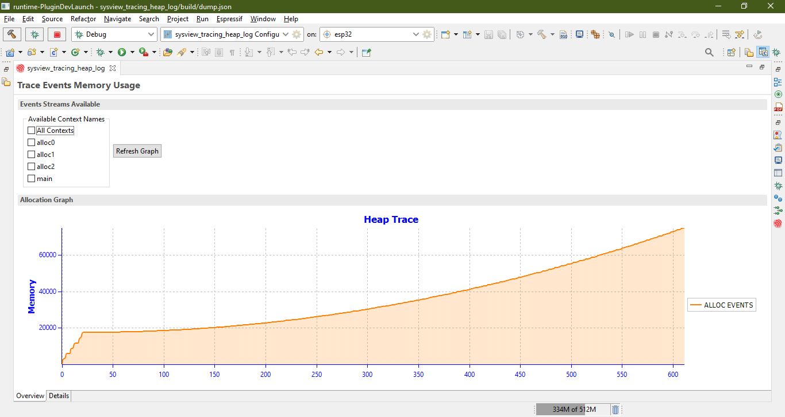

# Heap Tracing

- [Heap Tracing](#heap-tracing)
  - [Generating Dump File](#generating-dump-file)
  - [Analyzing the Dump File](#analyzing-the-dump-file)
    - [Overview Tab](#overview-tab)
    - [Details Tab](#details-tab)

To perform heap tracing, we need to generate a svdat dump file via debugging. The IDF Eclipse Plugin supports this by adding special breakpoints. To learn more about the configuration at the sdk level and different tracing features please use the following [link](https://docs.espressif.com/projects/esp-idf/en/latest/esp32/api-reference/system/heap_debug.html).

## Generating Dump File

For the purpose of this document, it is assumed that you know how to create the template project. To create a template project in IDE from the **system** templates named **sysview\_tracing\_heap\_log.**

1. Now open the sysview\_heap\_log.c file from the project explorer

2. Add a breakpoint at a line and right click on the breakpoint icon on the left side of the editor and select Breakpoint Properties… from the context menu.

3. The properties window will popup select Actions from the left pane and click on new.

4. You need to select the Action Type from the Action Type drop down as Heap Tracing. For the initial breakpoint we need to make sure that we select the Start Heap Trace Action. Also specify the location for the file to be saved here, it is recommended that you select a folder inside the project directory and save the file there. It is also important that you name your action to something meaningful so that you can differentiate it later from other actions. Click OK after it is done.

5. Now we have created an action that can be run when the breakpoint is hit but it still needs to be attached to the breakpoint so we can simply click on Attach button and it will be attached to the breakpoint and will be shown in the Actions for this breakpoint section.

6. Click Apply and Close.

  
Now we have created a breakpoint that has an action attached to it that will start the tracing and will generate a dump file, but we still need to stop the tracing somewhere before our program ends so that the dump file can be generated so we need another breakpoint and another action that can be used to stop the tracing. For this example, we simply add a breakpoint on line number 102 and set its properties.
  
Follow all the steps from 1 to 4 with one difference that you need to select the Stop Heap Trace checkbox from the action. Also attach the new created action if all steps are followed properly you will see the given action as shown below attached to the breakpoint.

Click apply and close.

Now that the breakpoints are added we need to create a debug configuration for our esp32 board and launch it to learn more about creating debug configuration please refer to the main Readme file.

Once you start the debug using the proper debug configuration for your board the IDE will ask you to switch to the debugger perspective and will stop on the breakpoints we can simply continue the execution of our program for the both added breakpoints. After that is done you can see that the dump file will be generated at the location you specified and if you stored the file in the project directory you can refresh the project by right clicking on it in project explorer and selecting refresh from the context menu.

Up to this point we have successfully generated a dump file but that dump file is a binary file that is of no use until we parse it and generate some meaningful information.

## Analyzing the Dump File

With IDF Eclipse Plugin you can analyze the dump files generated for a project. To analyze svdat dump file simply right click on it and from the context menu select Heap Dump Analysis.

**Note: It is important to know that for analysis to be run properly the project should have been built and contain the appropriate symbols file**

After clicking on that be patient it can take a few seconds to a couple of minutes depending upon the dump file and how big is that.

### Overview Tab

Once the dump file is parsed you will see something like this your graph can be different based on your own dump file.

The graph simply lets you know about the memory consumption over time. Initially all the contexts are collectively shown we can select any context we want form the list of available contexts that corresponds to the contexts that were found in the dump file against the heap events. For example, the below image shows two contexts selected for the graph.

### Details Tab

Further information regarding the details of the tracing can be found in the details tab. If you click on the details tab you will have something like this the data can vary depending on your dump file.

The highlighted light orange rows are the ones that can **possibly** be memory leaks. The keyword to know here is possibly because the trace could have been stopped before the free event was found.

The green highlights show the free heap events. You can also use the check box below View Possible Memory Leaks to only show the entries that are possibly causing memory leakage.

Each entry here corresponds to an event in heap we can also view the callers for them you can simply right click on any record from the table and select the option Show Callers.

Once you click on this you a `Callers View` will popup that will show the call stack for that event in the heap.

You can navigate to the exact line in the code by simply clicking on an entry and it will take you to the location of the caller in the c file.
