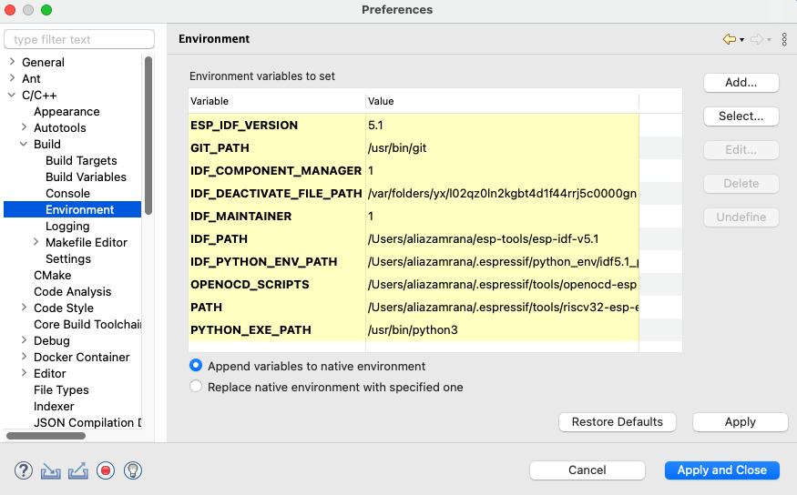
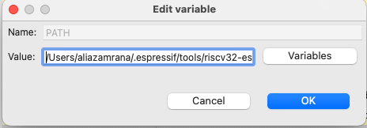
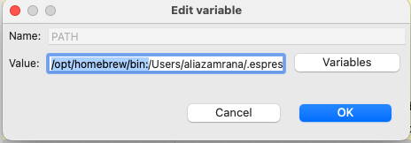

# Installing Missing Tools and Updating Path

Some tools are required as mandatory for the IDF and must be installed manually on Linux and MAC for windows the tools installation in the IDF-Eclipse Plugin takes care of them. Please vist [this](https://docs.espressif.com/projects/esp-idf/en/latest/esp32/get-started/linux-macos-setup.html) link to first install them respective to your platform.

Once you have installed the required tools you can move to the next step.
The `PATH` in the IDE is independent of the system's `PATH` variable so we need to configure it. 
 
We will be using CMake as an example but you need to make sure to follow the steps below for all the tools you have installed from the previous link.

Run the following command to find out the install location of the tools

For CMake `which cmake` This will output the path to the directory where the CMake is installed. If you dont get the path it could mean a trouble with the path in your terminal or installation please consult the documentation again for the installation and correct configuration of the PATH for your system. Your output may look something like this
 
`/opt/homebrew/bin/cmake`
 
We need to copy the path for the directory in which the CMake is present. So the path you will copy will look like this `/opt/homebrew/bin`
 

Once that is copied you can head over to the IDE.

- Open Eclipse Settings and Go to `C/C++ -> Build -> Environment`. You will see these variables if you have installed the tools.

 

- Select the `PATH` variable and click `Edit...` 

- Now paste the path that we previously copeid `/opt/homebrew/bin` at the start of the current path and place a colon `:` after that. Your original `PATH` value will always come after the path you have copied. It should look something like this.  

 

Now as stated previously this was only for cmake you need to find the install locations of the other required tools and add them in the same way to the `PATH`. After you have done that you can click `OK` and then click `Apply and Close`.

Once you have configured these correctly you should be able to build the projects.