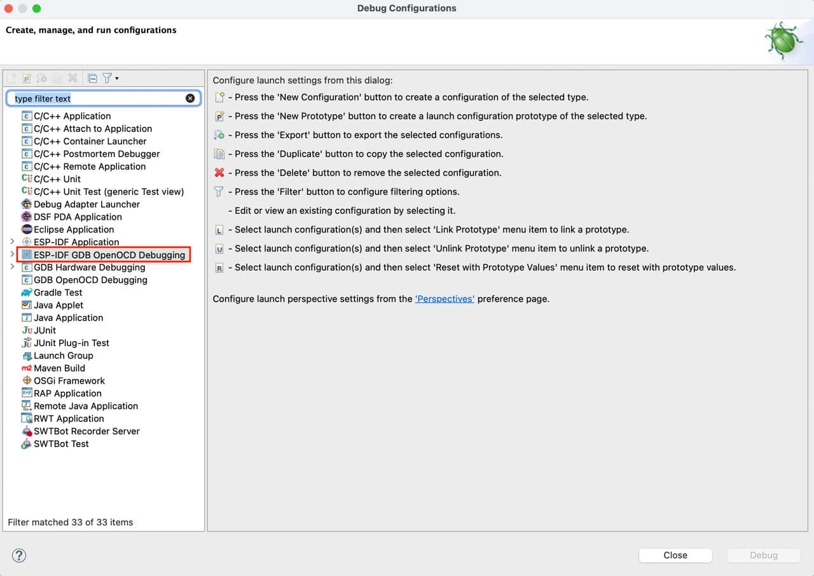
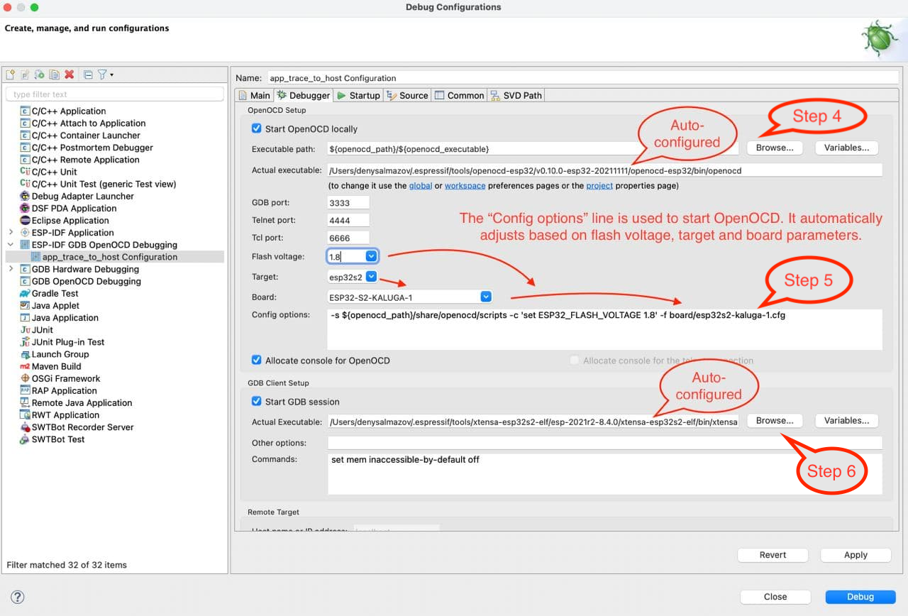
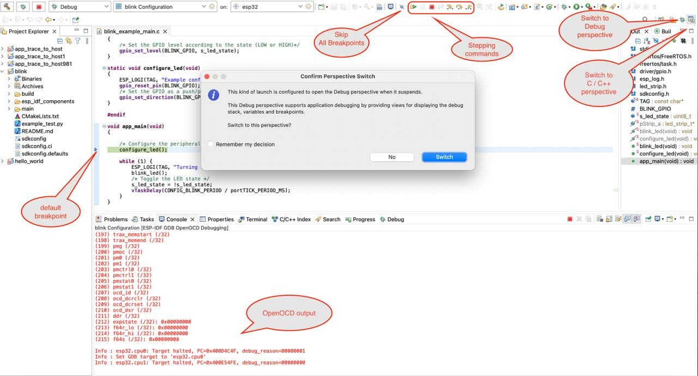

## ESP-IDF GDB OpenOCD Debugging
With ESP-IDF GDB OpenOCD Debugging, both GDB server and GDB client both will be initiated by Eclipse, so need not to initiate GDB server from the command line.

Before you get started with the GDB OpenOCD Debugging, please make sure you've already installed `Embedded C/C++ OpenOCD Debugging` plugin while updating the IDF Eclipse Plugin and your [JTAG interface is configured and connected](https://docs.espressif.com/projects/esp-idf/en/latest/esp32/api-guides/jtag-debugging/index.html#configure-and-connect-jtag-interface).

To get the latest changes of the idf eclipse plugin, please check this [here](https://github.com/espressif/idf-eclipse-plugin#GettingStarted)

# Create a new debug configuration
Please follow the below steps to create a new debug configuration.
* Right-click on the project
* `Debug As > Debug Configurations...` This will launch a debug configuration window
* On the left Panel, choose `ESP-IDF GDB OpenOCD Debugging`
* Right Click and create `New Configuration` This will create a new debug configuration for your project

Please navigate through each tab and configure project specific settings. 
> **NOTE:**  Most of the settings are auto-configured by the plugin.

The other way to create a debug configuration is from the launch configuration bar:
* Expand list with launch/debug configurations 
* Click on `New Launch Configuration...`
* Select `ESP-IDF GDB OpenOCD Debugging` and double click on it or on `Next >` button
* In the `Debugger` tab, check if the `Config options` is right for your board.
* Click on `Finish` 

## Main Tab 
1. Enter the “Name:” of this configuration, the default name is "{project_name} Configuration".
2. On the “Main” tab below, under “Project:”, press “Browse” button and select the project if it's not selected or you want to change it.
3. In the next line “C/C++ Application:” should be a relative path to the elf file, for example, "build\hello_world.elf" for `hello_world` project. If the elf file is not there, then likely this project has not been build yet. After building the project, the elf file will appear there, however, you can change it by pressing "Browse" button.

The last section on the "Main" tab is "Build (if required) before launching". If you don't want to build the project each time you are pressing the "Debug" button, click “Disable auto build”.

Points 1 - 3 are shown below.

## Debugger Tab
In the `Debugger` tab, all parameters are automatically configured to start debugging, you just need to check if the `Config options` line is appropriate for your board. It automatically adjusts based on `Flash voltage` and `Board` options. If you expand the list of boards, only those that match the selected `Target` will appear. So, for example, if the selected target is `esp32`, you will not see `ESP32-S2-KALUGA-1` in the list, to see it there, you need to change the target to `esp32s2` first. The second option in the debugger tab, which depends on the target, is the `gdb executable`, which is also automatically and dynamically configured based on the target you choose.

Let's take a look at some other options, that you need to check if they auto configured correctly for you:

4. The "Executable path" for OpenOCD is based on eclipse preferences, which are configured after tools installation. Check if the "Actual executable" is correct and if it's not, then likely the tools installation went wrong, so you need to check if tools installed correctly to avoid possible problems. If it's still not correct after tools installation, click on "Browse" and select the path to `openocd.exe` manually.
5. In the next step, please make sure that the GDB port is 3333 if you want to use an internal gdb client and the Tcl port is 6666 if you want to use [Application Level Tracing](https://github.com/espressif/idf-eclipse-plugin#application-level-tracing). Also, check `Config options` as described above.
6. In the `GDB Client Setup` section as described above, the gdb executable should be automatically and dynamically configured based on the target you choose. You can change it, by clicking "Browse" button and selecting the path to the gdb executable. By default, the "Commands" line should be `set mem inaccessible-by-default off`.

Points 4 - 6 are shown below.

> **NOTE:**  Update the OpenOCD Config options based on the esp board you've choosen. Please check this here https://docs.espressif.com/projects/esp-idf/en/latest/esp32/api-guides/jtag-debugging/tips-and-quirks.html#id1

## Startup Tab

7. By default, the binaries will be uploaded to your board before joining a debug session, so there is no need to flash them to the target separately. If for some reason you don't want to do that, you can uncheck the `Flash every time with application binaries` option. Also, you can check `Enable verbose output` option, this will enable debug level 3 - '-d3'.
8. Under “Initialization Commands”,  “Initial Reset.” and “Enable ARM semihosting” are enabled by default. Then, in entry field below,  must be the following lines:

		mon reset halt
		flushregs
		set remote hardware-watchpoint-limit 2
Points 7 - 8 are shown below.

9. Options `Load Symbols` and `Use project binary` are selected.
10. Further down on the same tab, establish an initial breakpoint to halt CPUs after they are reset by debugger. The plugin will set this breakpoint at the beginning of the function entered under “Set break point at:”. Checkout this option and enter the name of the main function e.g. app_main in provided field.
11. Checkout “Continue” option. This will make the program to resume after `mon reset halt` is invoked per point 8. The program will then stop at breakpoint inserted at app_main.

Points 9 - 11 are shown below.

## Common Tab

You can save your debug logs to an external file. To do this:
* Go-to Common tab.
* Under `Standard Input and Output` section: Select Output file checkbox, enter log file name and path where you want logs to be redirected.
* Apply changes and run your application.

 **NOTE:** Path to the file can be relative if it's located in the workspace (see screenshot below)
 
 
 
# Preferences for OpenOCD Configuration
OpenOCD path is auto-configured based on the `OPENOCD_SCRIPTS` path defined in the CDT Build environment variables.

# Start Debugging

To start debugging, you need to select your debug configuration, change mode from `Run` to `Debug` and click on launch icon (bug icon).

After stopping the target at the default breakpoint, you will be suggested to switch to the `Debug perspective`.

You can customize the `Debug perspective` in your own way, for example, move some tabs, add additional views that you might find useful, or remove them. To add a view, follow these steps:
* On the top panel of the Eclipse click on `Window`
* `Short View`
* Select the view you want to add

Any issues on OpenOCD debugging please refer to https://github.com/espressif/openocd-esp32/wiki/Troubleshooting-FAQ 
