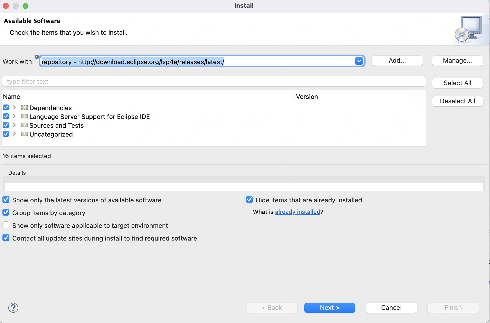
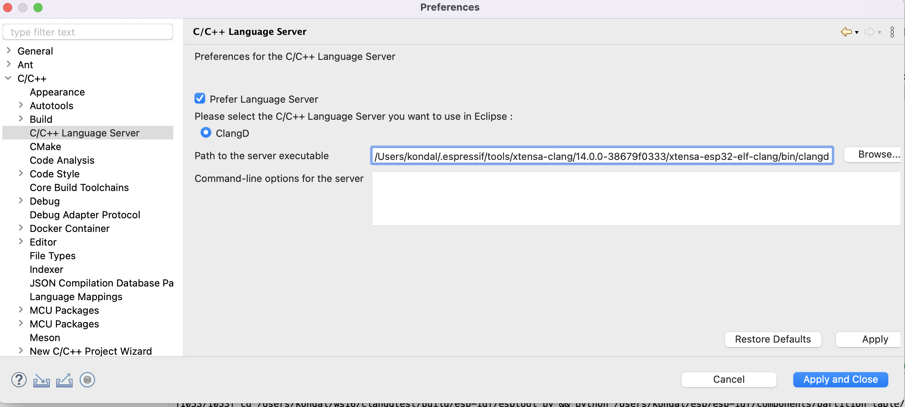
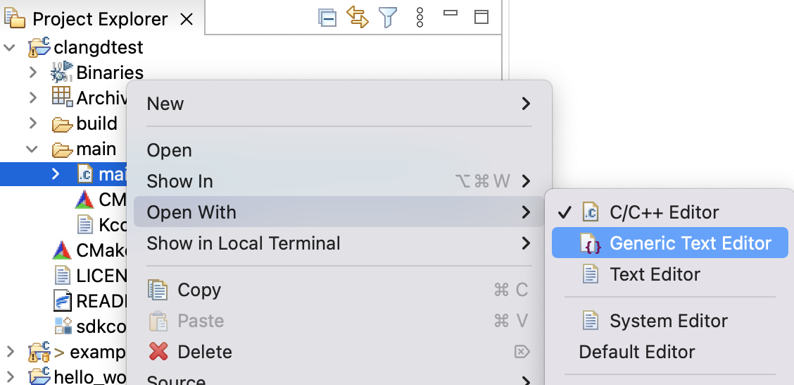
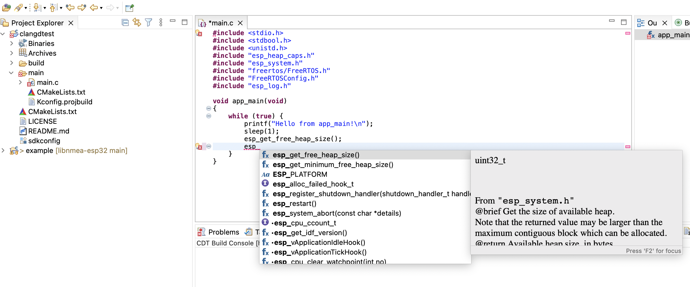
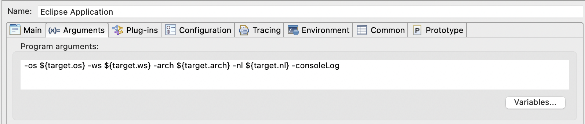
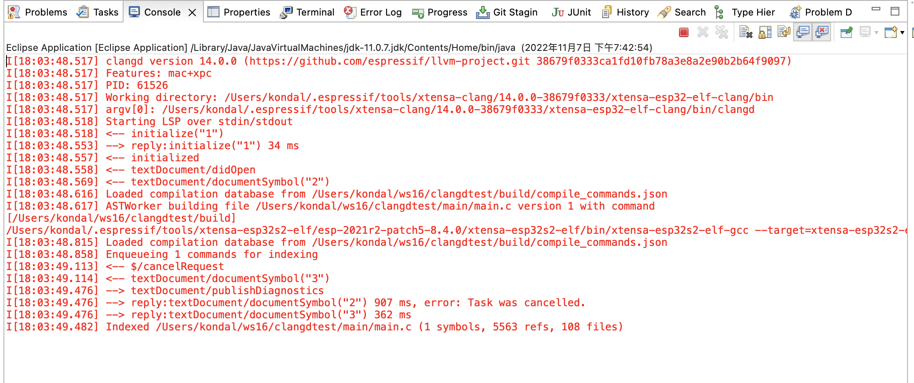

# Clangd LSP Support in Espressif-IDE (Only experimental)

Follow the below instructions to configure esp-idf Clangd LSP in Eclipse CDT or Espressif-IDE. This is an experimental feature you might not be able to see fully functional.

1. Install Eclipse LSP4E update site plugins http://download.eclipse.org/lsp4e/releases/latest/

 	

2. Configure the ClangD language server from the eclipse preferences
   - Go to Eclipse Preferences
   - Go to `C/C++` > `Build` > `C/C++ language Server`
   - Check the `Prefer Langauge Server` option
   - Browse the path to the clangd executable from the toolchain
   - Click Apply and Close
   
    

3. As this is an experimental feature you need to open the editor in `Generic Text Editor`
   - Right-click on the file
   - Choose `Open With` > `Generic Text Editor`
  
     

4. To understand your source code clangd needs `compile_commands.json`. This file provides compile commands for every source file in a project. It is usually generated by build under project build folder so make sure you build the project

5. Now your editor is configured to content proposals and resolve headers from clangd

    

## Limitations:
1. You might see error markers on the file if the project is not built with the clangd but you're using clangd for content proposals (You can't really build your esp project with clangd at the moment). For example,
- Unknown argument: '-fstrict-volatile-bitfields'
- Unknown argument: '-fno-tree-switch-conversion'
2. Header file navigation is supported but you can't jump to source code from the editor

## Troubleshooting
Launch your eclipse in the console mode by passing `-consoleLog` in the program arguments and you will be seeing a bunch of logs.

  
  

