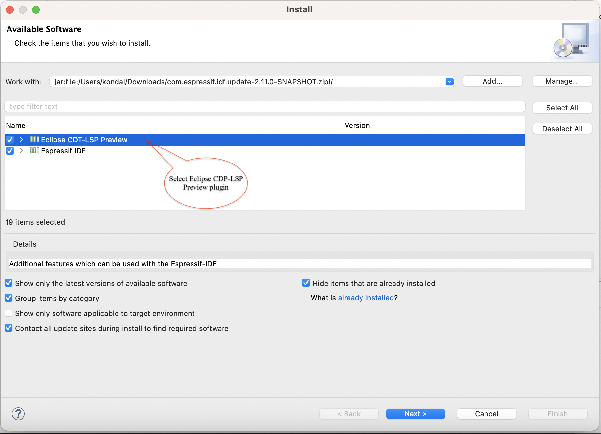
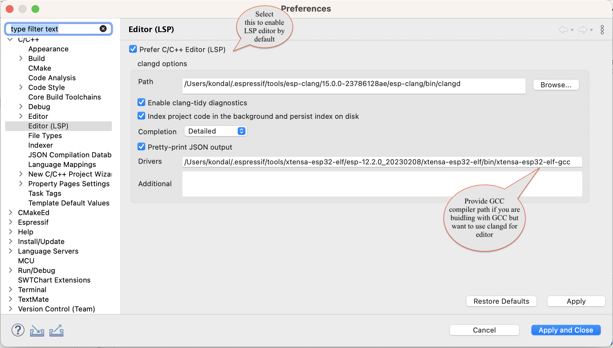
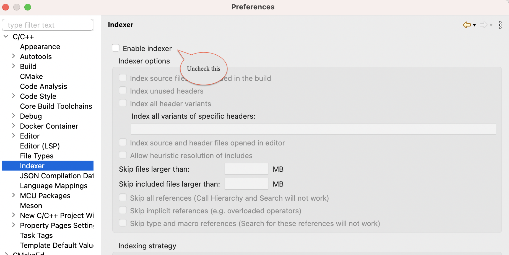
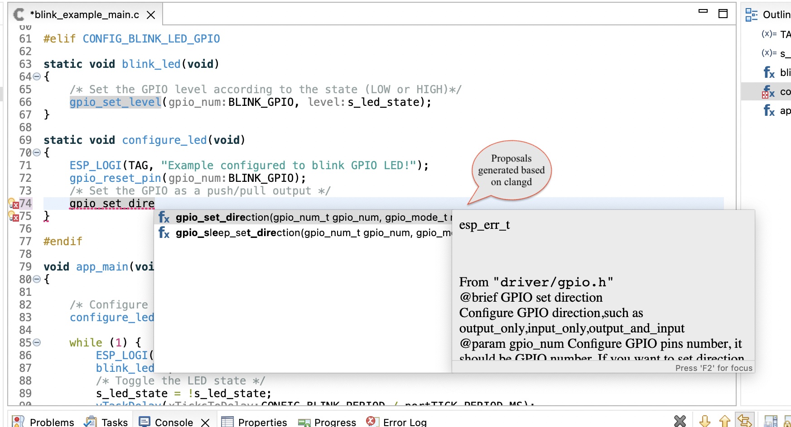

# Clangd Configuration in Espressif-IDE

Follow the below instructions to configure Clangd in Espressif-IDE.

## Prerequisites
1. Install the latest version of [Espressif-IDE](https://github.com/espressif/idf-eclipse-plugin/blob/master/docs/Espressif-IDE.md#downloads) 
2. Install the latest version of Eclipse CDT-LSP and it's dependencies using [Update Site](https://dl.espressif.com/dl/idf-eclipse-plugin/updates/latest/)

 	

## Clangd Configuration
To enable clangd in the C/C++ editor, follow the below steps.

1. Go to `Window` > `Preferences` > `C/C++` > `Editor(LSP)`
2. Enable `Prefer C/C++ Editor`
3. Provide clangd `path` and `Drivers` path as shown below.
4. Click on `Apply and Close`. This would enable the C/C++ editor with clangd support.

 	

## Disable CDT Indexer
As we are going to use clangd as the indexer and for editor features, we need to disable CDT indexer.

1. Go to `Window` > `Preferences` > `C/C++` > `Indexer`
2. Uncheck `Enable Indexer` option and then click on `Apply and Close`.
   
   
   

## Clangd Editor
1. Open any C/C++ file in the project.
2. You should see the Clangd features in the editor.

 	
3. You can also see the context help for the Clangd features.

 	

## Clangd Configuration File
To avoid the errors in the editor, you need to create a `.clangd` file at the root of the project and the below settings.

```
CompileFlags:
  Remove: [-fno-tree-switch-conversion, -fstrict-volatile-bitfields]

```

