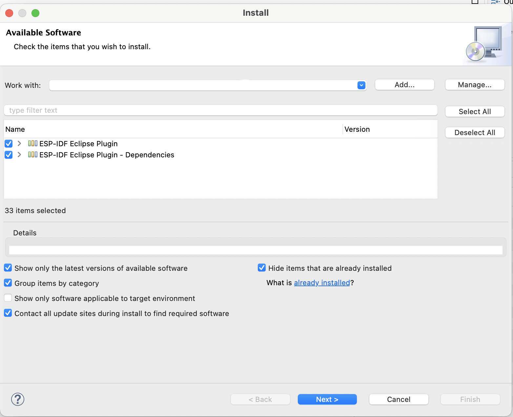
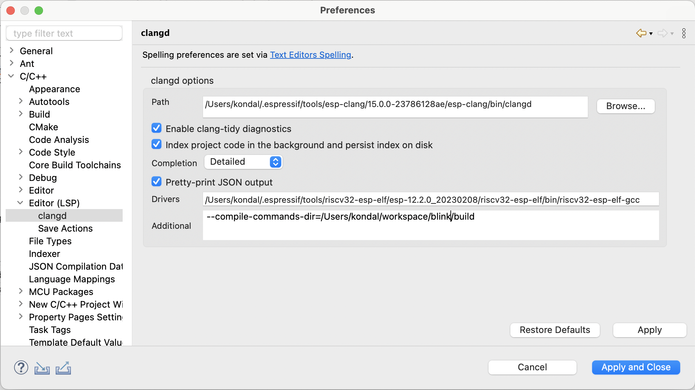
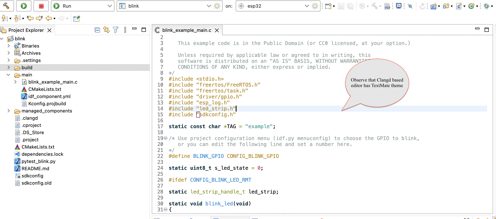

# Espressif-IDE LSP Support for C/C++ Editor.

The Espressif-IDE 3.0.0 (and higher) now includes the [Eclipse CDT-LSP](https://github.com/eclipse-cdt/cdt-lsp/), enabling support for the latest C/C++ standards and providing an LSP-based C/C++ Editor. This editor, powered by the [LLVM](https://clangd.llvm.org/) clangd C/C++ language server, offers advanced functionality for ESP-IDF developers.

In line with this enhancement, we've discontinued support for the standard CDT Editor/Indexer, as it only offers support for up to C++14. This change is significant, especially considering that ESP-IDF now utilizes C++20 (with GCC 11.2) in v5.0.x, transitioned to C++23 (with GCC 12.1) in v5.1 and C++23 with GCC 13.1 with v5.2.

The LSP powered C/C++ editor greatly benefits ESP-IDF developers by aligning with the latest language standards and compiler versions, enhancing productivity, and improving code quality.

## Prerequisites
1. Clangd is supported from [Espressif-IDE](https://github.com/espressif/idf-eclipse-plugin/blob/master/docs/Espressif-IDE.md#downloads) 3.0.0 and higher. 
2. If you are updating via the update site, you need to select the ESP-IDF Eclipse Plugin and its dependencies, as shown below:

 	

## How to use Clangd in Espressif-IDE
Espressif-IDE 3.0.0 higher offers the Clangd support. This includes default C/C++ LSP editor features and many other [features](https://github.com/eclipse-cdt/cdt-lsp/).


## Clangd Configuration
To enable clangd in the C/C++ editor, follow the below steps.

1. Go to `Window` > `Preferences` > `C/C++` > `Editor(LSP)`
2. Enable `Prefer C/C++ Editor`
3. Provide clangd `path` and `Drivers` path as shown below.
4. Click on `Apply and Close`. This would enable the C/C++ editor with clangd support.

 	

## Disable CDT Indexer
As we are going to use clangd as the indexer and for editor features, we need to disable CDT indexer.

1. Go to `Window` > `Preferences` > `C/C++` > `Indexer`
2. Uncheck `Enable Indexer` option and then click on `Apply and Close`.
   
   
   

## Clangd Editor
1. Open any C/C++ file in the project.
2. You should see the Clangd features in the editor.

 	
3. You can also see the context help for the Clangd features.

 	

## Clangd Configuration File
To avoid the errors in the editor, you need to create a `.clangd` file at the root of the project and the below settings.

```
CompileFlags:
  Remove: [-fno-tree-switch-conversion, -fstrict-volatile-bitfields]

```

