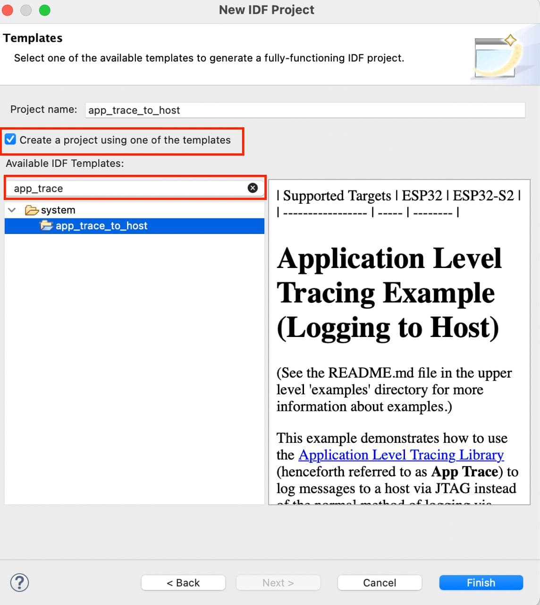
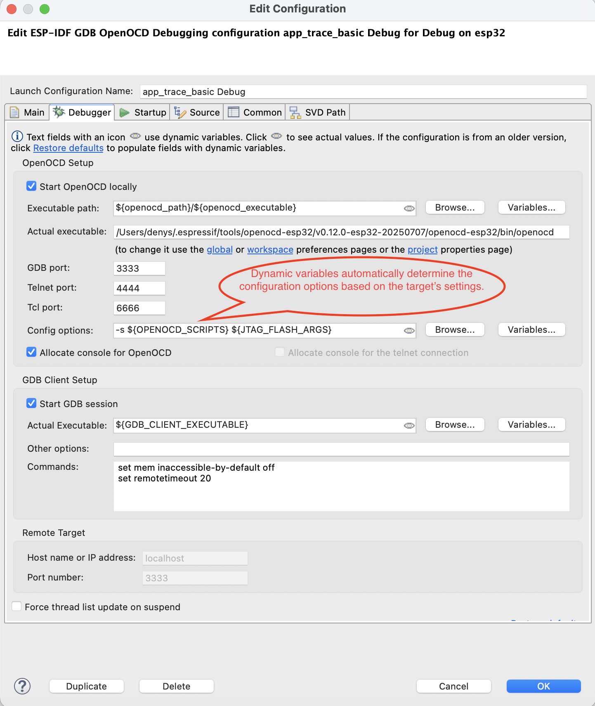
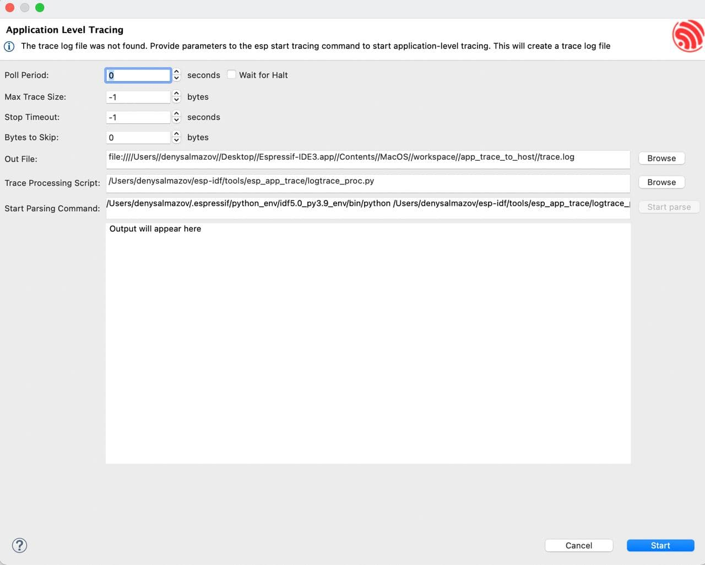
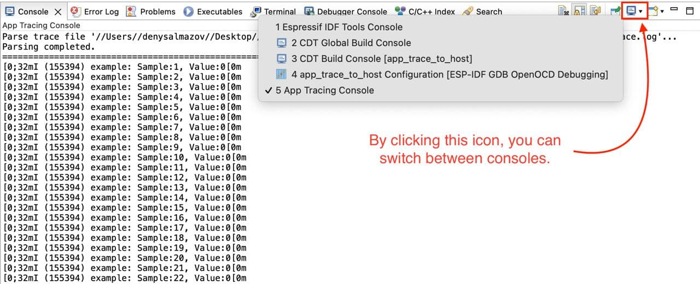

Application Level Tracing
=========================

:link_to_translation:`zh_CN:[中文]`

ESP-IDF provides a useful feature for program behavior analysis called `Application Level Tracing Library <https://docs.espressif.com/projects/esp-idf/en/latest/esp32c3/api-guides/app_trace.html?>`_. The IDF-Eclipse plugin provides a UI that allows you to start and stop tracing commands and process the received data. To get familiar with this library, you can use the `app_trace_to_host <https://github.com/espressif/esp-idf/tree/release/v5.0/examples/system/app_trace_to_host>`_ project or the `app_trace_basic <https://github.com/espressif/esp-idf/tree/release/v5.1/examples/system/app_trace_basic>`_ project (if you are using ESP-IDF 5.1 or higher). These projects can be created directly from the plugin.

Before using application-level tracing, create a debug configuration for the project where you must select the board you are using to successfully start the OpenOCD server.

After creating the debug configuration, right-click on the project in the Project Explorer and select ``ESP-IDF: Application Level Tracing``.

.. image::  ../../../media/AppLvlTracing_2.png
   :alt: Application Level Tracing option in the context menu

It may take a moment to open the application level tracing dialog, as the OpenOCD server starts first. At the top of the dialog, you will find auto-configured fields that can be adjusted if needed for the trace start command.

**Start Command:**

- Syntax: ``start <outfile> [poll_period [trace_size [stop_tmo [wait4halt [skip_size]]]]``
- Arguments:

  - ``outfile``: Path to the file where data from both CPUs will be saved, with format ``file://path/to/file``.
  - ``poll_period``: Data polling period (in ms). If greater than 0, the command runs in non-blocking mode. Default: 1 ms.
  - ``trace_size``: Maximum data size to collect (in bytes). Tracing stops after the specified amount of data is received. Default: -1 (disabled).
  - ``stop_tmo``: Idle timeout (in sec). Stops tracing if there is no data for the specified period. Default: -1 (disabled).
  - ``wait4halt``: If 0, tracing starts immediately; otherwise, waits for the target to halt before starting. Default: 0.
  - ``skip_size``: Bytes to skip at the start. Default: 0.

Additional information can be found `here <https://docs.espressif.com/projects/esp-idf/en/latest/esp32c3/api-guides/app_trace.html?>`_.

The next two fields, ``Trace Processing Script`` and ``Start Parsing Command``, are used to parse the output file.

- ``Trace Processing Script``: Path to the parsing script, which by default is ``logtrace_proc.py`` from ESP-IDF.
- ``Start Parsing Command``: Allows you to check and edit the parsing command if necessary. By default, it is configured as: ``$IDF_PATH/tools/esp_app_trace/logtrace_proc.py/path/to/trace/file/path/to/program/elf/file``.

The ``Start parse`` button is disabled until a dump file is generated. To generate the dump file, click the ``Start`` button at the bottom of the dialog box. This button changes to ``Stop`` once tracing starts, allowing you to stop tracing.

When the output file is available, click ``Start parse`` to view the parsed script output in the Eclipse console.

