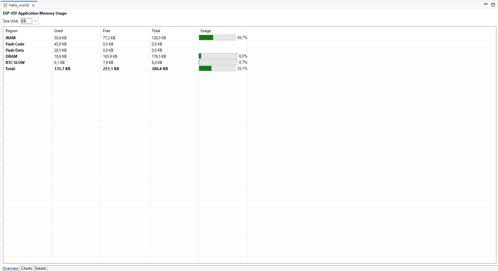
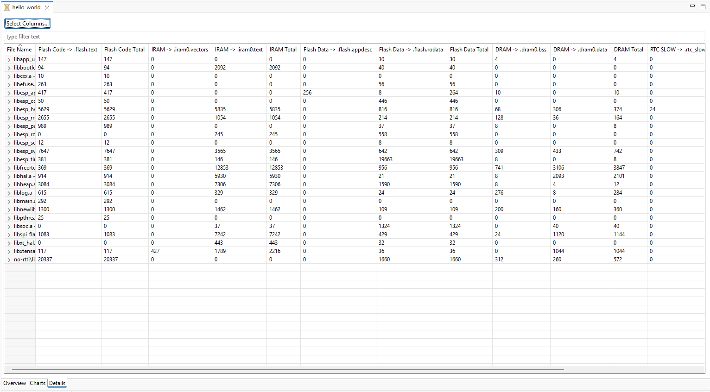

ESP-IDF Application Size Analysis
=================================

:link_to_translation:`zh_CN:[中文]`

The Application Size Analysis editor helps you examine your application's static memory usage. It has two sections:

- ``Overview``: Summarizes the application's memory usage.
- ``Details``: Shows detailed component and per-symbol memory information, with search and sort features.

To launch the Application Size Analysis editor:

#. Right-click on the project.
#. Select ``ESP-IDF: Application Size Analysis`` menu option to launch the editor.

   Application Size Analysis – Overview

   Application Size Analysis – Details
