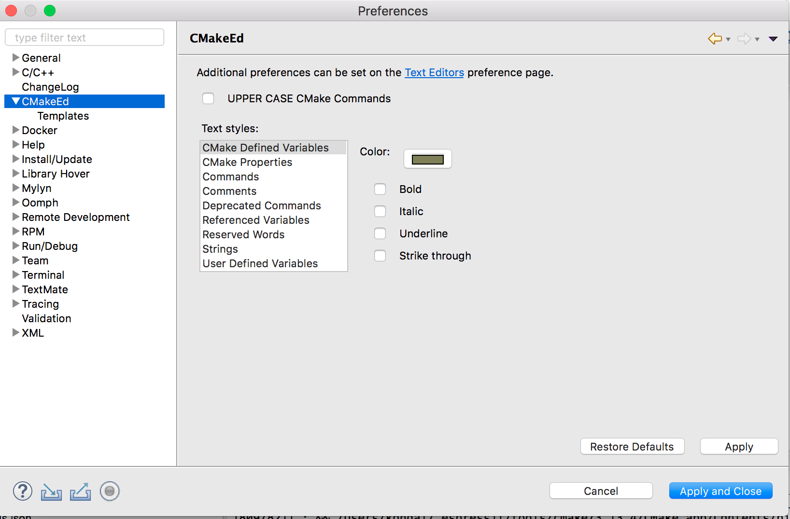

CMake Editor
============

:link_to_translation:`zh_CN:[中文]`

The CMake Editor Plugin is integrated with the IDF Plugin for editing CMake files, such as ``CMakeLists.txt``. It provides syntax coloring, CMake command auto-completion, and code templates.

.. image:: ../../../media/cmake_editor_ca.png
   :alt: CMake Editor with content assist

CMake editor preferences can be controlled using ``Eclipse`` > ``Preferences`` > ``CMakeEd``.

