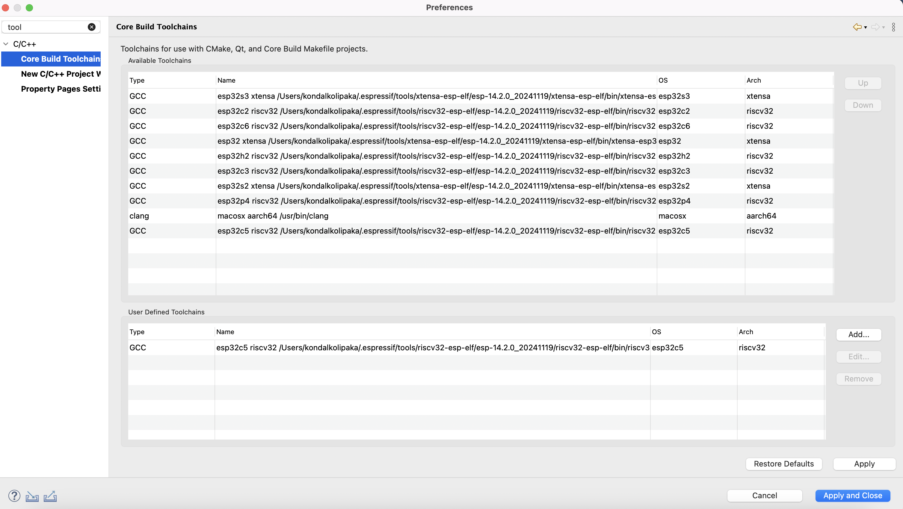
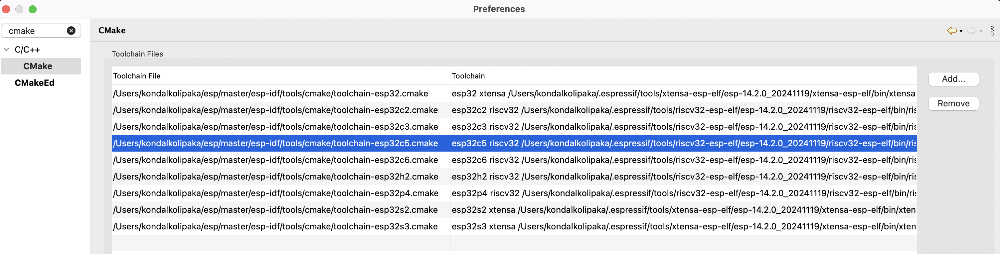
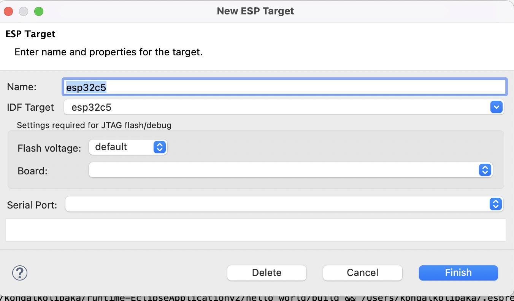
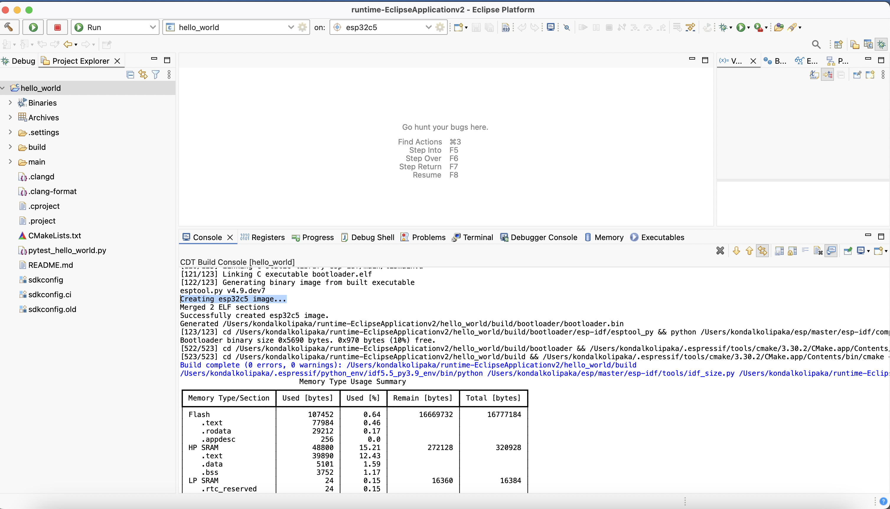

How to Add a Preview or Custom ESP-IDF Target in the IDE (Manual Configuration)
===============================================================================

To add support for any preview or custom ESP-IDF target (such as ESP32-C5 or others not listed by default in the IDE), follow these steps:

Step 1: Configure Toolchain
---------------------------
1. Go to Preferences → C/C++ → Core Build Toolchain.
2. Under User Defined Toolchain, click on Add….
3. Select GCC and configure as follows:
   - **Compiler:** (Path to the toolchain compiler for your target, e.g. `/Users/testuser/.espressif/tools/riscv32-esp-elf/esp-14.2.0_20241119/riscv32-esp-elf/bin/riscv32-esp-elf-gcc`)
   - **Operating System:** (e.g. `esp32c5` for ESP32-C5)
   - **CPU Arch:** (e.g. `riscv32` for ESP32-C5)
4. Click Finish.

*Core Build Toolchains Preferences: Adding a custom/preview target toolchain (example: ESP32-C5)*

Step 2: Configure CMake Toolchain
---------------------------------
1. Navigate to Preferences → C/C++ → CMake.
2. Click on Add….
3. Browse and select the CMake toolchain file for your target (e.g. `toolchain-esp32c5.cmake`).
4. Choose the corresponding toolchain entry created in Step 1.
5. Click Finish.

*CMake Toolchain Preferences: Adding a custom/preview target toolchain file (example: ESP32-C5)*

Step 3: Add Launch Target
-------------------------
1. From the IDE's top toolbar target list, click on New Launch Target.
2. Select ESP Target.
3. Provide the following details:
   - **Name:** (e.g. `esp32c5`)
   - **IDF Target:** (e.g. `esp32c5`)
4. Click Finish.

*New ESP Target Dialog: Creating a launch target for a custom/preview target (example: ESP32-C5)*

Step 4: Build a Project
-----------------------
- Create or open a project.
- Select your custom/preview target from the target list.
- Build the project.

*Build Output: Successfully building a project for a custom/preview target (example: ESP32-C5)*
