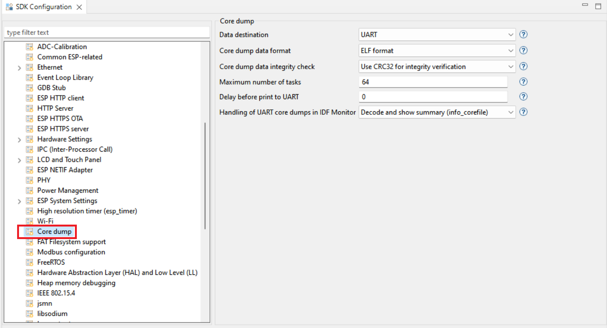

.. _coredumpdebugging:

Core Dump Debugging
===================

:link_to_translation:`zh_CN:[中文]`

The IDF-Eclipse plugin allows you to debug the core dump if any crash occurs on the chip, provided that the required configurations are set. Currently, only UART core dump capture and debugging are supported.

To enable core dump debugging for a project:

1. You need to enable it first in ``sdkconfig``. Launch the ``sdkconfig`` in the project root by double-clicking on it which will open the configuration editor.
2. Click on the ``Core Dump`` from the settings on the left and select ``Data Destination`` as ``UART``.

This enables core dump debugging. When you connect a serial monitor for the project and a crash occurs, Eclipse automatically loads the core dump and opens the debug perspective, allowing you to inspect all the information contained in the dump.

You can view the registers and stack trace, and even check the value of variables in the stack frame.

To exit the debug session: simply press the ``stop`` button.
