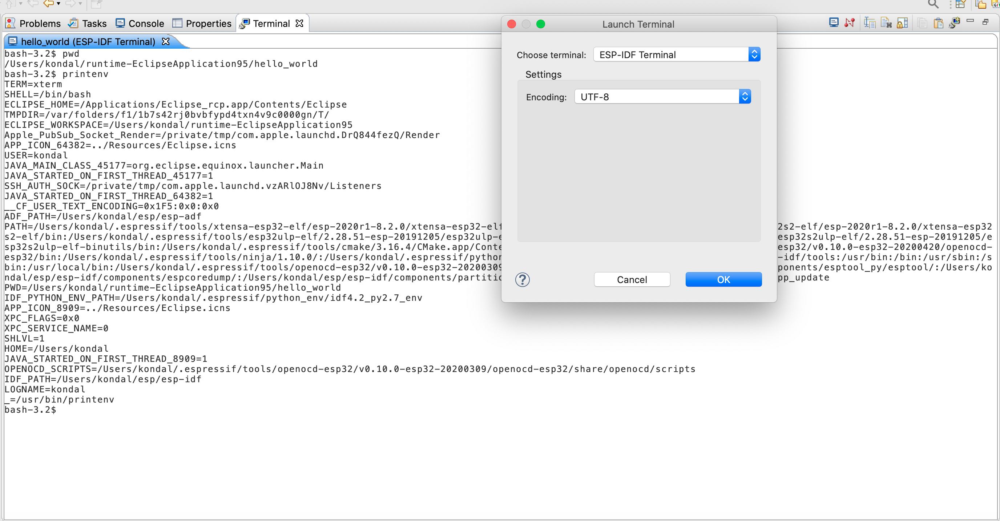

ESP-IDF Terminal
===============================

This would launch a local terminal with all the environment variables set under ``Preferences`` > ``C/C++`` > ``Build`` > ``Environment``. The default working directory would be either the currently selected project or ``IDF_PATH`` if there is no project selected.

The terminal ``PATH`` is also configured with ``esptool``, ``espcoredump``, ``partition_table``, and ``app_update`` component paths, so it is convenient to access them directly from the ESP-IDF terminal.

To launch the ESP-IDF Terminal:

- Click on the ``Open a Terminal`` icon from the toolbar.
- Choose ``ESP-IDF Terminal`` from the terminal drop-down and click ``OK`` to launch a terminal.

