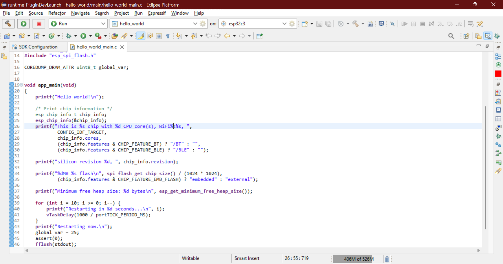

.. _gdbstubdebugging:

GDBStub Debugging
=================
You can now use the GDBStub debugging inside our Eclipse plugin to help you diagnose and debug issues on chips via Eclipse when it is in panic mode.

To enable GDBStub debugging for a project:

1. Launch the `sdkconfig` in project root by double-clicking on it which will open the configuration editor.

.. image:: ../../../media/GDBStubDebugging/sdkconfig_editor.png

2. Expand the `Component Config` section and select `ESP System Settings`. From the settings on the right for `Panic Handler behaviour` select the `GDBStub on Panic option` from the list.

.. image:: ../../../media/GDBStubDebugging/sdkconfig_editor_panic_behavior.png

Now you will be taken to the GDBStub debugger automatically when you connect the serial monitor and there is a panic for this example.

To use the GDBStub debugging for a project:

1. Create a template `hello_world` project and add the following lines in the main C file:

   .. code-block:: c

      This is a global variable 
      COREDUMP_DRAM_ATTR uint8_t global_var;

2. Now add these two lines just above the `esp_restart()` function:

   .. code-block:: c

      global_var = 25;
      assert(0);

The final file should be something like this:

Build and flash the project and launch the serial monitor. On line number 45, we are signaling for a failing assert which will put the chip in panic mode and when that line reaches, you will be prompted to switch the perspective to debug mode and the chip will be halted.

Remember that this is a panic mode and you cannot continue the execution from here, you will have to stop and restart the chip through IDF commands or simply restart the serial monitor.

.. image:: ../../../media/GDBStubDebugging/debug_panic_mode.png

You can view the registers stack trace and even view the value of variables in the stack frame.

To exit the debug session simply press the `stop` button.

