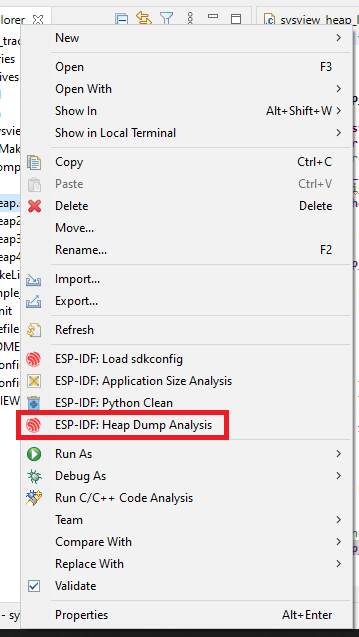
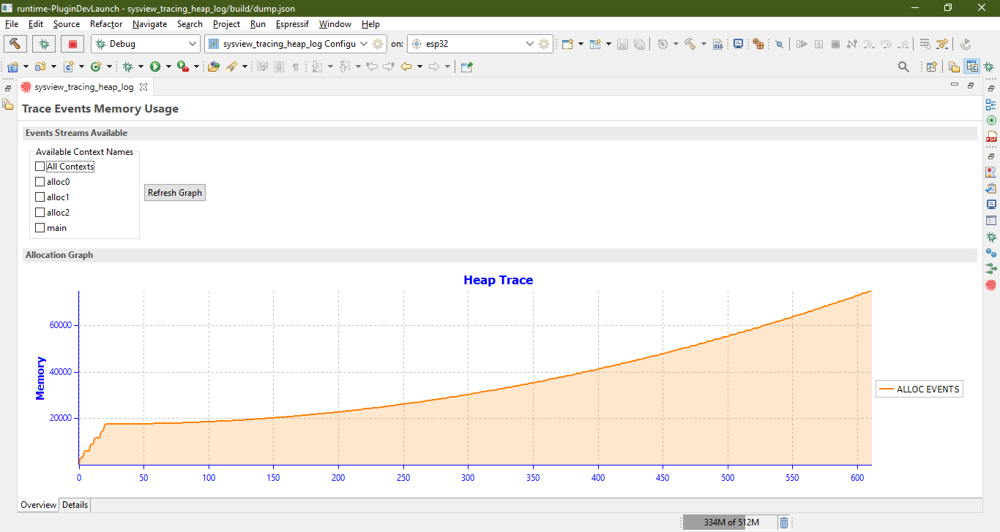
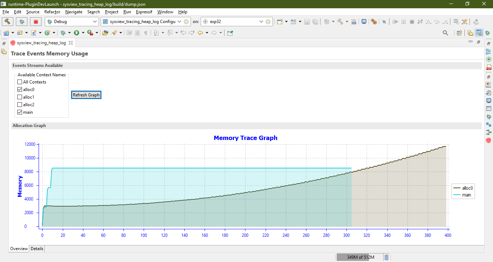
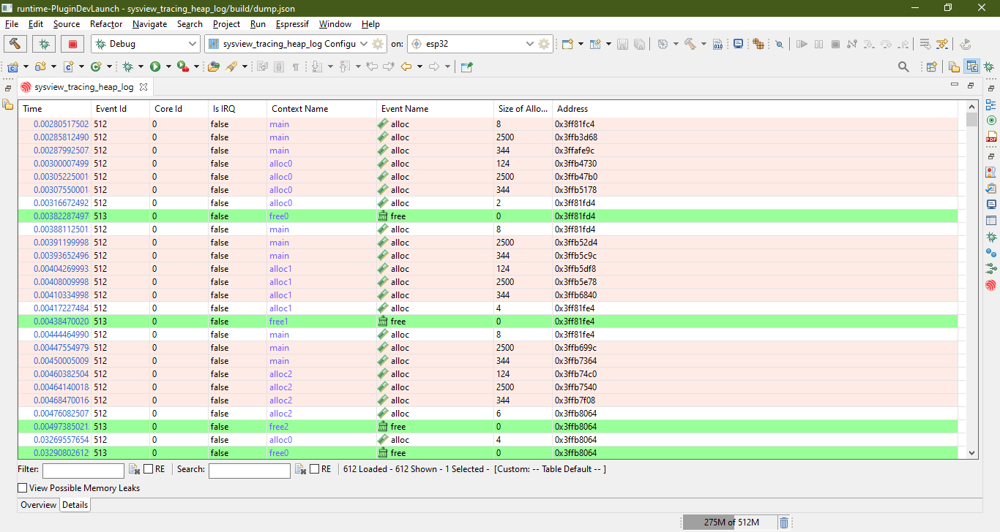
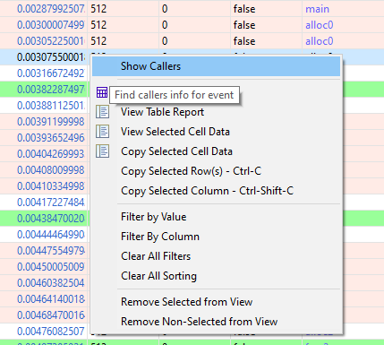
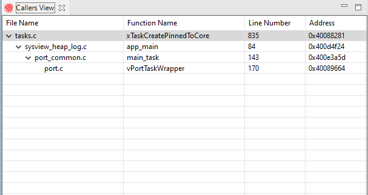

.. _heap_tracing:

Heap Tracing
============

:link_to_translation:`zh_CN:[中文]`

Heap tracing allows you to monitor memory usage over time by generating and analyzing a ``svdat`` dump file. The IDF Eclipse Plugin supports generating heap trace files by setting special breakpoints. For more information on SDK-level configuration and tracing features, refer to the official `ESP-IDF documentation <https://docs.espressif.com/projects/esp-idf/en/latest/esp32/api-reference/system/heap_debug.html>`_.

Generating Dump File
--------------------

1. **Open the sysview_heap_log.c File**
   
   From the Project Explorer, locate and open the ``sysview_heap_log.c`` file from the **system** templates project.

   .. image:: ../../../media/HeapTracing/sysview_heap_log_file.PNG
      :alt: sysview_heap_log.c file

2. **Add a Breakpoint and Configure Properties**
   
   Add a breakpoint at the desired line, then right-click on the breakpoint icon in the editor and select ``Breakpoint Properties``.

   .. image:: ../../../media/HeapTracing/breakpoint_properties_popup.png
      :alt: Breakpoint Properties

3. **Define Heap Tracing Action**

   In the ``Breakpoint Properties`` window, go to ``Actions``, click ``New``, and select ``Heap Tracing`` from the ``Action Type`` dropdown. 

   For the initial breakpoint, set the ``Action`` to ``Start Heap Trace`` and specify the save location for the dump file (it is recommended to store it in the project directory). Name the action meaningfully, then click ``OK``.

   .. image:: ../../../media/HeapTracing/heap_tracing_action.png
      :alt: Heap Tracing Action

4. **Attach the Action to the Breakpoint**

   After creating the action, click ``Attach`` to link it to the breakpoint, which will display the action under the ``Actions for this breakpoint`` section.

   .. image:: ../../../media/HeapTracing/breakpoint_properties_actions_start_attached.png
      :alt: Attach Action

5. **Apply and Create Additional Breakpoint**

   Now you have a breakpoint that will start tracing and generate a dump file. To stop the tracing, create another breakpoint (e.g., at line 102), set its properties, and choose the ``Stop Heap Trace`` option in the action settings. Attach this action to the breakpoint as shown below.

   .. image:: ../../../media/HeapTracing/breakpoint_properties_actions_stop_attached.png
      :alt: Stop Heap Trace Action

6. **Launch Debug Configuration**

   Launch the debug configuration for your ESP32 board. When a breakpoint is hit, the IDE will prompt you to switch to the debugger perspective. Continue execution at each breakpoint to start or stop tracing, then refresh the project in the Project Explorer to view the dump file at the specified location.

Analyzing the Dump File
-----------------------

The IDF Eclipse Plugin allows you to analyze generated ``svdat`` dump files. Right-click on the dump file and select ``ESP-IDF: Heap Dump Analysis`` from the context menu.

.. note::

   Ensure the project is built with the appropriate symbols file to enable analysis.

``Overview`` Tab
----------------

The ``Overview`` Tab displays memory consumption over time in a graph format. By default, all contexts are shown, but you can select specific contexts corresponding to heap events.

For example, selecting multiple contexts displays each of them separately on the graph.

``Details`` Tab
---------------

The ``Details`` Tab provides further insights by showing each event in the heap trace. Rows highlighted in light orange indicate potential memory leaks, as the trace may have ended before a corresponding free event was detected. Rows highlighted in green indicate free heap events.

To filter entries for possible memory leaks, check the ``View Possible Memory Leaks`` box. Right-clicking on any entry allows you to view its callers by opening the ``Callers View``, which displays the call stack for the heap event.

Clicking on an entry in the ``Callers View`` will navigate to the corresponding line in the source file.

