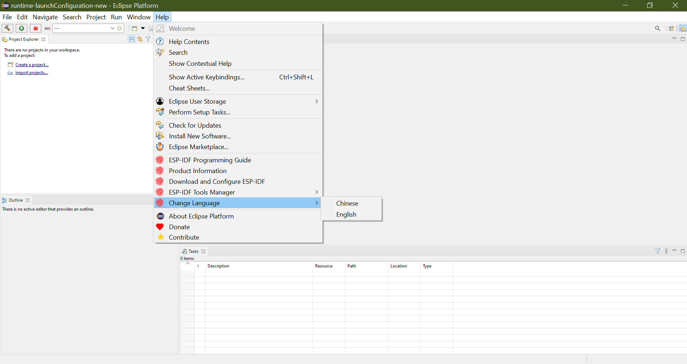

Switch Between Languages in the IDE
===================================

:link_to_translation:`zh_CN:[中文]`

Espressif IDE supports English and Chinese languages. You can switch between these languages using the following steps:

1. Click on the ``Espressif`` menu from the menu bar.
2. Select ``Change Language`` from the drop-down menu.
3. From the submenu, select the language you want.
4. The IDE will restart with the selected language.

