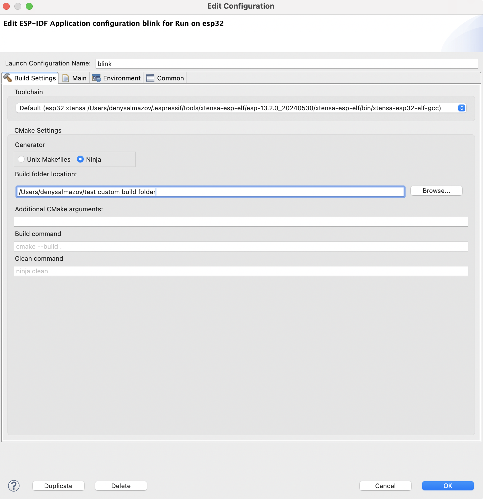

Build the Project
===============================

.. |build_icon| image:: ../../media/icons/build.png
   :height: 16px
   :align: middle

Once you have created a project and configured the esp target and serial port, you can build the project by clicking on |build_icon| in the toolbar.

However, below steps will guide you through the process of building the project if you are new to the IDE:

1. Select a project from the ``Project Explorer``.
2. Select ``Run`` from the first dropdown, which is called ``Launch Mode``.
3. Select your application from the second dropdown, which is called ``Launch Configuration`` (Auto-detected).
4. Select a target from the third dropdown, which is called ``Launch Target``.
5. Now click on the ``Build`` button |build_icon| to start the build process.

 .. image:: ../../media/9_cmake_build.png

Custom Build Directory
----------------------

The IDE allows configuring a custom build directory for the project:

1. Select a project and click on the *Edit* button for the launch configuration in the top toolbar to open the *Edit Configuration* window.
2. Navigate to the *Build Settings* tab.
3. In the *Additional CMake Arguments* section, provide a custom build directory by adding arguments `-B <custom build path>` with an absolute path. The customized build directory path can be within the project or in any other location in the file system. For example: `-B /Users/myUser/esp/generated`.
4. Click on *Ok* and build the project.

.. note::
   This configuration changes where all the project build artifacts will be generated.

References
----------
.. toctree::
    :maxdepth: 1

      Configure CDT Build Environment Variables<additionalfeatures/configureenvvariables>