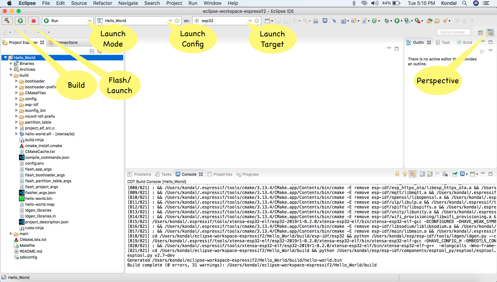
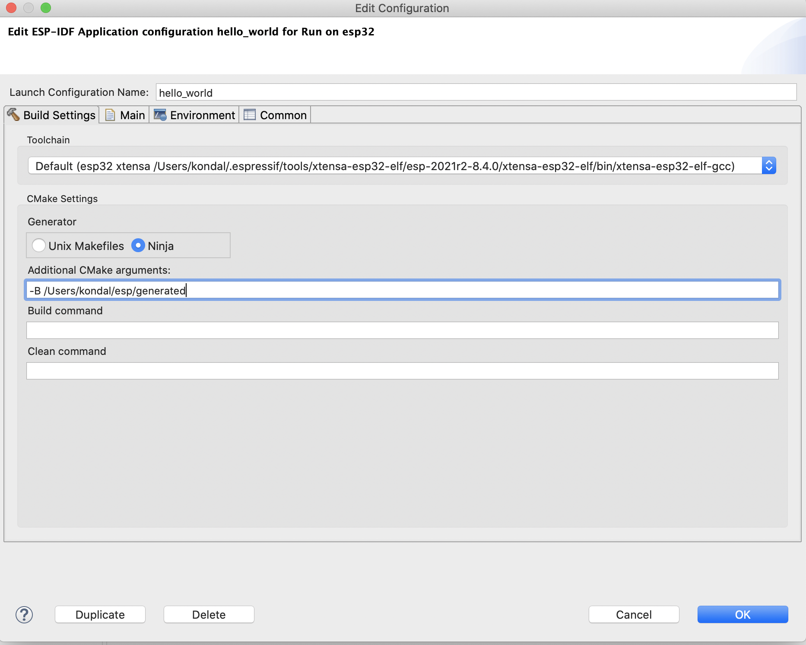

Build Your Project
==================

:link_to_translation:`zh_CN:[中文]`

Once you have created a project and configured the ESP target and serial port, you can build the project by clicking on |build_icon| in the toolbar.

However, the following steps will guide you through the process of building the project if you are new to the IDE:

1. Select a project from the ``Project Explorer``.
2. Select ``Run`` from the first dropdown, which is called **Launch Mode**.
3. Select your application from the second dropdown, which is called **Launch Configuration** (Auto-detected).
4. Select a target from the third dropdown, which is called **Launch Target**. For example, ``esp32``.
5. Now click on the ``Build`` button |build_icon| to start the build process.

Custom Build Directory
----------------------

The IDE stores ``Build folder location`` on each launch configuration. Select that configuration in the **Launch Bar** so that build, ``sdkconfig``, flash, and debug all use the same folder.

To configure a custom build directory:

1. Select a project and click on the ``Edit`` button for the launch configuration in the top toolbar to open the ``Edit Configuration`` window.
2. Navigate to the ``Build Settings`` tab.
3. In the ``Build folder location`` field, enter a path:

   - Leave the field blank to use the default folder ``project/build``.
   - A relative path is resolved under the project directory.
   - An absolute path can point to any location in the file system.

4. Click on ``Ok`` and build the project.

.. note::

    This configuration specifies the location where all the project build artifacts will be generated.  

References
----------

.. toctree::
    :maxdepth: 1

    Configure CDT Build Environment Variables <additionalfeatures/configureenvvariables>
    Add a Preview or Custom ESP-IDF Target <additionalfeatures/configuretoolchain>
