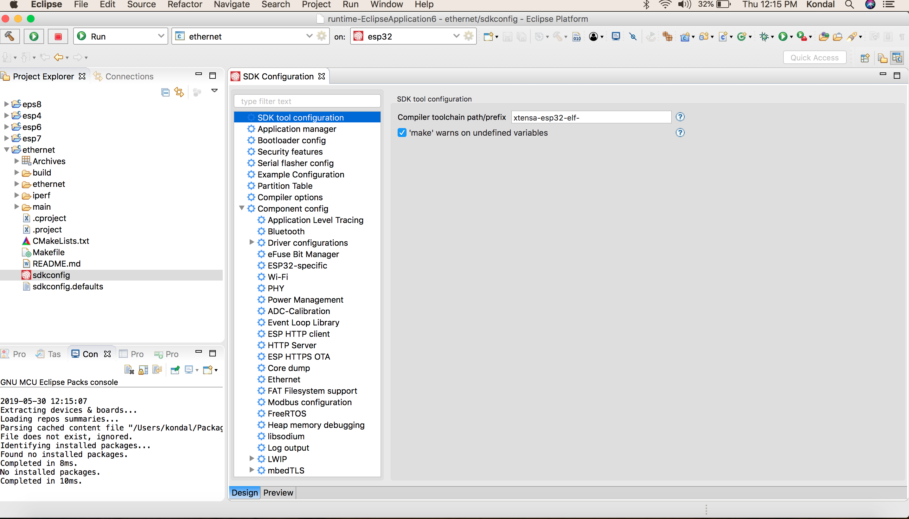

Configure Your Project
======================

:link_to_translation:`zh_CN:[中文]`

Project configuration is stored in a single file called ``sdkconfig`` located in the root directory of the project. This configuration file can be modified using the SDK Configuration Editor.

.. note::

    ``sdkconfig`` file is generated only after the build. Hence, it is recommended to build the project once before configuring the project.

To launch the SDK Configuration Editor:

#. Navigate to the ``sdkconfig`` file.
#. Double-click on the file to launch the SDK Configuration Editor.
#. Use ``Ctrl+S`` or ``Command+S`` based on your OS to save the changes. You can also use the Eclipse ``Save`` button from the toolbar.
#. To revert changes made in the SDK Configuration Editor, either close the editor without saving or right-click on the ``sdkconfig`` file and select ``Load sdkconfig`` to revert the changes from the editor.

