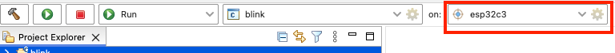

Connect Your Device
===================

:link_to_translation:`zh_CN:[中文]`

Click the gear icon to select the ESP target for your project and the serial port of your device. Skip this step if these settings were configured during project creation. By default, the launch target dropdown will display all the supported targets provided by the plugin.

Clicking the gear icon opens the ``ESP Target`` configuration dialog, where you can select the serial port for your device and specify the ESP board. The plugin will automatically detect serial ports connected to your machine.

.. image:: ../../media/8_launch_target.png

Regarding the serial ports and their patterns, please refer to the `ESP-IDF documentation <https://docs.espressif.com/projects/esp-idf/en/latest/esp32/get-started/linux-macos-setup.html#connect-your-device>`_.

Custom Target
-------------

If you need to add a target that is not available in the launch target dropdown, please follow the instructions below:

1. Click on the launch target dropdown.
2. Select ``New Launch Target``.
3. Select ``ESP Target``.
4. Specify the properties of the target device where you want to launch the application. Enter a ``Name`` for the target and select the ``Serial Port`` to which your ESP device is connected on your machine.
