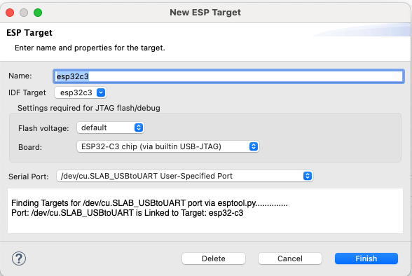

Connect Your Device
===============================
Next, select the ESP target for your project (ignore this step if it was already set during project creation) and the serial port of your device by clicking on the gear icon. By default, the launch target dropdown will display all the supported targets provided by the plugin.

.. image:: https://github.com/espressif/idf-eclipse-plugin/assets/8463287/8d85c547-5cd3-4c10-8ca2-9bb5d69b4bce

Clicking on the gear icon will open the launch configuration dialog. Here, you can select the serial port for your device.

Regarding the Serial ports and their patterns, please refer to the `ESP-IDF documentation <https://docs.espressif.com/projects/esp-idf/en/latest/esp32/get-started/linux-macos-setup.html#connect-your-device>`_.

Custom Target
----------------
If you need to add a target that is not available in the launch target dropdown, please follow the instructions below:

1. Click on the launch target dropdown.
2. Select ``New Launch Target``.
3. Select ``ESP Target``.
4. Provide properties for the target where you would like to launch the application. Enter a ``Name`` for the target and select the ``Serial Port`` to which your ESP device is connected on your machine.

 
