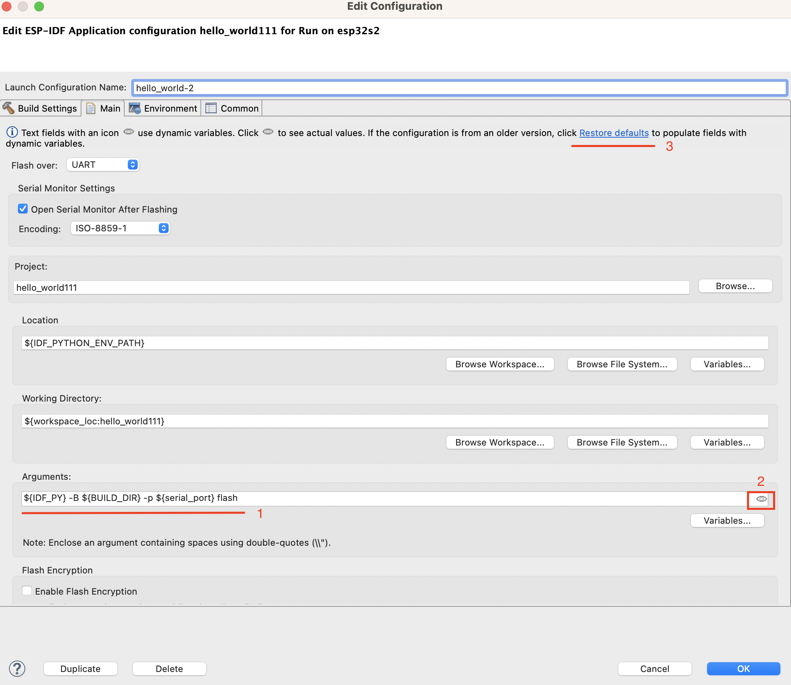

Flash onto the Device
===============================

.. |run_icon| image:: ../../media/icons/run.png
   :height: 16px
   :align: middle

Flash operation can be initiated with just a click of a launch button |run_icon| and it's auto-configured to flash the application with the default flash command, i.e., ``idf.py -p PORT flash``.

.. image:: https://github.com/espressif/idf-eclipse-plugin/assets/8463287/3249c01b-af23-4863-811f-c3959008f257
   :width: 767px
   :alt: flash

To provide customized flash arguments, please follow :ref:`this link <customizeLaunchConfig>` for further instructions.

To enable flash encryption, please see the :ref:`Flash Encryption guide <flashEncryption>`.

To configure flashing via JTAG, please refer to this :ref:`JTAG Flashing guide <JTAGFlashing>`

.. _customizeLaunchConfig:

Customize Flash Arguments
-------------------------------

To provide the customized launch configuration and flash arguments, follow the steps below:

#. Click on the ``Launch Configuration`` edit button.
#. Switch to the ``Main`` tab.
#. Specify the ``Location`` where this application has to run. Since ``idf.py`` is a Python file, configure the Python system path. Example: ``${system_path:python}``.
#. Specify the ``Working directory`` of the application. Example: ``${workspace_loc:/hello_world}``.
#. In the **Arguments** field (see **1** in the image), the default value uses **dynamic variables**:

   ``${IDF_PY} -B ${BUILD_DIR} -p ${serial_port} ${flash_command}``

   This default setup automatically adapts to your project and board, so usually no manual changes are needed.

   - Use the **Preview icon** (see **2**) to switch between showing resolved values and the raw dynamic variables.  
   - The field is **modifiable only** when dynamic variables are shown (not resolved).  
   - If you are migrating from an older plugin version and the field does not contain dynamic variables, click **Restore Defaults** (see **3**) to reset it.

#. Click **OK** to save the settings.
#. Click on the ``Launch`` icon to flash the application to the selected board.

.. image:: ../../media/12_flashing.png
   :alt: Flashing process

.. _flashEncryption:

Flash Encryption
-------------------------------

.. warning::

   Enabling flash encryption is an **irreversible operation**.  
   If configured incorrectly, the board may become permanently unusable.  
   Proceed with caution and only enable this option if you fully understand its implications.

To enable flash encryption in ESP-IDF, follow these steps:

#. Open ``sdkconfig`` and enable the ``Enable flash encryption on boot`` option.

#. Perform a normal flash of the application.
#. Open the **Launch Configuration** dialog, edit the configuration, and check the **Enable Flash Encryption** box.

#. Flash the application again.

Once enabled, flash encryption will automatically secure the contents of the flash memory according to ESP-IDF settings.

For more details, please refer to the official  
`ESP-IDF Flash Encryption documentation <https://docs.espressif.com/projects/esp-idf/en/stable/esp32/security/flash-encryption.html>`_.

.. _JTAGFlashing:

Upload Application via JTAG
-------------------------------

The default option for uploading applications is UART. To change it to JTAG, you need to edit the launch configuration for your project and select the appropriate option.
To do so, select your project in the launch configuration bar and click on the gear icon to edit the launch configuration:

Then select the ``Flash Over JTAG`` option and complete the ``OpenOCD Setup`` section.

.. image:: https://user-images.githubusercontent.com/24419842/226183857-f9d8569b-05b0-4b52-b0b2-293aac493020.png
   :width: 986px
   :alt: Flash over JTAG option

If the ``Flash Over JTAG`` option is not available and you see a message like this:

.. image:: ../../media/JtagFlash_3.png
   :alt: OpenOCD update required message

It means that OpenOCD needs to be updated. You can find the latest OpenOCD version on the `openocd-esp32 GitHub page <https://github.com/espressif/openocd-esp32/releases>`_.

Providing the Right Path for OpenOCD
~~~~~~~~~~~~~~~~~~~~~~~~~~~~~~~~~~~~

After downloading the necessary `OpenOCD version <https://github.com/espressif/openocd-esp32/releases>`_, extract it to a new folder in the `.espressif/tools/openocd-esp32/`. Follow these steps:

* Download the required `v0.10.0-esp32-20201202 <https://github.com/espressif/openocd-esp32/releases/tag/v0.10.0-esp32-20201202>`_ version or a higher one for JTAG Flashing.
* Go to `.../.espressif/tools/openocd-esp32/`, create a new folder named ``v0.10.0-esp32-20201202``, and extract OpenOCD there.
* The resulting path to OpenOCD might look like: ``.../.espressif/tools/openocd-esp32/v0.10.0-esp32-20201202/openocd-esp32/...``

After completing this, update the ``OPENOCD_SCRIPT`` environment variable in Eclipse:

* Go to ``Eclipse > Preferences > C/C++ > Build > Environment``
* Edit the ``OPENOCD_SCRIPTS`` variable by providing the correct path to the ``openocd/scripts`` folder.
* The path to the OpenOCD scripts may look like this: ``.../.espressif/tools/openocd-esp32/v0.10.0-esp32-20201202/openocd-esp32/share/openocd/scripts``

