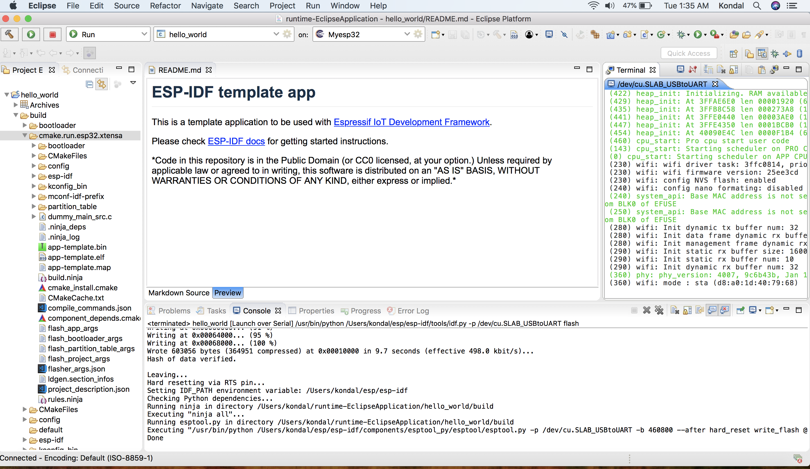
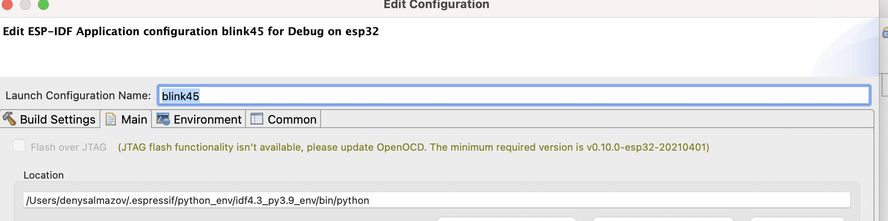

Flash onto the Device
===============================

.. |run_icon| image:: ../../media/icons/run.png
   :height: 16px
   :align: middle

Flash operation can be initiated with just a click of a launch button |run_icon| and it's auto-configured to flash the application with the default flash command, i.e., ``idf.py -p PORT flash``.

.. image:: https://github.com/espressif/idf-eclipse-plugin/assets/8463287/3249c01b-af23-4863-811f-c3959008f257
   :width: 767px
   :alt: flash

To provide customized flash arguments, please follow :ref:`this link <customizeLaunchConfig>` for further instructions.

To configure flashing via JTAG, please refer to this :ref:`JTAG Flashing guide <JTAGFlashing>`

.. _customizeLaunchConfig:

Customized Launch Configuration
-------------------------------

To provide the customized launch configuration and flash arguments, please follow the step-by-step instructions below.

#. Click on the ``Launch Configuration`` edit button.
#. Switch to the ``Main`` tab.
#. Specify the ``Location`` where this application has to run. Since ``idf.py`` is a Python file, configure the Python system path. Example: ``${system_path:python}``.
#. Specify the ``Working directory`` of the application. Example: ``${workspace_loc:/hello_world}``.
#. In additional arguments, provide a flashing command that will run in the specified working directory.
#. The flash command looks like this: ``/Users/user-name/esp/esp-idf/tools/idf.py -p /dev/cu.SLAB_USBtoUART flash``.
#. Click OK to save the settings.
#. Click on the ``Launch`` icon to flash the application to the selected board.

.. _JTAGFlashing:

Upload application via JTAG
-------------------------------

The default option for uploading applications is UART. To change it to JTAG, you need to edit the launch configuration for your project and select the appropriate option.
To do so, select your project in the launch configuration bar and click on the gear icon to edit the launch configuration:

.. image:: ../../media/JtagFlash_1.png
   :alt: Edit launch configuration

Then select the ``Flash Over JTAG`` option and complete the ``OpenOCD Setup`` section.

.. image:: https://user-images.githubusercontent.com/24419842/226183857-f9d8569b-05b0-4b52-b0b2-293aac493020.png
   :width: 986px
   :alt: Flash over JTAG option

If the ``Flash Over JTAG`` option is not available and you see a message like this:

It means that OpenOCD needs to be updated. You can find the latest OpenOCD version on the `openocd-esp32 GitHub page <https://github.com/espressif/openocd-esp32/releases>`_.

Providing the Right Path for OpenOCD
~~~~~~~~~~~~~~~~~~~~~~~~~~~~~~~~~~~~

After downloading the necessary `OpenOCD version <https://github.com/espressif/openocd-esp32/releases>`_, extract it to a new folder in the `.espressif/tools/openocd-esp32/`. Follow these steps:

* Download the required `v0.10.0-esp32-20201202 <https://github.com/espressif/openocd-esp32/releases/tag/v0.10.0-esp32-20201202>`_ version or a higher one for JTAG Flashing.
* Go to `.../.espressif/tools/openocd-esp32/`, create a new folder named ``v0.10.0-esp32-20201202``, and extract OpenOCD there.
* The resulting path to OpenOCD might look like: ``.../.espressif/tools/openocd-esp32/v0.10.0-esp32-20201202/openocd-esp32/...``

After completing this, update the ``OPENOCD_SCRIPT`` environment variable in Eclipse:

* Go to ``Eclipse > Preferences > C/C++ > Build > Environment``
* Edit the ``OPENOCD_SCRIPTS`` variable by providing the correct path to the ``openocd/scripts`` folder.
* The path to the OpenOCD scripts may look like this: ``.../.espressif/tools/openocd-esp32/v0.10.0-esp32-20201202/openocd-esp32/share/openocd/scripts``

