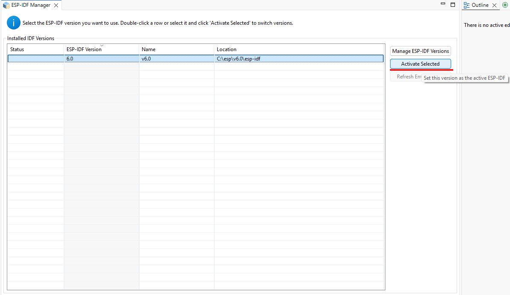
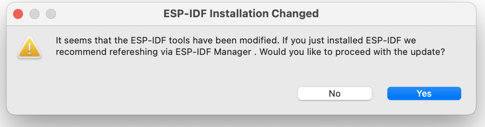

Installation
===============================

Configuring and installing the Espressif-IDE involves two main steps:

1. :ref:`Downloading and Installing the Espressif-IDE <esp-idf-installation>`
2. :ref:`Installing the ESP-IDF and related tools within the Espressif-IDE <esp-idf-tools-installation>`

.. note::
   For Eclipse CDT users who prefer installing the ESP-IDF Eclipse Plugin via the `Update site <https://dl.espressif.com/dl/idf-eclipse-plugin/updates/latest/>`_, please refer to the :ref:`Update Site Installation Guide <marketplaceupdate>`. 

Espressif-IDE Installation
----------------------------
.. _esp-idf-installation:

To begin, navigate to the section corresponding to your operating system below and follow the provided instructions to install the Espressif-IDE.

Windows
~~~~~~~~
.. note::
   For Windows users, Espressif-IDE is available with ESP-IDF as an offline installer.
   
To download and install it, follow the instructions provided :ref:`here <windowsofflineinstaller>`. This guide will walk you through the installation process for Java, Git, CMake, ESP-IDF, IDF Tools, Device Drivers, and Espressif-IDE to help you get started.

macOS/Linux
~~~~~~~~~~~~
Download the Espressif-IDE for your respective operating system from the :ref:`download section <downloads>`. After downloading, launch the IDE and proceed to :ref:`install the necessary ESP-IDF and related tools <esp-idf-tools-installation>`. Please ensure that Java, Python, and Git are installed as prerequisites and are available in the system path before launching the IDE.

ESP-IDF and Tools Installation
-------------------------------
.. _esp-idf-tools-installation:

The Espressif-IDE provides a Tool Manager view that allows you to activate available ESP-IDF versions and manage related tools. To install the ESP-IDF and its tools, first download the Espressif Installation Manager (EIM) from the following `link`_.

  .. link:: https://dl.espressif.com/dl/eim/

After downloading and launching EIM, follow the on-screen instructions to install the required ESP-IDF version and associated tools. Once the installation is complete, you can use the ESP-IDF Manager within the IDE to activate the installed ESP-IDF version in the workspace.
The Espressif-IDE allows you to download and launch the EIM directly from the IDE, making it easier to manage your ESP-IDF versions and tools. If you are coming trying to open the workspace from and older version of Espressif-IDE you will be prompted to convert the older configuration to use with EIM.

Follow these steps inside the Espressif-IDE to install the ESP-IDF and related tools:

1. Go to ``Espressif > ESP-IDF Manager``. The following editor will open:

   .. image:: ../../media/ToolsManager/ESP-IDF_Manager_Editor_Screen.png

2. Click on the ``Launch EIM`` or ``Download & Launch EIM`` button if you have not already downloaded and installed EIM.

   You will see the progress of download and installation in the console. Once the EIM is launched, you can use it to install the ESP-IDF and related tools.

3. Once you close the EIM your ESP-IDF Manager editor will be updated with the latest information about the ESP-IDF versions and tools available.

.. note::
    Please note that the EIM will be the only tool going forward to manage the ESP-IDF versions and tools. The previous versions of the Espressif-IDE used to manage tools internally but now the only point of entry into the ESP-IDF will be through the EIM.

After the EIM is closed the ESP-IDF Manager editor will be updated with the latest information about the ESP-IDF versions and tools available.:

You can add as many versions of ESP-IDF as you want via EIM, but only one version can be set as active, and that version will be used to compile and index projects in your workspace. This feature helps you switch between versions in the workspace easily.

To activate any specific version, simply click on the radio button next to it in the ``Active`` column.

The refresh button in the last column for the active ESP-IDF version can be used to reload any changes in the ESP-IDF directory you made.

.. note::
    Any manual changes made to the ESP-IDF directory will not be reflected in the IDE until you refresh the active ESP-IDF version using the refresh button but if you made any changes to the installation of ESP-IDF using the EIM, those changes will be detected and a popup message will be shown to you to update the ESP-IDF version in the IDE.

References
----------
.. toctree::
    :maxdepth: 1

    Update Site Installation Guide<marketplaceupdate>
    Windows Offline Installer<windowsofflineinstaller>
    Configure CDT Build Environment Variables<additionalfeatures/configureenvvariables>