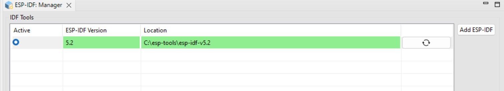

Installation
===============================

Configuring and installing the Espressif-IDE involves two main steps:

1. :ref:`Downloading and Installing the Espressif-IDE <esp-idf-installation>`
2. :ref:`Installing the ESP-IDF and related tools within the Espressif-IDE <esp-idf-tools-installation>`

.. note::
   For Eclipse CDT users who prefer installing the ESP-IDF Eclipse Plugin via the `Update site <https://dl.espressif.com/dl/idf-eclipse-plugin/updates/latest/>`_, please refer to the :ref:`Update Site Installation Guide <marketplaceupdate>`. 

Espressif-IDE Installation
----------------------------
.. _esp-idf-installation:

To begin, navigate to the section corresponding to your operating system below and follow the provided instructions to install the Espressif-IDE.

Windows
~~~~~~~~
.. note::
   For Windows users, Espressif-IDE is available with ESP-IDF as an offline installer.
   
To download and install it, follow the instructions provided :ref:`here <windowsofflineinstaller>`. This guide will walk you through the installation process for Java, Git, CMake, ESP-IDF, IDF Tools, Device Drivers, and Espressif-IDE to help you get started.

macOS/Linux
~~~~~~~~~~~~
Download the Espressif-IDE for your respective operating system from the :ref:`download section <downloads>`. After downloading, launch the IDE and proceed to :ref:`install the necessary ESP-IDF and related tools <esp-idf-tools-installation>`. Please ensure that Java, Python, and Git are installed as prerequisites and are available in the system path before launching the IDE.

ESP-IDF and Tools Installation
-------------------------------
.. _esp-idf-tools-installation:

The Espressif-IDE provides a tool manager to install and manage ESP-IDF and related tools. Please follow the instructions below for installing ESP-IDF in the Espressif-IDE.

1. Go to ``Espressif > ESP-IDF Manager``. The following editor will open:

   .. image:: ../../media/ToolsManager/ESP-IDF_Manager_Editor_Screen.png

2. Click on the ``Add ESP-IDF`` button.

   .. image:: ../../media/ToolsManager/ESP-IDF_Configuration_Download_or_Use_ESP-IDF.png

   From the screen shown above, you can choose an already downloaded ESP-IDF directory or select and download directly from the given dialog. The ``Git`` and ``Python`` tools must be installed, and if they are configured in the system PATH, they will be preloaded in the view. If not, you can browse to the directory and select the proper executables.

3. Click on ``Finish``, which will be enabled after all paths and executables are properly configured.

.. note::
    Please note that the python executable is not the one from the virtual environment created from the installation of the ESP-IDF via other means like from CLI. If you are selecting an already installed ESP-IDF directory IDE will automatically pick up the python once you have installed the tools

After you have clicked ``Finish``, you will see the progress in the console for the tools getting installed. Once the installation is done, and if this is the very first set of ESP-IDF installed in the IDE, it will be activated as well. You will see a similar entry in the editor for ESP-IDF Manager:

You can add as many versions of ESP-IDF as you want, but only one version can be set as active, and that version will be used to compile and index projects in your workspace. This feature helps you switch between versions in the workspace easily.

Let's take a look at how multiple versions will look. Follow the same steps as before to add another ESP-IDF version to the IDE.

.. image:: ../../media/ToolsManager/ESP-IDF_Manager_Multiple_versions.png

To activate any specific version, simply click on the radio button next to it in the ``Active`` column.

The refresh button in the last column for the active ESP-IDF version can be used to reload any changes in the directory you made.
