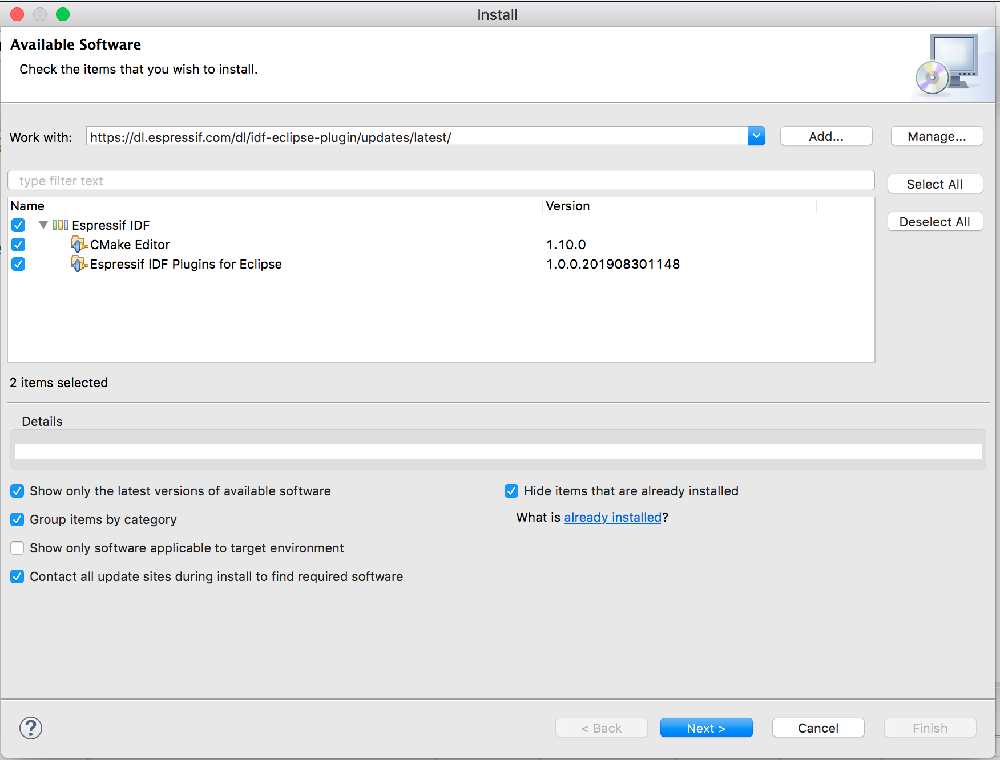
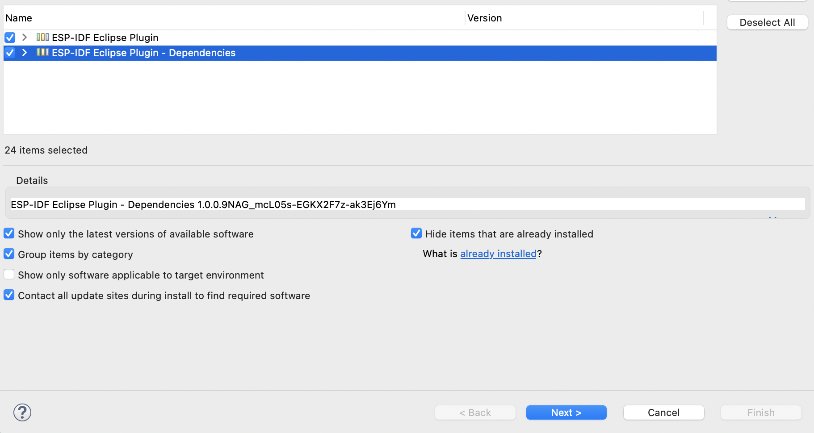
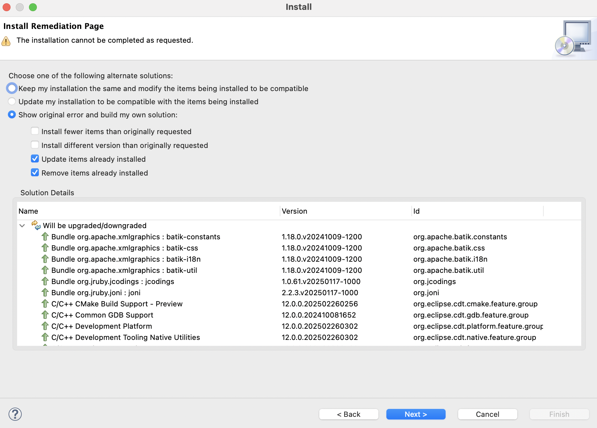

.. _marketplaceupdate:

Update Site Installation Guide
==============================

:link_to_translation:`zh_CN:[中文]`

The Espressif-IDE Eclipse Plugin can be installed using the following three methods:

- :ref:`installUpdateSiteURL`
- :ref:`install_idf_eclipse_plugin_marketplace`
- :ref:`install_idf_eclipse_plugin_local_archive`

.. _installUpdateSiteURL:

Installing IDF Plugin Using the Update Site URL
-----------------------------------------------

You can install the IDF Eclipse plugin into an existing Eclipse CDT/Espressif-IDE using the update site URL. First, add the release repository URL as follows:

1.  Go to ``Help`` > ``Install New Software``.
2.  Click ``Add``, and in the pop-up window:

    * Enter ``Espressif IDF Plugin for Eclipse`` as the ``Name``.
    * Enter ``Location`` of the repository. (`Stable release <https://dl.espressif.com/dl/idf-eclipse-plugin/updates/latest/>`_)
    * Click ``Add``.

3.  Select all items from the list and proceed with the installation.

For adding beta and nightly builds, you can use the following update site URLs:

* `Beta version <https://dl.espressif.com/dl/idf-eclipse-plugin/updates/beta/>`_
* `Nightly build <https://dl.espressif.com/dl/idf-eclipse-plugin/updates/nightly/>`_

.. note::

    Although the following screenshots are captured on macOS, the installation steps are the same for Windows and Linux.

.. _install_idf_eclipse_plugin_marketplace:

Installing IDF Eclipse Plugin from Eclipse Marketplace
------------------------------------------------------

To install the ESP-IDF Eclipse Plugin from the Eclipse Marketplace, follow these steps:

1. Open Eclipse and go to ``Help`` > ``Eclipse Marketplace...``.
2. In the search box, enter **ESP-IDF Eclipse Plugin** to locate the plugin.
3. Click ``Install`` and follow the on-screen instructions to complete the installation.
4. After installation, restart Eclipse to activate the plugin.

.. _install_idf_eclipse_plugin_local_archive:

Installing IDF Eclipse Plugin from Local Archive
------------------------------------------------

To install the ESP-IDF Eclipse Plugin from a local archive, follow these steps:

1. Download the latest update site archive for the IDF Eclipse Plugin from `here <https://github.com/espressif/idf-eclipse-plugin/releases>`_.
2. In Eclipse, go to ``Help`` > ``Install New Software``.
3. Click the ``Add`` button.
4. In the ``Add Repository`` dialog, select ``Archive`` and choose the file ``com.espressif.idf.update-vxxxxxxx.zip``.
5. Click ``Add``.
6. Select ``Espressif IDF`` from the list and continue with the installation.
7. After the installation is complete, restart Eclipse.

.. _upgradePlugins:

How to Upgrade Existing IDF Eclipse Plugin
------------------------------------------

If you are installing the IDF Eclipse Plugin for the first time, follow these steps to add the repository for the new release:

1. Go to ``Window`` > ``Preferences`` > ``Install/Update`` > ``Available Software Sites``.
2. Click ``Add``.
3. Enter the `URL <https://dl.espressif.com/dl/idf-eclipse-plugin/updates/latest/>`_ of the new repository: .
4. Click ``Ok``.

If you have already installed the IDF Eclipse Plugin using the update site URL, you can upgrade to the latest version with the following steps:

1. Go to ``Help`` > ``Check for Updates``.
2. If updates are found, select ``Espressif IDF Plugins for Eclipse`` and deselect all other items.
3. Click ``Next`` to proceed with the installation.

.. image:: ../../media/Update_plugins.png

.. _upgradeEspressifIdeDependencies:

Upgrading from Espressif-IDE 3.3.0 to 3.4.0
-------------------------------------------

If the next version of the plugin requires updated dependencies (e.g., the minimum CDT version has changed from 11.6 to 12), make sure these dependencies are updated during installation from the update site.

If the required dependencies are not updated, the installer will display the following error:

``The installation cannot be completed as requested.``

To resolve this:

1.  Click ``Show original error and build my own solution``.
2.  Then select both:

    - ``Update items already installed``
    - ``Remove items already installed``

This ensures that the installer can update or replace any conflicting components, allowing the installation to complete successfully.

.. _troubleshooting_missing_items:

Troubleshooting
---------------

If you encounter the error ``Cannot complete the install because one or more required items could not be found.`` during installation, it usually means that the Eclipse Platform update site is not enabled.

To resolve this issue:

1.  Go to ``Help`` > ``Install New Software``.  
2.  Click ``Manage``.  
3.  Make sure the option for the ``Eclipse Platform - Latest Release Update Site`` is enabled.  

    .. image:: ../../media/Resolve_update_error_2.png

4.  Apply the changes and close the dialog.  
5.  Then go to ``Help`` > ``Check for Updates`` and proceed with updating the IDE and its dependencies.  

.. note::

    Enabling the Eclipse Platform update site ensures that all required dependencies are properly resolved during installation or upgrade.
