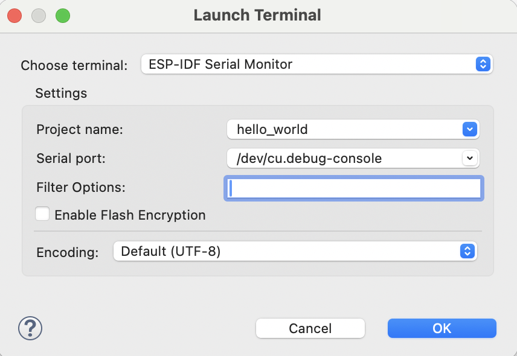

.. _serialMonitor:

Monitor the Output
===============================

To see the serial output in Eclipse, we need to configure the `ESP-IDF Serial Monitor` to connect to the serial port. This is integrated with the `IDF Monitor <https://docs.espressif.com/projects/esp-idf/en/latest/esp32/api-guides/tools/idf-monitor.html#idf-monitor>`_.

.. image:: https://github.com/espressif/idf-eclipse-plugin/assets/8463287/993a1fa2-9c6e-4b0e-a245-713df30331e7
   :alt: Serial Monitor

To launch the serial monitor in the IDE, follow the steps below:

1. Click on the ``Open a Terminal`` icon from the top toolbar.
2. Choose ``ESP-IDF Serial Monitor`` from the terminal drop-down.
3. Select the ``Serial Port`` for your board if it's not detected.
4. Configure serial monitor ``Filter Options`` for output filtering.
5. Click on ``OK`` to launch the monitor, which will listen to the USB port.

ESP-IDF Serial Monitor Settings
-------------------------------
ESP-IDF Serial Monitor will allow you to configure the default settings of the serial monitor character limit and number of lines.

1. Navigate to ``Espressif`` from the Eclipse ``Preferences``.
2. Click on ``ESP-IDF Serial Monitor Settings``.
3. Provide ``Console Line Width`` and ``Limit Console Output``.