.. _OpenOCDDebugging:

ESP-IDF GDB OpenOCD Debugging
=============================

:link_to_translation:`zh_CN:[中文]`

Create a New Debug Configuration
--------------------------------

Please follow the below steps to create a new debug configuration:

1. Right-click on the project.
2. Go to ``Debug As`` > ``Debug Configurations...``. This will launch a debug configuration window.
3. On the left panel, choose ``ESP-IDF GDB OpenOCD Debugging``.
4. Right click and create ``New Configuration``. This will create a new debug configuration for your project.

Please navigate through each tab and configure project specific settings. 

.. note::

    Most of the settings are auto-configured by the plugin.

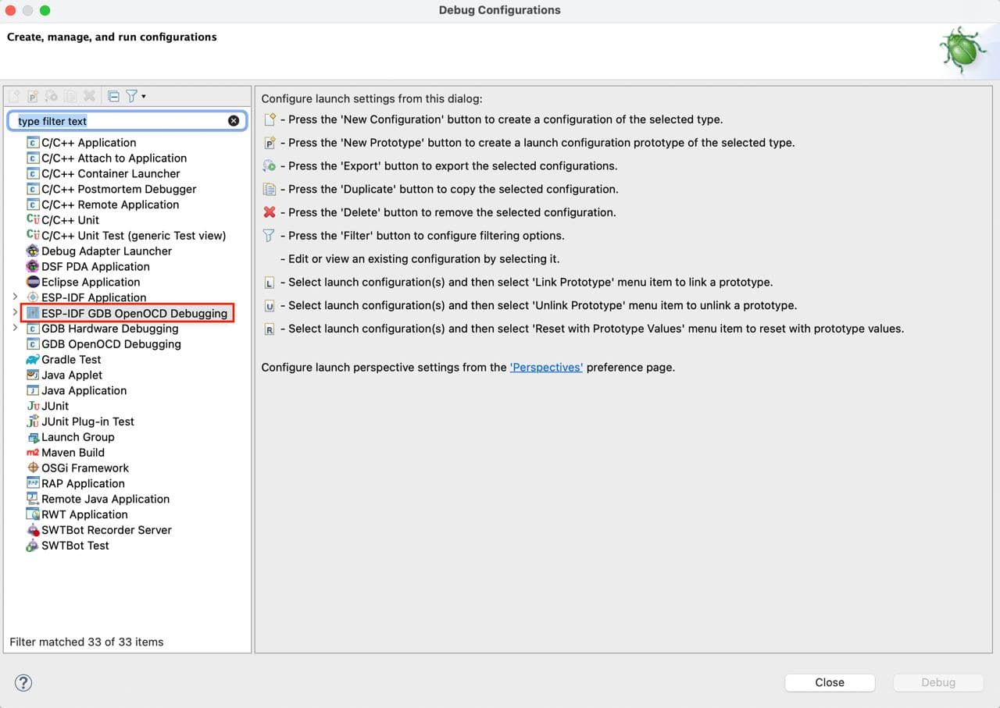

The other way to create a debug configuration is from the launch configuration bar:

1. Expand list with launch/debug configurations.
2. Click on ``New Launch Configuration...``.
3. Select ``ESP-IDF GDB OpenOCD Debugging`` and double-click on it or on ``Next >`` button.
4. In the ``Debugger`` tab, check if the ``Config options`` is right for your board.
5. Click on ``Finish``.

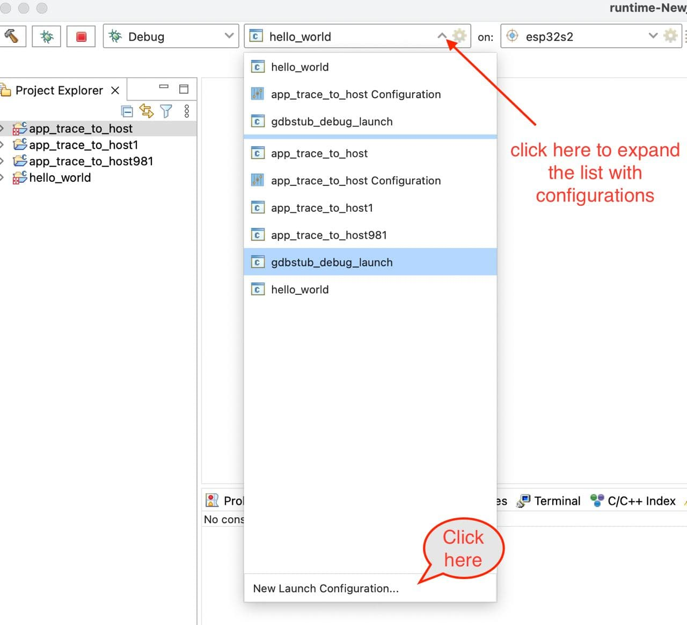

Main Tab 
--------

1. Enter the ``Name`` of this configuration, the default name is "{project_name} Configuration".
2. On the ``Main`` tab below, under ``Project:``, press ``Browse`` button and select the project if it's not selected or you want to change it.
3. In the next line, ``C/C++ Application:`` should be a relative path to the elf file, for example, ``build/hello_world.elf`` for ``hello_world`` project. If the elf file is not there, then likely this project has not been build yet. After building the project, the elf file will appear there. However, you can change it by pressing ``Browse`` button.

The last section on the ``Main`` tab is ``Build (if required) before launching``. If you don't want to build the project each time you click the ``Debug`` button, then select ``Disable auto build``.

Points 1–3 are shown below.

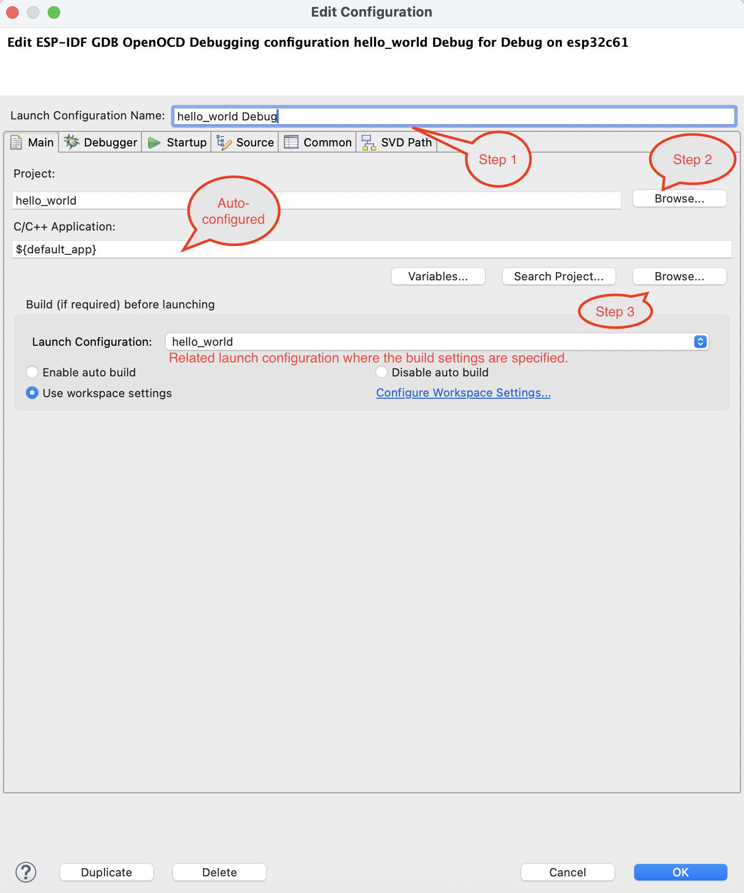

Debugger Tab
------------

In the ``Debugger`` tab, all parameters are automatically configured to start debugging, you just need to check if the ``Config options`` line is appropriate for your board. It automatically adjusts based on ``Flash voltage`` and ``Board`` options. If you expand the list of boards, only those that match the selected ``Target`` will appear. So, for example, if the selected target is ``esp32``, you will not see ``ESP32-S2-KALUGA-1`` in the list. To make it appear, you need to change the target to ``esp32s2`` first. The second option in the Debugger tab is ``GDB executable``, which also depends on the selected target and is automatically configured based on it.

Let's take a look at some other options, that you need to check if they auto-configured correctly for you:

4. The ``Executable path`` for OpenOCD is based on Eclipse preferences, which are configured after tools installation. Check if the ``Actual executable`` is correct. If it is not, the tools installation likely failed, so make sure tools are installed properly to avoid potential problems. If ``Actual executable`` is still not correct after tools installation, click on ``Browse`` and select the path to ``openocd.exe`` manually.

5. In the next step, please make sure that the GDB port is 3333 if you want to use an internal GDB client, and the TCL port is 6666 if you want to use :doc:`additionalfeatures/appleveltracing`. Also, check ``Config options`` as described above.

6. In the ``GDB Client Setup`` section as described above, the GDB executable should be automatically and dynamically configured based on the target you choose. You can change it, by clicking ``Browse`` button and selecting the path to the GDB executable. By default, the ``Commands`` line should be ``set mem inaccessible-by-default off``.

Points 4-6 are shown below.

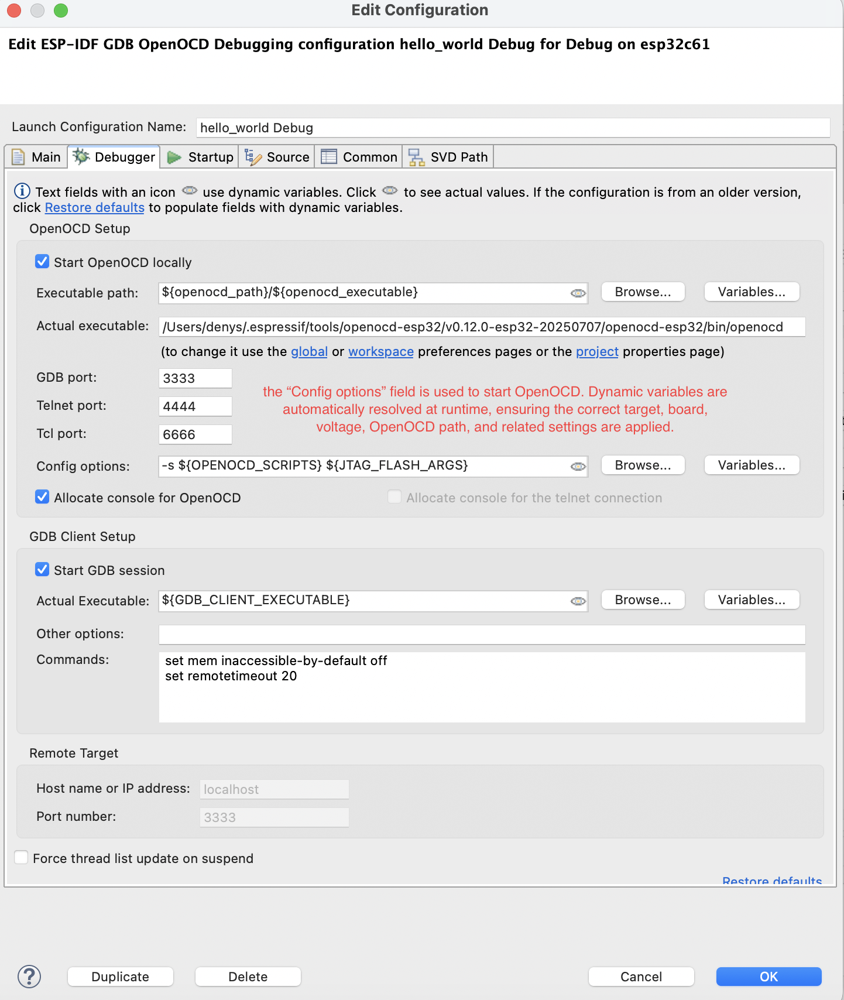

.. note::

    Update the OpenOCD ``Config options`` based on the ESP board you've chosen. See details `here <https://docs.espressif.com/projects/esp-idf/en/latest/esp32/api-guides/jtag-debugging/tips-and-quirks.html#id1>`_.

Startup Tab
-----------

7. By default, the binaries will be uploaded to your board before joining a debug session, so there is no need to flash them to the target separately. If for some reason you don't want to do that, you can uncheck the ``Flash every time with application binaries`` option. Also, you can check ``Enable verbose output`` option, which will enable debug level 3 - ``-d3``.

8.  Under ``Initialization Commands``, ``Initial Reset.`` and ``Enable ARM semihosting`` are enabled by default. Then, the following lines must be entered in the field below:

    .. code-block:: text

        mon reset halt
        flushregs
        set remote hardware-watchpoint-limit 2

Points 7-8 are shown below.

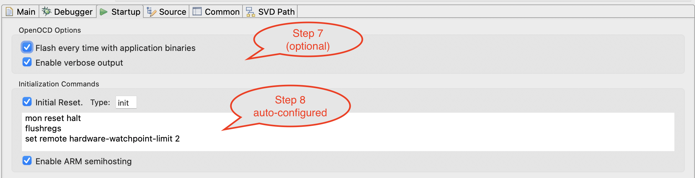

9. Options ``Load Symbols`` and ``Use project binary`` are selected.

10. Further down on the same tab, establish an initial breakpoint to halt CPUs after they are reset by debugger. The plugin will set this breakpoint at the beginning of the function specified under ``Set break point at:``. Checkout this option and enter the name of the main function, e.g., ``app_main`` in provided field.

11. Check the ``Continue`` option. This will make the program resume after ``mon reset halt`` is invoked as described in point 8. The program will then stop at breakpoint inserted at ``app_main``.

Points 9-11 are shown below.

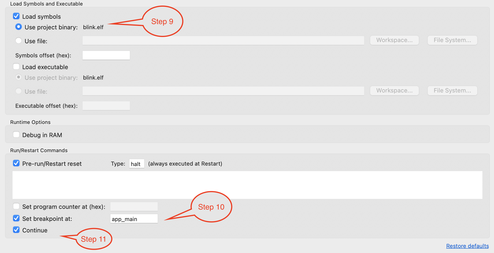

Common Tab
----------

You can save your debug logs to an external file. To do this:

1. Go to ``Common`` tab.
2. Under ``Standard Input and Output`` section, select the ``Output File`` checkbox, then enter the log file name and path where you want logs to be redirected.
3. Apply changes and run your application.

.. note::

    - The path can be relative if the file is located in the workspace (see the screenshot below).
    - When specifying a directory path (ending with a separator like ``/`` or ``\``), the system will automatically append ``openocd.log`` as the filename. For example, entering ``/tmp/logs/`` will create the file ``/tmp/logs/openocd.log``.

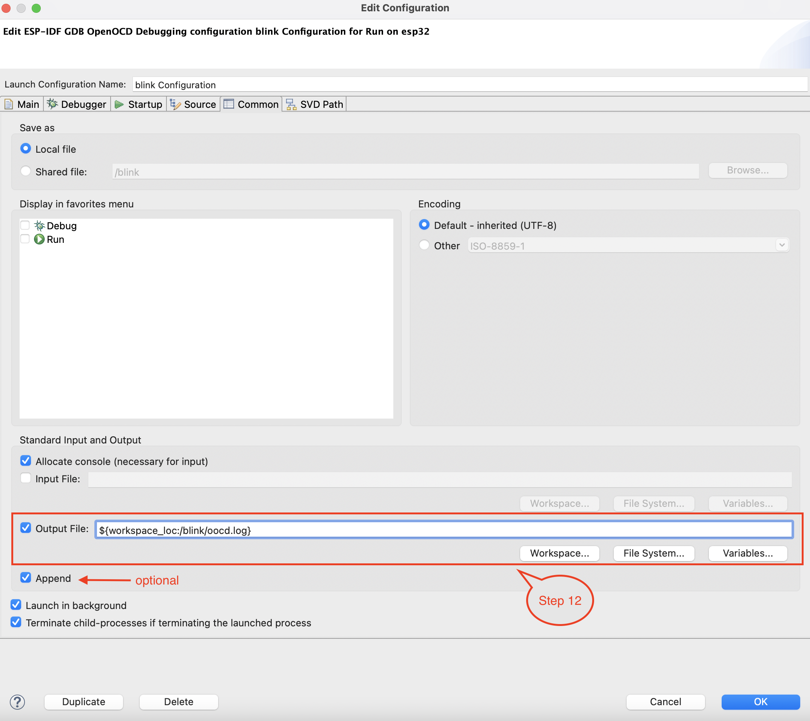

Preferences for OpenOCD Configuration
~~~~~~~~~~~~~~~~~~~~~~~~~~~~~~~~~~~~~

OpenOCD path is auto-configured based on the ``OPENOCD_SCRIPTS`` path defined in the CDT Build environment variables.

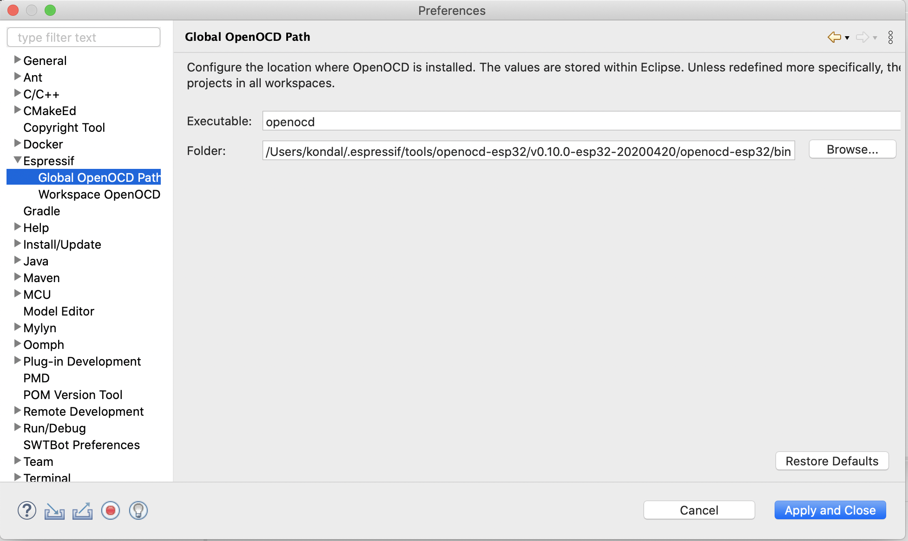

Start Debugging
---------------

To start debugging, you need to select your debug configuration, change mode from ``Run`` to ``Debug`` and click on launch icon (i.e., bug icon).

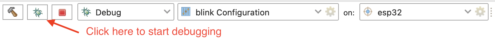

After stopping the target at the default breakpoint, you will be suggested to switch to the ``Debug perspective``.

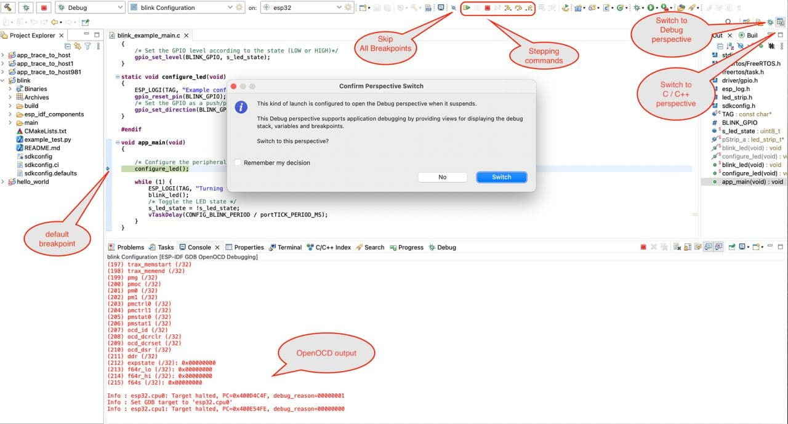

You can customize the ``Debug perspective`` to suit your preferences. For example, you can move some tabs, add additional views that you may find useful, or remove the ones you do not need. To add a view, follow these steps:

1. On the top panel of the Eclipse, click on ``Window``.
2. Select ``Show View``.
3. Select the view you want to add.

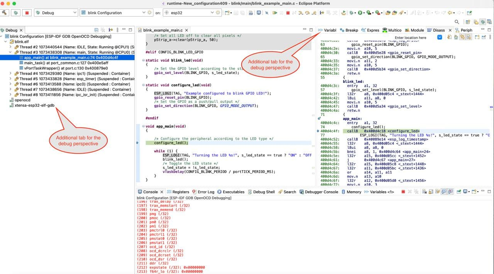

Troubleshooting
---------------

* Please make sure you always have the latest `Espressif-IDE <https://github.com/espressif/idf-eclipse-plugin/releases/>`_.
* If your board supports JTAG, see `this page <https://docs.espressif.com/projects/esp-idf/en/latest/esp32/api-guides/jtag-debugging/index.html#selecting-jtag-adapter>`_ for more details.
* If there is any OpenOCD timeout issue, please increase the GDB server timeout value `<https://www.esp32.com/viewtopic.php?f=40&t=36164#p122701>`_ from the preferences. Usually, this happens while working with large-size applications.
* If you encounter any errors while debugging, please refer to the OpenOCD `Troubleshooting FAQ <https://github.com/espressif/openocd-esp32/wiki/Troubleshooting-FAQ>`_  to see if it helps resolve the issue.
* If you have any issue and want to enable OpenOCD debugging verbose, please check the ``Enable verbose output`` option from the ``Startup`` tab.
