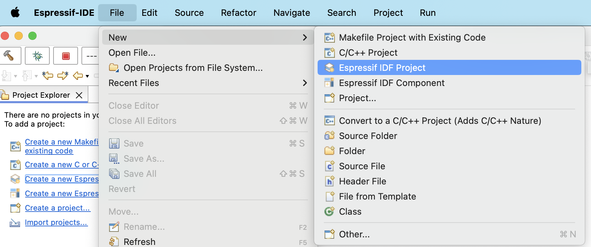

.. _startproject:

Start a Project
===============================

To get started with the Espressif-IDE, you can create a new project or import an existing project.

1. :ref:`Create a New Project <newproject>`
2. :ref:`Create a New Project Using ESP-IDF Templates <newprojecttemplate>`
3. :ref:`Import an Existing Project <importproject>`

..  _newproject: 

Create a New Project
---------------------
To create a new Project in the Espressif-IDE, follow the steps below:

#. Go to ``File`` > ``New`` > ``Espressif IDF Project``.
#. Provide the ``Project name``
#. Click ``Finish``.

.. Note::
    The ESP-IDF build system does not support spaces in the paths to either ESP-IDF or to projects.

.. _newprojecttemplate:

Create a New Project Using ESP-IDF Templates
---------------------------------------------
Espressif-IDE also offers the ability to create a project using the ESP-IDF templates, which can be accessed by following the steps below:

#. Go to ``File`` > ``New`` > ``Espressif IDF Project``.
#. Choose a target board from the ``Select Project Target`` dropdown.
#. Click on ``Create a project using one of the templates`` from the Templates section.
#. Select the template you want to use and that automatically fills the project name based on the template selected.
#. Click ``Finish``.

 .. image:: ../../media/3_new_project_default.png

.. note::
    You may see numerous unresolved headers and symbols errors in the editor, and these will only be resolved after the build process.

.. _importproject:

Import an Existing Project
---------------------------
To import an existing project into the Espressif-IDE, please make sure that is a CMake project. Follow the steps below:

#. Right-click in the ``Project Explorer``.
#. Select ``Import..`` Menu.
#. Select ``Existing IDF Project`` from ``Espressif`` import wizard menu list.
#. Click ``Next``.
#. Click on ``Browse...`` to choose an existing project location directory.
#. Provide ``Project name`` if you wish you have a different name.
#. Click ``Finish`` to import the selected project into Eclipse workspace as a CMake project.

.. image:: ../../media/5_import_project.png

