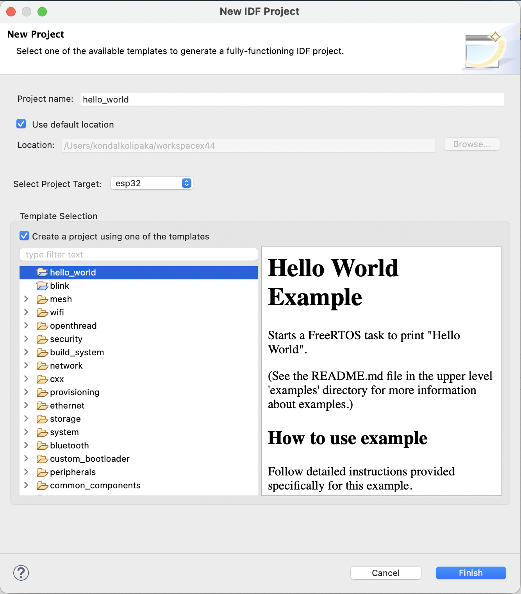

.. _startproject:

Start Your Project
==================

:link_to_translation:`zh_CN:[中文]`

To get started with the Espressif-IDE, you can create a new project or import an existing project.

- :ref:`Create a New Project <newproject>`
- :ref:`Create a New Project Using ESP-IDF Templates <newprojecttemplate>`
- :ref:`Import an Existing Project <importproject>`

..  _newproject: 

Create a New Project
--------------------

To create a new Project in the Espressif-IDE, follow the steps below:

#.  Go to ``File`` > ``New`` > ``Espressif IDF Project``.

    .. image:: ../../media/newproject_menu.png
       :alt: New Project Menu

#.  Provide the ``Project name``.
#.  Click ``Finish``.

.. Note::

    The ESP-IDF build system does not support spaces in the paths to either ESP-IDF or to projects.

.. _newprojecttemplate:

Create a New Project Using ESP-IDF Templates
--------------------------------------------

Espressif‑IDE also allows you to create a project from ESP‑IDF templates, which can be accessed by following the steps below:

#. Go to ``File`` > ``New`` > ``Espressif IDF Project``.
#. Choose a target board from the ``Select Project Target`` dropdown.
#. Click on ``Create a project using one of the templates`` from the ``Template Selection`` section.
#. Select the template you want to use and that automatically fills the project name based on the template selected.
#. Click ``Finish``.

.. note::

    You may see numerous unresolved header and symbol errors in the editor. These will be resolved only after the build process.

.. _importproject:

Import an Existing Project
--------------------------

To import an existing project into the Espressif-IDE, please make sure that is a CMake project. Follow the steps below:

#. Right-click the ``Project Explorer``.
#. Select ``Import..`` Menu.
#. Select ``Existing IDF Project`` from ``Espressif`` import wizard menu list.
#. Click ``Next``.
#. Click on ``Browse...`` to choose an existing project location directory.
#. Provide ``Project name`` if you wish you have a different name.
#. Click ``Finish`` to import the selected project into Eclipse workspace as a CMake project.

