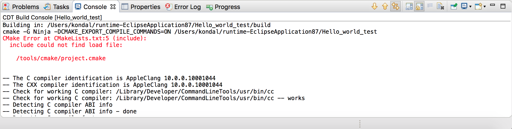
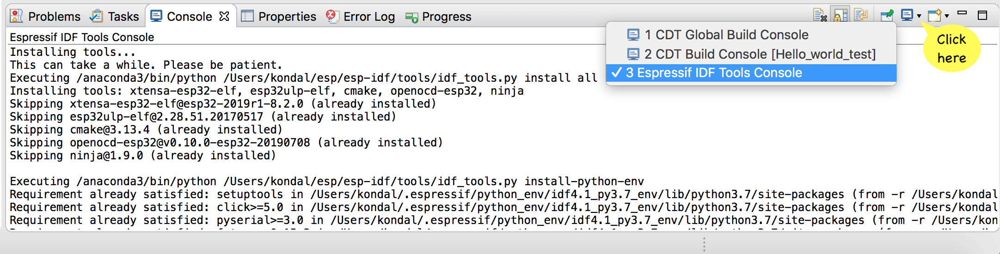

.. _troubleshooting:

Troubleshooting
===============

:link_to_translation:`zh_CN:[中文]`

- :ref:`suggestions_for_build_errors`
- :ref:`error_log`
- :ref:`console_view_log`
- :ref:`cdt_global_build_log`
- :ref:`espressif_idf_tools_console`

.. _suggestions_for_build_errors:

Suggestions for Build Errors Using Hints View
---------------------------------------------

If you encounter a problem during a build, there may be a hint for this error in the ESP-IDF hint database, located at ``tools/idf_py_actions/hints.yml`` in ESP-IDF. The ESP-IDF Eclipse plugin provides a Hints View where you can type an error message to find a hint for it.

**Prerequisites:** The ``hints.yml`` file is available from ESP-IDF v5.0 and higher. If you are using an older version, you can manually download the ``hints.yml`` file from `here <https://github.com/espressif/esp-idf/blob/master/tools/idf_py_actions/hints.yml>`_ and save it to ``esp-idf/tools/idf_py_actions/``. To download the file, right-click the ``Raw`` button and select ``Save as...``.

To open the Hints View, go to ``Windows`` > ``Show View`` > ``Other...`` > ``Espressif`` > ``Hints``.

.. image:: https://user-images.githubusercontent.com/24419842/189666994-78cc8b24-b934-426f-9df5-79af28c50c55.png
    :alt: Hints View

Now you can type or paste an error from the build log, such as:

``ccache error: Failed to create temporary file for esp-idf/libsodium/CMakeFiles/..../....: No such file or directory``

.. image:: https://user-images.githubusercontent.com/24419842/189672552-994624f3-c0c5-48e6-aa2c-61e4ed8915e5.png
    :alt: Example Error in Hints View

Double-clicking the row will display the hint message if it doesn't fully fit on your screen.

.. image:: https://user-images.githubusercontent.com/24419842/189673174-8ce40cda-6933-4dc4-a555-5d2ca617256e.png
    :alt: Hint Message

.. _error_log:

Error Log
---------

The Error Log View captures warnings and errors logged by plug-ins. The log file is stored in the ``.log`` file within the ``.metadata`` subdirectory of the workspace.

To open the Error Log View, go to ``Window`` > ``Show View`` > ``Error Log``.

To export the current log view content:

1.  Press the ``Export Log`` toolbar button or select ``Export Log...`` from the context menu.

    .. image:: ../../media/export_log.png
        :alt: Export Log

2.  Enter a file name.

It's recommended to include an error log when reporting an issue.

.. _console_view_log:

Console View Log
----------------

The Console View shows warnings and errors related to the current running process or build. 

To access the Console View, go to ``Window`` > ``Show View`` > ``Console``.

.. _cdt_global_build_log:

CDT Global Build Log
--------------------

To enable global build logging, go to ``Preferences`` > ``C/C++`` > ``Build`` > ``Logging``.

.. _espressif_idf_tools_console:

Espressif IDF Tools Console
----------------------------

The Espressif IDF Tools Console is part of the Console View and opens during the installation of IDF tools from Eclipse.

If you encounter any issues during installation of IDF tools via ``Espressif`` > ``ESP-IDF Tools Manager`` > ``Install tools``, check the Espressif IDF Tools Console for errors.

If this console is not active, switch to it by clicking the ``Display Selected Console`` icon in the Console View.

