.. _windowsofflineinstaller:

Installing Espressif-IDE by Windows Offline Installer
======================================================

Espressif-IDE Installer (All-in-One) is an offline installer and it comes with all the required components to work with the ESP-IDF Application development.

The installer deploys the following components:

- Embedded Python
- Cross-compilers
- OpenOCD
- CMake and Ninja build tools
- ESP-IDF
- Espressif-IDE
- Amazon Corretto OpenJDK

As Installer bundles, all the required components and tools including stable esp-idf so people behind corporate firewalls can use the whole solution out-of-box. This also configures all the required build environment variables and tool paths as you launch the IDE. All you could do is to get started with your project directly without manually configuring anything. This will give you a big boost to your productivity!

More details about the standard setup of toolchain for Windows can be found in the `windows-setup <https://docs.espressif.com/projects/esp-idf/en/latest/esp32/get-started/windows-setup.html>`_.

Download
--------

You can download the latest version of the installer from `this <https://dl.espressif.com/dl/esp-idf/>`_ and run the installer. You can find installer name with `espressif-ide-setup-2.10.0-with-esp-idf-5.0.1` or similar name based on the version of the installer and the version of the ESP-IDF.

Choose the Installer as shown below.

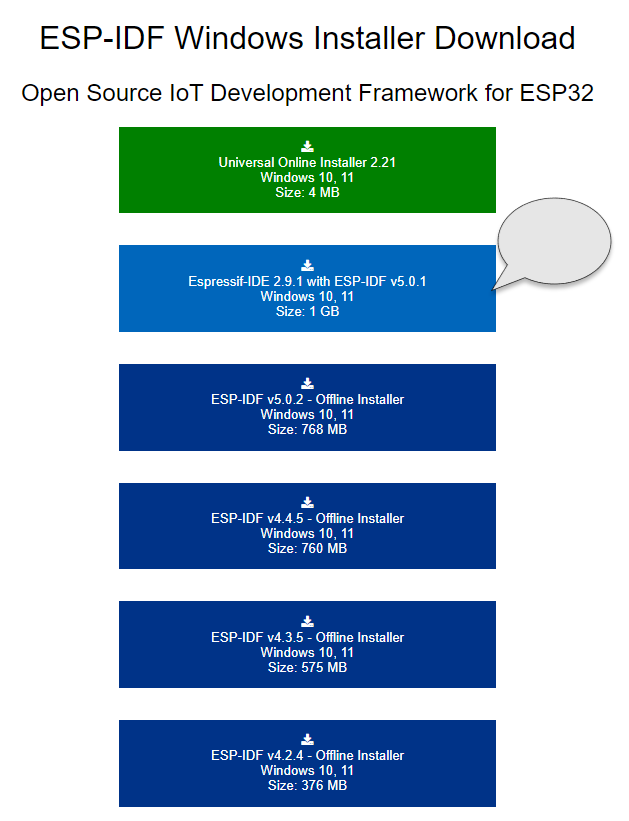

Installation
------------

The installer is an executable file with .exe extension. You can run the installer by double-clicking on it.

The installer will guide you through the installation process. Please find the step-by-step guide below.

Step 1: Choose Language
~~~~~~~~~~~~~~~~~~~~~~~~

Select language for the installer and click Ok.

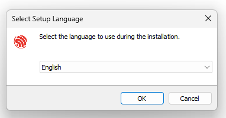

Step 2: Accept the product license agreement
~~~~~~~~~~~~~~~~~~~~~~~~~~~~~~~~~~~~~~~~~~~~~

Read through the product license agreement, and then select `I accept the agreement`. You must accept the product license in order to continue with the installation. Continue by clicking Next.

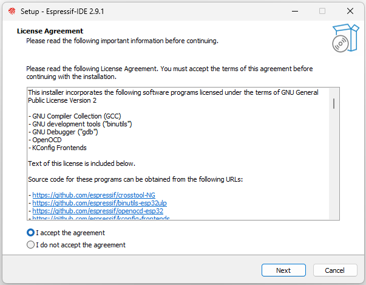

Step 3: Pre-installation checks
~~~~~~~~~~~~~~~~~~~~~~~~~~~~~~~

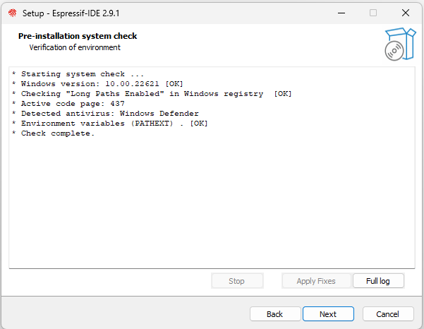

Step 4: Choose the installation directory
~~~~~~~~~~~~~~~~~~~~~~~~~~~~~~~~~~~~~~~~~

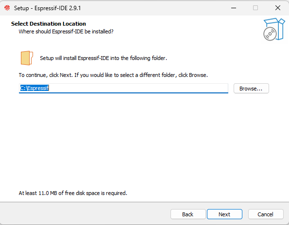

Step 5: Select Components to Install
~~~~~~~~~~~~~~~~~~~~~~~~~~~~~~~~~~~~

By default all the components are selected. You can deselect any component if you don't want to install it.

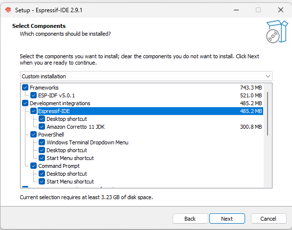

Step 6: Review the installation summary
~~~~~~~~~~~~~~~~~~~~~~~~~~~~~~~~~~~~~~~

A review summary is presented before the Espressif-IDE and others are installed.

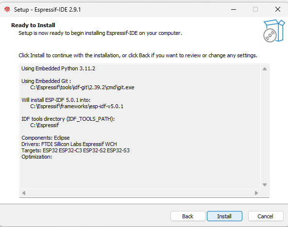
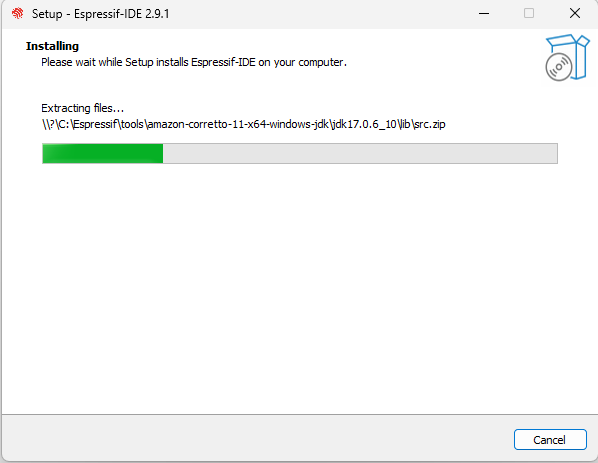

Step 6: Finalize the installation
~~~~~~~~~~~~~~~~~~~~~~~~~~~~~~~~~

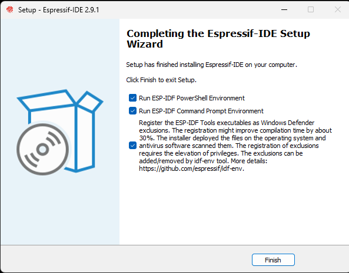
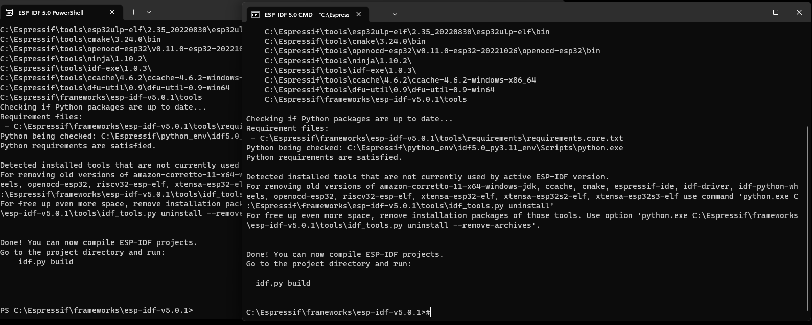

Step 7: Launch Espressif-IDE
~~~~~~~~~~~~~~~~~~~~~~~~~~~~

Launch Espressif-IDE by double-clicking on the icon.

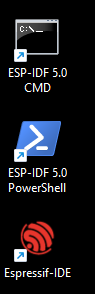

Step 8: Choose Espressif-IDE Workspace
~~~~~~~~~~~~~~~~~~~~~~~~~~~~~~~~~~~~~~

It's advised to select a workspace directory outside the Espressif-IDE Installer folder.

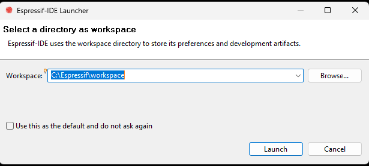

Step 9: Espressif-IDE Workbench
~~~~~~~~~~~~~~~~~~~~~~~~~~~~~~~

As soon as you launch the Espressif-IDE, it will automatically configure the required environment variables and launch the Welcome page. You can close the Welcome page. You don't need to run any additional install tools from the IDE.

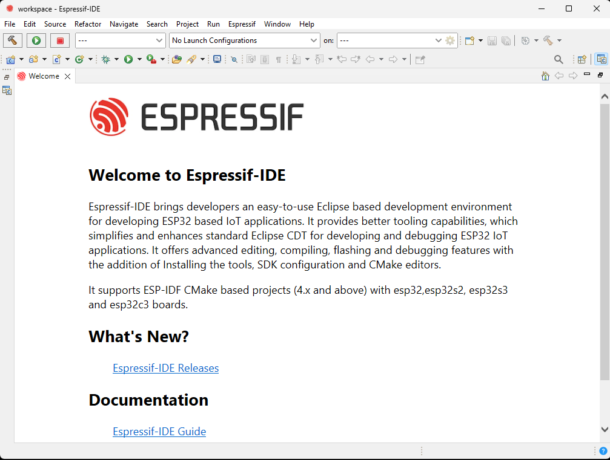

You can verify the CDT Build environment variables from the Eclipse Preferences.

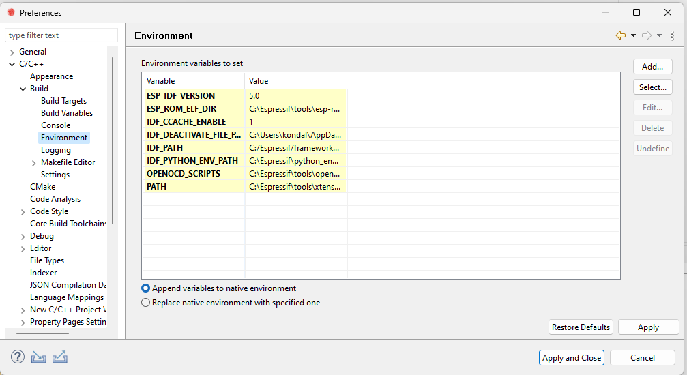

Step 10: Build Your First Project
~~~~~~~~~~~~~~~~~~~~~~~~~~~~~~~~~

As IDE already configured with all the required environment variables, you can start with your project.

You can find more details for creating a project in the `New Project <https://github.com/espressif/idf-eclipse-plugin#create-a-new-project>`_ section of the documentation.

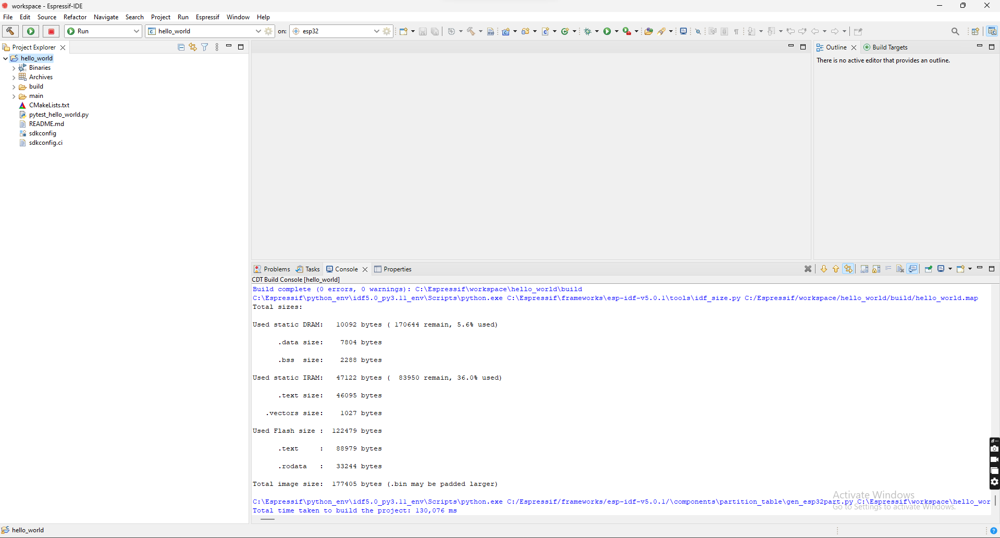