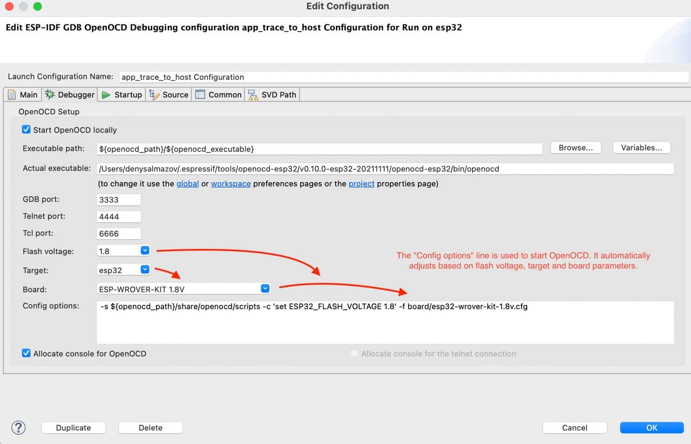
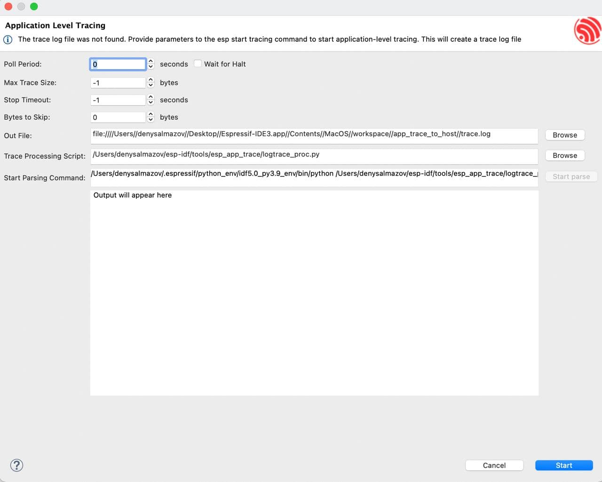
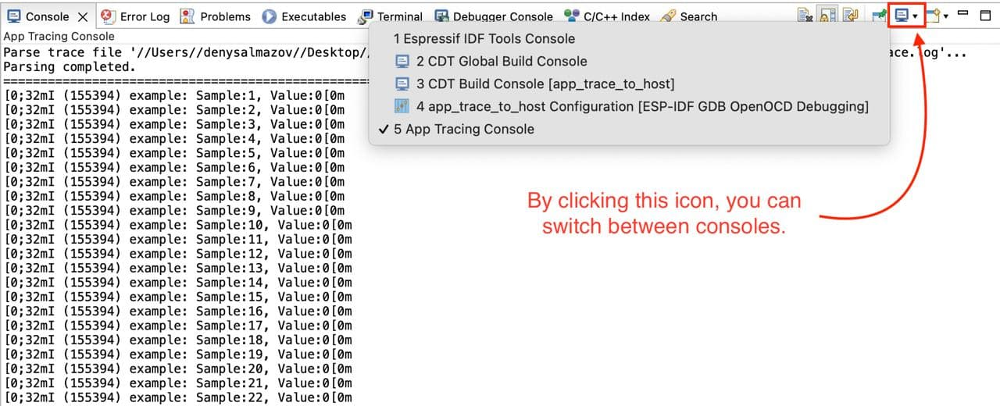

应用级跟踪
==========

:link_to_translation:`en:[English]`

ESP-IDF 提供了一项用于程序行为分析的实用功能，称为 `应用级跟踪库 <https://docs.espressif.com/projects/esp-idf/zh_CN/latest/esp32c3/api-guides/app_trace.html>`_。IDF-Eclipse 插件提供了 UI 界面，可用于启动和停止跟踪命令并处理接收的数据。如需熟悉该库，你可以参考 `app_trace_to_host <https://github.com/espressif/esp-idf/tree/release/v5.0/examples/system/app_trace_to_host>`_ 示例项目，或者 `app_trace_basic <https://github.com/espressif/esp-idf/tree/release/v5.1/examples/system/app_trace_basic>`_ 示例项目（要求使用 ESP-IDF 5.1 及以上）。这些示例项目可以直接通过插件创建。

.. image::  ../../../media/AppLvlTracing_1.png
   :alt: 应用级跟踪项目创建

在使用应用级跟踪之前，需要为项目创建调试配置，并选择所用的开发板，以便成功启动 OpenOCD 服务器。

创建好调试配置后，在项目管理器中右键单击项目并选择 ``ESP-IDF: Application Level Tracing``。

.. image::  ../../../media/AppLvlTracing_2.png
   :alt: 上下文菜单中的应用级跟踪选项

打开应用级跟踪对话框可能需要一些时间，因为需要先启动 OpenOCD 服务器。对话框顶部有一些预配置的字段，这些字段用于启动跟踪命令，并可根据需要进行调整。

**启动命令：**

- 语法：``start <outfile> [poll_period [trace_size [stop_tmo [wait4halt [skip_size]]]]``
- 参数：

  - ``outfile``：保存来自两个 CPU 的数据的文件路径，格式为 ``file://path/to/file``。
  - ``poll_period``：数据轮询周期（单位：毫秒）。如果大于 0，则以非阻塞模式运行。默认值：1。
  - ``trace_size``：可收集的最大数据量（单位：字节）。在接收到指定的数据量后停止跟踪。默认值：-1（不设限）。
  - ``stop_tmo``：空闲超时时间（单位：秒）。在指定时间段内无数据则停止跟踪。默认值：-1（不设限）。
  - ``wait4halt``：为 0 时立即开始跟踪，否则等待目标暂停后再开始。默认值：0。
  - ``skip_size``：开始时要跳过的字节数。默认值：0。

更多信息请参阅 `此处 <https://docs.espressif.com/projects/esp-idf/zh_CN/latest/esp32c3/api-guides/app_trace.html>`_。

接下来的两个字段 ``Trace Processing Script`` 和 ``Start Parsing Command`` 用于解析输出文件。

- ``Trace Processing Script``：解析脚本的路径，默认使用 ESP-IDF 提供的 ``logtrace_proc.py``。
- ``Start Parsing Command``：用于在需要时检查并编辑解析命令。默认配置为：``$IDF_PATH/tools/esp_app_trace/logtrace_proc.py/path/to/trace/file/path/to/program/elf/file``。

在生成转储文件之前，``Start parse`` 按钮处于禁用状态。要生成转储文件，请单击对话框底部的 ``Start`` 按钮。开始跟踪后，该按钮会变为 ``Stop``，点击即可停止跟踪。

输出文件生成后，可单击 ``Start parse``，在 Eclipse 控制台中查看解析脚本的输出。

