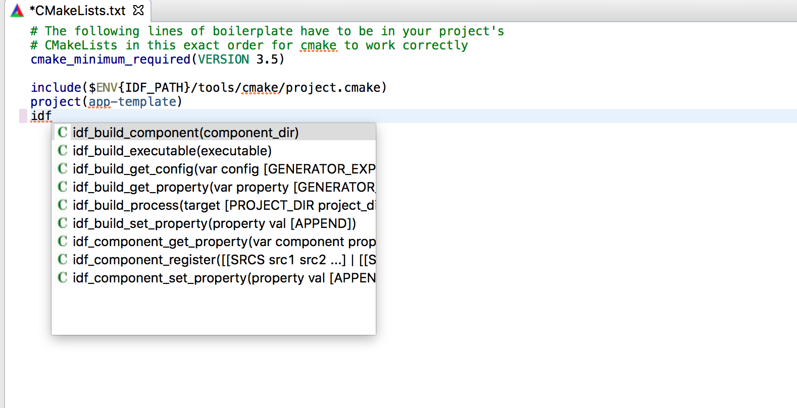
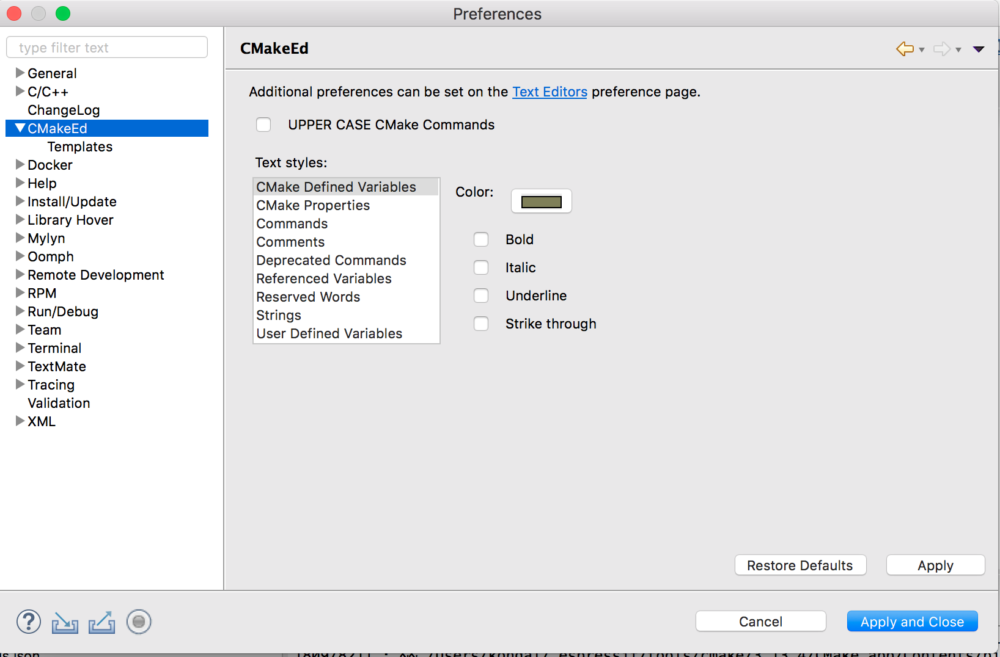

CMake 编辑器
============

:link_to_translation:`zh_CN:[中文]`

CMake 编辑器插件与 IDF 插件集成，可用于编辑 CMake 文件（例如 ``CMakeLists.txt``）。该插件提供语法高亮、CMake 命令自动补全和代码模板等功能。

CMake 编辑器的首选项可通过 ``Eclipse`` > ``Preferences`` > ``CMakeEd`` 进行设置。

