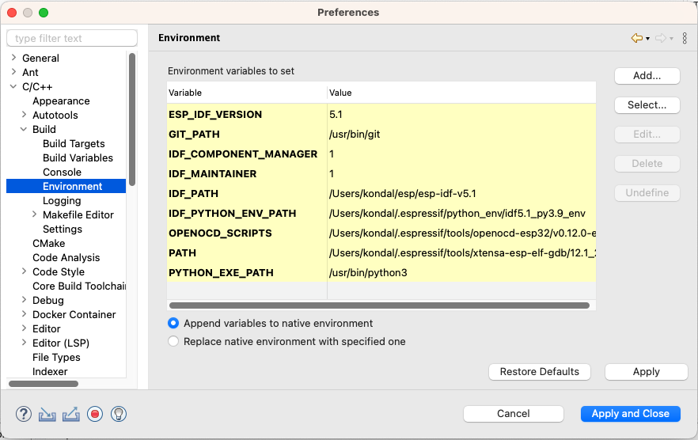

配置环境变量
============

:link_to_translation:`en:[English]`

通过 `EIM <https://docs.espressif.com/projects/idf-im-ui/en/latest/>`_ 安装 ESP-IDF 后，在 ``Espressif`` > ``ESP-IDF Manager`` 中激活 ESP-IDF 时，IDE 会自动配置所有必需的环境变量。你可以在 ``Preferences`` 页面前往 ``C/C++`` > ``Build`` > ``Environment``，查看这些变量。

