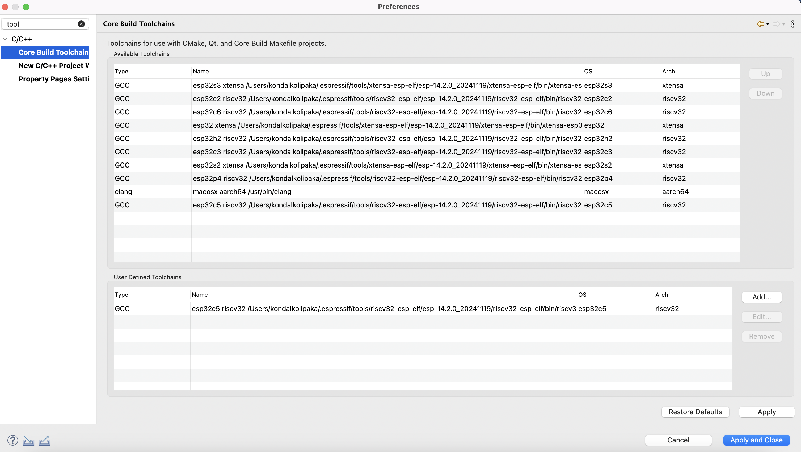

在 IDE 中添加预览版或自定义 ESP-IDF 目标
========================================

:link_to_translation:`zh_CN:[中文]`

若想添加预览版或自定义的 ESP-IDF 目标（例如 ESP32-C5 或 IDE 中未默认列出的目标），请按以下步骤操作：

步骤 1：配置工具链
------------------

1.  前往 ``Preferences`` > ``C/C++`` > ``Core Build Toolchain``。
2.  在 ``User Defined Toolchains`` 部分，点击 ``Add``。
3.  选择 ``GCC``，并按如下配置：

    - **编译器**：目标所用工具链编译器的路径，例如 ``/Users/testuser/.espressif/tools/riscv32-esp-elf/esp-14.2.0_20241119/riscv32-esp-elf/bin/riscv32-esp-elf-gcc``
    - **操作系统**：例如 ``esp32c5``，用于 ESP32-C5
    - **CPU 架构**：例如 ``riscv32``，用于 ESP32-C5

4.  点击 ``Finish``。

   核心构建工具链：添加自定义或预览版目标工具链（示例：ESP32-C5）

步骤 2：配置 CMake 工具链
-------------------------

1. 前往 ``Preferences`` > ``C/C++`` > ``CMake``。
2. 点击 ``Add``。
3. 浏览并选择目标的 CMake 工具链文件（例如 ``toolchain-esp32c5.cmake``）。
4. 选择步骤 1 中创建的相应工具链条目。
5. 点击 ``Finish``。

.. figure:: ../../../media/toolchain/toolchain_2.png
   :align: center
   :alt: CMake 工具链首选项（添加自定义目标）

   CMake 工具链首选项：添加自定义或预览版目标工具链文件（示例：ESP32-C5）

步骤 3：添加启动目标
--------------------

1. 在 IDE 顶部工具栏的目标列表中，点击 ``New Launch Target``。
2. 选择 ``ESP Target``。
3. 填写如下信息：

   - ``Name``：例如， esp32c5
   - ``IDF Target``：例如， esp32c5

4. 点击 ``Finish``。

.. figure:: ../../../media/toolchain/toolchain_3.png
   :align: center
   :alt: 新建乐鑫目标对话框（自定义目标示例）

   新建乐鑫目标对话框：为自定义或预览版目标创建启动目标（示例：ESP32-C5）

步骤 4：构建项目
----------------

- 新建或打开项目。
- 在目标列表中选择自定义或预览版目标。
- 构建项目。

.. figure:: ../../../media/toolchain/toolchain_4.png
   :align: center
   :alt: 自定义目标项目的构建输出

   构建输出：成功为自定义或预览版目标构建项目（示例：ESP32-C5）
