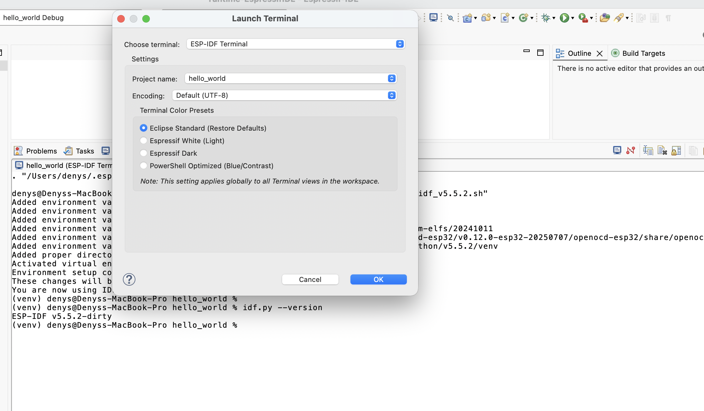

ESP-IDF 终端
============

:link_to_translation:`en:[English]`

该功能会启动一个本地终端，其中配置了在 ``Preferences`` > ``C/C++`` > ``Build`` > ``Environment`` 下的所有环境变量。默认工作目录为当前选中的项目；如果没有选中项目，则为 ``IDF_PATH``。

该终端的 ``PATH`` 还配置了 ``esptool``、``espcoredump``、``partition_table`` 和 ``app_update`` 组件的路径，便于在 ESP-IDF 终端中直接访问这些组件。

可参照下列步骤启动 ESP-IDF 终端：

1. 在工具栏中点击 ``Open a Terminal`` 图标。
2. 在终端下拉菜单中选择 ``ESP-IDF Terminal``，然后点击 ``OK`` 启动终端。

