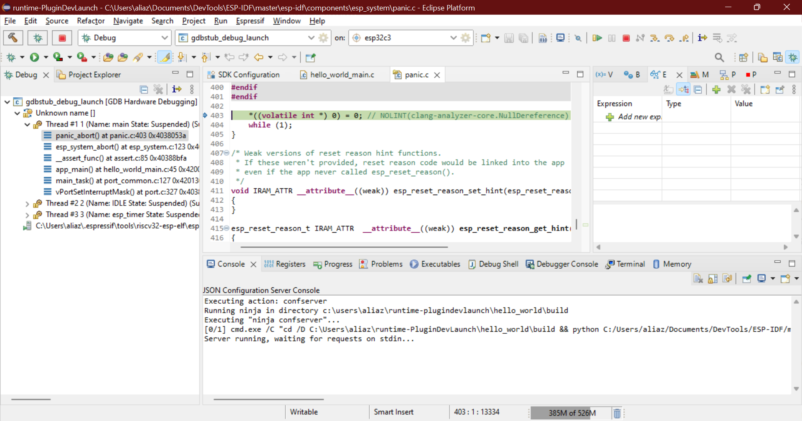

.. _gdbstubdebugging:

GDBStub 调试
============

:link_to_translation:`en:[English]`

你可以在 Eclipse 插件中使用 GDBStub 调试功能，在芯片进入 panic 模式时诊断和调试相关问题。

可参照下列步骤为项目启用 GDBStub 调试：

1.  在项目根目录中双击 ``sdkconfig``，打开配置编辑器。

    .. image:: ../../../media/GDBStubDebugging/sdkconfig_editor.png

2.  展开 ``Component Config`` 部分并选择 ``ESP System Settings``。在右侧设置中，将 ``Panic handler behaviour`` 设为列表中的 ``GDBStub on Panic`` 选项。

    .. image:: ../../../media/GDBStubDebugging/sdkconfig_editor_panic_behavior.png

当连接串口监视器且此示例发生 panic 时，将自动进入 GDBStub 调试器。

参照下列步骤在项目中使用 GDBStub 调试：

1.  创建 ``hello_world`` 模板项目，并在 ``main.c`` 文件中加入以下内容：

    .. code-block:: c

        // 这是一个全局变量
        COREDUMP_DRAM_ATTR uint8_t global_var;

2.  现在在 ``esp_restart()`` 函数的上方加入下面两行代码：

    .. code-block:: c

        global_var = 25;
        assert(0);

最终生成的文件应如下所示：

.. image:: ../../../media/GDBStubDebugging/code_example.png

构建并烧录项目，然后启动串口监视器。在第 45 行，会触发一个失败的断言，导致芯片进入 panic 模式。当程序执行到该行时，IDE 会提示你切换到调试模式，并暂停芯片执行。

此时芯片处于 panic 模式，无法继续执行程序。必须通过 IDF 命令停止并重启芯片，或者直接重启串口监视器。

你可以查看寄存器、栈回溯以及栈帧中的变量值。

若要退出调试会话，只需点击 ``stop`` 按钮。
