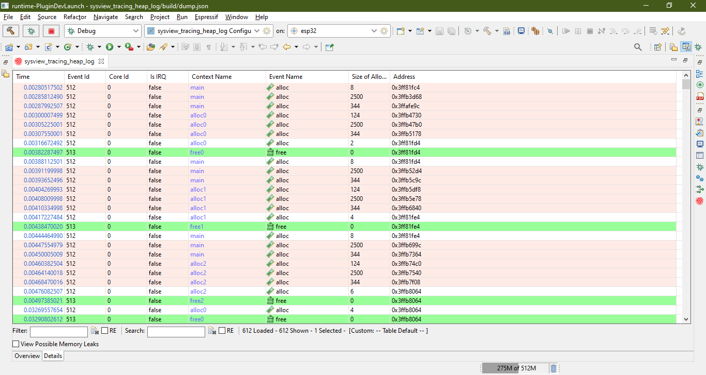

.. _heap_tracing:

堆跟踪
======

:link_to_translation:`en:[English]`

你可以使用堆跟踪生成并分析 ``svdat`` 转储文件，持续监控内存使用情况。IDF Eclipse 插件支持通过设置特定断点来生成堆跟踪文件。有关 SDK 级配置和跟踪功能的更多信息，请参阅官方 `ESP-IDF 文档 <https://docs.espressif.com/projects/esp-idf/zh_CN/latest/esp32/api-reference/system/heap_debug.html>`_。

生成转储文件
------------

1. **打开 sysview_heap_log.c 文件**
   
   在资源管理器中找到并打开 **系统** 模板项目中的 ``sysview_heap_log.c`` 文件。

   .. image:: ../../../media/HeapTracing/sysview_heap_log_file.PNG
      :alt: sysview_heap_log.c 文件

2. **添加断点并配置属性**
   
   在所需的代码行添加一个断点，然后在编辑器中右键单击断点图标，选择 ``Breakpoint Properties``。

   .. image:: ../../../media/HeapTracing/breakpoint_properties_popup.png
      :alt: 断点属性

3. **定义堆跟踪操作**

   在 ``Breakpoint Properties`` 窗口中，前往 ``Actions``，单击 ``New``，并在 ``Action Type`` 下拉列表中选择 ``Heap Tracing``。 

   对于初始断点，在 ``Action`` 一栏选择 ``Start Heap Trace``，并指定转储文件的保存位置（建议存放在项目目录）。为该操作设置一个有意义的名称，然后单击 ``OK``。

   .. image:: ../../../media/HeapTracing/heap_tracing_action.png
      :alt: 堆跟踪操作

4. **将该操作附加至断点**

   创建操作后，单击 ``Attach`` 将其链接至断点。绑定成功后，该操作会显示在 ``Actions for this breakpoint`` 一栏。

   .. image:: ../../../media/HeapTracing/breakpoint_properties_actions_start_attached.png
      :alt: 附加操作

5. **应用并创建另一个断点**

   现在你已有一个会开始跟踪并生成转储文件的断点。要停止跟踪，请再创建一个断点（例如在代码的第 102 行），设置其属性，并在操作设置中选择 ``Stop Heap Trace`` 选项。按下图所示，将此操作附加至断点。

   .. image:: ../../../media/HeapTracing/breakpoint_properties_actions_stop_attached.png
      :alt: 停止堆跟踪操作

6. **启动调试配置**

   在 IDE 中启动开发板的调试配置。当程序运行至断点时，IDE 会提示你切换到调试器视图。在每个断点处继续执行程序，以开始或停止跟踪。然后在资源管理器中刷新项目，即可在指定位置查看生成的转储文件。

分析转储文件
------------

IDF Eclipse 插件可用于分析生成的 ``svdat`` 转储文件。右键单击该转储文件，并在上下文菜单中选择 ``ESP-IDF: Heap Dump Analysis``。

.. note::

   确保项目使用合适的符号文件进行构建，以便启用分析。

.. image:: ../../../media/HeapTracing/analysis_context_menu.png
   :alt: 堆转储分析的上下文菜单

``Overview`` 标签页
-------------------

``Overview`` 标签页以曲线图形式显示内存消耗的变化情况。默认情况下，图表会显示所有上下文的内存信息，你也可以选择只显示与特定堆事件相关的上下文。

.. image:: ../../../media/HeapTracing/overview_tab_tracing.png
   :alt: 内存消耗图

例如，选择多个上下文时，曲线图会分别显示每个上下文的内存使用情况。

.. image:: ../../../media/HeapTracing/overview_tab_tracing_contexts.png
   :alt: 图表中已选的上下文

``Details`` 标签页
------------------

``Details`` 标签页提供更详细的信息，显示堆跟踪中的每个事件。浅橙色高亮的行表示潜在的内存泄漏，因为跟踪可能在释放事件被检测到之前就已结束。绿色高亮的行表示已释放的堆事件。

要筛选可能的内存泄漏条目，请勾选 ``View Possible Memory Leaks`` 复选框。右键单击任意条目可查看其调用者，这会打开 ``Callers View``，显示该堆事件的调用栈。

.. image:: ../../../media/HeapTracing/show_callers_context_menu.png
   :alt: 显示调用者

在 ``Callers View`` 中单击某个条目将跳转到源文件中的相应代码行。

.. image:: ../../../media/HeapTracing/callers_view.png
   :alt: 调用者视图
