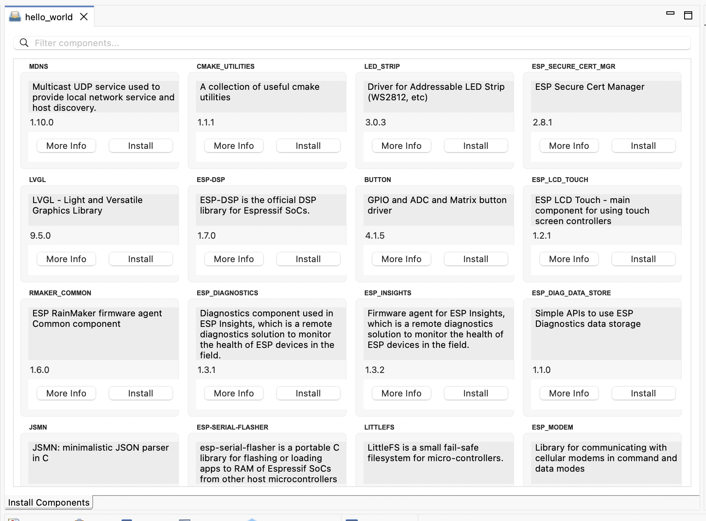

安装 ESP-IDF 组件
=================

:link_to_translation:`en:[English]`

可以从 `ESP-IDF 组件注册表 <https://components.espressif.com/>`_ 提供的可用组件中，选择 ESP-IDF 组件安装至你的项目。请按照以下步骤操作：

1. 在 ``Project Explorer`` 中，右键点击要添加组件的项目，然后选择 ``ESP-IDF: Install ESP-IDF Components``。
2. 界面中出现一个新窗口，显示所有可安装的组件。
3. 在该窗口中，可点击 ``Install`` 按钮将所选组件添加到项目。要查看组件的 README 文件，点击 ``More Info``，浏览器会打开该 README。

已添加的组件也会在此显示，但 ``Install`` 按钮的文字会变为 ``Already Added`` 并被禁用。
