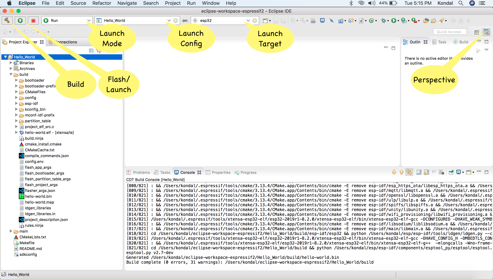

构建项目
========

:link_to_translation:`en:[English]`

.. |build_icon| image:: ../../media/icons/build.png
   :height: 16px
   :align: middle

创建项目并配置好乐鑫目标设备及串口后，可在工具栏中点击 |build_icon| 图标来构建项目。

如果你是初次使用 IDE，请参照下列步骤，完成项目的构建流程：

1. 在 ``Project Explorer`` 中选择一个项目。
2. 在第一个下拉菜单 **启动模式** 中选择 ``Run``。。
3. 在第二个下拉菜单 **启动配置** 中选择你的应用程序（该程序会被自动检测）。
4. 在第三个下拉菜单 **启动目标** 中选择目标芯片，如 ``esp32``。
5. 点击 ``Build`` 按钮 |build_icon|，开始构建流程。

自定义构建目录
--------------

IDE 允许为项目配置自定义构建目录：

1. 选择一个项目，在顶部工具栏中点击启动配置的 ``Edit`` 按钮，打开 ``Edit Configuration`` 窗口。
2. 前往 ``Build Settings`` 选项卡。
3. 在 ``Build folder location`` 部分填写自定义的构建目录。该自定义目录路径可以位于项目内，也可以位于文件系统中的任意位置。
4. 点击 ``Ok`` 并构建项目。

.. note::

    此配置指定了项目生成的所有构建产物的存放位置。

.. image:: ../../media/custombuilddir.png
   :alt: 自定义构建目录配置

参考文档
--------

.. toctree::
    :maxdepth: 1

    配置 CDT 构建环境变量 <additionalfeatures/configureenvvariables>
    添加预览或自定义 ESP-IDF 目标 <additionalfeatures/configuretoolchain>
