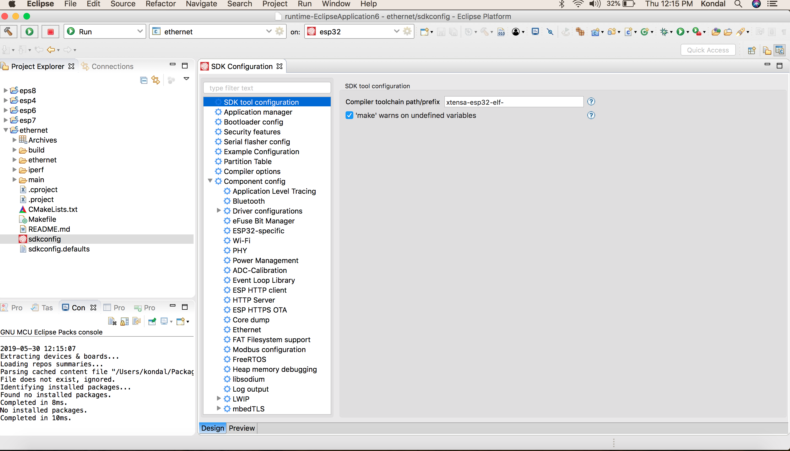

配置项目
========

:link_to_translation:`en:[English]`

项目配置保存在项目根目录下一个名为 ``sdkconfig`` 的文件中。可以使用 SDK 配置编辑器修改该配置文件。

.. note::

    ``sdkconfig`` 文件仅在构建之后才会生成。因此，建议在配置项目之前先构建一次项目。

可参照下列步骤，启动 SDK 配置编辑器：

#. 找到 ``sdkconfig`` 文件。
#. 双击该文件以启动 SDK 配置编辑器。
#. 根据操作系统使用 ``Ctrl+S`` 或 ``Command+S`` 保存更改。也可以使用 Eclipse 工具栏中的 ``Save`` 按钮来保存。
#. 若想撤销在 SDK 配置编辑器中所做的更改，可以在不保存的情况下关闭编辑器，或右键单击 ``sdkconfig`` 文件并选择 ``Load sdkconfig``，在编辑器中还原更改。

