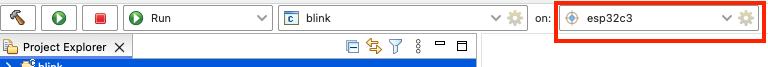
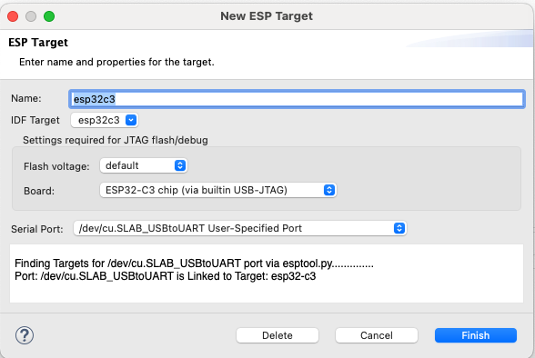

连接设备
========

:link_to_translation:`en:[English]`

点击齿轮图标，选择项目的目标芯片以及设备的串口。如果在创建项目时已完成设置，则忽略此步。默认情况下，启动目标下拉菜单会显示插件支持的所有目标芯片。

点击齿轮图标可以打开 ``ESP Target`` 配置对话框，选择设备的串口并指定乐鑫开发板。插件会自动检测连接到电脑的串口。

关于串口及其命名规则，请参考 `ESP-IDF 文档 <https://docs.espressif.com/projects/esp-idf/zh_CN/latest/esp32/get-started/linux-macos-setup.html#id12>`_。

自定义目标
----------

如果需要添加不在启动目标下拉菜单中的目标，请参照以下步骤：

1. 点击启动目标下拉菜单。
2. 选择 ``New Launch Target``。
3. 选择 ``ESP Target``。
4. 指定要启动应用程序的目标设备属性。为该目标输入 ``Name``，并选择电脑上乐鑫设备所连接的 ``Serial Port``。
